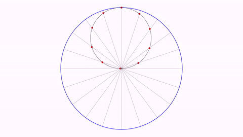
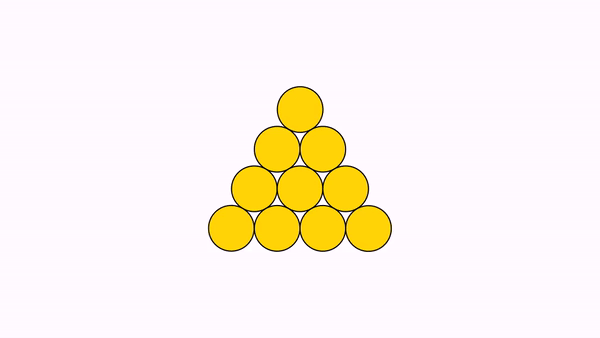

[home](https://davidgutierrezrubio.github.io/jmathanim/) [back](../index.html)

# Examples gallery

## Function and its points with zero slope

A simple animation illustrating the updateable object `PointOnFunctionGraph` :

```java
final Axes axes = new Axes();
axes.generatePrimaryXTicks(-2, 2, 1);
axes.generatePrimaryYTicks(-2, 2, 1);
add(axes);

//The function
FunctionGraph cat = FunctionGraph.make(x -> (x - 1) * (x + 1) * (x - .5));
cat.thickness(3).drawColor("darkblue");


//The roots of f'(x)
double root1 = -0.4342585459107;
double root2 = 0.767591879244;

double xStart = -1;
PointOnFunctionGraph A = new PointOnFunctionGraph(xStart, cat);
A.style("redcircle");

Line tangentLine = Line.make(A, A.getSlopePointRight()).drawColor("darkgreen");

//First, we animate the creation of the objects
play.showCreation(cat);
play.fadeIn(A);
play.showCreation(tangentLine);

//Now we shift the point A to the first root and fadeIn a illustrative text and a marker point
play.shift(5, root1 - xStart, 0, A);
Point marker1 = A.copy().dotStyle(Point.DotSyle.CROSS).drawColor("darkblue");
play.fadeIn(2, LaTeXMathObject.make("$$f'(x)=0$$").scale(.5).stackTo(A, Anchor.Type.UPPER, .1), marker1);

//We do the same with the second root
play.shift(5, root2 - root1, 0, A);
Point marker2 = A.copy().dotStyle(Point.DotSyle.CROSS).drawColor("darkblue");
play.fadeIn(2, LaTeXMathObject.make("$$f'(x)=0$$").scale(.5).stackTo(A, Anchor.Type.LOWER, .1), marker2);

play.shift(5, 1, 0, A);

waitSeconds(5);
```

[You can see the video here](https://imgur.com/gallery/Iun5dD6)


## Taylor expansion of sin(x)

```java
public void runSketch() throws Exception {
    int orderTaylor = 8;
    Axes axes = new Axes();
    axes.addXTicksLegend("$\\pi$", PI, Axes.TickScale.PRIMARY, 0);
    axes.addXTicksLegend("$-\\pi$", -PI, Axes.TickScale.PRIMARY, 0);
    axes.addXTicksLegend("$2\\pi$", 2 * PI, Axes.TickScale.PRIMARY, 0);
    axes.addXTicksLegend("$-2\\pi$", -2 * PI, Axes.TickScale.PRIMARY, 0);
    axes.generatePrimaryYTicks(-4, 4, 1);
    add(axes);
    final double xmin = -2 * PI - .2;
    final double xmax = 2 * PI + .2;
    FunctionGraph sinFunction = FunctionGraph.make(t -> Math.sin(t), xmin, xmax);
    sinFunction.thickness(3).drawColor("#682c0e");
    camera.adjustToObjects(sinFunction);

    play.showCreation(sinFunction);
    waitSeconds(1);

    FunctionGraph taylor[] = new FunctionGraph[orderTaylor];
    LaTeXMathObject texts[] = new LaTeXMathObject[orderTaylor];
    for (int n = 1; n < orderTaylor; n++) {
        taylor[n] = FunctionGraph.make(TaylorExpansionSin(n),xmin,xmax).drawColor("#153e90").thickness(4);
        texts[n]=LaTeXMathObject.make("Taylor order "+n).scale(3).stackToScreen(Anchor.Type.UL,.2,.2);
        texts[n].setColor("#153e90").layer(2);
    }
    final Rect r = texts[1].getBoundingBox().addGap(.1, .1);
    Shape box=Shape.rectangle(r).fillColor(JMColor.WHITE).thickness(3).layer(1);
    play.showCreation(taylor[1],texts[1],box);
    for (int n = 2; n < orderTaylor; n++) {
        add(taylor[n-1].copy().thickness(1).drawColor(JMColor.GRAY));
        Transform transformFunction = new Transform(2, taylor[n-1], taylor[n]);
        Transform transformText=new Transform(2, texts[n-1], texts[n]);
        playAnimation(transformFunction,transformText);
    }
    waitSeconds(5);
}

public final DoubleUnaryOperator TaylorExpansionSin(int order) {
    return x->{
        double resul=0;
        double potX=x;
        int sign=1;
        for (int n = 0; n < order; n++) {
            int k=2*n+1;
            resul+=potX/factorial(k)*(sign);
            sign=-sign;
            potX*=x*x;
        }
        return resul;
    };
}
public int factorial(int n) {
    int resul = 1;
    for (int i = 1; i <= n; i++) {
        resul *= i;
    }
    return resul;
}
```

You can [see the video here](https://imgur.com/gallery/PjlVtXw).

## Trifolium into Freeth's Nephroid (and back)

Two parametric curves expressed in polar coordinates. Note that we made a copy of the first one as it becomes altered after the first `transform`.

```java
add(new Axes());
ParametricCurve trifolium = ParametricCurve.makePolar(t -> 2*Math.cos(t)*(4*Math.sin(t)*Math.sin(t)-1), t -> t, 0, PI);
ParametricCurve nephroid = ParametricCurve.makePolar(t -> 1 + 2 * Math.sin(t / 2), t -> t, 0, 4 * PI);

trifolium.drawColor("#153e90").thickness(3);
nephroid.drawColor("#a05344").thickness(3);
ParametricCurve trifoliumCopy = trifolium.copy();

camera.adjustToObjects(trifolium, nephroid);
play.transform(5, trifolium, nephroid);
play.transform(5, nephroid, trifoliumCopy);
```

Here you have a GIF from the movie generated:


### Trail curve derived from Trifolium

For each point of the Trifolium, we add the derivative vector rotated 90 degrees clockwise, and draw the trail. The animation is done with the `advanceFrame()` method, and we register an instance of `CameraAlwaysAdjusting` class to adjust the camera to all objects in the scene.

```java
ParametricCurve trifolium = ParametricCurve.makePolar(t -> 2 * Math.cos(t) * (4 * Math.sin(t) * Math.sin(t) - 1), t -> t, 0, PI);

//The original coordinates of the points are irrelevant as they will be updated
//prior to drawing the first frame.
Point pointOnCurve = Point.at(0, 0).drawColor("darkblue");
Point pointToTrail = Point.at(0, 0);
Arrow2D arrow = Arrow2D.makeSimpleArrow2D(pointOnCurve, pointToTrail).drawColor("darkblue").layer(1);
add(trifolium.thickness(3), pointOnCurve, arrow);
add(Trail.make(pointToTrail).drawColor("darkred").dashStyle(DashStyle.DASHED));
registerUpdateable(new CameraAlwaysAdjusting(camera, .1, .1));
double time = 10;
for (double t = 0; t < time; t += dt) {
    final double t0 = PI *t/time;
    pointOnCurve.moveTo(new Vec(trifolium.getFunctionValue(t0)));
    Vec deriv = trifolium.getTangentVector(t0);
    Vec normal=deriv.copy().rotate(-90 * DEGREES);
    pointToTrail.copyFrom(pointOnCurve.add(normal));
    advanceFrame();
}
waitSeconds(3);
```

Here you have a GIF from the movie generated:


## The Koch curve

```java
@Override
public void runSketch() throws Exception {
    int numIters = 6;
    Shape[] koch = new Shape[numIters];
    koch[0] = Shape.segment(Point.origin(), Point.unitX());
    for (int n = 1; n < numIters; n++) {
        koch[n] = getNextKochIteration(koch[n - 1]);
    }
    camera.adjustToObjects(koch[numIters - 1]);
    for (int n = 1; n < numIters; n++) {
        play.transform(3, koch[n - 1], koch[n]);
    }
    waitSeconds(5);
}

public Shape getNextKochIteration(Shape previousShape) {
    //A new iteration of the Koch curve is composed of 4 copies of the previous iteration
    //scaled 1/3.
    Shape s1 = previousShape.copy().scale(previousShape.getPoint(0), 1d / 3, 1d / 3);

    Shape s2 = s1.copy().rotate(s1.getPoint(0), PI / 3).shift(s1.getPoint(0).to(s1.getPoint(-1)));
    s2.getJMPoint(0).isThisSegmentVisible = true;//Mark the first point of s2 visible in order to connect it to s1 later

    Shape s3 = s1.copy().rotate(s1.getPoint(0), -PI / 3).shift(s1.getPoint(0).to(s2.getPoint(-1)));
    s3.getJMPoint(0).isThisSegmentVisible = true;//Mark the first point of s3 visible in order to connect it to s2 later

    Shape s4 = s1.copy().shift(s1.getPoint(0).to(s3.getPoint(-1)));
    s4.getJMPoint(0).isThisSegmentVisible = true;//Mark the first point of s4 visible in order to connect it to s3 later

    s1.getPath().addJMPointsFrom(s2.getPath());//Add all points of s2
    s1.getPath().addJMPointsFrom(s3.getPath());//Add all points of s3
    s1.getPath().addJMPointsFrom(s4.getPath());//Add all points of s4

    //This command cleans up the path, removin redundant points, like consecutive equal ones
    s1.getPath().distille();
    return s1;
}
```

You can [see the video here](https://imgur.com/gallery/8jCXGWf).

## The Hilbert curve

```java
@Override
public void runSketch() throws Exception {
    int numIters = 7;
    Shape unitSquare = Shape.square().center().scale(-1, 1);
    Shape hilbert = unitSquare.copy().scale(.5).rotate(-90 * DEGREES);
    unitSquare.thickness(2).drawColor("#153e90").fillColor("#FDFDFD");
    camera.setGaps(.1, .1);
    camera.zoomToObjects(unitSquare);
    hilbert.getJMPoint(0).isThisSegmentVisible = false;
    Shape previous = hilbert;
    add(unitSquare);
    for (int n = 0; n < numIters; n++) {
        hilbert = getNextHilbert(unitSquare, hilbert);
        play.transform(2, previous, hilbert);
        previous = hilbert;
    }
    waitSeconds(3);
}

public Shape getNextHilbert(Shape box, Shape previous) {
    Shape s1 = previous.copy().scale(box.getPoint(1), .5, .5);
    AffineJTransform.createReflectionByAxis(s1.getBoundingBox().getUR(), s1.getBoundingBox().getDL(), 1).applyTransform(s1);

    Shape s2 = previous.copy().scale(box.getPoint(2), .5, .5);
    s2.getJMPoint(0).isThisSegmentVisible = true;
    Shape s3 = previous.copy().scale(box.getPoint(3), .5, .5);
    s3.getJMPoint(0).isThisSegmentVisible = true;
    Shape s4 = previous.copy().scale(box.getPoint(0), .5, .5);
    s4.getJMPoint(0).isThisSegmentVisible = true;
    AffineJTransform.createReflectionByAxis(s4.getBoundingBox().getDR(), s4.getBoundingBox().getUL(), 1).applyTransform(s4);

    s1.getPath().addJMPointsFrom(s2.getPath());//Add all points of s2
    s1.getPath().addJMPointsFrom(s3.getPath());//Add all points of s3
    s1.getPath().addJMPointsFrom(s4.getPath());//Add all points of s4

    return s1;
}
```

You can [see the video here](https://imgur.com/gallery/7ZRnq0I).

## The Tusi couple

This example shows the use of anonymous updaters to perform commands in the update cycle of the animation.

```java
  Shape circleBig = Shape.circle().rotate(90 * DEGREES);
		//Circle that moves
        Shape circleSmall = circleBig.copy().scale(.5).shift(0, .5);

		//This shape is the path that will walk circleSmall
        Shape path = circleBig.copy().scale(.5);

		//Outer circle
        circleBig.thickness(2).drawColor(JMColor.BLUE);

        int numPoints = 10;
        Point[] points = new Point[numPoints];
        for (int n = 0; n < numPoints; n++) {
            points[n] = Point.at(0, 0).style("redCircle");//Doesn't matter the initial coordinates
            add(points[n]);
        }
		//Add the diameters
        for (int n = 0; n < numPoints * 2; n++) {
            Point p1 = circleBig.getPath().getPointAt(.5d * n / numPoints);
            Point p2 = circleBig.getPath().getPointAt(.5d * n / numPoints + .5);
            add(Shape.segment(p1, p2).drawColor(JMColor.GRAY).thickness(.5));
        }
		//Register a updateable that puts all points of the circle in the correct position
        registerUpdateable(new Updateable() {
            @Override
            public int getUpdateLevel() {
                return circleSmall.getUpdateLevel() + 1;
            }

            @Override
            public void update(JMathAnimScene scene) {
                for (int n = 0; n < numPoints; n++) {
                    Point p = circleSmall.getPath().getPointAt(1d * n / numPoints);
                    points[n].v.copyFrom(p.v);
                }
            }
        });

        add(circleBig, circleSmall);
        MoveAlongPath mov = new MoveAlongPath(10, path, circleSmall, Anchor.Type.BY_CENTER);
        Animation rot = Commands.rotate(10, -2 * PI, circleSmall).setUseObjectState(false);
        mov.setLambda(t -> t);//Uniform movement
        rot.setLambda(t -> t);//Uniform rotation
        playAnimation(mov, rot);
```

Here you have a GIF from the movie generated:



## The distributive property

```java
//Two rectangles
Shape sq1 = Shape.square().scale(2.5, 1).style("solidblue");
Shape sq2 = Shape.square().scale(1.75, 1).style("solidred");
sq2.stackTo(sq1, Anchor.Type.RIGHT, .5);
add(sq1, sq2);

//Brace delimiters...
Delimiter del1X = Delimiter.make(sq1.getPoint(1), sq1.getPoint(0), Delimiter.Type.BRACE, .1);
Delimiter del1Y = Delimiter.make(sq1.getPoint(0), sq1.getPoint(3), Delimiter.Type.BRACE, .1);
Delimiter del2X = Delimiter.make(sq2.getPoint(1), sq2.getPoint(0), Delimiter.Type.BRACE, .1);
Delimiter del2Y = Delimiter.make(sq2.getPoint(2), sq2.getPoint(1), Delimiter.Type.BRACE, .1);
//And their legends
LaTeXMathObject textA1 = LaTeXMathObject.make("$a$").stackTo(del1Y, Anchor.Type.LEFT, .05);
LaTeXMathObject textA2 = LaTeXMathObject.make("$a$").stackTo(del2Y, Anchor.Type.RIGHT, .05);
LaTeXMathObject textB = LaTeXMathObject.make("$b$").stackTo(del1X, Anchor.Type.LOWER, .05);
LaTeXMathObject textC = LaTeXMathObject.make("$c$").stackTo(del2X, Anchor.Type.LOWER, .05);

//The colors chosen to the symbols a, b and c
JMColor colA = JMColor.parse("#34403C");
JMColor colB = JMColor.parse("#961A4C");
JMColor colC = JMColor.parse("#6A2A5C");
JMColor colArea = JMColor.parse("#B73A1C");
textA1.setColor(colA, 0);
textA2.setColor(colA, 0);
textB.setColor(colB, 0);
textC.setColor(colC, 0);

Delimiter del12X = Delimiter.make(sq1.getPoint(3), sq2.getPoint(2), Delimiter.Type.BRACE, .1);
LaTeXMathObject textBC = LaTeXMathObject.make("$b+c$");
textBC.setColor(colB, 0);
textBC.setColor(colC, 2);

//This ensures that the text "b+c" is always centered under the brace
registerUpdateable(new AnchoredMathObject(textBC, del12X, Anchor.Type.UPPER, .05));

LaTeXMathObject formula1 = LaTeXMathObject.make("\\'{A}rea=$a\\cdot b+a\\cdot c$").scale(3);
formula1.stackTo(sq2.getPoint(3), Anchor.Type.UPPER, .5);
formula1.setColor(colArea, 0, 1, 2, 3, 4);
formula1.setColor(colA, 6, 10);
formula1.setColor(colB, 8);
formula1.setColor(colC, 12);


LaTeXMathObject formula2 = LaTeXMathObject.make("\\'{A}rea=$a\\cdot(b+c)$").scale(3);

formula2.setColor(colArea, 0, 1, 2, 3, 4);
formula2.setColor(colA, 6);
formula2.setColor(colB, 9);
formula2.setColor(colC, 11);

add(del1X, del2X, del1Y, del2Y, textA1, textA2, textB, textC, formula1);
camera.adjustToAllObjects();

//Align horizontally formula1 and formula2 with it. Note that we have to do this after adjusting the camera
formula1.hCenter();
formula2.alignCenter(5, formula1, 5);
LaTeXMathObject formula3 = formula1.copy();

waitSeconds(2);

Animation an1 = Commands.shift(3, .5, 0, sq1, textA1, textB);
Animation an2 = Commands.fadeIn(3, del12X, textBC);

TransformMathExpression an3 = new TransformMathExpression(3, formula1, formula2);
an3.mapRange(0, 7, 0);//"Área=a\cdot"
an3.map(8, 9);//b -> b
an3.map(9, 10);//+ -> +
an3.map(10, 6).setJumpHeight(.5);//Second a -> a
an3.map(12, 11);//c -> c

playAnimation(an1, an2, an3);
waitSeconds(3);

//Inverse
an1 = Commands.shift(3, -.5, 0, sq1, textA1, textB);
an2 = Commands.fadeOut(3, del12X, textBC);

an3 = new TransformMathExpression(3, formula2, formula3);
an3.mapRange(0, 7, 0);
an3.map(9, 8);
an3.map(10, 9);
an3.map(6, 10).setJumpHeight(-.5);
an3.map(11, 12);
playAnimation(an1, an2, an3);
waitSeconds(3);
```


## The Clock

This example shows how combining simple animations we can have complex ones. The total animation is done with a single `playAnimation` call.

```java
        double runtime = 5;

		//This shape hold the points where the numbers will lie
        Shape destiny = Shape.circle().scale(.75).rotate(90 * DEGREES);
        AnimationGroup gr = new AnimationGroup();
        for (int n = 1; n <= 12; n++) {
            //Take 12 points equally spaced inside the path 0, 1/12, 2/12,...11/12
            //We take them in reverse as the circle is built counterclockwise
            Vec sv = destiny.getPath().getPointAt((12 - n) / 12.d).v;
            double waitTime = runtime * .5 * (n - 1) / 11;
			
            //Each number begins centered at (0,0) and moves to a point of shape destiny, with a combined animation
            //of growing, shifting and rotating...
            LaTeXMathObject sq = LaTeXMathObject.make("" + n).center();
            AnimationGroup ag = new AnimationGroup();
            ag.add(Commands.growIn(runtime - waitTime, sq));
            ag.add(Commands.shift(runtime - waitTime, sv, sq).setUseObjectState(false));
            ag.add(Commands.rotate(runtime - waitTime, sv.getAngle() - PI / 2, sq).setUseObjectState(false));
			//...but first let make them wait a variable time, so they don't start at the same time
            Concatenate con = new Concatenate(new WaitAnimation(waitTime), ag);
            gr.add(con);
        }
        playAnimation(gr);
        waitSeconds(3);
```

Here you have a GIF from the movie generated:


## A Pythagoras Theorem proof

An animation with a background image and the shadow effect

[Link to Youtube](https://www.youtube.com/watch?v=wogadxvkZi0)

## Sum of the first odd numbers

Visual proof of the sum of the 9 first odd numbers
[Link to Youtube](https://www.youtube.com/watch?v=uFhtdXuPPLM)

And here with the 40 first odd numbers...
[Link to Youtube](https://www.youtube.com/watch?v=emEJ-EooNBc)


## A property of powers

The `map` parameters may seem confusing to read, but the creation was pretty straightforward, using the `formulaHelper` method before to show the indices of each LaTeXMathObject instance:

```java
LaTeXMathObject t1 = LaTeXMathObject.make("$4^{2+3}=4^2\\cdot 4^3$");
LaTeXMathObject t2 = LaTeXMathObject.make("$4^{7+3}=4^7\\cdot 4^3$").alignCenter(4, t1, 4);
LaTeXMathObject t3 = LaTeXMathObject.make("$4^{7+1}=4^7\\cdot 4^1$").alignCenter(4, t1, 4);
LaTeXMathObject t4 = LaTeXMathObject.make("$4^{7-2}=4^7\\cdot 4^{-2}$").alignCenter(4, t1, 4);
LaTeXMathObject t5 = LaTeXMathObject.make("$4^{ {1\\over2}-2}=4^{1\\over2}\\cdot 4^{-2}$").alignCenter(6, t1, 4);
LaTeXMathObject t6 = LaTeXMathObject.make("$a^{b+c}=a^{b}\\cdot a^{c}$").alignCenter(4, t1, 4);

//Colors
JMColor colA = JMColor.parse("darkgreen");
JMColor colB = JMColor.parse("#84142d");
JMColor colC = JMColor.parse("#1f4068");
t1.setColor(colA, 0, 5, 8).setColor(colB, 1, 6).setColor(colC, 3, 9);
t2.setColor(colA, 0, 5, 8).setColor(colB, 1, 6).setColor(colC, 3, 9);
t3.setColor(colA, 0, 5, 8).setColor(colB, 1, 6).setColor(colC, 3, 9);
t4.setColor(colA, 0, 5, 8).setColor(colB, 1, 6).setColor(colC, 2, 3, 9, 10);
t5.setColor(colA, 0, 7, 12).setColor(colB, 1, 2, 3, 8, 9, 10).setColor(colC, 4, 5, 13, 14);
t6.setColor(colA, 0, 5, 8).setColor(colB, 1, 6).setColor(colC, 3, 9);

double runtime = 2;
camera.setGaps(.1, .1);
camera.zoomToObjects(t1, t2, t3, t4, t5, t6);
TransformMathExpression tr = new TransformMathExpression(runtime, t1, t2);
tr.mapRange(0, 9, 0);
playAnimation(tr);
waitSeconds(1);

tr = new TransformMathExpression(runtime, t2, t3);
tr.mapRange(0, 9, 0);//t2 and t3 have the same number of shapes, one-to-one correspondence
playAnimation(tr);
waitSeconds(1);

tr = new TransformMathExpression(runtime, t3, t4);
tr.mapRange(0, 8, 0);
tr.defineDstGroup("minus8", 9, 10);
tr.map(9, "minus8");//The "3" maps into the 2 shapes "-8"
playAnimation(tr);
waitSeconds(1);

tr = new TransformMathExpression(runtime, t4, t5);
tr.map(0, 0);
tr.defineDstGroup("frac1", 1, 2, 3);
tr.map(1, "frac1").setTransformStyle(TransformMathExpression.TransformType.FLIP_VERTICALLY);
tr.mapRange(2, 5, 4);
tr.defineDstGroup("frac2", 8, 9, 10);
tr.map(6, "frac2").setTransformStyle(TransformMathExpression.TransformType.FLIP_VERTICALLY);
tr.mapRange(7, 10, 11);
playAnimation(tr);
waitSeconds(1);

tr = new TransformMathExpression(runtime, t5, t6);
tr.map(0, 0);
tr.defineOrigGroup("frac1", 1, 2, 3);
tr.map("frac1", 1);//The 3 shapes "1 / 2" maps into the shape "b"
tr.mapRange(4, 7, 2);
tr.defineOrigGroup("frac2", 8, 9, 10);
tr.map("frac2", 6);
tr.mapRange(11, 12, 7);
tr.defineOrigGroup("minus2", 13, 14);
tr.map("minus2", 9);
playAnimation(tr);
waitSeconds(1);

//Highlight the "b"
playAnimation(Commands.highlight(1, t6.get(1)),
              Commands.highlight(1, t6.get(6)));
//Highlight the "c"
playAnimation(Commands.highlight(1, t6.get(3)),
              Commands.highlight(1, t6.get(9)));
waitSeconds(3);
```

Here is a gif from the movie generated:


## Moving 3 coins
A solution for a simple puzzle. Can you invert the triangle only moving 3 coins?

```java
Shape coinBase = Shape.circle().fillColor("gold").thickness(2);
Shape[] coin = new Shape[10];
for (int n = 0; n < 10; n++) {
    coin[n] = coinBase.copy();
}
double vertGap = Math.sqrt(3) - 2;//This negative gap is computed so that circles are tangent
MathObjectGroup row1 = MathObjectGroup.make(coin[0], coin[1], coin[2],coin[3])
    .setLayout(Anchor.Type.RIGHT, 0);
MathObjectGroup row2 = MathObjectGroup.make(coin[4], coin[5],coin[6])
    .setLayout(Anchor.Type.RIGHT, 0);
MathObjectGroup row3 = MathObjectGroup.make(coin[7],coin[8])
    .setLayout(Anchor.Type.RIGHT, 0);
MathObjectGroup row4 = MathObjectGroup.make(coin[9])
    .setLayout(Anchor.Type.RIGHT, 0);
MathObjectGroup pyramid = MathObjectGroup.make(row1, row2, row3, row4)
    .setLayout(Anchor.Type.UPPER, vertGap);

add(pyramid);
camera.adjustToAllObjects();
camera.scale(2);
Animation anim1 = Commands.rotate(2, coin[8].getCenter(), -120 * DEGREES, coin[9]);
Animation anim2 = Commands.rotate(2, coin[4].getCenter(), -120 * DEGREES, coin[0]);
Animation anim3 = Commands.rotate(2, coin[2].getCenter(), -120 * DEGREES, coin[3]);

playAnimation(anim1, anim2, anim3);
waitSeconds(3);

anim1 = Commands.rotate(2, coin[6].getCenter(), -120 * DEGREES, coin[9]);
anim2 = Commands.rotate(2, coin[7].getCenter(), -120 * DEGREES, coin[0]);
anim3 = Commands.rotate(2, coin[1].getCenter(), -120 * DEGREES, coin[3]);

playAnimation(anim1, anim2, anim3);

waitSeconds(3);
```

Here is a gif from the movie generated:



## A declaration of love

This example illustrates the transform animation between two multishape objects.

```java
LaTeXMathObject text = LaTeXMathObject.make("I$\\heartsuit$pentagons").center();
text.setColor(JMColor.parse("darkred"), 1);//Heart must be dark red

MultiShapeObject pentagons = new MultiShapeObject();
for (Shape sh : text) {//Iterates over the shapes
    //Creates a pentagon rotated a random angle
    Shape pentagon = Shape.regularPolygon(5);
    pentagon.rotate(Math.random() * 2 * PI);
    AffineJTransform tr = AffineJTransform.createAffineTransformation(pentagon.getBoundingBox(), sh.getBoundingBox(), 1);
    //Transforms the pentagon so that fits in the bounding box of the current letter
    tr.applyTransform(pentagon);
    //Pentagon will be drawed and filled with a random color
    JMColor col = JMColor.random();
    pentagon.fillColor(col)
        .fillAlpha(.5)
        .drawColor(col);
    pentagons.add(pentagon);
}

camera.zoomToObjects(text);
play.transform(3, pentagons, text);
play.transform(3, text, pentagons);
```


[home](https://davidgutierrezrubio.github.io/jmathanim/) [back](../index.html)