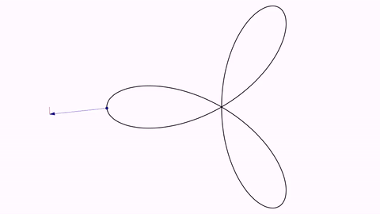
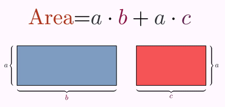

[ghome](https://davidgutierrezrubio.github.io/jmathanim/) [back](../index.html)

# Examples gallery

The animations in this channel are mostly made with JMathAnim, except for some simple things made with Powerpoint. Kdenlive was used for video editing. In Spanish with English subtitles: [El Taxista de Hardy](https://www.youtube.com/@EltaxistadeHardy1729)

## Function and its points with zero slope

A simple animation illustrating the updateable object `PointOnFunctionGraph` :

```java
@Override
public void setupSketch() {
    config.parseFile("#preview.xml"); //Change this to #production.xml to generate final HD video
    config.parseFile("#light.xml");
}

@Override
public void runSketch() {
    Axes axes = Axes.make(-2,2);//Axes with unit marks from -2 to 2, both vertically and horizontally
    add(axes);

    //The function
    FunctionGraph cat = FunctionGraph.make(x -> (x - 1) * (x + 1) * (x - .5));
    cat.thickness(3).drawColor("darkblue");

    //The roots of f'(x)
    double root1 = -0.4342585459107;
    double root2 = 0.767591879244;

    double xStart = -1;
    PointOnFunctionGraph A = PointOnFunctionGraph.make(xStart, cat);
    A.style("redcircle");

    Line tangentLine = Line.make(A, A.getSlopePointRight()).drawColor("darkgreen");

    //First, we animate the creation of the objects
    play.showCreation(cat);
    play.fadeIn(A);
    play.showCreation(tangentLine);

    //Now we shift the point A to the first root and fadeIn a illustrative text and a marker point
    play.shift(5, root1 - xStart, 0, A);
    PointOnFunctionGraph marker1 = A.copy().dotStyle(DotStyle.CROSS).drawColor("darkblue");

    LatexMathObject text1 = LatexMathObject.make("$$f'(x)=0$$")
        .scale(.5)
        .stack()
        .withGaps(.1)
        .withDestinyAnchor(AnchorType.UPPER)
        .toObject(A);

    play.fadeIn(2, text1,marker1);

    //We do the same with the second root
    play.shift(5, root2 - root1, 0, A);
    PointOnFunctionGraph marker2 = A.copy().dotStyle(DotStyle.CROSS).drawColor("darkblue");

    LatexMathObject text2 = LatexMathObject.make("$$f'(x)=0$$")
        .scale(.5)
        .stack()
        .withGaps(.1)
        .withDestinyAnchor(AnchorType.LOWER)
        .toObject(A);

    play.fadeIn(2, text2, marker2);

    play.shift(5, 1, 0, A);

    waitSeconds(5);
}
```

[You can see the video here](https://imgur.com/gallery/Iun5dD6)


## Taylor expansion of sin(x)

```java
@Override
public void setupSketch() {
    config.parseFile("#preview.xml"); //Change this to #production.xml to generate final HD video
    config.parseFile("#light.xml");
}

public void runSketch() throws Exception {
    int orderTaylor = 8;
    Axes axes = Axes.make();
    axes.addXTicksLegend("$\\pi$", PI, TickAxes.TickType.PRIMARY, 0);
    axes.addXTicksLegend("$-\\pi$", -PI, TickAxes.TickType.PRIMARY, 0);
    axes.addXTicksLegend("$2\\pi$", 2 * PI, TickAxes.TickType.PRIMARY, 0);
    axes.addXTicksLegend("$-2\\pi$", -2 * PI, TickAxes.TickType.PRIMARY, 0);
    axes.generatePrimaryYTicks(-4, 4, 1);
    add(axes);
    final double xmin = -2 * PI - .2;
    final double xmax = 2 * PI + .2;
    FunctionGraph sinFunction = FunctionGraph.make(t -> Math.sin(t), xmin, xmax);
    sinFunction.thickness(25).drawColor("#682c0e");
    camera.adjustToObjects(sinFunction);

    play.showCreation(sinFunction);
    waitSeconds(1);

    FunctionGraph[] taylor = new FunctionGraph[orderTaylor];
    LatexMathObject[] texts = new LatexMathObject[orderTaylor];
    for (int n = 1; n < orderTaylor; n++) {
        taylor[n] = FunctionGraph.make(TaylorExpansionSin(n), xmin, xmax).drawColor("#153e90").thickness(15);
        texts[n] = LatexMathObject.make("Taylor order " + (2*n-1)).scale(3).stack().withGaps(.2).toScreen(ScreenAnchor.UPPER_LEFT);
        texts[n].color("#153e90").layer(2);
    }
    final Rect r = texts[1].getBoundingBox().addGap(.1, .1);
    Shape box = Shape.rectangle(r).fillColor("white").thickness(3).layer(1);
    play.showCreation(taylor[1], texts[1], box);
    for (int n = 2; n < orderTaylor; n++) {
        add(taylor[n - 1].copy().thickness(1).drawColor("gray"));
        Transform transformFunction = Transform.make(2, taylor[n - 1], taylor[n]);
        Transform transformText = Transform.make(2, texts[n - 1], texts[n]);
        playAnimation(transformFunction, transformText);
    }
    waitSeconds(5);
}

public final DoubleUnaryOperator TaylorExpansionSin(int order) {
    return x->{
        double resul=0;
        double potX=x;
        int sign=1;
        for (int n = 0; n < order; n++) {
            int k=2*n+1;
            resul+=potX/factorial(k)*(sign);
            sign=-sign;
            potX*=x*x;
        }
        return resul;
    };
}
public int factorial(int n) {
    int resul = 1;
    for (int i = 1; i <= n; i++) {
        resul *= i;
    }
    return resul;
}
```

You can [see the video here](https://imgur.com/gallery/PjlVtXw).

## Trifolium into Freeth's Nephroid (and back)

Two parametric curves expressed in polar coordinates. Note that we made a copy of the first one as it becomes altered after the first `transform`.

```java
add(Axes.make());
ParametricCurve trifolium = ParametricCurve.makePolar(t -> 2 * Math.cos(t) * (4 * Math.sin(t) * Math.sin(t) - 1), t -> t, 0, PI);
ParametricCurve nephroid = ParametricCurve.makePolar(t -> 1 + 2 * Math.sin(t / 2), t -> t, 0, 4 * PI);

trifolium.drawColor("#153e90").thickness(15);
nephroid.drawColor("#a05344").thickness(15);
ParametricCurve trifoliumCopy = trifolium.copy();

camera.adjustToObjects(trifolium, nephroid);
play.transform(5, trifolium, nephroid);
play.transform(5, nephroid, trifoliumCopy);
```

Here you have a GIF from the movie generated:


### Trail curve derived from Trifolium

For each point of the Trifolium, we add the derivative vector rotated 90 degrees clockwise, and draw the trail. The animation is done with the `advanceFrame()` method, and we register an instance of `CameraAlwaysAdjusting` class to adjust the camera to all objects in the scene.

```java
ParametricCurve trifolium = ParametricCurve.makePolar(t -> 2 * Math.cos(t) * (4 * Math.sin(t) * Math.sin(t) - 1), t -> t, 0, PI);

//The original coordinates of the points are irrelevant as they will be updated
//prior to drawing the first frame.
Point pointOnCurve = Point.at(0, 0).drawColor("darkblue");
Point pointToTrail = Point.at(0, 0);
Arrow arrow = Arrow.make(pointOnCurve, pointToTrail,ArrowType.ARROW1).drawColor("darkblue").layer(1);
add(trifolium.thickness(15), pointOnCurve, arrow);
Trail derivedCurve = Trail.make(pointToTrail).drawColor("darkred").dashStyle(DashStyle.DASHED);
add(derivedCurve);
registerUpdateable(CameraAlwaysAdjusting.make(camera, .1, .1));
double time = 10;
for (double t = 0; t < time; t += dt) {
    final double t0 = PI * t / time;
    Vec v = trifolium.getFunctionValue(t0);
    pointOnCurve.moveTo(Point.at(v));
    Vec deriv = trifolium.getTangentVector(t0, 1).normalize();
    Vec normal = deriv.copy().rotate(-90 * DEGREES);
    pointToTrail.copyStateFrom(pointOnCurve.add(normal));
    advanceFrame();
}
waitSeconds(3);
```

Here you have a GIF from the movie generated:



## The trail of the vertices of a square rotating over a line

```java
Shape sq = Shape.square().scale(.2)
    .stack()
    .withOriginAnchor(AnchorType.LOWER_AND_ALIGNED_LEFT)
    .toScreen(ScreenAnchor.LEFT);
add(Line.XAxis(), sq);
int n = 1;
add(Trail.make(sq.getPoint(0)).drawColor("red").thickness(15)
    , Trail.make(sq.getPoint(1)).drawColor("blue").thickness(15)
    , Trail.make(sq.getPoint(2)).drawColor("green").thickness(15)
    , Trail.make(sq.getPoint(3)).drawColor("gray").thickness(15)
   );
for (int k = 0; k < 30; k++) {
    play.rotate(.5, sq.getPoint(n), -90 * DEGREES, sq);
    n++;
}
waitSeconds(3);
```

Here is a GIF from the movie generated:


## The Koch curve

```java
@Override
public void runSketch() throws Exception {
    int numIters = 6;
    Shape[] koch = new Shape[numIters];
    koch[0] = Shape.segment(Point.origin(), Point.unitX());
    for (int n = 1; n < numIters; n++) {
        koch[n] = getNextKochIteration(koch[n - 1]);
    }
    camera.zoomToObjects(koch[numIters - 1]);
    for (int n = 1; n < numIters; n++) {
        play.transform(3, koch[n - 1], koch[n]);
    }
    waitSeconds(5);
}

private Shape getNextKochIteration(Shape previousShape) {
    //A new iteration of the Koch curve is composed of 4 copies of the previous iteration
    //scaled 1/3.
    Shape s1 = previousShape.copy().scale(previousShape.get(0), 1d / 3, 1d / 3);
    JMPath s2 = s1.getPath().copy() //A copy of s1...
        .rotate(s1.get(0), PI / 3)//rotated 60 degrees around left point of s1...
        .shift(s1.get(0).to(s1.get(-1)));//and moved to start at right point of s1...
    JMPath s3 = s1.getPath().copy()//A copy of s1...
        .rotate(s1.get(0), -PI / 3)//rotated -60 degress around left point of s1...
        .shift(s1.get(0).to(s2.get(-1)));//and moved to start at right point of s2...
    JMPath s4 = s1.getPath().copy()//A copy of s1...
        .shift(s1.get(0).to(s3.get(-1)));//moved to start at right point of s3..
    s1.merge(s2, true, false).merge(s3, true, false).merge(s4, true, false);//merge all
    return s1;
}
```

You can [see the video here](https://imgur.com/gallery/8jCXGWf).

## The Hilbert curve

```java
@Override
public void runSketch() throws Exception {
    int numIters = 7;
    Shape unitSquare = Shape.square().center().scale(-1, 1);
    Shape hilbert = unitSquare.copy().scale(.5).rotate(-90 * DEGREES);
    unitSquare.thickness(5).drawColor("#153e90").fillColor("#FDFDFD");
    camera.setGaps(.1, .1);
    camera.zoomToObjects(unitSquare);
    hilbert.get(0).setSegmentToThisPointVisible(false);
    Shape previous = hilbert;
    add(unitSquare);
    for (int n = 0; n < numIters; n++) {
        hilbert = getNextHilbert(unitSquare, hilbert);
        play.transform(2, previous, hilbert);
        previous = hilbert;
    }
    waitSeconds(3);
}

private Shape getNextHilbert(Shape box, Shape previous) {
    //Next iteration of hilbert is done scaling the previous to 50%,
    //making 4 copies and merging them properly rotated and positioned

    Shape nextHilbert = previous.copy().scale(box.get(1), .5, .5);
    //Creates a reflection about a diagonal of s1 and apply to it
    AffineJTransform reflection1 = AffineJTransform.createReflectionByAxis(
        nextHilbert.getBoundingBox().getUpperRight(),
        nextHilbert.getBoundingBox().getLowerLeft(),
        1);
    reflection1.applyTransform(nextHilbert);

    JMPath s2 = previous.getPath().copy().scale(box.get(2), .5, .5);
    JMPath s3 = previous.getPath().copy().scale(box.get(3), .5, .5);
    JMPath s4 = previous.getPath().copy().scale(box.get(0), .5, .5);

    //Creates a reflection about the other diagonal of s4 and apply to it
    final AffineJTransform reflection2 = AffineJTransform.createReflectionByAxis(
        s4.getBoundingBox().getLowerRight(),
        s4.getBoundingBox().getUpperLeft(),
        1);
    s4.applyAffineTransform(reflection2);

    //Now merge everything
    nextHilbert.merge(s2, true, false).merge(s3, true, false).merge(s4, true, false);
    return nextHilbert;
}
```

You can [see the video here](https://imgur.com/gallery/7ZRnq0I).

## The Tusi couple

```java
int numPoints = 10;//Number of points/diameters to show

//The outer circle
Shape outerCircle = Shape.circle().thickness(15).drawColor("blue");

//This shape (outerCircle scaled 50%) is the path that will follow the rotatingCircle group
Shape path = outerCircle.copy().scale(.5);

//Add the diameters
for (int n = 0; n < numPoints * 2; n++) {
    Point p1 = Point.at(outerCircle.getVecAt(.5d * n / numPoints));
    Point p2 = Point.at(outerCircle.getVecAt(.5d * n / numPoints + .5));
    add(Shape.segment(p1, p2).drawColor("gray").thickness(5));
}

//A group containing the rotating circle and the marker points
MathObjectGroup rotatingCircle = MathObjectGroup.make();
//Circle that moves inside
Shape circleSmall = Shape.circle()
    .scale(.5).shift(0, .5) //Scale, position...
    .drawColor("olive").thickness(10);//Style...

rotatingCircle.add(circleSmall);//Add to group
for (int n = 0; n < numPoints; n++) {
    Point p = Point.at(circleSmall.getVecAt(1d * n / numPoints)).style("redCircle");
    rotatingCircle.add(p);//Add to group
}

add(outerCircle, rotatingCircle);
MoveAlongPath mov = MoveAlongPath.make(10, path, rotatingCircle, AnchorType.CENTER,false,false);
Animation rot = Commands.rotate(10, -2 * PI, rotatingCircle).setUseObjectState(false);
mov.setLambda(t -> t);//Uniform movement
rot.setLambda(t -> t);//Uniform rotation
playAnimation(mov, rot);
```

Here you have a GIF from the generated movie :


## The distributive property

```java
//Two rectangles
Shape sq1 = Shape.square().scale(2.5, 1).style("solidblue");
Shape sq2 = Shape.square().scale(1.75, 1).style("solidred");
sq2.stack()
    .withGaps(.5)
    .withDestinyAnchor(AnchorType.RIGHT)
    .toObject(sq1);
add(sq1, sq2);

//The colors chosen to the symbols a, b and c
JMColor colA = JMColor.parse("#34403C");
JMColor colB = JMColor.parse("#961A4C");
JMColor colC = JMColor.parse("#6A2A5C");
JMColor colArea = JMColor.parse("#B73A1C");

//Brace delimiters
Delimiter del1X = Delimiter.makeStacked(sq1, AnchorType.LOWER, DelimiterType.BRACE, .1).addlabelTip("$b$", .1);
Delimiter del1Y = Delimiter.makeStacked(sq1, AnchorType.LEFT, DelimiterType.BRACE, .1).addlabelTip("$a$", .1);
Delimiter del2X = Delimiter.makeStacked(sq2, AnchorType.LOWER, DelimiterType.BRACE, .1).addlabelTip("$c$", .1);
Delimiter del2Y = Delimiter.makeStacked(sq2, AnchorType.RIGHT, DelimiterType.BRACE, .1).addlabelTip("$a$", .1);

//Need to declare this so that labels do not appear rotated (vertical delimiters)
del1Y.setRotationType(RotationType.FIXED);
del2Y.setRotationType(RotationType.FIXED);

//Set the colors for labels only
del1X.getLabel().color(colB);
del1Y.getLabel().color(colA);
del2X.getLabel().color(colC);
del2Y.getLabel().color(colA);
LatexMathObject textBC = LatexMathObject.make("$b+c$");
textBC.setColorsToIndices(colB, 0);//"b" glyph
textBC.setColorsToIndices(colC, 2);//"c" glyph
Delimiter del12X = Delimiter.makeStacked(
    MathObjectGroup.make(sq1, sq2),//We group these 2 rectangles so the brace adjust to the 2 combined
    AnchorType.UPPER, DelimiterType.BRACE, .1)
    .addlabelTip(textBC, .1);

//The upper formula  Area=a*b+a*c
LatexMathObject formula1 = LatexMathObject.make("Area=$a\\cdot b+a\\cdot c$").scale(3);
//Position formula .5 units above sq2...we will center it horizontally later
formula1.stack()
    .withGaps(.5)
    .withDestinyAnchor(AnchorType.UPPER)
    .toObject(sq2);
//Apply colors
formula1.setColorsToIndices(colArea, 0, 1, 2, 3);//"Area"
formula1.setColorsToIndices(colA, 5, 9);//The "a" glyphs
formula1.setColorsToIndices(colB, 7);//The "b" glyph
formula1.setColorsToIndices(colC, 11); //The "c" glyph

//The upper formula  Area=a*(b+c)
LatexMathObject formula2 = LatexMathObject.make("Area=$a\\cdot(b+c)$").scale(3);
//Apply colors
formula2.setColorsToIndices(colArea, 0, 1, 2, 3);//"Area"
formula2.setColorsToIndices(colA, 5);//The "a" glyphs
formula2.setColorsToIndices(colB, 8);//The "b" glyph
formula2.setColorsToIndices(colC, 10);//The "c" glyph

add(del1X, del2X, del1Y, del2Y, formula1);
camera.adjustToAllObjects();

//Align formula1 horizontally and formula2 with it. Note that we have to do this after adjusting the camera
formula1.hCenter();
formula2.alignCenter(4, formula1, 4);//Align "=" sign of formula2 with that of the formula1

//We make a copy of formula1 to make the inverse animation later
LatexMathObject formula3 = formula1.copy();

waitSeconds(2);
Animation shiftSquareAnim = Commands.shift(3, .5, 0, sq1);
Animation fadeBraceAnim = Commands.fadeIn(3, del12X);

TransformMathExpression changeFormulaAnim = TransformMathExpression.make(3, formula1, formula2);
changeFormulaAnim.mapRange(0, 6, 0);//"Área=a\cdot"
changeFormulaAnim.map(7, 8);//b -> b
changeFormulaAnim.map(8, 9);//+ -> +
changeFormulaAnim.map(9, 5).addJumpEffect(.5);//Second a -> a
changeFormulaAnim.map(11, 10);//c -> c

playAnimation(shiftSquareAnim, fadeBraceAnim, changeFormulaAnim);
waitSeconds(3);

//Inverse animation
shiftSquareAnim = Commands.shift(3, -.5, 0, sq1);
fadeBraceAnim = Commands.fadeOut(3, del12X);

changeFormulaAnim = TransformMathExpression.make(3, formula2, formula3);
changeFormulaAnim.mapRange(0, 6, 0);
changeFormulaAnim.map(8, 7);
changeFormulaAnim.map(9, 8);
changeFormulaAnim.map(5, 9).addJumpEffect(-.5);
changeFormulaAnim.map(10, 11);
playAnimation(shiftSquareAnim, fadeBraceAnim, changeFormulaAnim);
waitSeconds(3);
```




## The Clock

This example shows how combining simple animations we can have complex ones. The total animation is done with a single `playAnimation` call.

```java
double runtime = 5;

//This shape hold the points where the numbers will lie
Shape destiny = Shape.circle().scale(.75).rotate(90 * DEGREES);
AnimationGroup wholeAnim = AnimationGroup.make();
for (int n = 1; n <= 12; n++) {
    //Take 12 points equally spaced inside the path 0, 1/12, 2/12,...11/12
    //We take them in reverse as the circle is built counterclockwise
    Vec sv = destiny.getVecAt(1d*(12 - n) / 12);
    //Each number begins centered at (0,0) and moves to a point of shape destiny, with a combined animation
    //of growing, shifting and rotating...
    LatexMathObject sq = LatexMathObject.make("" + n).center();
    AnimationGroup singleNumberAnim = AnimationGroup.make();
    singleNumberAnim.add(Commands.shift(runtime , sv, sq));
    singleNumberAnim.add(Commands.rotate(runtime, sv.getAngle() - PI / 2, sq).setUseObjectState(false));
    singleNumberAnim.setLambda(UsefulLambdas.smooth());
    wholeAnim.add(singleNumberAnim);
}
wholeAnim.addDelayEffect(.2);
//You can experiment changing the lambda, for example
//wholeAnim.setLambda(UsefulLambdas.bounce2())
playAnimation(wholeAnim);
waitSeconds(3);
```

Here you have a GIF from the movie generated:


## A Pythagoras Theorem proof

An animation with a background image and the shadow effect

[Link to Youtube](https://www.youtube.com/watch?v=wogadxvkZi0)

## Sum of the first odd numbers

Visual proof of the sum of the 9 first odd numbers
[Link to Youtube](https://www.youtube.com/watch?v=uFhtdXuPPLM)

And here with the 40 first odd numbers...
[Link to Youtube](https://www.youtube.com/watch?v=emEJ-EooNBc)


## A property of powers

The `map` parameters may seem confusing to read, but the creation was pretty straightforward, using the `formulaHelper` method before to show the indices of each LatexMathObject instance:

```java
LatexMathObject t1 = LatexMathObject.make("$4^{2+3}=4^2\\cdot 4^3$");
LatexMathObject t2 = LatexMathObject.make("$4^{7+3}=4^7\\cdot 4^3$").alignCenter(4, t1, 4);
LatexMathObject t3 = LatexMathObject.make("$4^{7+1}=4^7\\cdot 4^1$").alignCenter(4, t1, 4);
LatexMathObject t4 = LatexMathObject.make("$4^{7-2}=4^7\\cdot 4^{-2}$").alignCenter(4, t1, 4);
LatexMathObject t5 = LatexMathObject.make("$4^{ {1\\over2}-2}=4^{1\\over2}\\cdot 4^{-2}$").alignCenter(6, t1, 4);
LatexMathObject t6 = LatexMathObject.make("$a^{b+c}=a^{b}\\cdot a^{c}$").alignCenter(4, t1, 4);

//Colors
JMColor colA = JMColor.parse("darkgreen");
JMColor colB = JMColor.parse("#84142d");
JMColor colC = JMColor.parse("#1f4068");
t1.setColor(colA, 0, 5, 8).setColor(colB, 1, 6).setColor(colC, 3, 9);
t2.setColor(colA, 0, 5, 8).setColor(colB, 1, 6).setColor(colC, 3, 9);
t3.setColor(colA, 0, 5, 8).setColor(colB, 1, 6).setColor(colC, 3, 9);
t4.setColor(colA, 0, 5, 8).setColor(colB, 1, 6).setColor(colC, 2, 3, 9, 10);
t5.setColor(colA, 0, 7, 12).setColor(colB, 1, 2, 3, 8, 9, 10).setColor(colC, 4, 5, 13, 14);
t6.setColor(colA, 0, 5, 8).setColor(colB, 1, 6).setColor(colC, 3, 9);

double runtime = 2;
camera.setGaps(.1, .1);
camera.zoomToObjects(t1, t2, t3, t4, t5, t6);
TransformMathExpression tr = TransformMathExpression.make(runtime, t1, t2);
tr.mapRange(0, 9, 0);
playAnimation(tr);
waitSeconds(1);

tr = TransformMathExpression.make(runtime, t2, t3);
tr.mapRange(0, 9, 0);//t2 and t3 have the same number of shapes, one-to-one correspondence
playAnimation(tr);
waitSeconds(1);

tr = TransformMathExpression.make(runtime, t3, t4);
tr.mapRange(0, 8, 0);
tr.defineDstGroup("minus8", 9, 10);
tr.map(9, "minus8");//The "3" maps into the 2 shapes "-8"
playAnimation(tr);
waitSeconds(1);

tr = TransformMathExpression.make(runtime, t4, t5);
tr.map(0, 0);
tr.defineDstGroup("frac1", 1, 2, 3);
tr.map(1, "frac1").setTransformStyle(TransformMathExpression.TransformType.FLIP_VERTICALLY);
tr.mapRange(2, 5, 4);
tr.defineDstGroup("frac2", 8, 9, 10);
tr.map(6, "frac2").setTransformStyle(TransformMathExpression.TransformType.FLIP_VERTICALLY);
tr.mapRange(7, 10, 11);
playAnimation(tr);
waitSeconds(1);

tr = TransformMathExpression.make(runtime, t5, t6);
tr.map(0, 0);
tr.defineOrigGroup("frac1", 1, 2, 3);
tr.map("frac1", 1);//The 3 shapes "1 / 2" maps into the shape "b"
tr.mapRange(4, 7, 2);
tr.defineOrigGroup("frac2", 8, 9, 10);
tr.map("frac2", 6);
tr.mapRange(11, 12, 7);
tr.defineOrigGroup("minus2", 13, 14);
tr.map("minus2", 9);
playAnimation(tr);
waitSeconds(1);

//Highlight the "b"
playAnimation(Commands.highlight(1, t6.get(1)),
              Commands.highlight(1, t6.get(6)));
//Highlight the "c"
playAnimation(Commands.highlight(1, t6.get(3)),
              Commands.highlight(1, t6.get(9)));
waitSeconds(3);
```

Here is a gif from the movie generated:


## Moving 3 coins
A solution for a simple puzzle. Can you invert the triangle moving only 3 coins?

```java
Shape coinBase = Shape.circle().fillColor("gold").thickness(10);
Shape[] coin = new Shape[10];
for (int n = 0; n < 10; n++) {
    coin[n] = coinBase.copy();
}
double vertGap = Math.sqrt(3) - 2;//This negative gap is computed so that circles are tangent
MathObjectGroup pyramid=MathObjectGroup.make(coin);
pyramid.setLayout(PascalLayout.make(Vec.to(0,0),0, vertGap));
add(pyramid);
camera.adjustToAllObjects();
camera.scale(2);
//The number of coins:
//   0
//  1 2
// 3 4 5
//6 7 8 9
//To invert the pyramid, we need to:
//Rotate coin 6 around coin 3,
//rotate coin 9 around coin 8, and
//rotate coin 0 around coin 2
Animation anim1 = Commands.rotate(2, coin[3].getCenter(), -120 * DEGREES, coin[6]);
Animation anim2 = Commands.rotate(2, coin[8].getCenter(), -120 * DEGREES, coin[9]);
Animation anim3 = Commands.rotate(2, coin[2].getCenter(), -120 * DEGREES, coin[0]);

playAnimation(anim1,anim2,anim3);
//Now they are arranged in this way:
//6 1 2 0
// 3 4 5
//  7 8 
//   9
//So, we need to:
//Rotate coin 6 around coin 1,
//rotate coin 9 around 7, and
//rotate coin 0 around coin 5
//to invert the pyramid again

waitSeconds(3);//Take a breath...

anim1 = Commands.rotate(2, coin[1].getCenter(), -120 * DEGREES, coin[6]);
anim2 = Commands.rotate(2, coin[7].getCenter(), -120 * DEGREES, coin[9]);
anim3 = Commands.rotate(2, coin[5].getCenter(), -120 * DEGREES, coin[0]);

playAnimation(anim1, anim2, anim3);

waitSeconds(3);
```

Here is a gif from the movie generated:


## A declaration of love

This example illustrates the transform animation between two multishape objects.

```java
LatexMathObject   text = LatexMathObject.make("I$\\heartsuit$pentagons").center();
text.setColorsToIndices(JMColor.parse("darkred"), 1);//Heart must be dark red

MultiShapeObject pentagons = MultiShapeObject.make();
for (LatexShape sh : text) {//Iterates over the shapes
    //Creates a pentagon rotated with a random angle
    Shape pentagon = Shape.regularPolygon(5);
    pentagon.rotate(Math.random() * 2 * PI);
    AffineJTransform tr = AffineJTransform.createAffineTransformation(pentagon.getBoundingBox(), sh.getBoundingBox(), 1);
    //Transforms the pentagon so that fits in the bounding box of the current letter
    tr.applyTransform(pentagon);
    //Pentagon will be drawn and filled with a random color
    JMColor col = JMColor.random();
    pentagon.fillColor(col)
        .fillAlpha(.5)
        .drawColor(col);
    pentagons.add(pentagon);
}

camera.zoomToObjects(text);
play.transform(3, pentagons, text);
play.transform(3, text, pentagons);
```


## One thousand candies falling

This example explores the use of `MathObjectGroup`class to handle large sets of objects

```java
Shape candy = Shape.circle().scale(.03).thickness(2);//base shape for candy
int numCandies = 1000;//Number of candies to fall
Point refPoint = Point.origin();
//Locates the refPoint at the bottom of the screen, leaving a margin the size of a candy
refPoint.stack().withGaps(candy.getHeight()).toScreen(ScreenAnchor.LOWER);

//Creates the group of candies
MathObjectGroup candyHeap = MathObjectGroup.make();
for (int n = 0; n < numCandies; n++) {
    candyHeap.add(candy.copy().fillColor(JMColor.random()));
}
//Now we will layout this using a PascalLayout. We need a triangular number
//of candies to get a perfect triangular heap, so we will use an auxiliar group
//with the candies and fill it to get a triangular number
int triangularNumber = 0;
int k = 0;
while (triangularNumber < numCandies) {
    triangularNumber = k * (k + 1) / 2;
    k++;
}
MathObjectGroup auxCandyHeap = MathObjectGroup.make();
//add the candies
auxCandyHeap.getObjects().addAll(candyHeap.getObjects());
//Now add the "virtual candies"
for (int n = 0; n < triangularNumber - numCandies; n++) {
    auxCandyHeap.add(candy.copy());//Virtual candies, these will be discarded later
}

//Reverse the order, so that the virtual candies will be on top of the Pascal Layout
Collections.reverse(auxCandyHeap.getObjects());

double radius = .5 * candy.getHeight();//radius of a candy
double vgap = radius * (Math.sqrt(3) - 2);//negative gap so that the circles will stick together
PascalLayout layout = PascalLayout.make(Point.origin(), 0, vgap);//The reference point here is meaningless, we will align the group later
auxCandyHeap.setLayout(layout);
auxCandyHeap.stack().withDestinyAnchor(AnchorType.UPPER).toObject(refPoint);

//Note that we used auxCandyHeap only the set the layout of all elements of group candyHeap
//Now perform animations. We will shuffle all elements in each row
AnimationGroup anim = AnimationGroup.make();
MathObjectGroup rows = layout.getRowGroups(auxCandyHeap);
Collections.reverse(rows.getObjects()); //Reverse the order of rows
int counter = 0;
int rowCounter = 0;
for (MathObject r : rows) {
    MathObjectGroup row = (MathObjectGroup) r;
    Collections.shuffle(row.getObjects());
    //Now for each candy of the shuffled row, add a fall animation
    //Each candy waits an increasing time and makes a moveIn animation from UPPER
    //The time duration of the fall animation decreases with the row number,
    //as upper rows takes less time to fall that lower ones
    //It is not phsyically accurate, but hey, it works...
    for (MathObject candyToFall : row) {
        if (candyHeap.getObjects().contains(candyToFall)) {//if not an auxiliar candy...
            Concatenate conc = Concatenate.make();
            final double wt = 2d * counter / candyHeap.size();
            conc.add(WaitAnimation.make(wt));
            conc.add(Commands.moveIn(1 - .9 * rowCounter / rows.size(), ScreenAnchor.UPPER, candyToFall).setLambda(t -> t * t));
            anim.add(conc);
            counter++;
        }
    }
    rowCounter++;
}
playAnimation(anim);
waitSeconds(3);
```
 You can see a video of the animation [here](https://imgur.com/a/Yd6dfnk)

## Showing the divisibility of a number with candies

The animation of the candies allocating in the band is done with a single `setLayout` animation, with a jump effect with semicircular path and a delay effect of 0.5

You can see a video of the animation [here](https://imgur.com/a/aVj0oXL) (note: the title of the video should say "7" instead of "9").

## Concentric circles that appear and disappear

This animation show how using the MathObjectGroup class can achieve interesting effects easily.

```java
int numberSmallSquares = 24;//24 squares in each circle
int numberConcentricCircles = 15;//15 concentric circles

//This is the side length of a regular polygon
//circumscribed in a unit circle
double scaleSmallSquare = 2 * Math.tan(PI / numberSmallSquares);

//Creates a base shape (a square, that can be changed)
//and put it to the right of the point (1,0)
Shape baseShape = Shape.square().scale(scaleSmallSquare);
baseShape.stack().withOriginAnchor(AnchorType.LEFT).toPoint(1, 0);

//Colors to alternate in base shape
JMColor col1 = JMColor.parse("#512D6D");
JMColor col2 = JMColor.parse("#F8485E");

//Each concentric circle is a MathObjectGroup
MathObjectGroup[] circles = new MathObjectGroup[numberConcentricCircles];

//Create the first MathObjectGroup, the outer circle
double delta = 2 * PI / numberSmallSquares;
circles[0] = MathObjectGroup.make();
boolean useFirstColor = false;
for (int n = 0; n < numberSmallSquares; n++) {
    Shape smallSquare = baseShape.copy().fillColor(useFirstColor ? col1 : col2);
    smallSquare.rotate(Point.origin(), delta * n);
    circles[0].add(smallSquare);
    useFirstColor = !useFirstColor;
}
//Create the next MathObjectGroups recursively, scaling appropriately
double scale = 2d;
for (int k = 1; k < circles.length; k++) {
    circles[k] = circles[k - 1].copy().scale(scale / circles[k - 1].getWidth());
    scale *= scale / circles[k - 1].getWidth();
}

//Add everything to the scene. If you add an array, each element of this array
//will be added to the scene
add(circles);
camera.adjustToAllObjects();

//Time to create animations, each one a rotation with alternating direction
AnimationGroup ag = AnimationGroup.make();
boolean reverse = false;
for (int k = 0; k < circles.length; k++) {
    ag.add(Commands.rotate(1,//1 second
                           Vec.to(0,0), //Rotation center
                           (reverse ? -delta : delta),//angle
                           circles[k])//Object to rotate
          );
    reverse = !reverse;
}

ag.setLambda(t -> t);//Linear movement
playAnimation(ag);//Play...
waitSeconds(1);//Wait...
playAnimation(ag);//Play again...
waitSeconds(1);//Wait...and done!
```

Here is a GIF from the movie generated:


## A Truchet tiling

An example showing how to generate a simple MathObjectGroup (a Truchet tile) and use the setLayout method to tile the plane. Add a zoom out and rotate effect to generate the optical illusion that the image is still rotating after the animation is finished.

```java
@Override
public void setupSketch() {
    config.parseFile("#dark.xml");
    //Change this to "#production.xml" to automatically generate the final HD video
    config.parseFile("#preview.xml");
    config.setBackgroundColor(JMColor.parse("#303841"));
}
@Override
public void runSketch() {
    MathObjectGroup truchets = MathObjectGroup.make();
    int size = 44;//A square of 44 rows/columns
    final int numTiles = size * size;
    final int rowSize = size;
    for (int k = 0; k < numTiles; k++) {
        boolean rand = (Math.random() < .5);
        truchets.add(makeTruchet(rand));
    }
    truchets.setLayout(BoxLayout.make(rowSize)).center();
    add(truchets);

    //A radial gradient, centered at origin and relative to screen
    JMRadialGradient grad = JMRadialGradient.make(
        truchets.getCenter(),
        truchets.getHeight() * .5);
    grad.setRelativeToShape(false);
    grad.add(0, JMColor.parse("#EEEEEE"));
    grad.add(1, JMColor.parse("#FF5722"));
    //Both draw an fill colors with this gradient
    truchets.fillColor(grad).drawColor(grad);
    camera.setMathXY(-1, 1, 0);
    playAnimation(
        Commands.rotate(20, 4 * PI, truchets).setLambda(t -> t),
        Commands.cameraScale(20, camera, 20).setLambda(t -> t)
    );
    waitSeconds(5);//In this 5 seconds you will think that the picture is still moving :-)
}


//This method generates a single Truchet tile, rotated or not
private MathObjectGroup makeTruchet(boolean turn) {
    MathObjectGroup truchetTile = MathObjectGroup.make();
    //This commented line added the outline of the tile. You can uncomment it
    //to see the difference
    //resul.add(Shape.square().drawColor("violet").fillColor("white"));
  
    //A quarter circle, with radius 1
    Shape a = Shape.arc(.5 * PI);
    //2 copies, scaled around center of the arc
    double width = .375;
    Shape inner = a.copy().scale(Point.origin(), .5 - width * .5, .5 - width * .5);
    Shape outer = a.copy().scale(Point.origin(), .5 + width * .5, .5 + width * .5);
    
    //Merge inner and reversed outer shape, connecting both ends
    inner.merge(outer.reverse(), true,true);

    truchetTile.add(inner, inner.copy().rotate(Point.at(.5, .5), PI));
    if (turn) {//Rotate the tile 90 degrees
        truchetTile.rotate(.5 * PI);
    }
    return truchetTile;
}
```

You can see the generated video [here](https://imgur.com/gallery/Jxpwz02)


[home](https://davidgutierrezrubio.github.io/jmathanim/) [back](../index.html)