[home](https://davidgutierrezrubio.github.io/jmathanim/) [back](../index.html)

# Creating a JMathAnim Project

1) JMathAnim is a Java library that uses Maven as its deployment tool. As a result, you can easily include it in any project using a modern IDE. For example, let's see how to create a JMathAnim project in Netbeans:
   1. Create a new Java project with Maven:

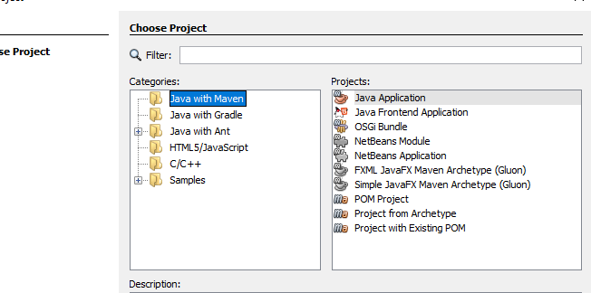

2) Set the name of the project. The Artifact, Group ID, Version and Package are not really necessary unless you're going to publish this to a repository. Select 'Finish' and the project is created.

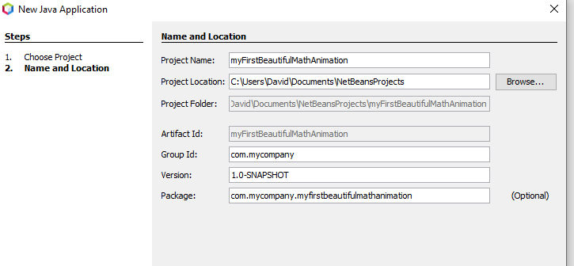


# Adding Maven dependencies
3) In the "Project Files" section we find the `pom.xml`file. This is a very important file for a Maven based project. Among other things, it allows us to specify external dependencies. Double click to edit it:

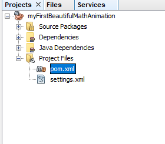

4) You will have a file like this:

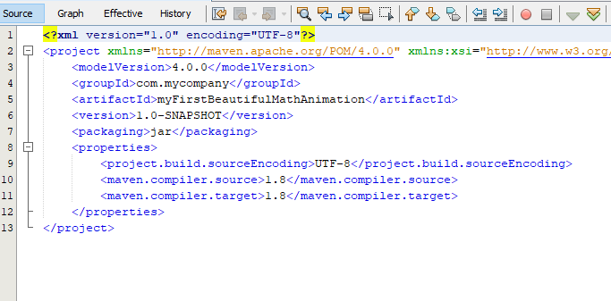

You need to add the dependencies to add the JMathAnim library to your project. You can use the latest released version (currently v0.9.10) or a snapshot version. Currently, I recommend using development snapshots, because released versions <1.0.0 may still have bugs that are periodically fixed in the snapshot versions before a new one is released.

If you want the released version, add

```xml
<dependencies>
    <dependency>
        <groupId>com.github.davidgutierrezrubio</groupId>
        <artifactId>JMathAnim</artifactId>
        <version>0.9.12</version>
    </dependency>
</dependencies>
```

If you want to use the snapshot version, you must also add the repository where it is located:

```xml
<repositories>
  <repository>
    <name>Central Portal Snapshots</name>
    <id>central-portal-snapshots</id>
    <url>https://central.sonatype.com/repository/maven-snapshots/</url>
    <releases>
      <enabled>false</enabled>
    </releases>
    <snapshots>
      <enabled>true</enabled>
    </snapshots>
  </repository>
</repositories>
<dependencies>
    <dependency>
        <groupId>com.github.davidgutierrezrubio</groupId>
        <artifactId>JMathAnim</artifactId>
        <version>0.9.13-SNAPSHOT</version>
    </dependency>
</dependencies>
```

4) In this example, I use the 0.8.3-snapshot version:

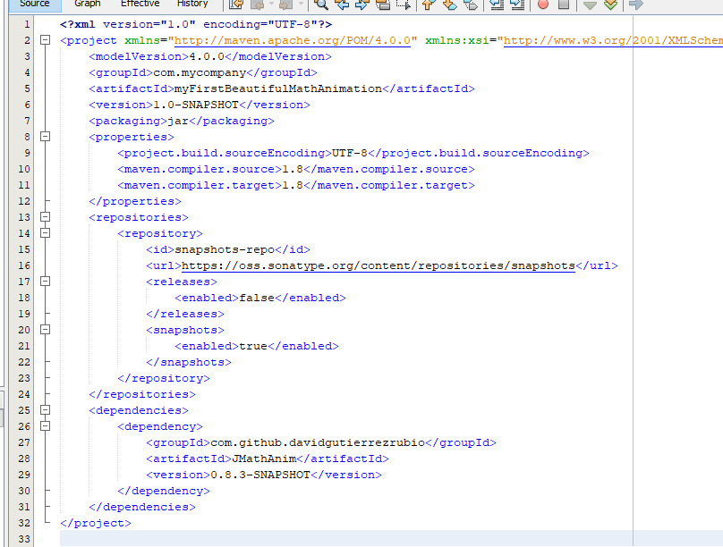

5) Once the file is saved, create a Java file in the default package:

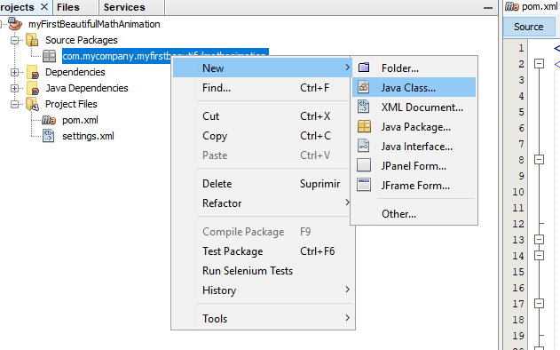

6) In my example, I created a file named `myScene.java` and a class with the same name:

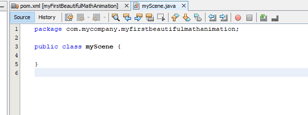

# Javadocs

The classes and methods (almost all of them) are documented in javadoc style. If you want to download them, in Netbeans it is quite simple. Just go to the project tree under the "dependencies" folder, right click on "jmathanim" and select "download javadoc".

# Writing the basic code
7) Press the 'Clean and build' button. This will tell Maven to download all the dependencies it needs. It should download JavaFX and Xuggler, which may take a few minutes depending on your bandwidth. Then we will make this class a subclass of `Scene2D`. If all goes well, the autocomplete should show the `Scene2D` class and you will need to implement the 2 abstract methods `setupSketch()` and `runSketch()`:

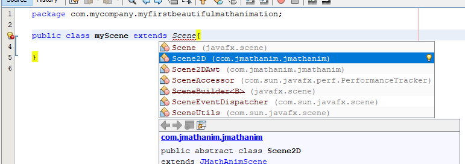

(Oops, I missed the convention that class names should start with an uppercase letter, sorry!)

8) Pressing Alt+Enter in Netbeans allows you to automatically add required imports and implement abstract methods:

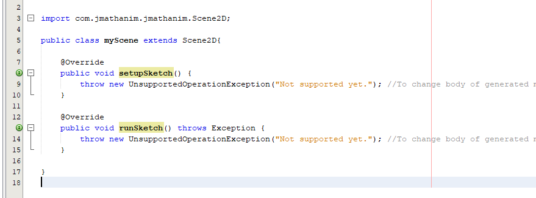

9) We're almost there... Add some basic code to test it. Delete the `throw' lines and insert the code as shown in the picture:

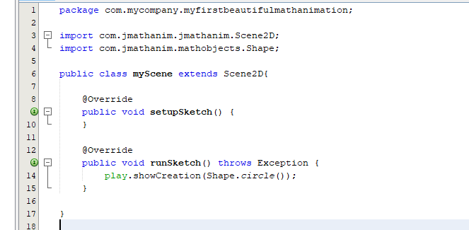

10) Finally, to be able to run this scene, we need to add a `main` method. In the same class (or another file if you prefer) we need to define a `public static void main` method. Hopefully Netbeans provides a shortcut for this; just go to the top level of the class and type `psvm`+TAB, and the text `public static void main(String[] args)` will be created automatically. Add the following code to your newly created `main' method:


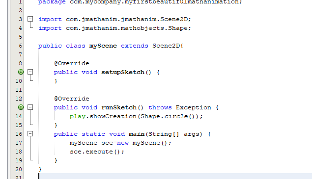

and run the code by pressing F6. You will be asked for the `main` method the first time. Simply select the class we created and press "Select main class". If everything went as planned, you should see a preview window with this animation, which will close when the animation is finished:


And that's it! You have JMathAnim ready to create beautiful, educational mathematical animations. Have fun with it!

[home](https://davidgutierrezrubio.github.io/jmathanim/) [back](../index.html)