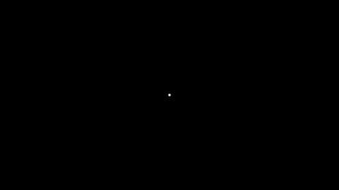

[home](https://davidgutierrezrubio.github.io/jmathanim/) [back](../index.html)

# Basic flow of an animation


We will illustrate this with a simple example: Create a java class named  `MovingDot.java` in your IDE with this code:

``` java
public class MovingDot extends Scene2D {
    @Override
    public void setupSketch() {
        config.setCreateMovie(true);
        config.setLowQuality();
    }

    @Override
    public void runSketch() throws Exception {
        Point p=Point.at(0,0);
        play.shift(2,Vec.to(1,0),p);
        waitSeconds(3);
    }
}
```

and, for simplicity, another one with the `main` method:

``` java
 public static void main(String[] args) {
        JMathAnimScene demoScene = new movingDot();
        demoScene.execute();
}
```

If you execute the program, and if everything goes well, you should see a white point moving to the right in a window, which closes after a few seconds. Something like this:



Besides, a file named MovingDot_480p.mp4` should be generated at the `media` folder in your project directory, with the generated animation. We will examine what happened here:

``` java
public class MovingDot extends Scene2D {...
```

All animations are defined in a class that extends the basic class `JMathAnimScene`. In this case, `Scene2D` is a subclass of `JMathAnimScene` which uses JavaFX to perform drawings. When you extend this class, you’ll need to implement the two abstract methods `setupSketch` and `runSketch`. The first does all necessary configuration before doing actual animations, like width, height, fps, whether should create a movie or not, should show preview window, etc.

``` java
 @Override
    public void setupSketch() {
        config.setCreateMovie(true);
        config.setLowQuality();
    }
```

The `config` object stores global configuration and has several methods to fine tune your scene. The `config.setCreateMovie(true)` tells the library that it should generate a movie. In practice, you should generate a movie in the last stages of your design, so by default this flag is set to `false`.

The `config.setLowQuality()` command establishes dimensions of 854x480 and 30 frames per second. Aditionally there is `config.setMediumQuality()` with 1280x720 at 30fps and `config.setHighQuality()` with 1920x1080 at 60fps. All these settings are 16:9.

The second method is where you should perform all the animations and drawings:

``` java
  @Override
    public void runSketch() throws Exception {
        Point p=Point.at(0,0);
        play.shift(2,1,0,p);
        waitSeconds(3);
    }
```

The coordinates where our objects live (the "math view") are centered initially at (0,0) with x from -2 to 2 and y from -1.125 to 1.125. Although the center and the x-boundaries are always these at the beginning, the y-boundaries may vary depending on the proportion. For a 16:9 proportion, these are the default values. 

The command

``` java
Point p=Point.at(0,0);
```

Creates a `Point`object, which represents a point at (0,0).  This object is not automatically added to the scene, so you should include it with the `add(p)`command or animating it in some way. Note that, up to this point, no frames were generated. The following command begins to do the magic:

``` java
play.shift(2,Vec.to(1,0),p);
```

Plays an animation, with lasts for 2 seconds, shifting the specified object `p` with a vector of coordinates `(1,0)`.

The specified animation generates 2 seconds of frames (the precise number of frames depends on fps) shifting our point one unit to the right.

``` java
waitSeconds(3);
```

With this command, we generate 3 seconds of still frames, where nothing happens, apart from seeing the objects we added to the scene.

When the `runSketch()`method is done, all necessary finishing procedures are called (finishing the movie, closing preview windows, etc.) and the execution terminates.

As you can see the basic flow of a typical scene is

1.  Setup animation with `setupSketch()` method.

2.  Write all the animation code in `runSketch()` method so that

    1.  Should create different objects, adding them to the scene.

    2.  Frames of the animation are generated when calling animation
        commands like `play.shift`.

Actually, there is another, more procedural form, to do animations, with the `advanceFrame()` method. You can manually adjust the properties of your objects like size or position and calling `advanceFrame()` each time. This way can be useful when you want to do complex movements that cannot be done with the `Animation`class.

[home](https://davidgutierrezrubio.github.io/jmathanim/) [back](../index.html)