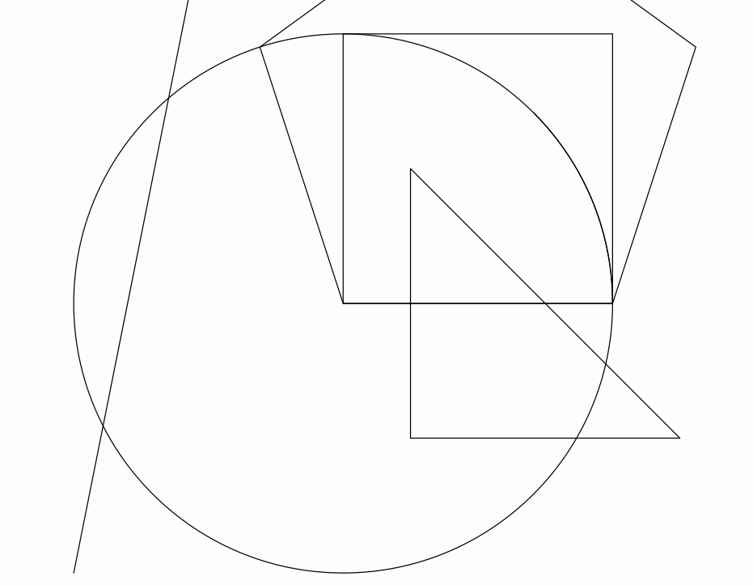

# Basic Objects

The Vec class
-------------

The `Vec` class represents a 2D vector (although it includes the z-coordinate too). All coordinates in the math view are represented by this class. Several methods are implemented for this class. For example, methods `add` and `mult` adds 2 vectors or multiply by a scalar,returning a new vector object with the result. These methods have their versions `addInSite` and `multInSite` which returns `void` and change the original vector.

``` java
Vec v=new Vec(1,3); //Creates a new vector.
Vec u=Vec.to(4,5);//Another way, using a static constructor.
double x=v.x;//The x-coordinate of the vector
double y=v.y;//The x-coordinate of the vector
double norm=v.norm();//returns the euclidean norm of the vector.
Vec w=v.mult(2);//Returns a copy of the vector scaled by 2. The vector v is not modified.
v.multInSite(3);//Multiplies the vector v by 3. The vector v is modified.
double dot=w.dot(v);//Computes the dot product of v and w
double angle=v.getAngle();//Returns the angle of v, from 0 to 2*PI
```

The `Point` class
-----------------

Everything that you can draw in the screen is a subclass of the `MathObject` class (moreover, everything that implements the `Drawable`
interface). So, they share a few common methods, like `scale`, `rotate` or `shift`. We’ll see this methods later.

The `Point` class is the most basic `MathObject` and, yes, you’re right, it represents a single point.

``` java
Point p=new Point(1,1); //You can create a point using constructors
Point q=Point.at(0,2);//Or using a static method
```

A ` Point` object contains a `Vec` object which stores its coordinates.

``` java
Vec v=p.v; //Coordinates of Point p
double x=p.v.x; //x-coordinate of p
double d=p.v.norm(); //Distance of p to the origin
```

A point can be represented in different styles, defined in the `DotStyle` enum, namely `CIRCLE, CROSS, PLUS` which show as this:


The code used was

``` java
@Override
public void runSketch() throws Exception {
        Point A = Point.at(-.5, 0).dotStyle(Point.Syle.CIRCLE);
        Point B = Point.at(0, 0).dotStyle(Point.Syle.CROSS);
        Point C = Point.at(.5, 0).dotStyle(Point.Syle.PLUS);
        add(A, B, C); //Add the 3 points to the scene
        waitSeconds(5); //Give me time to do a screenshot!
    }
```

If you try to execute this code you’ll probably see the dots are white over black background. These are the default color values. I used another colors for this document. Don’t worry, we’ll see later how to change this. You’ll see that you can easily apply styles to your animations.

The `Shape` class
-----------------

This class represents a shape defined by a curve. The truth is, it represents more than that, as it can represents a closed or open curve,
or even a curve defined by many disconnected pieces.

Several convenience static methods are defined to easily create most common shapes:

``` java
//Generates a circle with radius 1 and centered at (0,0)
Shape circ=Shape.circle();

//Generates a unit-square, with lower left cornet at (0,0)
Shape sq=Shape.square();

//A regular pentagon, with 2 first vertices at (0,0) and (1,0)
Shape reg=Shape.regularPolygon(5);

//A closed polygon (in this case, a triangle)
Shape poly=Shape.polygon(Point.at(0,0),Point.at(1,1),Point.at(0,1));

//A rectangle with their sides parallel to the axes, with lower left and upper right vertices at (1,2) and (3,5) respectively.
Shape rect=Shape.rectangle(Point.at(1,2),Point.at(3,5));

//A segment specified by the given points
Shape seg=Shape.segment(Point.at(-1,-1),Point.at(-.5,1.5));

//An arc centered at (0,0) with radius 1, and arclength of PI/4 radians
Shape arc=Shape.arc(PI/4);
```

If you add all these objects to the scene with the command `add(circ,sq,reg,rect,seg,arc)` you’ll obtain something like this:



The `Shape` class is one of the most important and the most likely to be animated. Several other classed depend on it.

Each `Shape` object has a `JMPath` object which stores and manages the path represented. Each point of the path can be accesed with the method
`getPoint(n)`. This is a circular array and zero-based, that is, if you have the object `pentagon` which is a shape with 5 vertices, `pentagon.getPoint(0)` will give you the first point of the shape, `pentagon.getPoint(1)` the second one,…​and `pentagon.getPoint(5)` instead of giving you an error, will return again the first point of the path.

In the `Shape` objects, apart from `.getCenter()`method, which returns the center of its bounding box, there is also the `.getCentroid()`method which computes the centroid of the shape, defined by the average point of all its vertices. This method effectively returns the center of a regular polygon for example, instead of the `.getCenter()`method.

## The `Arrow2D`class

The `Arrow2D` class defines a vector, which consists of a segment and an arrow head. 

```java
Arrow2D arrow1=new Arrow2D(Point.at(0,0), Point.at(1,1), Arrow2D.ArrowType.TYPE_1);
Arrow2D arrow2=new Arrow2D(Point.at(0,0), Point.at(-1,1), Arrow2D.ArrowType.TYPE_2);
add(arrow1,arrow2);
waitSeconds(3);
```


As you can see, the constructor accepts 3 parameters: starting and ending point, and a enum value with the type of arrow head to draw. Currently, there are 2 arrow heads, showed in the example.

You can, though, create your own personalized arrows supplying a `Shape` or `MultiShapeObject` object, with the arrow tip pointing up. For example, suppose we draw the following figure using a software like [Inkscape](https://inkscape.org/):


export the figure using the plain SVG format, and construct an `Arrow2D`object using the file we created. In the example, I saved the file in `C:\JMathAnim_resources\arrows\myArrrow.svg`:

```java
final SVGMathObject arrowHead = SVGMathObject.make("!C:\\JMathAnim_resources\\arrows\\myArrow.svg");
Arrow2D arrow1=new Arrow2D(Point.at(0,0), Point.at(1,1), arrowHead);
Arrow2D arrow2=new Arrow2D(Point.at(0,0), Point.at(-1,1), arrowHead.copy());
arrow1.thickness(4);
arrow2.thickness(4);
arrow2.scaleArrowHead(3);
add(arrow1,arrow2);
waitSeconds(3);
```

(Note the "!" character in the file path, needed to set an absolute path, we will see this later). If we execute this code...Wingardium Leviosa!


Note also the `arrow2.scaleArrowHead(3)`command that scales the size of the head. In the definition of `arrow2` we use a copy of `arrowHead` so that the scaling doesn't affect to `arrow1`.

The arrow head is by default set to absolute size. This means that scaling the camera won't affect the size perceived of the object. In this code we perform a zoom and see that the size of the arrow doesn't change:

```java
Shape square1 = Shape.square().center();
Shape square2 = square1.copy().scale(.5);
Shape square3 = square2.copy().scale(.5);
Shape square4 = square3.copy().scale(.5);
Arrow2D arrow = new Arrow2D(Point.at(1, 0), Point.at(0, 0), Arrow2D.ArrowType.TYPE_1);
add(square1, square2, square3, square4, arrow);
play.cameraScale(5, .1);
waitSeconds(1);
```


## The `LaTeXMathObject` class

If you want to include mathematical expressions in any work, of course, the best software to use is `LaTeX`. This class renders a mathematical expression written in LaTeX and imports it so you can draw it and animate it in several ways. To do this you’ll need a working LaTeX distribution installed on your system and accessible from your path. So, if you put the following the code in the `runSketch()` method:

``` java
LaTeXMathObject text = new LaTeXMathObject("Look mom, I'm \\LaTeX!");
add(text);
waitSeconds(5);
```


A minor drawback when combining LaTeX and Java, is that one of the most used symbols in LaTeX is the backslash "\\", and Java doesn’t accept single backslashes in their strings, so, if you want to compile a LaTeX formula like this

``` latex
$$\int_0^\infty e^{-x}\,dx=1$$
```

You’ll have to replace every single backslash "\\" with a double one "\\\\"

``` java
LaTeXMathObject formula = new LaTeXMathObject("$$\\int_0^\\infty e^{-x}\\,dx=1$$");
add(formula);
waitSeconds(5);
```

Otherwise you will get an error. Fortunately, most commons java IDE, like Netbeans, automatically perform this change when copy-pasting an already written formula into the code editor. 

By default, LaTeX formulas are placed so that their left side is centered at (0,0).

Importing images
================

JMathAnim allows both bitmap and vectorial images. All bitmap formats supported by JavaFX can be added into the scene with `JMImage` class and SVG format is (partially) supported using the `SVGMathObject` class.

## Importing SVG Objects

Let's see with an example: I used a free SVG file example from https://freesvg.org/donald-knuth.

```java
public void setupSketch() {
    config.setBackgroundColor(JMColor.WHITE);
    }

    @Override
public void runSketch() throws Exception {
	SVGMathObject svg=SVGMathObject.make("donaldKnuth.svg");
    svg.setHeight(2).center();
    play.showCreation(svg);
    waitSeconds(3);
    }
```

You'll obtain something like this:


For this to work, the `donaldKnuth.svg` file must be located at `<your_project_root_dir>/resources/images/` folder. Later we will see the structure of the `resources` folder.

Notice the command `config.setBackgroundColor(JMColor.WHITE)` we had to put in the `setupSketch` part. It's self-explicative. It simply sets the background color to white, so that we can see the svg we are importing.

> **WARNING**: The SVG import capabilities are limited, not all SVG commands are implemented, like gradient or the ARC command. So, not all SVG files can be imported succesfully.

Importing a SVG creates a `MultiShape`object, that holds many `Shape`objects. Each object of the SVG file is converted to a `JMPath` and stored in a `Shape`object. So, you can perform transformations and animations like any other `Shape` object.