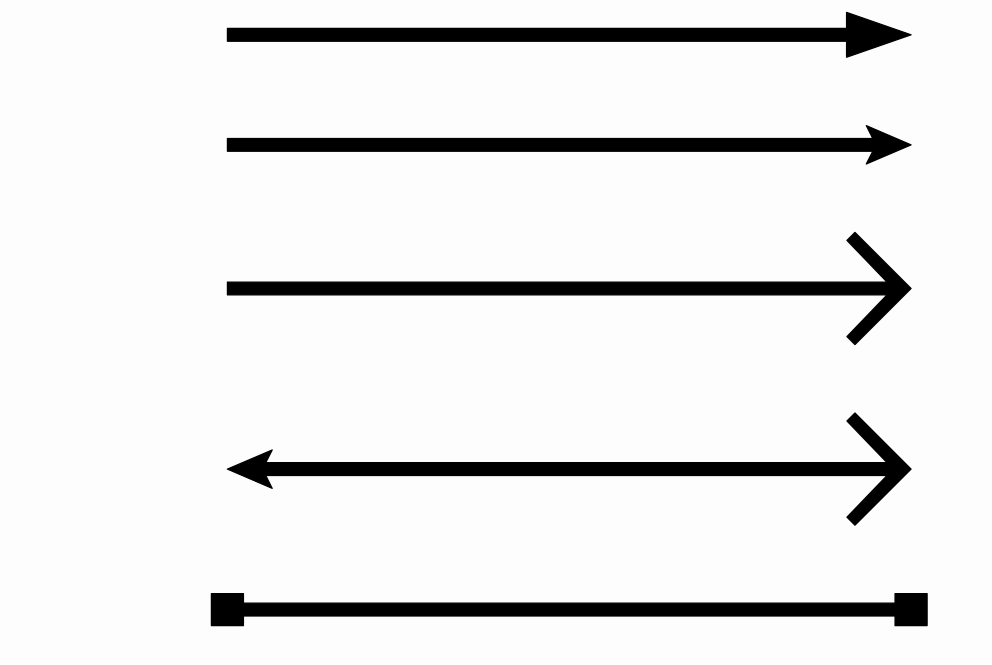
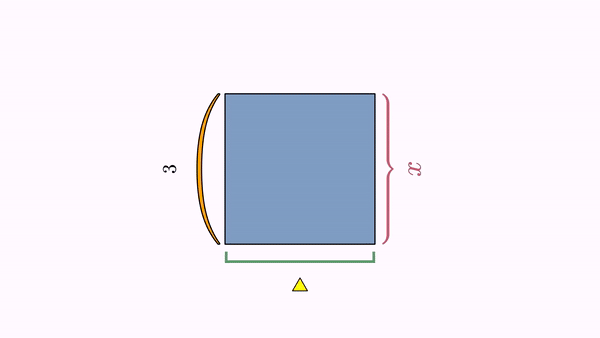

[home](https://davidgutierrezrubio.github.io/jmathanim/) [back](../index.html)

# Basic Objects

## The Vec class


The `Vec` class represents a 2D vector (although it includes the z-coordinate too). All coordinates in the math view are represented by this class. Several methods are implemented for this class. For example, methods `add` and `mult` adds 2 vectors or multiply by a scalar,returning a new vector object with the result. These methods have their versions `addInSite` and `multInSite` which returns `void` and change the original vector.

``` java
Vec v=new Vec(1,3); //Creates a new vector.
Vec u=Vec.to(4,5);//Another way, using a static constructor.
double x=v.x;//The x-coordinate of the vector
double y=v.y;//The x-coordinate of the vector
double norm=v.norm();//returns the euclidean norm of the vector.
Vec w=v.mult(2);//Returns a copy of the vector scaled by 2. The vector v is not modified.
v.multInSite(3);//Multiplies the vector v by 3. The vector v is modified.
double dot=w.dot(v);//Computes the dot product of v and w
double angle=v.getAngle();//Returns the angle of v, from 0 to 2*PI
```

## The `Point` class


Everything that you can draw in the screen is a subclass of the `MathObject` class (moreover, everything that implements the `Drawable`
interface). So, they share a few common methods, like `scale`, `rotate` or `shift`. We’ll see this methods later.

The `Point` class is the most basic `MathObject` and, yes, you’re right, it represents a single point.

``` java
Point p=new Point(1,1); //You can create a point using constructors
Point q=Point.at(0,2);//Or using a static method
```

A ` Point` object contains a `Vec` object which stores its coordinates.

``` java
Vec v=p.v; //Coordinates of Point p
double x=p.v.x; //x-coordinate of p
double d=p.v.norm(); //Distance of p to the origin
```

A point can be represented in different styles, defined in the `DotStyle` enum, namely `CIRCLE, CROSS, PLUS` which show as this:


The code used was

``` java
 @Override
    public void setupSketch() {
        config.parseFile("#preview.xml");
        config.parseFile("#light.xml");
    }

@Override
public void runSketch() throws Exception {
        Point A = Point.at(-.5, 0).dotStyle(Point.Syle.CIRCLE);
        Point B = Point.at(0, 0).dotStyle(Point.Syle.CROSS);
        Point C = Point.at(.5, 0).dotStyle(Point.Syle.PLUS);
        add(A, B, C); //Add the 3 points to the scene
        waitSeconds(5); //Give me time to do a screenshot!
    }
```

The code in the `setupSketch` method loads default presets to preview the animation with creating a movie file, and using a style with white background.  We will consistently use this style for the rest of the manual.  You can read more about configuration files in the styling chapter.

## The `Shape` class


This class represents a shape defined by a curve. The truth is, it represents more than that, as it can represents a closed or open curve,
or even a curve defined by many disconnected pieces.

Several convenience static methods are defined to easily create most common shapes:

``` java
//Generates a circle with radius 1 and centered at (0,0)
Shape circ=Shape.circle();

//Generates a unit-square, with lower left cornet at (0,0)
Shape sq=Shape.square();

//A regular pentagon, with 2 first vertices at (0,0) and (1,0)
Shape reg=Shape.regularPolygon(5);

//A closed polygon (in this case, a triangle)
Shape poly=Shape.polygon(Point.at(0,0),Point.at(1,1),Point.at(0,1));

//A rectangle with their sides parallel to the axes, with lower left and upper right vertices at (1,2) and (3,5) respectively.
Shape rect=Shape.rectangle(Point.at(1,2),Point.at(3,5));

//A segment specified by the given points
Shape seg=Shape.segment(Point.at(-1,-1),Point.at(-.5,1.5));

//An arc centered at (0,0) with radius 1, and arclength of PI/4 radians
Shape arc=Shape.arc(PI/4);
```

If you add all these objects to the scene with the command `add(circ,sq,reg,rect,seg,arc)` you’ll obtain something like this:


The `Shape` class is one of the most important and the most likely to be animated. Several other classed depend on it.

Each `Shape` object has a `JMPath` object which stores and manages the path represented. Each point of the path can be accesed with the method
`getPoint(n)`. This is a circular array and zero-based, that is, if you have the object `pentagon` which is a shape with 5 vertices, `pentagon.getPoint(0)` will give you the first point of the shape, `pentagon.getPoint(1)` the second one,…​and `pentagon.getPoint(5)` instead of giving you an error, will return again the first point of the path.

In the `Shape` objects, apart from `.getCenter()`method, which returns the center of its bounding box, there is also the `.getCentroid()`method which computes the centroid of the shape, defined by the average point of all its vertices. This method effectively returns the center of a regular polygon for example, instead of the `.getCenter()`method.

## The `LaTeXMathObject` class

If you want to include mathematical expressions in any work, of course, the best software to use is `LaTeX`. This class renders a mathematical expression written in LaTeX and imports it so you can draw it and animate it in several ways. To do this you’ll need a working LaTeX distribution installed on your system and accessible from your path. So, if you put the following the code in the `runSketch()` method:

``` java
LaTeXMathObject text = LaTeXMathObject.make("Look mom, I'm \\LaTeX!");
add(text);
waitSeconds(5);
```


A minor drawback when combining LaTeX and Java, is that one of the most used symbols in LaTeX is the backslash "\\", and Java doesn’t accept single backslashes in their strings, so, if you want to compile a LaTeX formula like this

``` latex
$$\int_0^\infty e^{-x}\,dx=1$$
```

You’ll have to replace every single backslash "\\" with a double one "\\\\"

``` java
LaTeXMathObject formula = LaTeXMathObject.make("$$\\int_0^\\infty e^{-x}\\,dx=1$$");
add(formula);
waitSeconds(5);
```

Otherwise you will get an error. Fortunately, most commons java IDE, like Netbeans, automatically perform this change when copy-pasting an already written formula into the code editor. 

By default, LaTeX formulas are placed at the center of the screen.

## The `Line` class

This class represents an infinite line. Of course, the "trick" is that in every frame it draws the visible part. Several static builder are implemented:

```java
Point A=Point.at(1, 1);
Point B=Point.at(0,1);
Vec v=Vec.to(1,.2);
Line line1=Line.make(A, B).drawColor(JMColor.RED).thickness(3);//Line that pass through A and B, color red
Line line2=Line.make(A, v).drawColor(JMColor.BLUE).thickness(2);//Line that pass through A and A+v, color blue
Line line3=Line.XAxis().drawColor("darkorange");//Line y=0, color dark orange
Line line4=Line.YAxis().drawColor("darkmagenta");//Line x=0, color dark magenta
Line line5=Line.XYBisector().drawColor("darkgreen");//Line y=x, color dark green
add(line1,line2,line3,line4,line5);//Add everything to the scene
play.shift(5, -1,-1.5, A);//Animates the point A moving (-1,-1.5) for 5 seconds
waitSeconds(3);
```


Note that the construction of `line2` only considers the direction vector at the build time. When moving the `A` point the direction changes. 

## The `Axes` class

The `Axes` class represents a cartesian axis. Well, actually is just a container for a couple of `Line`objects (the x-axis and y-axis), `Shape` objects (the ticks) and `LaTeXMathObject`(the legends of the ticks).

By default, axes without ticks are created. You can add them with the methods `generatePrimaryXTicks` and `generatePrimaryYTicks`. If you want to fine-tune the ticks, you can add individual ticks with latex expressions:

```java
Axes axes = new Axes();
axes.generatePrimaryXTicks(-2, 2, .5);//Generate x ticks -2, -1.5, -1, ..., 1.5, 2
axes.generatePrimaryYTicks(-2, 2, .5);//Generate y ticks -2, -1.5, -1, ..., 1.5, 2
axes.addXTicksLegend(0.75,TickAxes.TickType.PRIMARY);//Adds a tick at x=0.75, type primary tick.
axes.addYTicksLegend("$\\pi/4$", PI / 4,TickAxes.TickType.PRIMARY);//Adds a tick at y=PI/4 with legend $\\pi/4$
add(axes, Shape.circle().scale(.5).drawColor("darkblue"));//Add axes and a blue circle
waitSeconds(5);//Time for a screenshot!
```


## The `Arrow2D` class

The `Arrow2D` class defines a vector, which consists of a segment and an arrow head.  It is made with a static builder:

```java
Point A = Point.at(0, 0);
Point B = Point.at(1, 0);
        
Arrow2D ar = Arrow2D.makeSimpleArrow2D(A, B, ArrowType.TYPE_1);
Arrow2D ar2 = Arrow2D.makeSimpleArrow2D(A.copy(), B.copy(), ArrowType.TYPE_2).stackTo(ar, Anchor.Type.LOWER);
Arrow2D ar3 = Arrow2D.makeSimpleArrow2D(A.copy(), B.copy(), ArrowType.TYPE_3).stackTo(ar2, Anchor.Type.LOWER);
Arrow2D ar4 = Arrow2D.makeDoubleArrow2D(A.copy(), B.copy(), ArrowType.TYPE_1,ArrowType.TYPE_1).stackTo(ar3, Anchor.Type.LOWER);
Arrow2D ar5 = Arrow2D.makeDoubleArrow2D(A.copy(), B.copy(), ArrowType.TYPE_1,ArrowType.TYPE_2).stackTo(ar4, Anchor.Type.LOWER);
ar5.scaleArrowHead1(2);
ar5.scaleArrowHead2(2);

add(ar,ar2,ar3,ar4,ar5);
camera.adjustToAllObjects();
waitSeconds(4);
```




As you can see, there are 2 static builders, `makeSimpleArrow2D` and `makeDoubleArrow2D`, with parameters starting and ending points and type(s) of arrow(s). Currently there are 3 types of arrows, showed in the previous example. 

The arrow head is by default set to absolute size. This means that scaling the camera won't affect the size perceived of the object. In this code we perform a zoom and see that the size of the arrow doesn't change:

```java
Shape square1 = Shape.square().center();
Shape square2 = square1.copy().scale(.5);
Shape square3 = square2.copy().scale(.5);
Shape square4 = square3.copy().scale(.5);
Arrow2D arrow = Arrow2D.makeSimpleArrow2D(Point.at(1, 0), Point.at(0, 0), Arrow2D.ArrowType.TYPE_1);
add(square1, square2, square3, square4, arrow);
play.cameraScale(5, .1);
waitSeconds(1);
```


## The `Delimiter` class

The `Delimiter` is a extensible sign that adjust to 2 given control points A,B. May be brackets, braces, or parenthesis.  The precise form of the delimiter is recalculated every frame so if you animate the control points the delimiter will automatically adjust to them. Note that the delimiter always draws to the "left" of segment AB, if you are looking from A to B. The last parameter of the builder is the gap you want to apply between the control point and the delimiter.

```java
Shape sq=Shape.square().center().style("solidBlue");
//Brace
Delimiter delim1 = Delimiter.make(sq.getPoint(2), sq.getPoint(1), Delimiter.Type.BRACE, .05).fillColor("#d35d6e");
Delimiter delim2 = Delimiter.make(sq.getPoint(1), sq.getPoint(0), Delimiter.Type.BRACKET, .05).fillColor("#5aa469");
Delimiter delim3 = Delimiter.make(sq.getPoint(0), sq.getPoint(3), Delimiter.Type.PARENTHESIS, .05).fillColor("#efb08c");
add(delim1,delim2,delim3,sq);
play.scale(3,.75,1.8,sq);
play.scale(3,2,.25,sq);
play.rotate(3,60*DEGREES,sq);
play.shrinkOut(sq);
waitSeconds(1);
```

For this object the `drawAlpha` should be set to 0, that is, it should a purely fill object, otherwise, the "stitches" could be seen when fade in or fade out.



## The `TippableObject` class

A tippable object is a MathObject that marks a specified point of a `Shape`. Any mathobject can be used as a tip. Two static methods implements specific tips: the equal length symbols and arrow head symbols. A specialized subclass `LabelTip` attaches a LaTeX formula to a point of the shape. We'll use an hexagon to show you 6 examples in one:

```java
Shape reg = Shape.regularPolygon(6).center().style("solidblue");

//A black type 1 arrow head at the middle of one side
TippableObject tip1 = TippableObject.arrowHead(reg, .5 / 6,
	TippableObject.slopeDirection.POSITIVE,
    Arrow2D.ArrowType.TYPE_1
    ).layer(1);

//A LaTeX expression, color darkslateblue, at the middle of one side
//this expression rotates with the side, and the mark point is visible
LabelTip tip2 = LabelTip.makeLabelTip(reg, 1.5 / 6, "$a+b$");
tip2.visibleMarkPoint(true).layer(1); //Mark point is visible.
tip2.drawColor("darkslateblue");

//A LaTeX expression, color firebrick, attached to a side, that does not rotate with the shape
LabelTip tip3 = LabelTip.makeLabelTip(reg, 2.5 / 6, "$x$").visibleMarkPoint(false);
tip3.fixedAngle(true).layer(1); //The text shows with a fixed angle
tip3.drawColor("firebrick");

//An "equal length" sign, with 2 marks
TippableObject tip4 = TippableObject.equalLengthTip(reg, 3.5 / 6, 2).layer(1);

//A solid orange circle
TippableObject tip5 = TippableObject.make(reg, 4.5 / 6,
	TippableObject.slopeDirection.POSITIVE,
    Shape.circle().scale(.05).style("solidOrange")
    ).layer(1);

//A solid red square, aligned to the left of the shape point
TippableObject tip6 = TippableObject.make(reg, 5.5 / 6,
	TippableObject.slopeDirection.POSITIVE,
    Shape.square().scale(.1).style("solidRed")
                                         );
tip6.setAnchor(Anchor.Type.LEFT).layer(1);

add(reg, tip1, tip2, tip3, tip4, tip5, tip6);

//Rotate the hexagon and we'll see what happens to the tips
play.rotate(5, PI, reg);
waitSeconds(3);
```


# Importing images


JMathAnim allows both bitmap and vectorial images. All bitmap formats supported by JavaFX can be added into the scene with `JMImage` class and SVG format is (partially) supported using the `SVGMathObject` class.

## Importing bitmap images

JMathAnim can import and transform all bitmap images supported by JavaFX, like png, or jpg. Only basic transformations like shift, rotate and scale are supported, and its basic related animations. By default, the images are loaded in the `resources/images/` folder in your project (see the styling chapter about specifying another search paths).

````java
JMImage img=JMImage.make("euler.jpg").center().rotate(-5*DEGREES);
LaTeXMathObject text=LaTeXMathObject.make("All hail the great Euler!").stackTo(img, Anchor.Type.LOWER);
Animation anim = Commands.moveIn(2, Anchor.Type.LEFT, img);
playAnimation(anim,new ShowCreation(2 ,text));
waitSeconds(3);
````


## Importing SVG Objects

Let's see with an example: I used a free SVG file example from https://freesvg.org/donald-knuth. As with the bitmap images, the SVG files are loaded by default from the `resources/images` folder.

```java
public void setupSketch() {
    config.setBackgroundColor(JMColor.WHITE);
    }

    @Override
public void runSketch() throws Exception {
	SVGMathObject svg=SVGMathObject.make("donaldKnuth.svg");
    svg.setHeight(2).center();
    play.showCreation(svg);
    waitSeconds(3);
    }
```

You'll obtain something like this:


For this to work, the `donaldKnuth.svg` file must be located at `<your_project_root_dir>/resources/images/` folder. Later we will see the structure of the `resources` folder.

Notice the command `config.setBackgroundColor(JMColor.WHITE)` we had to put in the `setupSketch` part. It's self-explicative. It simply sets the background color to white, so that we can see the svg we are importing.

> **WARNING**: The SVG import capabilities are currently limited, not all SVG commands are implemented, like gradients or the ARC command. So, not all SVG files can be imported succesfully.

Importing a SVG creates a `MultiShape`object, that holds many `Shape`objects. Each object of the SVG file is converted to a `JMPath` and stored in a `Shape`object. So, you can perform transformations and animations like any other `Shape` object.

# The MathObjectGroup class

The `MathObjectGroup` class allows managing of large sets of `MathObject`instances as one single entity. For example, the following code creates a group with 3 shapes:

```java
Shape square=Shape.square();
Shape triangle=Shape.regularPolygon(3);
Shape circle=Shape.circle();
MathObjectGroup group=MathObjectGroup.make(square,triangle,circle);
```

A `MathObjectGroup` inherits from the `MathObject`class, so that you can perform methods like shift, rotate, scale, etc.

Any style change will be applied to all elements in the group.

```
group.setFillColor("cadetblue"); //Apply this fillcolor to square, triangle and circle
```

Note that you don't need to add the `MathObjectGroup` to the scene in order to show its members. You can add individually the objects you want to the scene. Adding a `MathObjectGroup` to the scene does not add the object itself, but is equivalent to add all its members to the scene.

```java
add(group);//Equivalent to add(square, triangle, circle)
```

This class becomes handy when you want to animate or position a large amount of objects, as we will see in next chapters.

# The `Rect` class

The `Rect`class represents a bounding box. If you are familiar with game programming or similar, you will know this concept. The bounding box of an object is the smallest rectangle which contains that object and which is used as fast reference for collision detection. The bounding box itself is not drawable, but you can easily create a rectangle with its dimensions with the static method `Shape.rectangle(Rect bbox)`. 

Every `MathObject` (moreover, any class that implements the `Boxable` interface) has the method `.getBoundingBox()` to get precisely that.

For example, the following code draws a ellipse rotated 45º counter-clockwise and its bounding box:

```java
Shape s = Shape.circle().scale(1, .5).rotate(45*DEGREES).style("solidorange");
Rect r=s.getBoundingBox();//the bounding box of the ellipse
Shape bbox=Shape.rectangle(r).drawColor("blue");//Creates a blue rectangle with the dimensions of r
add(s,bbox);
waitSeconds(3);//Smile for the screenshot!
```


Here are some useful methods that the `Rect`class implements (you can see more detailed information in the Javadocs). In the previous example, where `r` was a `Rect` representing the bounding box of the ellipse:

```java
r.xmin;//The most left x-coordinate of the Rect
r.xmax;//The most right x-coordinate of the Rect
r.ymin;//The lowest y-coordinate of the Rect
r.ymax;//The most upper y-coordinate of the Rect
r.getWidth();//Returns the width of the Rect
r.getHeight();//Returns the height of the Rect
r.addGap(.1, .2);//Creates a new Rect increased by .1 in x and .2 in y
r.getCenter();//Gets a Point lying in the center of the Rect
r.getUL();//Gets a Point lying the Upper-Left corner
r.getUR();//Gets a Point lying the Upper-Right corner
r.getDL();//Gets a Point lying the Lower-Left corner
r.getDL();//Gets a Point lying the Lower-Right corner
r.centerAt(dst);//Moves the Rect so that its center lies in dst
r.getRotatedRect(45*DEGREES);//Returns the smallest Rect that containts the original roated 45 degrees
r.getRelPoint(.25, .25);//Returns a Point located at the relative coordinates (.25,.25) of the Rect
r.getRelPoint(.5,.5);//This is the same as r.getCenter()
```

Apart from bounding boxes, the `Rect` class is used to represent the mathview. The method `getMathView()` returns a `Rect` will represents all visible area that is currently being drawed.

Thus, for example,  the following code will draw some dots at key points of the screen (the methods `thickness`, `drawColow` and `dotStyle` control the appearance of the points and will be seen in the Styling chapter):

```java
Rect mathView = getMathView();
Point center = mathView.getCenter().dotStyle(Point.DotSyle.PLUS).thickness(2);//A black point with a plus sign at the center
Point UL = mathView.getUL().thickness(2);//Black point at upper-left corner of the screen
Point UR = mathView.getUR().thickness(2);//Black point at upper-right corner of the screen
Point DL = mathView.getDL().thickness(2);//Black point at lower-left corner of the screen
Point DR = mathView.getDR().thickness(2);//Black point at lower-right corner of the screen
Point Q1 = mathView.getRelPoint(.25, .25).thickness(2).drawColor("red");//Red point at (25%,25%) of the screen
Point Q2 = mathView.getRelPoint(.75, .25).thickness(2).drawColor("green");//Green point at (75%,25%) of the screen
Point Q3 = mathView.getRelPoint(.75, .75).thickness(2).drawColor("yellow");//Yellow point at (75%,75%) of the screen
Point Q4 = mathView.getRelPoint(.25, .75).thickness(2).drawColor("blue");//Blue point at (25%,75%) of the screen
add(center, UL, UR, DL, DR, Q1, Q2, Q3, Q4);
add(Shape.rectangle(getMathView()).scale(.9));//add a rectangle with size 90% of the screen
waitSeconds(5);
```

If you execute this code you will obtain an image like this:


[home](https://davidgutierrezrubio.github.io/jmathanim/) [back](../index.html)