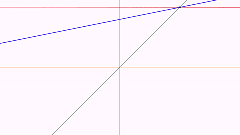
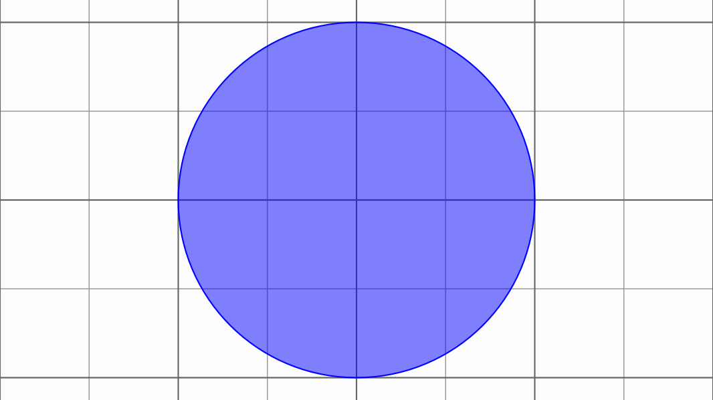
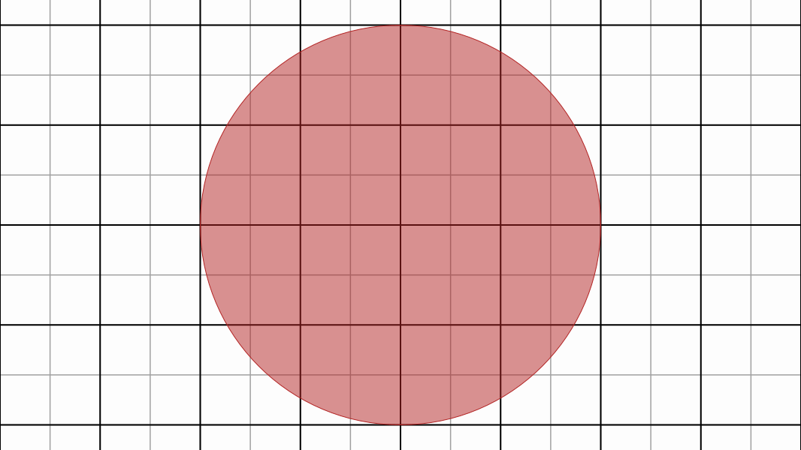

[home](https://davidgutierrezrubio.github.io/jmathanim/) [back](../index.html)

# Basic Objects

## The Vec class


The `Vec` class represents a 2D vector (although it includes the z-coordinate too). All coordinates in the math view are represented by this class. Several methods are implemented for this class. For example, methods `add` and `mult` add 2 vectors or multiply by a scalar, returning a new vector object with the result. These methods have the versions `addInSite` and `multInSite` which return `void` and change the original vector.

``` java
Vec v=new Vec(1,3); //Creates a new vector.
Vec u=Vec.to(4,5);//Another way, using a static constructor.
double x=v.x;//The x-coordinate of the vector
double y=v.y;//The x-coordinate of the vector
double norm=v.norm();//returns the euclidean norm of the vector.
Vec w=v.mult(2);//Returns a copy of the vector scaled by 2. The vector v is not modified.
v.multInSite(3);//Multiplies the vector v by 3. The vector v is modified.
double dot=w.dot(v);//Computes the dot product of v and w
double angle=v.getAngle();//Returns the angle of v, from 0 to 2*PI
```

## The `Point` class

Everything that you can draw on the screen is a subclass of the `MathObject` class (more precisely, everything that implements the `Drawable` interface). So, they share a few common methods, like `scale`, `rotate` or `shift`. We’ll see these methods later.

The `Point` class is the most basic `MathObject` and, yes, you’re right, it represents a single point.

``` java
Point p=new Point(1,1); //You can create a point using constructors
Point q=Point.at(0,2);//Or using a static method
```

A ` Point` object contains a `Vec` object which stores its coordinates.

``` java
Vec v=p.v; //Coordinates of Point p
double x=p.v.x; //x-coordinate of p
double d=p.v.norm(); //Distance of p to the origin
```

A point can be represented in different styles, defined in the `DotStyle` enum, namely `CIRCLE, CROSS, PLUS` which are shown as this:


The code used was

``` java
 @Override
    public void setupSketch() {
        config.parseFile("#preview.xml");
        config.parseFile("#light.xml");
    }

@Override
public void runSketch() throws Exception {
        Point A = Point.at(-.5, 0).dotStyle(Point.DotSyle.CIRCLE);
        Point B = Point.at(0, 0).dotStyle(Point.DotSyle.CROSS);
        Point C = Point.at(.5, 0).dotStyle(Point.DotSyle.PLUS);
        add(A, B, C); //Add the 3 points to the scene
        waitSeconds(5); //Give me time to do a screenshot!
    }
```

The code in the `setupSketch` method loads default presets to preview the animation by creating a movie file and using a style with a white background. We will consistently use this style for the rest of the manual. You can read more about configuration files in the styling chapter.

## The `Shape` class

This class represents a shape defined by a curve. The truth is, it represents more than that, as it can represent a closed or open curve, or even a curve defined by many disconnected pieces.

Several convenient static methods are defined to easily create the most common shapes:

``` java
//Generates a circle with radius 1 and centered at (0,0)
Shape circ=Shape.circle();

//Generates a unit-square, with lower left cornet at (0,0)
Shape sq=Shape.square();

//A regular pentagon, with 2 first vertices at (0,0) and (1,0)
Shape reg=Shape.regularPolygon(5);

//A closed polygon (in this case, a triangle)
Shape poly=Shape.polygon(Point.at(.25,-.5),Point.at(1.25,-.5),Point.at(.25,.5));


//A rectangle with their sides parallel to the axes, with lower left and upper right vertices at (1,2) and (3,5) respectively.
Shape rect=Shape.rectangle(Point.at(1,2),Point.at(3,5));

//A segment specified by the given points
Shape seg=Shape.segment(Point.at(-1,-1),Point.at(-.5,1.5));

//An arc centered at (0,0) with radius 1, and arclength of PI/4 radians
Shape arc=Shape.arc(PI/4);
add(circ, sq, reg, poly, rect, seg, arc);//Add everything to the scene
waitSeconds(5);//5 seconds of contemplation...
```

You’ll obtain something like this:


From version 0.9.8, Shapes can also be defined using LOGO commands:

``` java
String logoCmd = "REPEAT 12 [FD .5 RT 150 FD .5 LT 120] CLO";
Shape logoShape = Shape.logo(logoCmd);
add(logoShape.center().style("solidblue"));//Centered on screen and with a style filled blue
waitSeconds(3);
```

Which gives the following image for 3 seconds:


The implemented LOGO commands are the following:

```LOGO
FORWARD or FD
BACKWARD or BK
RIGHT or RT
LEFT or LT
REPEAT
PENUP or PU
PENDOWN or PD
```

A full reference of these commands can be found for example [here](https://glinsklogoprogramming.weebly.com/logo-commands.html).

Apart from these the `CLO` command is added to close the generated path.

The `Shape` class is one of the most important and the most likely to be animated. Several other classes depend on it.

### Other methods

Each `Shape` object has a `JMPath` object which stores and manages the path represented. Each point of the path can be accessed with the method
`getPoint(n)`. This is a circular array and zero-based. That is, if you have the object `pentagon` which is a shape with 5 vertices, `pentagon.getPoint(0)` will give you the first point of the shape, `pentagon.getPoint(1)` the second one,…​and `pentagon.getPoint(5)` instead of giving you an error, will return again the first point of the path. In the chapter "Dealing with paths" we see in more depth the path structure and how to access to its elements.

In the `Shape` objects, apart from the  `.getCenter()`method, which returns the center of its bounding box, there is also the `.getCentroid()`method which computes the centroid of the shape, defined by the average point of all its vertices. This method effectively returns the geometrical center of a regular polygon for example, instead of the `.getCenter()`method.

## The `LaTeXMathObject` class

If you want to include mathematical expressions in any work, the best software to use is `LaTeX`. This class renders a mathematical expression written in LaTeX and imports it so you can draw it and animate it in several ways. So, if you put the following code in the `runSketch()` method:

``` java
LaTeXMathObject text = LaTeXMathObject.make("Look mom, I'm \\LaTeX!");
add(text);
waitSeconds(5);
```


A minor drawback when combining LaTeX and Java, is that one of the most used symbols in LaTeX is the backslash "\\", and Java doesn’t accept single backslashes in its strings, so if you want to compile a LaTeX formula like this

``` latex
$$\int_0^\infty e^{-x}\,dx=1$$
```

You’ll have to replace every single backslash "\\" with a double one "\\\\":

``` java
LaTeXMathObject formula = LaTeXMathObject.make("$$\\int_0^\\infty e^{-x}\\,dx=1$$");
add(formula);
waitSeconds(5);
```

Otherwise, you will get an error. Fortunately, most common Java IDEs, like Netbeans, automatically perform this change when copy-pasting an already written formula into the code editor.

By default, LaTeX formulas are placed at the center of the screen.

Some commands, like `\begin{verbatim}` for example, are not supported by JLaTeXMath, so another method can be used. If you have a working LaTeX system installed in your computer you can specify that JMathAnim uses it to compile the text, by passing an optional argument:

```java
LaTeXMathObject formula=LaTeXMathObject.make(text, LaTeXMathObject.CompileMode.CompileFile);
```

This method will compile to a `.dvi` file, convert it to `.svg` and import it into a `MultiShapeObject`. If the `.svg` file was already generated in previous runs, JMathAnim will reuse it.


## The `Line` class

This class represents an infinite line. Of course, the "trick" is that in every frame it draws the visible part. Several static builders are implemented:

```java
Point A = Point.at(1, 1);
Point B = Point.at(0, 1);
Vec v = Vec.to(1, .2);
Line line1 = Line.make(A, B).drawColor(JMColor.RED).thickness(6);//Line that pass through A and B, color red
Line line2 = Line.make(A, v).drawColor(JMColor.BLUE).thickness(10);//Line that pass through A and A+v, color blue
Line line3 = Line.XAxis().drawColor("darkorange");//Line y=0, color dark orange
Line line4 = Line.YAxis().drawColor("darkmagenta");//Line x=0, color dark magenta
Line line5 = Line.XYBisector().drawColor("darkgreen");//Line y=x, color dark green
add(line1, line2, line3, line4, line5);//Add everything to the scene
play.shift(5, -1, -1.5, A);//Animates the point A moving (-1,-1.5) for 5 seconds
waitSeconds(3);
```



Note that the construction of `line2` only considers the direction vector at the build time. When moving the `A` point, the direction changes. 

Similarly, the `Ray` class allows us to represent rays in a similar way to`Line` objects.

## The `Axes` class

The `Axes` class represents a cartesian axis. Well, actually it is just a container for a couple of `Line` objects (the x-axis and y-axis), `Shape` objects (the ticks), and `LaTeXMathObject` (the legends of the ticks).

By default, axes without ticks are created. You can add them with the methods `generatePrimaryXTicks` and `generatePrimaryYTicks`. If you want to fine-tune the ticks, you can add individual ticks with latex expressions:

```java
Axes axes = new Axes();
axes.generatePrimaryXTicks(-2, 2, .5);//Generate x ticks -2, -1.5, -1, ..., 1.5, 2
axes.generatePrimaryYTicks(-2, 2, .5);//Generate y ticks -2, -1.5, -1, ..., 1.5, 2
axes.addXTicksLegend(0.75,TickAxes.TickType.PRIMARY);//Adds a tick at x=0.75, type primary tick.
axes.addYTicksLegend("$\\pi/4$", PI / 4,TickAxes.TickType.PRIMARY);//Adds a tick at y=PI/4 with legend $\\pi/4$
add(axes, Shape.circle().scale(.5).drawColor("darkblue"));//Add axes and a blue circle
waitSeconds(5);//Time for a screenshot!
```


## The `CartesianGrid` class
The name says it all!
```java
//A grid with reference point (0.0) and 
//steps of 0.5 between both vertical and horizontal lines
CartesianGrid grid = CartesianGrid.make(0, 0, .5, .5);
grid.thickness(7).drawColor("gray");
add(
    grid,
    Shape.circle() //A circle
    .drawColor("blue") //drawed in blue
    .fillColor("blue") //filled also in blue
    .fillAlpha(.5) //with opacity 50%
);
waitSeconds(3);
```



You can specify a second pair of parameters to include a secondary grid, in this case, returns a `MathObjectGroup` including 2 cartesian grids, the primary and secondary. In this case, the `make` method will return a `MathObjectGroup` containing 2 `CartesianGrid` objects:

```java
MathObjectGroup grid = CartesianGrid.make(0, 0, .5, .5, .25, .25);
add(
    grid,
    Shape.circle().drawColor("firebrick").fillColor("firebrick").fillAlpha(.5)
);
waitSeconds(3);
```




By default, grids are drawn using the `gridPrimaryDefault` and  `gridSecondaryDefault` styles. You can read more about styles in the next chapters.

## The `Arrow2D` class
> **WARNING**: This class is deprecated and is replaced by the better implemented `Arrow`class. You should consider using it instead.

## The `Arrow` class
This class replaces the old `Arrow2D`class and provides a better and more flexible implementation.
```java
Point A = Point.at(0, 0);
Point B = Point.at(1, 0);
Arrow ar = Arrow.make(A, B, Arrow.ArrowType.ARROW1);
Arrow ar2 = Arrow.make(A.copy(), B.copy(), ArrowType.ARROW2).stackTo(ar, Anchor.Type.LOWER, .1);
Arrow ar3 = Arrow.make(A.copy(), B.copy(), ArrowType.ARROW3).stackTo(ar2, Anchor.Type.LOWER, .1);
Arrow ar4 = Arrow.makeDouble(A.copy(), B.copy(), ArrowType.ARROW2, ArrowType.ARROW3).stackTo(ar3, Anchor.Type.LOWER, .1);
Arrow ar5 = Arrow.makeDouble(A.copy(), B.copy(), ArrowType.SQUARE, ArrowType.SQUARE).stackTo(ar4, Anchor.Type.LOWER, .1);
add(ar, ar2, ar3, ar4, ar5);
camera.zoomToAllObjects();
waitSeconds(4);
```
Produces the following image:


`Arrow` objects admit a curvature parameter, that allows for curved arrows:

```java
Point A = Point.at(0, 0);
Point B = Point.at(1, 0);
Arrow ar = Arrow.make(A, B, Arrow.ArrowType.ARROW1);
ar.setCurvature(60 * DEGREES);
add(ar);
camera.zoomToAllObjects();
waitSeconds(3);
```


An `Arrow` object is a subclass of `Shape` so you can apply usual styling methods (we will see about them in next chapter).

You can set individual scales for start and ending parts with the `setStartScale` and `setEndScale` methods:

```java
//Points A,B are added to the scene in red color
Point A = Point.at(0, 0).layer(1).drawColor("red");
Point B = Point.at(2, 0).layer(1).drawColor("red");
Arrow ar1 = Arrow.makeDouble(A, B, Arrow.ArrowType.NONE_BUTT, Arrow.ArrowType.ARROW2);
ar1.setArrowThickness(100);
ar1.setCurvature(-45 * DEGREES);
ar1.setStartScale(5);//Start is 5x the end
ar1.style("solidblue");//Style filled blue with contour
add(ar1, A, B);
camera.zoomToAllObjects();
waitSeconds(3);
```


## The `Delimiter` class

The `Delimiter` is a extensible sign that adjust to 2 given control points A,B, may be brackets, braces, or parenthesis.  The precise form of the delimiter is recalculated every frame, so if you animate the control points, the delimiter will automatically adjust to them. Note that the delimiter always draws to the "left" of segment AB, if you are looking from A to B. The last parameter of the builder is the gap you want to apply between the control point and the delimiter.

With the method `setLabel(obj,gap)` (from v0.9.4-SNAPSHOT) we can stack any `MathObject`as a label, with the given gap between both. The method admits the overloaded version with a `String`that will generate a `LaTeXMathObject` automatically. There is also the `addLengthLabel` method that creates a label that automatically updates its contents to the current length of the delimiter.

Also, from this version there are 2 new delimiters, LENGTH_ARROW and LENGTH_BRACKET.

Here you can see an example with delimiters:

```java
Shape sq = Shape.square().center().style("solidBlue");

//A red brace with a x legend
Delimiter delim1 = Delimiter.make(sq.getPoint(2), sq.getPoint(1), Delimiter.Type.BRACE, .05);
delim1.setLabel("$x$", .1);
delim1.fillColor("#d35d6e");//This will set the color both to label and delimiter

//A green bracket with a yellow triangle as a legend. This triangle will rotate with the delimiter
Delimiter delim2 = Delimiter.make(sq.getPoint(1), sq.getPoint(0), Delimiter.Type.BRACKET, .05);
delim2.setLabel(Shape.regularPolygon(3).scale(.1), .1);
delim2.fillColor("#5aa469");//This will set the fill color both to label and delimiter
delim2.getLabel().fillColor("yellow").thickness(6);//Change style of label only

//FIXED: Label doesn't rotate.
//ROTATE: Label rotates with the delimiter
//SMART: Label rotates trying not to get "upside-down" (default value)
delim2.setRotationType(Delimiter.Rotation.FIXED);

//An orange parenthesis
Delimiter delim3 = Delimiter.make(sq.getPoint(0), sq.getPoint(3), Delimiter.Type.PARENTHESIS, .05);
delim3.style("solidorange");
delim3.setDelimiterScale(3);//Make a 3x bigger parenthesis
delim3.setLabel("3", .2);//Note that style solidorange will not be applied to this label!

add(delim1, delim2, delim3, sq);
play.scale(3, .75, 1.8, sq);
play.scale(3, 2, .25, sq);
play.rotate(3, 60 * DEGREES, sq);
play.shrinkOut(sq);
waitSeconds(1);
```


## The `TippableObject` class

A tippable object is a MathObject that marks a specified point of a `Shape`. Any mathobject can be used as a tip. Two static methods implement specific tips: the equal length symbols and arrowhead symbols. A specialized subclass `LabelTip` attaches a LaTeX formula to a point of the shape. We'll use a hexagon to show you six examples in one:

```java
Shape reg = Shape.regularPolygon(6).center().style("solidblue");

//A black type 1 arrow head at the middle of one side
TippableObject tip1 = TippableObject.arrowHead(reg, .5 / 6,
	TippableObject.SlopeDirectionType.POSITIVE,
    Arrow2D.ArrowType.TYPE_1
    ).layer(1);

//A LaTeX expression, color darkslateblue, at the middle of one side
//this expression rotates with the side, and the mark point is visible
LabelTip tip2 = LabelTip.makeLabelTip(reg, 1.5 / 6, "$a+b$")
    .visibleMarkPoint(true)//Mark point is visible.
    .color("darkslateblue")
    .layer(1);

//A LaTeX expression, color firebrick, attached to a side, that does not rotate with the shape
LabelTip tip3 = LabelTip.makeLabelTip(reg, 2.5 / 6, "$x$")
    .visibleMarkPoint(false) //The mark point is not visible
    .fixedAngle(true) //The text shows with a fixed angle (doesn't align with the slope of the Shape)
    .color("firebrick")
    .layer(1);

//An "equal length" sign, with 2 marks
TippableObject tip4 = TippableObject.equalLengthTip(reg, 3.5 / 6, 2).layer(1);

//A solid orange circle
TippableObject tip5 = TippableObject.make(reg, 4.5 / 6,
	TippableObject.SlopeDirectionType.POSITIVE,
    Shape.circle().scale(.05).style("solidOrange")
    ).layer(1);

//A solid red square, aligned to the left of the shape point
TippableObject tip6 = TippableObject.make(reg, 5.5 / 6,
	TippableObject.SlopeDirectionType.POSITIVE,
    Shape.square().scale(.1).style("solidRed")
                                         );
tip6.setAnchor(Anchor.Type.LEFT).layer(1);

add(reg, tip1, tip2, tip3, tip4, tip5, tip6);

//Rotate the hexagon and we'll see what happens to the tips
play.rotate(5, PI, reg);
waitSeconds(3);
```


# Importing images


JMathAnim allows both bitmap and vectorial images. All bitmap formats supported by JavaFX can be added into the scene with the `JMImage` class, and the SVG format is (partially) supported using the `SVGMathObject` class.

## Importing bitmap images

JMathAnim can import and transform all bitmap images supported by JavaFX, like png or jpg. Any affine transformation can be done to a `JMImage`object. By default, the images are loaded in the `resources/images/` folder in your project (see the styling chapter about specifying other search paths).

````java
JMImage img=JMImage.make("euler.jpg").center().rotate(-5*DEGREES);
LaTeXMathObject text=LaTeXMathObject.make("All hail the great Euler!").stackTo(img, Anchor.Type.LOWER);
Animation anim = Commands.moveIn(2, Anchor.Type.LEFT, img);
playAnimation(anim,new ShowCreation(2 ,text));
waitSeconds(3);
````


## Importing SVG Objects

Let's see it with an example: I used a free SVG file example from https://freesvg.org/donald-knuth. As with the bitmap images, the SVG files are loaded by default from the `resources/images` folder.

```java
public void setupSketch() {
    config.parseFile("#light.xml");
    }

    @Override
public void runSketch() throws Exception {
	SVGMathObject svg=SVGMathObject.make("donaldKnuth.svg");
    svg.setHeight(2).center();
    play.showCreation(svg);//Plays an animation drawing the svg object
    waitSeconds(3);
    }
```

You'll obtain something like this:


For this to work, the `donaldKnuth.svg` file must be located at `<your_project_root_dir>/resources/images/` folder. Later we will see the structure of the `resources` folder.

> **WARNING**: The SVG import capabilities are currently limited, not all SVG commands are implemented, like gradients or the ARC command. So, not all SVG files can be imported succesfully.

Importing a SVG creates a `MultiShape`object, that holds many `Shape`objects. Each object of the SVG file is converted to a `JMPath` and stored in a `Shape`object. So, you can perform transformations and animations like any other `Shape` object.

# The MathObjectGroup class

The `MathObjectGroup` class allows the management of large sets of `MathObject`instances as one single entity. For example, the following code creates a group with 3 shapes:

```java
Shape square=Shape.square();
Shape triangle=Shape.regularPolygon(3);
Shape circle=Shape.circle();
MathObjectGroup group=MathObjectGroup.make(square,triangle,circle);
```

A `MathObjectGroup` inherits from the `MathObject`class so that you can perform methods like shift, rotate, scale, etc.

Any style change will be applied to all elements in the group.

```java
group.setFillColor("cadetblue");//Apply this fillcolor to square, triangle and circle
```

Note that you don't need to add the `MathObjectGroup` to the scene in order to show its members. You can add the objects you want to the scene individually. Adding a `MathObjectGroup` to the scene does not add the object itself, but is equivalent to adding all its members to the scene.

```java
add(group);//Equivalent to add(square, triangle, circle)
```

This class becomes handy when you want to animate or position a large number of objects, as we will see in next chapters.

# The `Rect` class

The `Rect` class represents a bounding box. If you are familiar with game programming or similar, you will know this concept. The bounding box of an object is the smallest rectangle which contains that object and which is used as a fast reference for collision detection. The bounding box itself is not drawable, but you can easily create a rectangle with its dimensions with the static method `Shape.rectangle(Rect bbox)`.

Every `MathObject` (moreover, any class that implements the `Boxable` interface) has the method `.getBoundingBox()` to get precisely that.

For example, the following code draws a ellipse rotated 45º counter-clockwise and its bounding box:

```java
Shape s = Shape.circle().scale(1, .5).rotate(45*DEGREES).style("solidorange");
Rect r=s.getBoundingBox();//the bounding box of the ellipse
Shape bbox=Shape.rectangle(r).drawColor("blue");//Creates a blue rectangle with the dimensions of r
add(s,bbox);
waitSeconds(3);//Smile for the screenshot!
```


Here are some useful methods that the `Rect` class implements (you can see more detailed information in the Javadocs). In the previous example, where `r` was a `Rect` representing the bounding box of the ellipse:

```java
r.xmin;//The most left x-coordinate of the Rect
r.xmax;//The most right x-coordinate of the Rect
r.ymin;//The lowest y-coordinate of the Rect
r.ymax;//The most upper y-coordinate of the Rect
r.getWidth();//Returns the width of the Rect
r.getHeight();//Returns the height of the Rect
r.addGap(.1, .2);//Creates a new Rect increased by .1 in x (left and right) and .2 in y (upper and lower)
r.getCenter();//Gets a Point lying in the center of the Rect
r.getUL();//Gets a Point lying the Upper-Left corner
r.getUR();//Gets a Point lying the Upper-Right corner
r.getDL();//Gets a Point lying the Lower-Left corner
r.getDL();//Gets a Point lying the Lower-Right corner
r.centerAt(dst);//Moves the Rect so that its center lies in dst
r.getRotatedRect(45*DEGREES);//Returns the smallest Rect that containts the original rotated 45 degrees
r.getRelPoint(.25, .25);//Returns a Point located at the relative coordinates (.25,.25) of the Rect
r.getRelPoint(.5,.5);//This is the same as r.getCenter()
```

Apart from bounding boxes, the `Rect` class is used to represent the mathview. The method `getMathView()` returns a `Rect `will represent all the visible area that is currently being drawn.

Thus, for example, the following code will draw some dots at key points of the screen (the methods `thickness`, `drawColor` and `dotStyle` control the appearance of the points and will be seen in the Styling chapter):

```java
Rect mathView = getMathView();
Point center = mathView.getCenter().dotStyle(Point.DotSyle.PLUS);//A black point with a plus sign at the center
Point UL = mathView.getUL();//Black point at upper-left corner of the screen
Point UR = mathView.getUR();//Black point at upper-right corner of the screen
Point DL = mathView.getDL();//Black point at lower-left corner of the screen
Point DR = mathView.getDR();//Black point at lower-right corner of the screen
Point Q1 = mathView.getRelPoint(.25, .25).drawColor("red");//Red point at (25%,25%) of the screen
Point Q2 = mathView.getRelPoint(.75, .25).drawColor("green");//Green point at (75%,25%) of the screen
Point Q3 = mathView.getRelPoint(.75, .75).drawColor("yellow");//Yellow point at (75%,75%) of the screen
Point Q4 = mathView.getRelPoint(.25, .75).drawColor("blue");//Blue point at (25%,75%) of the screen
add(center, UL, UR, DL, DR, Q1, Q2, Q3, Q4);
add(Shape.rectangle(getMathView()).scale(.9));//add a rectangle with size 90% of the screen
waitSeconds(5);
```

If you execute this code you will obtain an image like this:


[home](https://davidgutierrezrubio.github.io/jmathanim/) [back](../index.html)