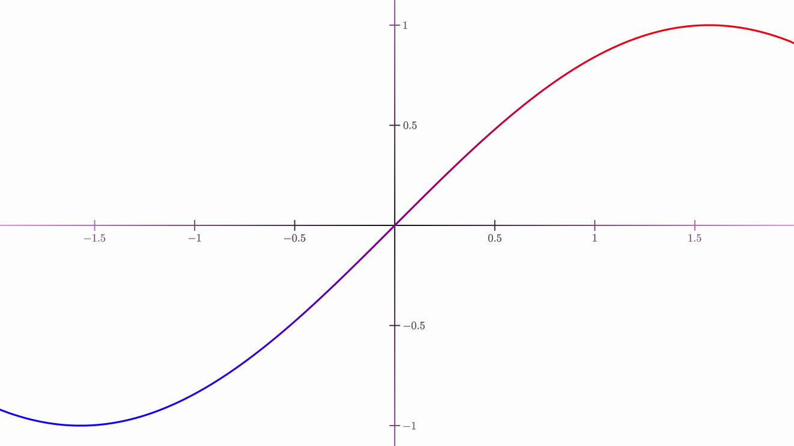
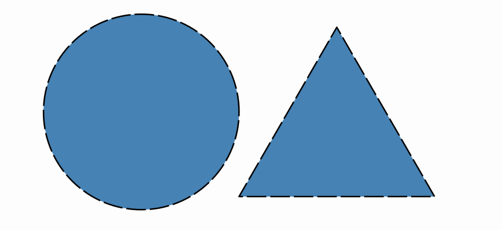

[home](https://davidgutierrezrubio.github.io/jmathanim/) [back](../index.html)

# Applying styles

Each `MathObject` has an object implementing the  `Stylable` interface that stores drawing parameters.

# Basic styles

## Colors

Each object has 2 colors: the draw color (changed with `.drawColor`), used for drawing the contour; and the fill color (changed with `.fillColor`), used to fill the object. Each color is stored in a `JMColor`object, with the components red, green, blue, and alpha. The `.thicknessmethod `sets the thickness of the stroke used to draw the object.

``` java
Shape r = Shape.regularPolygon(5)
    .fillColor(JMColor.parse("CADETBLUE"))
    .drawColor(JMColor.parse("#041137"))
    .thickness(15);
add(r.center());
waitSeconds(3);
```
When added to the scene, it will show something like this:


Here we can see the method `.parse` to define a color. All JavaFX color names are supported, as well as hexadecimal format `#RRGGBBAA` (8 hexadecimal digits), `#RRGGBB` (6 hexadecimal digits) and `#RGB` (4 hexadecimal digits) . Also, both methods to change colors are overloaded so that `drawColor(string)`is equivalent to `drawColor(JMColor.parse(string))`, and the same with `fillColor`.

```java
JMColor col1 = new JMColor.parse(1,1,1,.5);//White color with 50% opacity
JMColor col2 = JMColor.parse("#CDFA14");//Red: CD, Green: FA, Blue: 14 (hexadecimal), opacity 100% 
JMColor col3 = JMColor.parse("#CDFA14A6");//Red: CD, Green: FA, Blue: 14 (hexadecimal), opacity A6
JMColor col4 = JMColor.parse("SNOW");//Color SNOW from the JavaFX palette
```

The `LatexMathObject` has also the method `.setColor(JMColor col)` which changes both draw and fill colors, and a overloaded method which allows changing colors in specified glyphs (we will see this in the Mathematical Formulas chapter).

The methods `.fillAlpha(double f)` and `.drawAlpha(double d)` sets directly the opacity of fill and draw colors. These methods, like most, can be nested:

```
Shape sq=Shape.square().fillColor("CADETBLUE").fillAlpha(.5);
```

## Gradients

All methods that accept colors also accept gradients (in fact, any class that inherits from `PaintStyle`).

Linear gradients can be defined in a similar way to the JavaFX syntax:

```java
//A linear gradient from point (-1,0) to (1,0)
JMLinearGradient gradientBG = new JMLinearGradient(Point.at(-1, 0), Point.at(1, 0));
gradientBG.setRelativeToShape(false)
    .add(0d, "orange")//at t=0 (point (-1,0)), orange color
    .add(1d, "violet");//at t=1 (point (1,0)), violet color
config.setBackgroundColor(gradientBG);

Shape circle = Shape.circle();

//A radial gradient from relative point (.25,.75) and relative radius .75
JMRadialGradient gradientCircle = new JMRadialGradient(Point.at(.25, .75), .5);
gradientCircle.setRelativeToShape(true)
    .add(0d, "white")//At center of (.25,.75), white color
    .add(1d, "steelblue");//With distance of the center >.5, steelblue color
circle.fillColor(gradientCircle);
add(circle);
waitSeconds(3);
```


You can apply gradients both to fill and draw colors:

```java
Rect view = getMathView().getBoundingBox();
JMLinearGradient functionGradient = new JMLinearGradient(view.getLower(), view.getUpper());
functionGradient.setRelativeToShape(false)
    .add(0d, "blue")
    .add(1d, "red");

JMRadialGradient axesGradient = new JMRadialGradient(Point.origin(), 2);
axesGradient.setRelativeToShape(false)
    .add(0d, "black")
    .add(1d, "violet");

Axes axes = new Axes();
axes.generatePrimaryXTicks(-2, 2, .5)
    .generatePrimaryYTicks(-2, 2, .5)
    .drawColor(axesGradient);

FunctionGraph fg = FunctionGraph.make(x -> Math.sin(x), -2, 2);
fg.drawColor(functionGradient).thickness(10);

add(axes, fg);
waitSeconds(3);
```




## DashStyle

The `dashStyle` method sets the dash used to draw the outline, chosen from the enum `DashStyle`. Currently, there are 4 different styles, `SOLID`, `DASHED`, `DOTTED` and `DASHDOTTED`. The following code creates 4 pentagons with these dash styles.

```java
Shape r1 = Shape.regularPolygon(5).thickness(10);
Shape r2 = r1.copy().stack()
    .withDestinyAnchor(AnchorType.RIGHT)
    .withGaps(.1)
    .toObject(r1);
Shape r3 = r1.copy().stack()
    .withDestinyAnchor(AnchorType.RIGHT)
    .withGaps(.1)
    .toObject(r2);
Shape r4 = r1.copy().stack()
    .withDestinyAnchor(AnchorType.RIGHT)
    .withGaps(.1)
    .toObject(r3);

r1.dashStyle(DashStyle.SOLID);
r2.dashStyle(DashStyle.DASHED);
r3.dashStyle(DashStyle.DOTTED);
r4.dashStyle(DashStyle.DASHDOTTED);

add(LatexMathObject.make("{\\tt SOLID}").stack().toObject(r1));
add(LatexMathObject.make("{\\tt DASHED}").stack().toObject(r2));
add(LatexMathObject.make("{\\tt DOTTED}").stack().toObject(r3));
add(LatexMathObject.make("{\\tt DASHDOTTED}").stack().toObject(r4));
add(r1, r2, r3, r4);
camera.centerAtAllObjects();
waitSeconds(5);
```


# Saving styles 

A concrete combination of drawing parameters can be saved in styles. The `config` objects stores the saved styles and have methods to manage them. To apply a style to an object, use the method `.style(styleName)`.

```java
Shape triangle = Shape.regularPolygon(3).thickness(8).dashStyle(DashStyle.DASHED).fillColor("steelblue");
//Creates style named solidRed
config.createStyleFrom(triangle, "myStyle");
Shape circle = Shape.circle().scale(.5).stackTo(triangle, Anchor.Type.LEFT);
//Apply style to circle
circle.style("myStyle");
add(triangle, circle);
waitSeconds(5);
```




Nevertheless, although using styles is an efficient way to organize the appearance of an animation, you don't need to create them to copy the drawing attributes from one object to another. With the `.getMP()`method you can access directly to the `Stylable`object that stores the drawing parameters. If you want to copy the style from object A to B, you can invoke the `.copyFrom` method like this:

```java
B.getMP().copyFrom(A.getMP());
```

# Configuring the scene

The `Scene` class has an instance of `JMathAnimConfig` class, named `config`, that allows us to personalize global aspects of the animation. Most of these methods should be called only on the `setupSketch()`part of the animation. Invoking `config`methods in the `runSketch()`could lead to unpredictable behavior.

```java
//Methods to adjust output
config.setMediaW(800);//Adjusts width output to 800px
config.setMediaH(600);//Adjusts height output to 600px
config.setFPS(25);//Adjusts frames per second of video output to 25 fps

config.setLowQuality();//Predefined adjusts: 854x480 video, at 30fps
config.setMediumQuality();//Predefined adjusts: 1024x720 video, at 30fps
config.setHighQuality();//Predefined adjusts: 1920x1080 video, at 60fps

config.setCreateMovie(true);//Generates a mp4 file with the animation
config.setOutputDir("media");//Specifies output directory at <PROJECT_DIR>\media (this is the default value)
config.setOutputFileName("animation");//Sets video filename as animation_WWW.mp4 where WWW is the width output (by default, the output file name is the name of the scene class)

config.setShowPreviewWindow(true);//Show the preview window (by default: true)

config.setBackgroundColor(JMColor.parse("WHITE)"));//Sets background color to white
config.setBackGroundImage("background.png");//Sets the background image, located at RESOURCES_DIR. If null, no image background is applied
config.setDrawShadow(true); //Apply shadow effect to the scene, using javafx shadow effect
config.setShadowParameters(10,15,15,.5f);//Sets shadow parameters (kernel 10, offsets 15 and 15, shadow alpha .5f)

config.setResourcesDir("c:\\resources");//Specifies resources directory at absolute path c:\resources
```

# The configuration files

## Loading config files

All the settings and definitions can be stored in `XML` files and loaded with the `ConfigLoader`class. This class holds the static method `ConfigLoader.parseFile("file.xml")`, which can be called from the `config` object with `config.parseFile("file.xml")`.

Where does JMathAnim look for the files? Well, there are 3 location types that you can specify:

- If the file name starts with `#` it refers to an internal config file included in the library jar.

- If the file name starts with `!` it refers to an absolute path.

- Otherwise, it will look into the `<default resources path>/config/` folder.

By default, the resources path is located at /resources folder. So`` if you want to add resources locally to your project, you should create this folder. Of course, you can change the default `resources` folder with the method `config.setResourcesDir(newDir)`.

This way, if you want to store all your precious resources in a system-wide scope, you can store them in a folder (say `/home/bob/myJMathAnimResources`) and make JMathAnim look for resources there with the method `config.setResourcesDir("/home/bob/myJMathAnimResources")` at the beginning of the `setupSketch()` method (Note that the "!" modifier is not needed here).

A typical `resources` folder follows this structure:

```
resources/
├── config/
│   ├── configFile1.xml
│   ├── configFile2.xml
│   ├── ...
├── images/
│   ├── image1.png
│   ├── image2.png
│   ├── image3.svg
│   └── ...
...
```

The `config.parseFile` will look into the `config` folder, and image-related objects like `SVGMathObject`or `JMImage`  will look into the `images` folder.

A few examples:

* the `config.parseFile("file.xml")` command will try to load `file.xml`located at `<your current root project>/resources/config` folder
* the `config.parseFile("#file.xml") ` command will try to load `file.xml` internally stored at the jar library.
* the `config.parseFile("!/home/user/myResources/file.xml") ` command will try to load `file.xml` from the location `/home/user/myResources/file.xml`.

> Note: The "!" modifier can also  be used when specifying a file path in the config files, like background images, for example.

If the program cannot find the file, the logger will report an error but the execution won't be stopped.

Here is an example of a basic config file that I use for previewing, called `preview.xml`. The `<video>` tag controls aspects related to movie output:

```xml
<JMathAnimConfig>
    <video>
        <size width="1066" height="600" fps="30"/>
        <createMovie>false</createMovie>
        <showPreviewWindow>true</showPreviewWindow>
    </video>
</JMathAnimConfig>
```

And this for production, called `productionWithShadow.xml`. The `background` tag controls aspects like image or color background, or shadow effect.

```xml
<JMathAnimConfig>
    <video>
        <size width="1920" height="1080" fps="60"/>
        <createMovie>true</createMovie>
        <outputDir>c:\media</outputDir>
        <showPreviewWindow>false</showPreviewWindow>
    </video>
    <background>
        <shadows kernelSize="8" offsetX="15" offsetY="15" alpha=".5">true</shadows>
        <image>background1080.png</image>
    </background>
</JMathAnimConfig>
```

This way, in the `setupSketch()` method, you can change program behavior by just changing the config file loaded.

You can have several config files with different, independent aspects. This is the `light.xml` config I used in examples shown:

```xml
<JMathAnimConfig>
    <include>#axes_and_functions_light.xml</include>
    <include>#dots.xml</include>
    <background>
        <color>#FDFDFD</color>
    </background>
    <styles>
        <style name="default">
            <drawColor>black</drawColor>
            <fillColor>#00000000</fillColor>
            <thickness>4</thickness>
        </style>
          <style name="dotdefault">
            <drawColor>black</drawColor>
            <fillColor>#00000000</fillColor>
            <thickness>30</thickness>
        </style>  
        <style name="latexdefault">
            <drawColor>black</drawColor>
            <fillColor>black</fillColor>
            <thickness>1</thickness>
        </style>
        <style name="solidRed">
            <drawColor>black</drawColor>
            <fillColor>#f55652</fillColor>
            <thickness>8</thickness>
        </style>
        <style name="solidBlue">
            <drawColor>black</drawColor>
            <fillColor>#7ca0c0</fillColor>
            <thickness>8</thickness>
        </style>
        <style name="solidGreen">
            <drawColor>black</drawColor>
            <fillColor>#9bc693</fillColor>
            <thickness>8</thickness>
        </style>
        <style name="solidOrange">
            <drawColor>black</drawColor>
            <fillColor>orange</fillColor>
            <thickness>8</thickness>
        </style>
            <style name="1">
            <drawColor>#07004D</drawColor>
            <thickness>30</thickness>
            <dotStyle>circle</dotStyle>
        </style>
        <style name="2">
            <drawColor>#BF2500</drawColor>
            <thickness>30</thickness>
            <dotStyle>cross</dotStyle>
        </style>
        <style name="3">
            <drawColor>#5D2E8C</drawColor>
            <thickness>30</thickness>
            <dotStyle>plus</dotStyle>
        </style>
          <style name="fn1">
            <drawColor>#0F4C5C</drawColor>
            <fillColor>none</fillColor>
            <thickness>8</thickness>
        </style> 
         <style name="fn2">
            <drawColor>#9A031E</drawColor>
            <fillColor>none</fillColor>
            <thickness>8</thickness>
        </style> 
         <style name="fn3">
            <drawColor>#5F0F40</drawColor>
            <fillColor>none</fillColor>
            <dashStyle>DASHED</dashStyle>
            <thickness>4</thickness>
        </style> 
    </styles>
</JMathAnimConfig>
```

The JAR of the JMathAnim library has several predefined config files that you can load with "#" flag in the file name:

* The `config.parseFile("#preview.xml")`  loads settings for previewing the animation, with a low resolution of 1066x600 at 30pfs, showing preview windows and not creating a movie, which is ideal for the creation process of the scene.
* The `config.parseFile("#production.xml")` loads settings for generating the final animation, with high resolution 1920x1080 at 60pfs, not showing preview windows and creating a movie. This config should be loaded when the designing process is done and to create the final animation.
* The `config.parseFile("#light.xml")` loads settings for black drawings over a white background. The default colors are black.
* The `config.parseFile("#dark.xml")` loads settings for white drawings over a black background. The default colors are white.

You can check all the internal config files in the [github sources folder](https://github.com/davidgutierrezrubio/jmathanim/tree/master/src/resources/config).

The `<styles>` tag allows defining styles to apply to your animation. There are some convention-named styles that are important (names are case-insensitive):

*  Style `default`: All MathObjects (except the next ones mentioned) load this style when created.
*  Style `dotdefault`: All `Point` objects load this style when created.
*  Style `latexDefault`: Applied by default to all `LaTexMathObject` instances.
*  Style`functionGraphDefault`: For function graphs.
*  Style `axisdefault`: For x-axis and y-axis.
*  Style `axistickdefault`: For x-ticks and y-ticks in the axes.
*  Style `axislegenddefault`: For legends in ticks of axes.
* If no style with these names is defined, a default style with white stroke and no fill will be applied.

Below there is an example image with the same scene, loading `dark.xml` and `light.xml` config files.  

The `<include>` tag that appears at the beginning loads other config files. In this case, a `dots.xml` file with styles for dots is defined:

```xml
<JMathAnimConfig>  
    <styles>
        <style name="redCircle">
            <drawColor>RED</drawColor>
            <thickness>30</thickness>
            <dotStyle>circle</dotStyle>
        </style>
        <style name="blueCross">
            <drawColor>#6ca2e0</drawColor>
            <thickness>30</thickness>
            <dotStyle>cross</dotStyle>
        </style>
        <style name="yellowPlus">
            <drawColor>#FCE16D</drawColor>
            <thickness>30</thickness>
            <dotStyle>plus</dotStyle>
        </style>
    </styles>
```

Note that the thickness required for a dot to be visible is higher than a Shape.  That is because a `Point`with thickness 4 will have the same width as a stroke from a `Shape` with the same thickness. `Point` objects require higher thickness parameter in order to be clearly visible.

## Configuration files syntax

As we said, the config files that you can read are in XML format. All files must have a root tag called `<JMathAnimConfig>`. Everything outside of this tag is ignored.

Inside this tag, we may have:

* The `<include>` tag allows us to load another XML config files. For example `<include>#axes_and_functions_dark.xml</include>` (an internal config file included in the jar library) or `<include>myColors.xml</include>` (a file include in the `resources/config` folder).

* The `<video>` tag controls the output format. Inside this we may  have:

  * The `<size/>`tag  with attributes `width`, `height` and `fps`. For example `<size width="1066" height="600" fps="30"/>`.
  * The `<createMovie>` tag with a boolean value, to determine if actually create a movie file or not. For example `<createMovie>false</createMovie>`.
  * The `<saveToPNG>` tag with a boolean value, if each frame should be saved in a separate, autonumbered png file.  For example `<saveToPNG>false</saveToPNG>`. 
  * The `<showPreviewWindow>` to show or not the previsualization window. For example `<showPreviewWindow>true</showPreviewWindow>`.
  * The `<outputDir>` tag specifies the folder where to save the movie, if created. If this tag is not found, by default the generated movie will save on `ROOT_PROJECT_DIR/media` folder. For example `<outputDir>c:/my_generated_movies</outputDir>`.
  * The `<outputFileName>`tag sets part of the file name of the generated movie. A suffix with the media height is always added to the name. If this is tag is not found, by default the name will be the class name you are using as a subclass for `Scene2D`.

* The `<background>` has tags related to the background and effects to apply:

  * The `<color>` tag sets the background color. You can specify a color using a JavaFX color name case insensitive , like `<color>white</color>` or an hex format `<color>#F0A3C5</color>`. The hex format can be 8 bytes (RGBA), 6 bytes (RGB with alpha 1) or 3 bytes (RGB with alpha 1).
  * The `<image>` tag allows us to establish a background image. You can use the `!` modifier to specify an absolute path. Otherwise, the program will look into `resources/images` folder. Note that no scaling or adjusting is made, so that the image should fit the dimensions of the `<size/>` tag.
  * The `<shadow>` tag adds a shadow effect to every objects you draw in the screen, except for the background image. For example `<shadows kernelSize="8" offsetX="5" offsetY="5" alpha=".7">true</shadows>` sets a shadow with kernel size of 8 (the amount of shadow blurring), the offsets (15,15) of the shadow respect to their origin objects, and the alpha transparency of 70%.

* The `<styles>` tag defines all the styles we may need, each one in the `<style>` subtag. For example:

  ```xml
  <style name="myStyle">
      <drawColor>WHITE</drawColor>
      <fillColor>#f55652</fillColor>
      <thickness>7</thickness>
      <dashStyle>SOLID</dashStyle>
      <absoluteThickness>true</absoluteThickness>
      <dotStyle></dotStyle>
  </style>
  ```

  It is pretty self-explanatory. The attribute `name` defines the style name (case sensitive) and the `<drawColor>`, `<fillColor>`, `<thickness>` and `<dashStyle>` define their respective properties.  The `<dashStyle>` may take a value from the `enum DashStyle`, that is `SOLID`, `DASHED`,  or`DOTTED`.

  The `<absoluteThickness>` thickness controls if the thickness of the object will be affected by scaling transformations. By default this is true, so that if you zoom in a circle, for example, its thickness will always be the same. For objects like SVG imports for example, the absolute thickness flag is set to false.

  The `<dotStyle>` is one of the values of the `enum DotStyle` in the `Point` class and sets how a `Point` object with this style will be drawn. Currently, the possible values are `CIRCLE`, `CROSS` and `PLUS`.

[home](https://davidgutierrezrubio.github.io/jmathanim/) [back](../index.html)