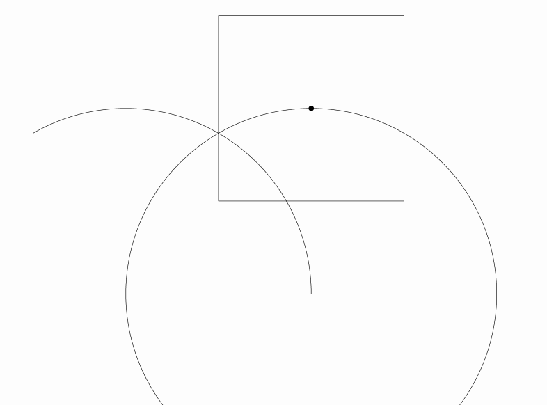
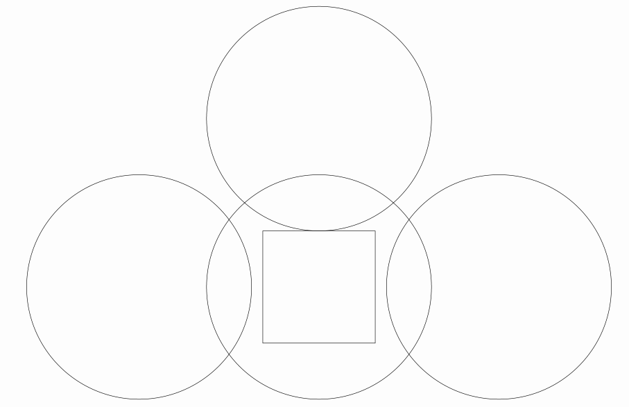
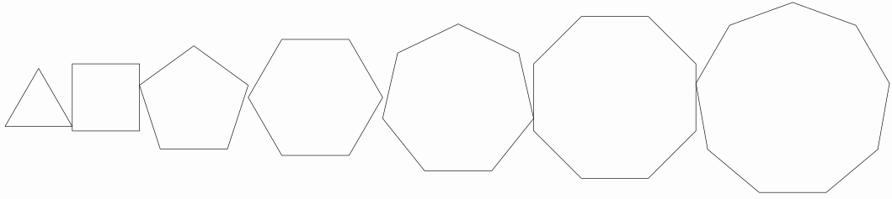
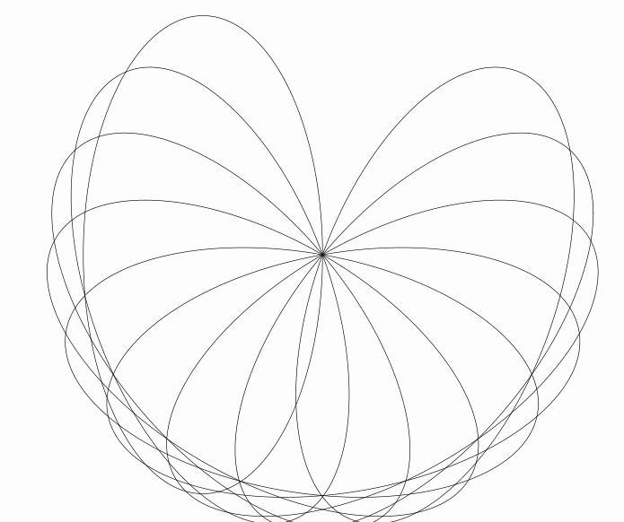
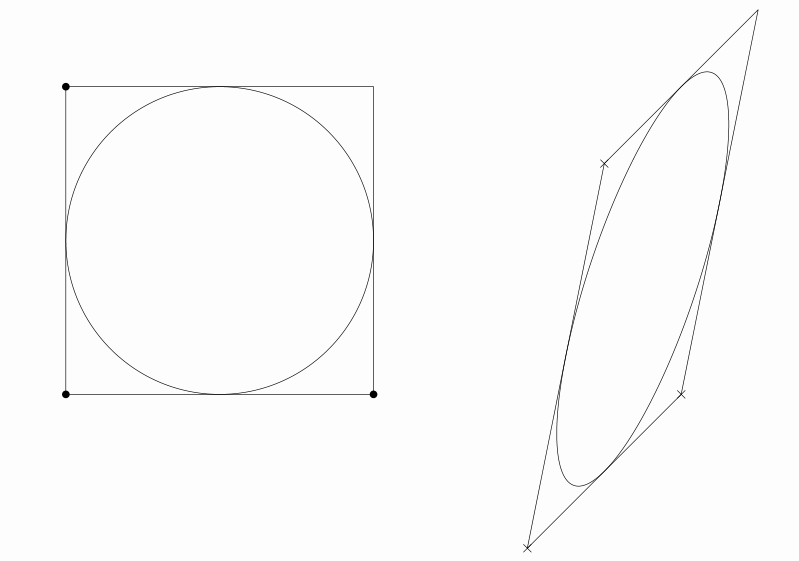

Transforming Objects
====================

All classes that inherit from `MathObject` can be transformed. Several methods for shifting, rotating, scaling or aligning are defined, and most of them have their animated version. Note that also most of these methods return the object self, so that they can be applied consecutively like this  `object.method1().method2()…​`.

Positioning objects
-------------------

### Shift

The `shift` command shifts the object by the specified vector

``` java
Shape c=Shape.circle().shift(Vec.to(1,1));//An unit circle, centered at (1,1)
```

A simpler 2D-version is also provided:

``` java
Shape sq=Shape.square().shift(-3,0);//An unit square, lower left vertex at (-3,0)
```

### MoveTo

The `MoveTo` command shifts the object so that its center is positioned at the given coordinates. Note that the center is the center of the bounding box of the object, not the geometrical center. For regular polygons, for example, they don’t necessarily match.

``` java
Shape r=Shape.regularPolygon(5).moveTo(3,3);//A pentagon, with its bounding box centered at (3,3)
```

PutAt
=====

This command puts the objects so that its specified anchor point is located at a given coordinates. The anchor point of a object can be one of the defined in the `Anchor` enum, that is:

-   `BY_CENTER` Center of the object.

-   `LEFT, RIGHT, UPPER, LOWER` middle point of the left/right/upper/lower side of the bounding box of the object.
    
-   `UL, UR, DL, DR` Up-left, up-right, down-left and down-right corners of the bounding box.

Some examples illustrate better. If you execute this code in the `runSketch()` method:

``` java
Point A = Point.at(.5, .5);
Shape circ = Shape.circle().putAt(A, Anchor.UPPER);//Set upper point of circle bouding box to A
Shape arc = Shape.arc(120 * DEGREES).putAt(A, Anchor.UR);//Set up-right point of arc bounding box to A
Shape sq = Shape.square().putAt(A, Anchor.BY_CENTER);//Set center of square to A
add(A, circ, arc, sq);//Add everything to the scene
waitSeconds(5);//Give me time to make a screenshot!
```

it gives this image:



The command `putAt` accepts a third argument `gap` to leave a space between the point and the anchor. This gap doesn’t apply for `Anchor.BY_CENTER`.

StackTo
=======

The `StackTo` command works in a similar way that `putAt`, but allows to position an object relative to another one. For example, the following code creates 4 circles, and stacks them into a square in different ways:

``` java
Shape c1=Shape.circle();
Shape c2=c1.copy();
Shape c3=c1.copy();
Shape c4=c1.copy();
Shape sq=Shape.square();
c1.stackTo(sq,Anchor.LEFT,.1);//Stacks circle to the left of the square, with a gap of .1 units
c2.stackTo(sq,Anchor.RIGHT,.1);//Stacks circle to the right of the square, with a gap of .1 units
c3.stackTo(sq,Anchor.UPPER);//Stacks circle to the upper side of the square, with no gap
c4.stackTo(sq,Anchor.BY_CENTER);//Stacks circle center-to-center with the square
add(c1,c2,c3,c4,sq);//Add everything to the scene
camera.adjustToAllObjects(); //Adjust camera, so that everyone gets into the photo
waitSeconds(5);//That is, smile for the screenshot!
```

which produces the following image:



You’ll notice two new methods here: The `copy()` method returns a copy of the object, and the `camera.adjustToAllObjects()` does as it says, rescales the camera so that everything fits into view.

As in the `putAt` method, a third parameter `gap` is allowed to add a given gap between the objects.

The `stackTo` command allows to easily generate aligned objects:

``` java
Shape previousPol = Shape.regularPolygon(6);//First hexagon
add(previousPol);
for (int n = 0; n < 10; n++) {
    Shape pol = Shape.regularPolygon(6).stackTo(previousPol, Anchor.RIGHT);
    add(pol);
    previousPol=pol;//New polygon becomes previous in the next iteration
}
camera.adjustToAllObjects();//Everyone should appear in the photo
waitSeconds(5);//Time for screenshot, but you already should know that
```

Which produces this regular polygons pattern. Note that all polygons are vertically aligned and their bounding boxes are stacked horizontally.



stackToScreen
=============

This methods is similar to `stackTo`, but it positions the object relative to the current view.

``` java
Shape sq=Shape.square();
add(sq.stackToScreen(Anchor.LEFT));//Stack square to the left of the screen, with no gaps
add(sq.copy().stackToScreen(Anchor.RIGHT,.3,.1));//Stack a copy of square to the left of the screen,with gaps of .3 horizontal and .1 vertical (here only horizontal one is used)
add(Shape.circle().stackToScreen(Anchor.UL));//Stack a unit circle to the upper left corner of the screen, with no gaps
waitSeconds(5);
```

<div class="tip">

There is shortcut method if you want to simply put the object at the center screen. The method `.center()` is equivalent to `.stackToScreen(Anchor.BY_CENTER)`.

Scaling objects
===============

All `MathObject` instances can be scaled with the `scale` command. Scaling can be done from a given scale center or by default, the center of the object.

``` java
add(Shape.circle().shift(-1, 0).scale(.5, 1));//x-scale and y-scale around center
add(Shape.circle().shift(0, 1).scale(Point.at(0, 0), 1.3, .2));//x-scale and y-scale around (0,0)
add(Shape.square().shift(1, 0).scale(.3)); //Uniform scale around center
waitSeconds(5);
```

produces the result:


Rotating objects
================

The `rotate` command rotates the object around a given center (or the center of the object if none given). The angle is specified in radians, but can also be given in degrees using the `DEGREES` constant. The format is `object.rotate(center_of_rotation,angle)` or `object.rotate(angle)`.

For example:

``` java
Shape ellipse=Shape.circle().scale(.5,1);//Creates an ellipse
for (int n = 0; n < 180; n+=20) {
    add(ellipse.copy().rotate(Point.at(.5,0),n*DEGREES));
}
waitSeconds(5);
```

Gives this spirograh-like picture:



Affine Transforms
=================

`shift`, `rotate` and `scale` are particular cases of a more general affine transform implemented by the `AffineJTransform` class. This class defines general affine transforms in the 2D plane, and has several static convenience methods for some of the most common transforms:

The `createTranslationTransform(Vec v)` or `createTranslationTransform(Point A, Point B)` creates a traslation transform. The `shift` command is just a shortcut for this transform. 

The `create2DRotationTransform(Point center, double angle)` creates a rotation transform, used in the `rotate` command.

The `createScaleTransform(Point center, double sx, double sy, double sz)` creates a scaling transform. The z-scale factor is here for
compatibility to extend to the 3D case, but is currently not used. Used in the `scale` command.

Given any `MathObject` instance, there are 2 main methods to use an `AffineJTransform` object on it:

-   The `transform.applyTransform(object)` method transforms and modifies the current object, returning `void`.
    
-   The `transform.getTransformed(object)` returns a copy of the object transformed. The original object is unaltered.

The `createDirect2DHomothecy(Point A, Point B, Point C, Point D, double alpha)` is a combination of shifting, rotating and uniform scaling. This method generates the (only) direct homothecy that maps the points (A,B) into points (C,D). The `alpha` parameter is used for animations, as a value of `alpha=0` returns the identity transform and `alpha=1` returns the full transform. Intermediate values return intermediate transforms, interpolating the shifting, rotating, and scaling parameters adequately.

Look at the following example:

``` java
Shape sq = Shape.square().shift(-1.5,-1);
Point A = sq.getPoint(0);//First vertex of the square (lower-left corner)
Point B = sq.getPoint(1);//First vertex of the square (lower-right corner)
Point C = Point.at(1.5, -1);//Destiny point of A
Point D = Point.at(1.7, .5);//Destiny point of B
add(A, B, C, D);
for (double alpha = 0; alpha <= 1; alpha += .2) {
    AffineJTransform transform = AffineJTransform.createDirect2DHomothecy(A, B, C, D, alpha);
    add(transform.getTransformedObject(sq));
}
waitSeconds(5);
```

Produces the following sequence of interpolated transforms from one square to another. Note that an homothecy may change scale of objects, but proportions are unaltered:


Notice also another new method here, the `getPoint(n)` method in a `Shape`, will return the n-th point at the shape.

> **WARNING**: You should be careful, when defining the parameters of a transformation like `createDirect2DHomothecy(A, B, C, D, alpha)` if the points `A, B, C, D` are going to be actually modified by the transformation itself (for example, A is an instance of a point of the shape you are transforming). The safe approach in this case should be using copies of the points as parameters, with the `.copy()` method.

If we want to make a reflection of an object, we can use the static methods `createReflection` and `createReflectionByAxis`. They differ in the way the transformation is specified:

-   `createReflection(Point A, Point B, double alpha)` creates the (only) reflection that maps the point `A` into point `B`. The reflection axis is the perpendicular bisector of the segment joining the two points.
    
-   `createReflectionByAxis(Point E1, Point E2, double alpha)` creates the (only) reflection with axis the line specified by the points `E1` and `E2`.

In both cases, the `alpha` parameter works in a similar way than the homothecy transform.

An example of `createReflection` is showed in the following source code:

``` java
Shape sq = Shape.regularPolygon(5);
Point A = sq.getPoint(0);//First vertex of the pentagon(lower-left corner)
Point B = A.copy().shift(.5,-.2);
add(A, B);
for (double alpha = 0; alpha <= 1; alpha += .2) {
    AffineJTransform transform = AffineJTransform.createReflection(A, B, alpha);//Reflection that maps A into B
    add(transform.getTransformedObject(sq));
}
camera.adjustToAllObjects();
waitSeconds(5);
```


There is also a more general way to define an affine transform using `createAffineTransformation(Point A, Point B, Point C, Point D, Point E, Point F, double lambda)`. It returns the (only) affine transform that maps the points (A,B,C) into (D,E,F), with the `lambda` interpolation parameter as in the previous methods. Here’s an example:

``` java
Shape sq = Shape.square();
Shape circ = Shape.circle().scale(.5).shift(.5, .5);//A circle inscribed into the square
Point A = Point.at(0, 0); //A maps to D
Point B = Point.at(1, 0); //B maps to E
Point C = Point.at(0, 1); //C maps to F
Point D = Point.at(1.5, -.5).dotStyle(DotSyle.CROSS);
Point E = Point.at(2, 0).dotStyle(DotSyle.CROSS);
Point F = Point.at(1.75, .75).dotStyle(DotSyle.CROSS);
add(sq, circ, A, B, C, D, E, F);
AffineJTransform transform = AffineJTransform.createAffineTransformation(A, B, C, D, E, F, 1);
add(transform.getTransformedObject(sq));
add(transform.getTransformedObject(circ));
camera.adjustToAllObjects();
waitSeconds(5);
```

That produces the following image:


