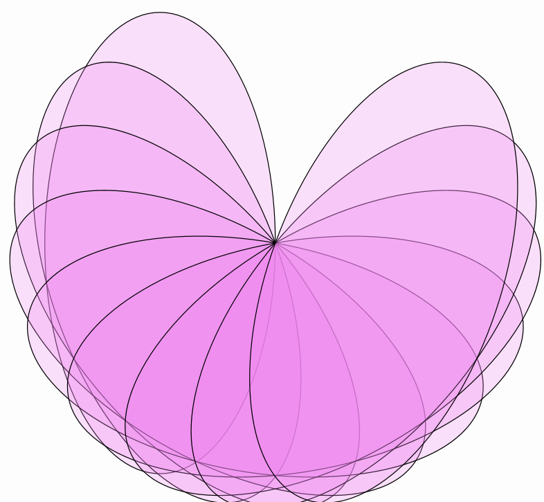
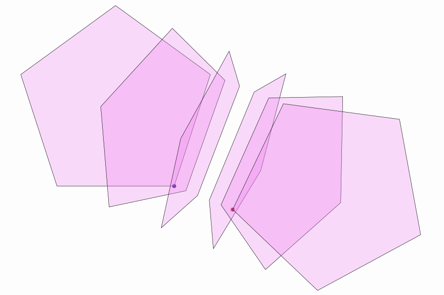
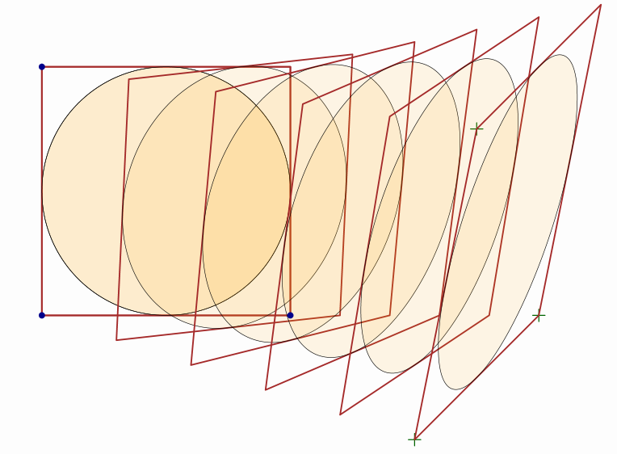
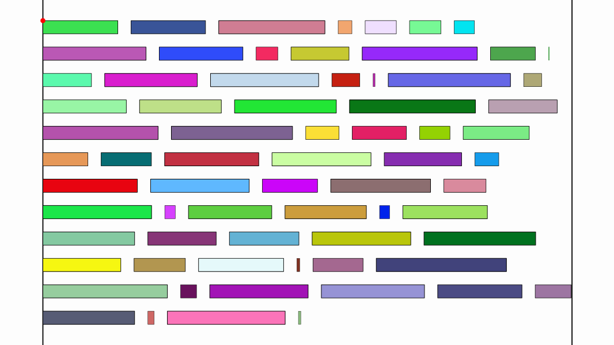

[home](https://davidgutierrezrubio.github.io/jmathanim/) [back](../index.html)

# Transforming Objects
All classes that inherit from `MathObject` can be transformed. Several methods for shifting, rotating, scaling, or aligning are defined, and most of them have an animated version. Note that most of these methods return the object self, so that they can be applied consecutively like this `object.method1().method2()….`

# Positioning objects

## Shift

The `shift` command shifts the object by the specified vector

``` java
Shape c=Shape.circle().shift(Vec.to(1,1));//An unit circle, centered at (1,1)
```

A simpler 2D-version is also provided:

``` java
Shape sq=Shape.square().shift(-3,0);//An unit square, lower left vertex at (-3,0)
```

## MoveTo
The `moveTo` command shifts the object so that its center is positioned at the given coordinates. Note that the center is the center of the bounding box of the object, not the geometrical center. For regular polygons, for example, they don’t necessarily match.

``` java
Shape r=Shape.regularPolygon(5).moveTo(3,3);//A pentagon, with its bounding box centered at (3,3)
```

## StackTo
The `StackTo` command allows us to position an object relative to another one. For example, the following code creates 4 circles and stacks them into a square in different ways:

``` java
Shape c1 = Shape.circle().fillColor("orange").fillAlpha(.3);
Shape c2 = c1.copy().fillColor("violet").fillAlpha(.6);
Shape c3 = c1.copy().fillColor("darkgreen").fillAlpha(.5);
Shape c4 = c1.copy().fillColor("darkblue").fillAlpha(.5);
Shape sq = Shape.square().fillColor("darkred").fillAlpha(.3);
c1.stackTo(sq, Anchor.Type.LEFT, .1);//Stacks circle to the left of the square, with a gap of .1 units
c2.stackTo(sq, Anchor.Type.RIGHT, .1);//Stacks circle to the right of the square, with a gap of .1 units
c3.stackTo(sq, Anchor.Type.UPPER);//Stacks circle to the upper side of the square, with no gap
c4.stackTo(sq, Anchor.Type.CENTER);//Stacks circle center-to-center with the square
add(c1, c2, c3, c4, sq);//Add everything to the scene
camera.adjustToAllObjects(); //Adjust camera, so that everyone gets into the photo
waitSeconds(5);//That is, smile for the screenshot!
```

which produces the following image:


You’ll notice two new methods here: The `copy()` method returns a copy of the object, and the `camera.adjustToAllObjects()` does as it says, rescales the camera so that everything fits into view, but it doesn't zoom in.  The `fillColor` and `fillAlpha` sets the filling of the object. 

Note that the `.moveTo(p)`method is equivalent to `.stackTo(p, Anchor.Type.CENTER)`.

With the `stackTo` command you can easily generate aligned objects:

``` java
Shape previousPol = Shape.regularPolygon(3).fillColor(JMColor.random()).thickness(8);//First polygon, with random fill color
add(previousPol);
for (int n = 4; n < 10; n++) {
    Shape pol = Shape.regularPolygon(n).fillColor(JMColor.random()).thickness(8).stackTo(previousPol, Anchor.Type.RIGHT);
    add(pol);
    previousPol = pol;//New polygon becomes previous in the next iteration
}
camera.adjustToAllObjects();//Everyone should appear in the photo
waitSeconds(5);//Time for screenshot, but you already should know that
```

Which produces this regular polygons pattern. Note that all polygons are vertically aligned and their bounding boxes are stacked horizontally. Actually, you can achieve the same effect easier using layouts with `MathObjectGroup` as we will see later in this chapter.


You can change the `Anchor` to other values to see how these anchors work. Apart from `UPPER`, `LOWER`, `LEFT`, `RIGHT` and `CENTER` there are also `UR` (up-right), `UL` (up-left), `DR` (down-right) and `DL` (down-left).

By default, the `stackTo` method takes the appropriate origin anchor point to align with the destination anchor point. For example, `stackTo(obj,Anchor.Type.RIGHT)` will move the object so that its `LEFT` anchor (the reverse of `RIGHT`) matches the `RIGHT` anchor of the destination object. You can specify the origin and destiny anchors too. For example, this code will place a square so that its center matches the right side of a circle:

```java
Shape sq = Shape.square().scale(.5, .5).fillColor("orange").fillAlpha(.5).thickness(8);
Shape c = Shape.circle().scale(.5).fillColor("yellow").fillAlpha(.5).thickness(8);
add(c, sq);
sq.stackTo(Anchor.Type.CENTER, c, Anchor.Type.RIGHT, 0);//Center of sq goes to RIGHT of c
waitSeconds(3);
```


## StackToScreen

This methods is similar to `stackTo`, but it positions the object relative to the current view.

``` java
Shape sq=Shape.square().scale(.5).style("solidblue");

//Stack square to the left of the screen, with no gaps
add(sq.stackToScreen(Anchor.Type.LEFT));

//Stack a copy of square to the left of the screen,with gaps of .3 horizontal and .1 vertical (here only horizontal one is used)
add(sq.copy().style("solidgreen").stackToScreen(Anchor.Type.RIGHT,.3,.1));

//Stack a unit circle to the upper left corner of the screen, with no gaps
add(Shape.circle().style("solidred").scale(.25).stackToScreen(Anchor.Type.ULEFT));

waitSeconds(5);
```


There is shortcut method if you want to simply put the object at the center screen. The method `.center()` is equivalent to `.stackToScreen(Anchor.Type.CENTER)`.

## Aligning objects

The `MathObject`class has the method `align` which aligns the object with another one, using one of the aligns in the enum `Align: LEFT, RIGHT, UPPER, LOWER, HCENTER, VCENTER`.

```java
Line floor = Line.XAxis();
add(floor);
for (int n = 4; n < 10; n++) {
    Shape pol = Shape.regularPolygon(n) //Creates a regular polygon with n sides...
        .moveTo(Point.random()) //Move its center to a random point on current view...
        .scale(Math.random() * .5);//And scale it randomly between 0 and 0.5
    Shape pol2 = pol.copy() //Creates a copy of the polygon...
        .fillColor(JMColor.random()) //fill it with a random color...
        .thickness(6) //With this thickness...
        .align(floor, MathObject.Align.LOWER);//And align the bottom of the object with object floor
    add(pol, pol2);
}
camera.adjustToAllObjects();//Everyone should appear in the photo
waitSeconds(5);//Smile!
```


# Scaling objects
All `MathObject` instances can be scaled with the `scale` command. Scaling can be done from a given scale center or by default, the center of the object  bounding box.

``` java
@Override
public void setupSketch() {
    config.parseFile("#preview.xml");
    config.parseFile("#light.xml");
}

@Override
public void runSketch() throws Exception {
    Shape s1=Shape.circle()//A circle...
        .style("solidorange")//Style solidorange (included in #light.xml)
        .shift(-1, 0) //Shifted 1 unit to the left
        .scale(.5, 1);//x-scale and y-scale around center
    Shape s2=Shape.regularPolygon(5)//A regular pentagon...
        .style("solidred")//Style solidred (included in #light.xml)
        .shift(0, 1)//Shifted 1 unit up
        .scale(Point.at(0, 0), 1.3, .2);//x-scale and y-scale around (0,0)
    Shape s3=Shape.square() //A square...
        .style("solidblue")//Style solidblue (included in #light.xml)
        .shift(1, 0)//shifted 1 unit to the left
        .scale(.3); //Uniform scale around center
    add(s1,s2,s3);
    waitSeconds(5);
}
```

produces the result:


# Rotating objects
The `rotate` command rotates the object around a given center (or the center of the object if none is given). The angle is specified in radians but can also be given in degrees using the `DEGREES` constant. The format is `object.rotate(center_of_rotation,angle)` or `object.rotate(angle)`. As in the `scale` method, if no center is specified, the center of the bounding box is chosen as rotation center.

For example:

``` java
   Shape ellipse = Shape.circle().scale(.5, 1);//Creates an ellipse
        ellipse.fillColor("violet").fillAlpha(.25);//fill violet 25% opacity
        Point rotationCenter = Point.at(.5, 0);
        for (int n = 0; n < 180; n += 20) {
            add(ellipse.copy().rotate(rotationCenter, n * DEGREES));
        }
        waitSeconds(5);
```

Gives this spirograh-like picture:



# Affine Transforms
`shift`, `rotate` and `scale` are particular cases of a more general affine transform implemented by the `AffineJTransform` class. This class defines general affine transforms in the 2D plane, and has several static convenience methods for some of the most common transforms:

The `createTranslationTransform(Vec v)` or `createTranslationTransform(Point A, Point B)` creates a traslation transform. The `shift` command is just a shortcut for this transform. 

The `create2DRotationTransform(Point center, double angle)` creates a rotation transform, which is used in the `rotate` command.

The `createScaleTransform(Point center, double sx, double sy, double sz)` creates a scaling transform. The z-scale factor is here for
compatibility to extend to the 3D case, but is currently not used. Used in the `scale` command.

Given any `MathObject` instance, there are 2 main methods to use an `AffineJTransform` object on it:

-   The `transform.applyTransform(object)` method transforms and modifies the current object, returning `void`.
    
-   The `transform.getTransformed(object)` returns a copy of the object transformed. The original object is unaltered.

## Isomorphic transformations
The `createDirect2DIsomorphic(Point A, Point B, Point C, Point D, double alpha)` is a combination of shifting, rotating and uniform scaling. This method generates the (only) direct transform of this type that maps the points (A,B) into points (C,D). The `alpha` parameter is used for animations, as a value of `alpha=0` returns the identity transform and `alpha=1` returns the full transform. Intermediate values return intermediate transforms, interpolating the shifting, rotating, and scaling parameters adequately. These transforms preserve not the size, but the shape and proportions of the objects.

Look at the following example:

``` java
Shape sq = Shape.square().shift(-1.5, -1).fillColor("darkgreen").fillAlpha(.3);//Square, fill color dark green, and opacity 30%
Point A = sq.getPoint(0).drawColor("darkblue");//First vertex of the square (lower-left corner), dark blue color
Point B = sq.getPoint(1).drawColor("darkblue");//First vertex of the square (lower-right corner), dark blue color
Point C = Point.at(1.5, -1).drawColor("darkred");//Destiny point of A, dark red color
Point D = Point.at(1.7, .5).drawColor("darkred");//Destiny point of B, dark red color
add(A, B, C, D);
for (double alpha = 0; alpha <= 1; alpha += .2) {
    AffineJTransform transform = AffineJTransform.createDirect2DIsomorphic(A, B, C, D, alpha);
    add(transform.getTransformedObject(sq));//Adds a copy of the square, transformed
}
waitSeconds(5);
```

Produces the following sequence of interpolated transforms from one square to another. Note that this transformation may change the scale of objects, but proportions are unaltered:


> **WARNING**: You should be careful, when defining the parameters of a transformation like `createDirect2DIsomorphic(A, B, C, D, alpha)` if the points `A, B, C, D` are going to be actually modified by the transformation itself (for example, A is an instance of a point of the shape you are transforming). The safe approach in this case should be using copies of the points as parameters, with the `.copy()` method.

Since version 0.9.9-SNAPSHOT, the `createInverse2DIsomorphic` method is implemented too, that returns the (only) inverse isomorphic transform that maps A into C and B into D.

```java
Shape sq = LaTeXMathObject.make("R").get(0).scale(8).center().fillColor("steelblue").fillAlpha(.3);//Square, fill color dark green, and opacity 30%
Point A = sq.getBoundingBox().getDL().drawColor("darkblue");//First vertex of the square (lower-left corner), dark blue color
Point B = sq.getBoundingBox().getUL().drawColor("darkblue");//First vertex of the square (lower-right corner), dark blue color
Point C = Point.at(3.5, -1).drawColor("darkred");//Destiny point of A, dark red color
Point D = Point.at(3.7, .5).drawColor("darkred");//Destiny point of B, dark red color
add(A, B, C, D);
for (double alpha = 0; alpha <= 1; alpha += .2) {
    AffineJTransform transform = AffineJTransform.createInverse2DIsomorphic(A, B, C, D, alpha);
    add(transform.getTransformedObject(sq));//Adds a copy of the square, transformed
}
camera.adjustToAllObjects();
waitSeconds(5);
```


## Reflections
If we want to make a reflection of an object, we can use the static methods `createReflection` and `createReflectionByAxis`. They differ in the way the transformation is specified:

-   `createReflection(Point A, Point B, double alpha)` creates the (only) reflection that maps point `A` into point `B`. The reflection axis is the perpendicular bisector of the segment joining the two points.
    
-   `createReflectionByAxis(Point E1, Point E2, double alpha)` creates the (only) reflection with axis the line specified by the points `E1` and `E2`.

In both cases, the `alpha` parameter works in a similar way to the isomorphic transform.

An example of `createReflection` is shown in the following source code:

``` java
Shape sq = Shape.regularPolygon(5).fillColor("violet").fillAlpha(.3);//Regular pentagon, fill violet, opacity 30%
Point A = sq.getPoint(0).copy().drawColor("darkblue");//Copy of the first vertex of the pentagon(lower-right corner), color dark blue
Point B = A.copy().shift(.5, -.2).drawColor("darkred");//Copy of A, shifted (.5,-2), color dark red
add(A, B);
for (double alpha = 0; alpha <= 1; alpha += .2) {
    AffineJTransform transform = AffineJTransform.createReflection(A, B, alpha);//Reflection that maps A into B
    add(transform.getTransformedObject(sq));//Adds a copy of the pentagon, transformed
}
camera.adjustToAllObjects();
waitSeconds(5);
```


## General affine transforms
There is also a more general way to define an affine transform using `createAffineTransformation(Point A, Point B, Point C, Point D, Point E, Point F, double lambda)`. It returns the (only) affine transform that maps the points (A,B,C) into (D,E,F), with the `lambda` interpolation parameter as in the previous methods. Here’s an example:

``` java
Shape sq = Shape.square().drawColor("brown").thickness(4);
Shape circ = Shape.circle().scale(.5).shift(.5, .5).fillColor("orange").fillAlpha(.1);//A circle inscribed into the square
//We create the points with layer(1) so that the draw over the square and circles (by default in layer 0)
Point A = Point.at(0, 0).drawColor("darkblue").layer(1); 
Point B = Point.at(1, 0).drawColor("darkblue").layer(1); 
Point C = Point.at(0, 1).drawColor("darkblue").layer(1); 
Point D = Point.at(1.5, -.5).dotStyle(DotSyle.PLUS).thickness(6)).drawColor("darkgreen");
Point E = Point.at(2, 0).dotStyle(DotSyle.PLUS).thickness(6).drawColor("darkgreen");
Point F = Point.at(1.75, .75).dotStyle(DotSyle.PLUS).thickness(6).drawColor("darkgreen");
add(sq, circ, A, B, C, D, E, F);

for (double alpha = 0; alpha <= 1; alpha += .2) {
    //A maps to D,B maps to E, C maps to F
    AffineJTransform transform = AffineJTransform.createAffineTransformation(A, B, C, D, E, F, alpha);
    add(transform.getTransformedObject(sq));//Adds a copy of the square, transformed
    add(transform.getTransformedObject(circ));//Adds a copy of the circle, transformed
}
camera.adjustToAllObjects();
waitSeconds(5);
```

That produces the following image:



# Layouts

The `MathObjectGroup`class allows applying layouts to its members through the `setLayout(layout,gap)` method, which positions all objects with the given layout and specified gap. The layouts are defined in the enum `MathObjectGroup.Layout` and currently are `CENTER`, `LEFT, RIGHT, UPPER` and `LOWER`, which aligns the objects centered in these directions. There are also the versions `URIGHT, DRIGHT, ULEFT, DLEFT` which work in a similar way but align at the top (U) o bottom (D), and `LUPPER, RUPPER, LLOWER, RLOWER` that align to the left (L) or right (R). There are also the `DIAG1`, `DIAG2`, `DIAG3`, and `DIAG4` layouts that align in the main diagonals of the 4 sectors (45, 135, 225 and 315 degrees).

The following code shows all current layouts, with a set of 10 increasing squares:

```java
MathObjectGroup group = MathObjectGroup.make();
double h = 0;//This will hold the total height of the squares, to properly zoom out the camera later
for (int n = 0; n < 10; n++) {
    Shape square = Shape.square().scale(.2 + .1 * n).fillColor(JMColor.random()).fillAlpha(.5).thickness(6);
    h += square.getHeight();
    group.add(square);
}
camera.scale(2 * h / camera.getMathView().getHeight());//Zooms out so that the height of view is 2xTotal height
add(group);//This adds all squares to the scene, but not the group object itself.
LaTeXMathObject layoutName = LaTeXMathObject.make("").scale(7);
add(layoutName);
for (MathObjectGroup.Layout layout : MathObjectGroup.Layout.values()) {//Iterate over all the layout values
    group.setLayout(layout, .1); //Set this layout, with .1 gap between objects
    layoutName.setLaTeX(layout.name()).stackToScreen(Anchor.Type.LOWER, .2, .2); //Change value of the label
    waitSeconds(3);
```


There is a more advanced overloaded form of this method, where the layout is given as a subclass of the `GroupLayout` class. Since version 0.8.9, the `BoxLayout`, `SpiralLayout`, `HeapLayout` and `PascalLayout` have been implemented. These methods work well when all elements of the group have the same dimensions. You can define your own layouts subclassing the `GroupLayout` abstract class.

## The BoxLayout

The `BoxLayout` allocates the objects in a matrix form:

```java
MathObjectGroup gr = MathObjectGroup.make();
int num = 16;
for (int n = 0; n < num; n++) {
    MathObject sq = Shape.square().scale(.25).fillColor("violet").fillAlpha(1 - 1. * (n+1) / num).thickness(6);
    LaTeXMathObject t = LaTeXMathObject.make("" + n);
    t.stackTo(sq, Anchor.Type.CENTER).layer(1);
    gr.add(MathObjectGroup.make(sq, t));//Each object of the group is itself a group with 2 elements
}
Point refPoint = Point.origin(); //The reference point to locate the box
add(refPoint.thickness(40).drawColor(JMColor.RED).layer(1));
BoxLayout layout = new BoxLayout(refPoint, 4, BoxLayout.Direction.RIGHT_UP, .1, .1);//This is where the magic happens
add(gr.setLayout(layout));
camera.zoomToAllObjects();
waitSeconds(3);//Smile, you're in a screenshot!
```

Gives a static image like this. The red dot is the reference point


The `BoxLayout.Direction.RIGHT_UP` tells the layout to first fill the row in the `RIGHT` direction, and then go `UP` to move to the next one. You can try other values, like `LEFT_DOWN`.

The gaps are not the usual horizontal and vertical gaps, but the in-row-gap, and between-row gaps. The "row" term in this case is not the usual horizontal row, but the lower level groups of objects. For example, if direction is `RIGHT_DOWN` , `RIGHT_UP`, `LEFT_DOWN` or `LEFT_UP` the "rows" will be horizontal and the in-row-gap will act like a horizontal gap (and the between-rows-gap like a vertical gap), but if direction is `UP_RIGHT`, `UP_LEFT`, `DOWN_RIGHT`, or `DOWN_LEFT`, the "rows" will be vertical and the in-row-gap will act like a vertical gap. An image is worth a thousand words:


The `BoxLayout` has the methods `getRowGroups` and `getColumnGroups` which return a `MathObjectGroup` with its elements other `MathObjectGroup` objects, each one with the elements of a row (or column).

For example, if you add the following lines right before the `waitSeconds`command in the previous code, you can assign random fill colors to each row:

```java
for(MathObjectGroup rows:layout.getRowGroups(gr)) {//Iterate over the rows
	rows.fillColor(JMColor.random());
}
```


## The SpiralLayout

If in the previous code you change the 

```java
BoxLayout layout = new BoxLayout(refPoint, 4, BoxLayout.Direction.RIGHT_UP, .1, .1);//This is where the magic happens
```

into

```java
SpiralLayout layout = new SpiralLayout(refPoint, SpiralLayout.Orientation.RIGHT_CLOCKWISE, .1, .1);//Another kind of magic!
```

You will get the objects in a spiral form:


The orientation parameter specifies if the spiral is clockwise or counterclockwise and the position of the second object relative to the first one (which is centered at the reference point). The gaps are the usual horizontal and vertical gaps.

This class has the method`setSpiralGap` that admits an integer parameter that controls the aperture of the spiral. The default value is 0. A value of 1 will leave a single space between consecutive turns of the spiral. A value of 2 will leave 2 spaces, etc. If in the previous example we make the following change in the number of squares and the creation of the layout:

```java
int num=50;//Now we are creating more squares!
........
SpiralLayout layout = new SpiralLayout(refPoint, SpiralLayout.Orientation.RIGHT_CLOCKWISE, 0, 0).setSpiralGap(1);
```

You will obtain the following image:


## The HeapLayout

If you use the `HeapLayout`:

```java
HeapLayout layout = new HeapLayout(refPoint, .1, .1);
```

You will get a triangular pile of numbered squares:


## The PascalLayout

The `PascalLayout` resembles the positions of numbers in the Pascal triangle. If you use the code:

```java
PascalLayout layout = new PascalLayout(refPoint,.1,.1);
```

You will obtain a layout like this:


## The FlowLayout

The `FlowLayout` is similar to the `BoxLayout` except the new row is created when exceeds certain width, most like a text editor will do.

```java
int num = 70;
MathObjectGroup sqs = MathObjectGroup.make();
for (int n = 0; n < num; n++) {//Create random bars
     sqs.add(Shape.square().scale(Math.random(), .1).style("solidorange"));
}
double width = 2;
final Point corner = Point.relAt(.1, .9);
add(corner.thickness(40).drawColor("red").layer(1));
add(Line.YAxis().shift(corner.v.add(Vec.to(width, 0))));//Draw vertical lines to mark the margins
add(Line.YAxis().shift(corner.v.add(Vec.to(0, 0))));
FlowLayout flayout = new FlowLayout(corner, width, AbstractBoxLayout.Direction.RIGHT_DOWN, 0,0);
sqs.setLayout(flayout);
add(sqs);
camera.adjustToAllObjects();
waitSeconds(2);
```



## Composing layouts

From version 0.9.2-SNAPSHOT the `ComposeLayout` allows the creation of more complex layouts by composition. The syntax for creating a composite layout is

```java
ComposeLayout composedLayout=new ComposeLayout(outerLayout, innerLayout, size);
```

When applied to a group, this layout will first divide the group into subgroups of `size` elements, then will layout each one with the inner layout, and finally it will layout each subgroup, as an individual object, with the outer layout.

We illustrate this with an example. Here we use as inner layout a `BoxLayout` and as outer layout a `PascalLayout`.

```java
MathObjectGroup gr = MathObjectGroup.make();
int num = 54;
for (int n = 0; n < num; n++) {//Creates a group with 54 numbered squares
    MathObject sq = Shape.square().scale(.25).fillColor("violet").fillAlpha(1 - 1. * (n + 1) / num).thickness(6);
    LaTeXMathObject t = LaTeXMathObject.make("" + n);
    t.stackTo(sq, Anchor.Type.CENTER).layer(1);
    gr.add(MathObjectGroup.make(sq, t));//Each object of the group is itself a group with 2 elements
}

Point refPoint = Point.origin(); //The reference point to locate the outer layout
add(refPoint.thickness(40).drawColor(JMColor.RED).layer(1));//add this point so we can see it clearly

GroupLayout innerLayout = new BoxLayout(refPoint, 3, BoxLayout.Direction.RIGHT_DOWN, 0, 0);
GroupLayout outerLayout = new PascalLayout(refPoint, .1, .1);
ComposeLayout composedLayout=new ComposeLayout(outerLayout, innerLayout, 9);//The composed layout

add(gr.setLayout(composedLayout));
camera.adjustToAllObjects();
waitSeconds(3);//Smile, you're in a screenshot!
```


Another example: we use composite layouts to draw a Sierpinski triangle using a group of equilateral triangles and iterating compositions:

```java
MathObjectGroup triangles = MathObjectGroup.make();
int degree = 6;//Degree of the Sierpisnki triangle
int num = (int) Math.pow(3, degree);//We need 3^degree triangles!
for (int n = 0; n < num; n++) {
    MathObject tr = Shape.regularPolygon(3).scale(.25);
    triangles.add(tr);
}
Point corner = Point.relAt(.5, .9);//Top corner of the Sierpinski triangle
PascalLayout innerLayout = new PascalLayout(corner, 0, 0);
GroupLayout previousLayout = innerLayout;
GroupLayout sierpinskiLayout = innerLayout;
for (int n = 1; n < degree; n++) {//Iterates composing the innerLayout with itself 6 times
    sierpinskiLayout = new ComposeLayout(previousLayout, innerLayout, 3);
    previousLayout = sierpinskiLayout;
}
sierpinskiLayout.applyLayout(triangles);
add(triangles);
camera.adjustToAllObjects();
waitSeconds(5);
```

We obtain the following image (note that there are 729 triangles in there):


[home](https://davidgutierrezrubio.github.io/jmathanim/) [back](../index.html)
