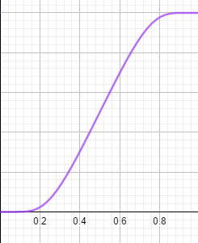

Animations
==========

So far, we’ve learned to draw basic objects, and put them in the position we desire. What about animations? Well, that is what this
library is meant for. We have the `Animation` class that will store any kind of animation you can do to an object. Not only `MathObject`
instances can be animated, but also the `Camera` object. 

An `Animation` object has 3 important methods that should be understood if you want to implement your own animations or playing it manually with
the `advanceFrame()` method 

-   The `initialize()` method, which prepares the objects to be animated. It should be called immediately before the animation
    begins, that is, no modifications should be done to the objects between this method and the start of the animation.
-   The `processAnimation`this method computes the time depending on the frame rate, and calls the next method. If the animation is finished, return `true`.
-   The `doAnim(double t)` method. This method actually 
    performs the animation. The parameter `t` ranges from 0 to 1 where 0 is the beginning and 1 is the end. This
    is not actually the time, but the percentage of animation done. A second parameter computed is a "smoothed" version of the parameter `t`, where
    a smooth function is applied so that the animation starts and ends in a soft way, rather than with the lineal `t`. Currently, the smooth function used is




The smooth function is defined as a lambda java function, that you can get or set with `getLambda` and `setLambda` methods.

-   The `finishAnimation()` method, that should do all the needed cleanup and finishing jobs.

An `Animation` object can be played with the `playAnimation` method, but there is another way to play it in a more procedimental way. You can achieve the same effect with the following piece of code:

````java
Animation anim=<define here the animation>
anim.initialize();
while (!anim.processAnimation()) {
    advanceFrame();
}
````

Also, there is a convenience object created, `play`, which performs easily most used animations.

In general, parameters of all animations always follow the structure `(runTime, parameters, object_1,…​,object_n)`. The last part is a varargs `MathObject`, this way, you can apply the animation to an arbitrary number of objects.

Basic Animations
----------------

The basic transformations also have their animated versions. They are defined as static methods in the `Commands` class.

A gif (and its generating code) is worth a thousand words:

``` java
Shape sq=Shape.square().fillColor("#87556f").thickness(2);
//Animates a moving square, with 3 seconds of duration
Animation shiftAnim = Commands.shift(3, Vec.to(.75,-.5), sq);
playAnimation(shiftAnim);
waitSeconds(1);
```


We have performed a simple animation defining it in the variable `shiftAnim` and playing it with the `playAnimation` method.

This animation and many other have a shorter access through the `play` object. The following code produces the same result:

``` java
Shape sq=Shape.square().fillColor("#87556f").thickness(2);
play.shift(3, Vec.to(.75,-.5), sq);
waitSeconds(1);
```

The `play` object is an instance of the `PlayAnim` class that holds several fast-access to most common animations.

You can replace the animation method with one of this list of basic transforms, in its easy-access version, to see how it works:

``` java
//Rotates the square arund its center, 45 degress, in 3s
play.rotate(3,45*DEGRESS,sq);

//Rotates the square around the origin 120
play.rotate(5,Point.at(0,0),120*DEGREES,sq);degress, in 5s

//Scales the square uniformly at 70%, around its center, in 3s
play.scale(3,.7,sq);

//Scales the square at 70% x, 150% y, around the origin, in 3s
play.scale(3,Point.at(0,0),.7,1.5,sq);
```

The `play` object has also most animations related to the view camera:

``` java
//Animates a camera pan for 4 seconds, with vector (1,-1)
play.cameraShift(4,1,-1);

//Zoom in the view 200%, in 3 seconds
play.cameraScale(3,.5);

//Zoom out the view 25%, in 3 seconds
play.cameraScale(3,4);

//Pan and zoom the camera so that the specified objects are visible, in 3 seconds
play.adjustToObjects(3,sq,circ,A,B);

//Pan and zoom the camera so that all objects in the scene are visible, in 3 seconds
play.adjustCameraToAllObjects(3);
```

Before adjusting the camera to objects, you can define the gaps used to leave space between the objects and the border of the screen, with the
`camera.setGaps(hGap,vGap)` method.

Some method to add or remove objects to the scene are also included:

``` java
//Fade the object from 0 alpha to 1, and add the object to the scene, in 2 seconds
play.fadeIn(2,sq);

//Fade out the object to 1 alpha to 0, removing it from the scene, in 2 seconds
play.fadeOut(2,sq);

//Fade out all objects in the scene, in 2 seconds
play.fadeOutAll(2);

//Scales the object from 0 to 1, adding it to the scene
play.growIn(2,sq);

//The same, but it also applies a 30 degrees rotation
play.growIn(2,30*DEGREES,sq);

//The opposite, scales the object to 0 and removes it from the scene
play.shrinkOut(2,sq);

//The same but it also applies a 45 degrees rotation
play.shrinkOut(2,45*DEGREES,sq);

//Scales briefly the object, to highlight it, for 1 second
play.highlight(1,sq);
```

Most of this commands can be called omitting the runtime parameter, using the default time for each one. For example, calling
`play.fadeIn(sq)` will execute the `fadeIn` animation in 1 second, which is the value defined in the public variable `play.defaultRunTimefadeIn`.
You can change the values of these variables as you need. Here is a demo animation with its source code:

``` java
LaTeXMathObject text;
Shape sq = Shape.square().fillColor("#87556f").thickness(2).center();//
text = LaTeXMathObject.make("{\\tt play.fadeIn(sq)}").stackToScreen(Anchor.LOWER, .1, .1);
add(text);
play.fadeIn(sq);
waitSeconds(1);
remove(text);
text = LaTeXMathObject.make("{\\tt play.highlight(sq)}").stackToScreen(Anchor.LOWER, .1, .1);
add(text);
play.highlight(sq);
waitSeconds(1);
remove(text);
text = LaTeXMathObject.make("{\\tt play.shrinkOut(1,45*DEGREES, sq)}").stackToScreen(Anchor.LOWER, .1, .1);
add(text);
play.shrinkOut(1,45*DEGREES, sq);
waitSeconds(1);
```


The `MoveAlongPath` animations move an object along a specified path. You can provide a `Shape` object or a `JMPath`objec to determine the path. The moved object will be located with the specified `Anchor` point.

In this example, we show 2 squares moving along  a circle:

```java
Shape c = Shape.circle();
Shape a = Shape.square().scale(.3);
Shape b = a.copy();
add(c,a, b);
Animation anim = new MoveAlongPath(5, c, a,Anchor.UL);
Animation anim2 = new MoveAlongPath(5, c, b,Anchor.DR);
playAnimation(anim, anim2);
waitSeconds(3);
```


You can try modifying the lambda function of each animation with the `setLambda` method to see what happens. For example, `anim.setLambda(x->x)` or `anim.setLambda(x->4*x*(1-x))`. 

The ShowCreation animation
--------------------------

This animation draws the specified object and add it to the scene. Depending on the object, several strategies (that is several ways to
actually create the object) are used, specified in the enum `ShowCreationStrategy`. Strategy is automatically chosen, but it can be
overriden with the method `setStrategy`. 

Forcing a specified strategy may lead to errors in some cases, as some methods are designed for specific subclasses, like `Line` or `Arrow2D`.

Let’s show with an example. Using the short version with the `play` object:

``` java
Shape sq=Shape.square().fillColor("#87556f").thickness(2).center();
play.showCreation(2,sq);//Creates sq in 2 seconds
//The other way to do this:
//ShowCreation sc=new ShowCreation(2, sq);
//playAnimation(sc);
waitSeconds(1);
```


In the case of a simple shape like this, the `SIMPLE_SHAPE_CREATION` strategy is used.

In case of `MultiShape` objects, which include `LaTeXMathObject` and `SVGObject`, the strategy `FIRST_DRAW_AND_THEN_FILL`, where, as its name
suggest, first draw the outline and then fill the shape.

``` java
LaTeXMathObject text=LaTeXMathObject.make("$a^2+b^2=c^2$").center().scale(3);
play.showCreation(text);
```


The Transform animation
-----------------------

The `Transform` class animates a smooth transform from one `Shape` object to another.

``` java
Shape circle = Shape.circle().shift(-1, 0).scale(.5);
Shape pentagon = Shape.regularPolygon(5).shift(.5, -.5).style("solidblue");
play.transform(3, circle, pentagon);
waitSeconds(3);
```


Note that the `transform` animation also interpolates drawing parameters
as thickness and color.

> **WARNING**: After transforming object `A` into `B`, in some cases the transformed object becomes unusable. You should using `B` after that in a general
> case. That is no the case when the objects transformed are both `Shape` for example.

The precise method of transform depends on the type of source and destination objects. While both have to be `Shape` instances, the
specified type of the object, given by the `getObjectType()` determines the most appropiate type of transformation. For example, in the previous
case, a point-by-point interpolation was chosen. However, if both shapes are regular polygons with the same number of sides, a homothecy is
chosen to transform. We will show another example, not using the "long" form given by the \` play\` object:

``` java
Shape pentagon = Shape.regularPolygon(5).thickness(3).scale(.5).shift(-1,-1);
Shape pentagonDst = Shape.regularPolygon(5).thickness(3).scale(.8).shift(.5,-.5).rotate(45*DEGREES);
Transform tr = new Transform(3, pentagon, pentagonDst);
playAnimation(tr);
waitSeconds(1);
```


While both methods may seem equal, the homothecy method ensures the object doesn’t get distorted in the way. If you want to force a concrete
transform strategy, you can do it with the method `.transformMethod(method)` where method is a value of the enum `TransformMethod`.

> **WARNING**: Forcing a concrete transform strategy may leads to errors in some cases. In most cases, no animation will be done and a message will be added to the logs.

Apart from different transform strategies, this class also allows different previous-to-transform optimization strategies (well, right now
it only has one), listed in the enum `OptimizeMethod`.

By default, a transform animations convertes the n-th point of Shape A into the n-th point of Shape B. The `SIMPLE_CONNECTED_PATHS`
optimization aligns the paths cycling the transformed object, so that the sum of the distances between points of A from the points of B is
minimum, ensuring a cleaner point-to-point transform from A to B. The following code compares the same transformation with and without
optimization:

``` java
Shape circle = Shape.circle().scale(-1, 1).scale(.6).shift(-.5, .3);
Shape circle2 = circle.copy();
Shape square = Shape.square().shift(.5, 0).scale(.6).rotate(45*DEGREES);
add(LaTeXMathObject.make("With optimization").stackToScreen(Anchor.LOWER, .1, .1));
Transform tr = new Transform(3, circle, square);
playAnimation(tr);
waitSeconds(1);
play.fadeOutAll();
add(LaTeXMathObject.make("Without optimization").stackToScreen(Anchor.LOWER, .1, .1));
Transform tr2 = new Transform(3, circle2, square);
tr2.optimizePaths(false);
playAnimation(tr2);
waitSeconds(1);
play.fadeOutAll();
```


Changing styles
---------------

So far, we have seen how to animate the position or shape of an object. In the `Transform` animation, style of the transformed object changes
smoothly to match the style of destiny too. There are a few animations related to the style of an object:

The `setColor` animation animates the colors of the objects to the specified. Draw color and fill color may be specified. If you do not
wish to change one of them, you just set it to null. For example:

``` java
Shape sq=Shape.square().center().thickness(10);
Arrow2D arrow=Arrow2D.makeSimpleArrow2D(Point.UnitX, Point.UnitY).thickness(10);
add(sq,arrow);
waitSeconds(3);
AnimationGroup cmd = Commands.setColor(3, JMColor.RED, null, sq,arrow);
playAnimation(cmd);
waitSeconds(3);
```

Will generate the following animation:


The `setMP` animations works in a more general way, where you directly interpolate with the values of a specified `MODrawProperties`.
Currently, only the draw and fill colors and thickness are interpolated. At the end of the animation, all the destiny attributes like layer, dash
style, etc are copied.

If you have styles defined via config files or with the command `createStyleFrom(obj)` , the ` setStyle` animation changes the drawing
parameters of an object to that style. This command has a shortcut in the `play` object. So, for example, the following code:

``` java
play.setStyle(3,"solidBlue",circle);
```

will progressively change the drawing parameters of the `circle` object to adjust to the style `solidBlue` defined previously.

AffineTransform related animations
----------------------------------

`affineTransform(double runtime, Point a, Point b, Point c, Point d, Point e, Point f, MathObject…​ objects) `

`reflection(double runtime, Point A, Point B, MathObject…​ objects) `

`reflectionByAxis(double runtime, Point a, Point b, MathObject…​ objects)`

`homothecy(double runtime, Point a, Point b, Point c, Point d, MathObject... objects)`