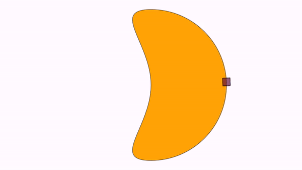

Animations

So far, we’ve learned to draw basic objects, and put them in the position we desire. What about animations? Well, that is what this library is meant for. We have the `Animation` class that will store any kind of animation you can do to an object. Not only `MathObject` instances can be animated, but also the `Camera` object. 

An `Animation` object has 3 important methods that should be understood if you want to implement your own animations or playing it manually with the `advanceFrame()` method 

-   The `initialize(this)` method, which prepares the objects to be animated. It should be called immediately before the animation begins, that is, no modifications should be done to the objects between this method and the start of the animation. The only parameter it needs is the scene from where it is invoked, usually the own class, `this`.
-   The `processAnimation`this method computes the time depending on the frame rate, and calls the next method. If the animation is finished, return `true`.
-   The `doAnim(double t)` method. This method actually performs the animation. The parameter `t` ranges from 0 to 1 where 0 is the beginning and 1 is the end. This is not actually the time, but the percentage of animation done. A second parameter computed is a "smoothed" version of the parameter `t`, where a smooth function is applied so that the animation starts and ends in a soft way, rather than with the lineal `t`. Currently, the smooth function used is


The smooth function is defined as a lambda java function, that you can get or set with `getLambda` and `setLambda` methods.

-   The `finishAnimation()` method, that should do all the needed cleanup and finishing jobs.

An `Animation` object can be played with the `playAnimation` method, but there is another way to play it in a more procedimental way. You can achieve the same effect with the following piece of code:

````java
Animation anim=<define here the animation>
anim.initialize(this);
while (!anim.processAnimation()) {
    advanceFrame();
}
````

Also, there is a convenience object created, `play`, which performs easily most used animations.

In general, parameters of all animations always follow the structure `(runTime, parameters, object_1,…​,object_n)`. The last part is a varargs `MathObject`, this way, you can apply the animation to an arbitrary number of objects.

Basic Animations
----------------

The basic transformations also have their animated versions. They are defined as static methods in the `Commands` class.

A gif (and its generating code) is worth a thousand words:

``` java
Shape sq=Shape.square().fillColor("#87556f").thickness(2);
//Animates a moving square, with 3 seconds of duration
Animation shiftAnim = Commands.shift(3, Vec.to(.75,-.5), sq);
playAnimation(shiftAnim);
waitSeconds(1);
```


We have performed a simple animation defining it in the variable `shiftAnim` and playing it with the `playAnimation` method.

This animation and many other have a shorter access through the `play` object. The following code produces the same result:

``` java
Shape sq=Shape.square().fillColor("#87556f").thickness(2);
play.shift(3, Vec.to(.75,-.5), sq);
waitSeconds(1);
```

The `play` object is an instance of the `PlayAnim` class that holds several fast-access to most common animations.

You can replace the animation method with one of this list of basic transforms, in its easy-access version, to see how it works:

``` java
//Rotates the square arund its center, 45 degress, in 3s
play.rotate(3,45*DEGRESS,sq);

//Rotates the square around the origin 120
play.rotate(5,Point.at(0,0),120*DEGREES,sq);degress, in 5s

//Scales the square uniformly at 70%, around its center, in 3s
play.scale(3,.7,sq);

//Scales the square at 70% x, 150% y, around the origin, in 3s
play.scale(3,Point.at(0,0),.7,1.5,sq);
```

## Camera animations

The `play` object has also most animations related to the view camera:

``` java
//Animates a camera pan for 4 seconds, with vector (1,-1)
play.cameraShift(4,1,-1);

//Zoom in the view 200%, in 3 seconds
play.cameraScale(3,.5);

//Zoom out the view 25%, in 3 seconds
play.cameraScale(3,4);

//Pan and zoom the camera so that the specified objects are visible, in 3 seconds
play.adjustToObjects(3,sq,circ,A,B);

//Pan and zoom the camera so that all objects in the scene are visible, in 3 seconds
play.adjustCameraToAllObjects(3);
```

Before adjusting the camera to objects, you can define the gaps used to leave space between the objects and the border of the screen, with the
`camera.setGaps(hGap,vGap)` method.

## Enter and exit animations

Some method to add or remove objects to the scene are also included:

``` java
//Fade the object from 0 alpha to 1, and add the object to the scene, in 2 seconds
play.fadeIn(2,sq);

//Fade out the object to 1 alpha to 0, removing it from the scene, in 2 seconds
play.fadeOut(2,sq);

//Fade out all objects in the scene, in 2 seconds
play.fadeOutAll(2);

//Scales the object from 0 to 1, adding it to the scene
play.growIn(2,sq);

//The same, but it also applies a 30 degrees rotation
play.growIn(2,30*DEGREES,sq);

//The opposite, scales the object to 0 and removes it from the scene
play.shrinkOut(2,sq);

//The same but it also applies a 45 degrees rotation
play.shrinkOut(2,45*DEGREES,sq);

//Scales briefly the object, to highlight it, for 1 second
play.highlight(1,sq);
```

Most of this commands can be called omitting the runtime parameter, using the default time for each one. For example, calling
`play.fadeIn(sq)` will execute the `fadeIn` animation in 1 second, which is the value defined in the public variable `play.defaultRunTimefadeIn`.
You can change the values of these variables as you need. Here is a demo animation with its source code:

``` java
LaTeXMathObject text;
Shape sq = Shape.square().fillColor("#87556f").thickness(2).center();//
text = LaTeXMathObject.make("{\\tt play.fadeIn(sq)}").stackToScreen(Anchor.LOWER, .1, .1);
add(text);
play.fadeIn(sq);
waitSeconds(1);
remove(text);
text = LaTeXMathObject.make("{\\tt play.highlight(sq)}").stackToScreen(Anchor.LOWER, .1, .1);
add(text);
play.highlight(sq);
waitSeconds(1);
remove(text);
text = LaTeXMathObject.make("{\\tt play.shrinkOut(1,45*DEGREES, sq)}").stackToScreen(Anchor.LOWER, .1, .1);
add(text);
play.shrinkOut(1,45*DEGREES, sq);
waitSeconds(1);
```


## Moving along a path

The `MoveAlongPath` animations move an object along a specified path. You can provide a `Shape` object or a `JMPath`objec to determine the path. The moved object will be located with the specified `Anchor` point.

In this example, we show 2 squares moving along  a circle:

```java
Shape c = Shape.circle();
Shape a = Shape.square().scale(.3);
Shape b = a.copy();
add(c,a, b);
Animation anim = new MoveAlongPath(5, c, a,Anchor.UL);
Animation anim2 = new MoveAlongPath(5, c, b,Anchor.DR);
playAnimation(anim, anim2);
waitSeconds(3);
```




You can try modifying the lambda function of each animation with the `setLambda` method to see what happens. For example, `anim.setLambda(x->x)` or `anim.setLambda(x->4*x*(1-x))`. 

The ShowCreation animation
--------------------------

This animation draws the specified object and add it to the scene. Depending on the object, several strategies (that is several ways to actually create the object) are used, specified in the enum `ShowCreationStrategy`. Strategy is automatically chosen, but it can be overriden with the method `setStrategy`. 

Forcing a specified strategy may lead to errors in some cases, as some methods are designed for specific subclasses, like `Line` or `Arrow2D`.

Let’s show with an example. Using the short version with the `play` object:

``` java
Shape sq=Shape.square().fillColor("#87556f").thickness(2).center();
play.showCreation(2,sq);//Creates sq in 2 seconds
//The other way to do this:
//ShowCreation sc=new ShowCreation(2, sq);
//playAnimation(sc);
waitSeconds(1);
```


In the case of a simple shape like this, the `SIMPLE_SHAPE_CREATION` strategy is used.

In case of `MultiShape` objects, which include `LaTeXMathObject` and `SVGObject`, the strategy `FIRST_DRAW_AND_THEN_FILL` is chosen, where, as its name
suggest, first draw the outline and then fill the shape.

``` java
LaTeXMathObject text=LaTeXMathObject.make("$a^2+b^2=c^2$").center().scale(3);
play.showCreation(text);
```


The Transform animation
-----------------------

The `Transform` class animates a smooth transform from one `Shape` object to another.

``` java
Shape circle = Shape.circle().shift(-1, 0).scale(.5);
Shape pentagon = Shape.regularPolygon(5).shift(.5, -.5).style("solidblue");
play.transform(3, circle, pentagon);
waitSeconds(3);
```


Note that the `transform` animation also interpolates drawing parameters
as thickness and color.

> **WARNING**: After transforming object `A` into `B`, in some cases the transformed object becomes unusable. You should using `B` after that in a general case. 

The precise method of transform depends on the type of source and destination objects.  For example, in the previous case, a point-by-point interpolation was chosen. However, if both shapes are regular polygons with the same number of sides, an homothecy is chosen to transform. We will show another example, not using the "long" form given by the `play` object:

``` java
Shape pentagon = Shape.regularPolygon(5).thickness(3).scale(.5).shift(-1,-1);
Shape pentagonDst = Shape.regularPolygon(5).thickness(3).scale(.8).shift(.5,-.5).rotate(45*DEGREES);
Transform tr = new Transform(3, pentagon, pentagonDst);
playAnimation(tr);
waitSeconds(1);
```


While both methods may seem equal, the homothecy method ensures the object doesn’t get distorted in the way. If you want to force a concrete transform strategy, you can do it with the method `.transformMethod(method)` where method is a value of the enum `TransformMethod`.

> **WARNING**: Forcing a concrete transform strategy may leads to errors in some cases. In most cases, no animation will be done and a message will be added to the logs.

Apart from different transform strategies, this class also allows different previous-to-transform optimization strategies (well, right now it only has one), listed in the enum `OptimizeMethod`.

By default, a transform animations convertes the n-th point of Shape A into the n-th point of Shape B. The `SIMPLE_CONNECTED_PATHS` optimization aligns the paths cycling the transformed object, so that the sum of the distances between points of A from the points of B is minimal, ensuring a cleaner point-to-point transform from A to B. The following code compares the same transformation with and without
optimization:

``` java
Shape circle = Shape.circle().scale(-1, 1).scale(.6).shift(-.5, .3);
Shape circle2 = circle.copy();
Shape square = Shape.square().shift(.5, 0).scale(.6).rotate(45*DEGREES);
add(LaTeXMathObject.make("With optimization").stackToScreen(Anchor.LOWER, .1, .1));
Transform tr = new Transform(3, circle, square);
playAnimation(tr);
waitSeconds(1);
play.fadeOutAll();
add(LaTeXMathObject.make("Without optimization").stackToScreen(Anchor.LOWER, .1, .1));
Transform tr2 = new Transform(3, circle2, square);
tr2.optimizePaths(false);
playAnimation(tr2);
waitSeconds(1);
play.fadeOutAll();
```


Changing styles
---------------

So far, we have seen how to animate the position or shape of an object. In the `Transform` animation, style of the transformed object changes smoothly to match the style of destiny too. There are a few animations related to the style of an object:

The `setColor` animation animates the colors of the objects to the specified. Draw color and fill color may be specified. If you do not wish to change one of them, you just set it to null. For example:

``` java
Shape sq=Shape.square().center().thickness(10);
Arrow2D arrow=Arrow2D.makeSimpleArrow2D(Point.unitX(), Point.unitY()).thickness(10);
add(sq,arrow);
waitSeconds(3);
Animation cmd = Commands.setColor(3, JMColor.RED, null, sq,arrow);
playAnimation(cmd);
waitSeconds(3);
```

Will generate the following animation:


The `setMP` animations works in a more general way, where you directly interpolate with the values of a specified `MODrawProperties`.
Currently, only the draw and fill colors and thickness are interpolated. At the end of the animation, all the destiny attributes like layer, dash style, etc are copied.

If you have styles defined via config files or with the command `createStyleFrom(obj)` , the ` setStyle` animation changes the drawing parameters of an object to that style. This command has a shortcut in the `play` object. So, for example, the following code:

``` java
play.setStyle(3,"solidBlue",circle);
```

will progressively change the drawing parameters of the `circle` object to adjust to the style `solidBlue` defined previously.

AffineTransform related animations
----------------------------------

These animations are better explained with illustrative examples:

The animation `Commands.affineTransform(double runtime, Point a, Point b, Point c, Point d, Point e, Point f, MathObject… objects) ` is the animated version of the `createAffineTransformation`we saw in the chapter dedicated to transforming objects:

```java
Shape sq=Shape.square().center().scale(2);
Shape circ=Shape.circle();
Point A=Point.at(-1,-1).drawColor(JMColor.BLUE);
Point B=Point.at(1,-1).drawColor(JMColor.BLUE);
Point C=Point.at(-1,1).drawColor(JMColor.BLUE);
Point D=Point.at(1,1).drawColor(JMColor.RED);
Point E=Point.at(0,0).drawColor(JMColor.RED);
Point F=Point.at(1.7,.2).drawColor(JMColor.RED);
add(A,B,C,D,E,F);
Animation anim = Commands.affineTransform(3, A, B, C, D, E, F, sq,circ);
playAnimation(anim);
waitSeconds(3);
```


The animation   `Commands.reflection(double runtime, Point A, Point B, MathObject… objects) `animates the reflection that maps point A into B.

```java
Shape reg=Shape.regularPolygon(5).center();
Point A=reg.getPoint(0).drawColor(JMColor.BLUE);
Point B=Point.at(1,.5).drawColor(JMColor.RED);
add(A,B);
Animation anim=Commands.reflection(3, A, B, reg);
playAnimation(anim);
waitSeconds(3);
```


The animation `Commands.reflectionByAxis(double runtime, Point a, Point b, MathObject… objects)` animates the reflection given by the axis AB.

```java
Shape reg=Shape.regularPolygon(5).center();
Point A=reg.getPoint(0).drawColor(JMColor.BLUE);
Point B=Point.at(1,.5).drawColor(JMColor.RED);
add(A,B);
Animation anim=Commands.reflectionByAxis(3, A, B, reg);
playAnimation(anim);
waitSeconds(3);
```


The animation `Commands.homothecy(double runtime, Point a, Point b, Point c, Point d, MathObject... objects)` animates the only direct homothecy that maps A into C and B into D:

```java
Point A = Point.origin().drawColor(JMColor.BLUE);
Point B = Point.at(1, 0).drawColor(JMColor.BLUE);
Point C = Point.at(1, .2).drawColor(JMColor.RED);
Point D = Point.at(1.8, .6).drawColor(JMColor.RED);
add(A,B,C,D);
Shape triangle = Shape.polygon(A, B, Point.at(0, .5));
Animation anim=Commands.homothecy(3, A, B, C, D, triangle);
playAnimation(anim);
waitSeconds(3);
```


## Transforming math expressions

As we saw, the `LatexMathObject`allows to import mathematical expressions via LaTeX. JMathAnim implements a specific animation to transform an expression into another. First, we must analyze the internal structure of a `LatexMathObject`. This class inherites from the `MultiShape` class which manages an array of `Shape` objects. So, for example if we generate a math expression with the command

```java
LaTeXMathObject t1=LaTeXMathObject.make("$2+2=4$");
```

It will generate 5 shapes, that we can access via `get` method. Thus, the command `t1.get(0)` will return the first shape ( the "2" glyph), `t1.get(1)` will return the "+" glyph, etc. This indices will be important to specify exactly how we want the animation from one expression to another to be done.

Suppose we are planning to perform an animation that solves a simple equation x+2=0. We define the two math expressions:

```java
LaTeXMathObject t1=LaTeXMathObject.make("$x+2=0$");
LaTeXMathObject t2=LaTeXMathObject.make("$x=-2$");
```

and we want to define a precise, self-explaining animation, that transforms the first into to second.

If we simply try with the command

```java
play.transform(4, t1, t2);
```

we obtain the following:


It's nice, but not illustrative. It would be better to force the "+2" to convert into "-2", and the original "=" sign to their destination "=" sign. For this we have the `TransformMathExpression` animation class. But first, we must be clear about the indices of the different shapes that compose the latex objects. For that, we have the method `formulaHelper` that takes a varargs of `LatexMathObject` objects, or `String` with the LaTeX code, overlays the shape number for each one, stacks the formulas vertically, zooms and adds them to the scene. If we execute, with the previous objects `t1` and `t2 `

```java
formulaHelper(t1,t2);
waitSeconds(5);
```

We'll obtain the following image for 5 seconds. You can make an screenshot to examine it more deeply:


So, we need an animation that maps shape 0 onto shape 0, shape 3 onto shape 1, etc.

We create a new `TransformMathExpression` animation object, with the expected parameters:

```java
TransformMathExpression tr=new TransformMathExpression(5, t1, t2);
```

The `TransformMathExpression`  objects admits several commands to define the precise transform we want to do. In this case, we want to transform the original shape 0 (x) to destiny shape 0 (x). This is stated with the command`map`

```java
tr.map(0,0);//Transforms orig-shape 0 to dst-shape 0
```

We also want to map the "+" sign (shape 1) into the "-" sign (shape 2), with the command

```java
tr.map(1,2);//Transforms orig-shape 1 to dst-shape 2
```

and the original "2" (shape 2) into the destiny "2" (shape 3):

```java
tr.map(2,3);
```

And finally, the "=" sign (shape 3) into the another "=" sign (shape 1):

```java
tr.map(3,1);//Transforms orig-shape 3 to dst-shape 1
```

What about shape 4 (the "0" sign)? If we don't specify a destination, this shape is marked for removal, with a `fadeOut` animation by default. If we play this animation with the `playAnimation` method we have:


Oh, this is better, but there is still something that looks odd.  When manipulating equations, it's always desirable to mark the "=" sign a as pivotal point. We can achieve this forcing that the origin and destiny formulas are aligned by the "=" sign. This sign is at position 3 in origin formula and in position 1 in destiny. With the command

```
t2.alignCenter(1, t1, 3);
```

we make that the center of glyph 1 of `t2` (its "=" sign) match the center of the glyph 3 of `t1` (its "=" sign). If we execute this method prior to the animation now we have:


### Range mapping

If we need to map a bunch of consecutive origin indices into another bunch of consecutive destiny indices, the method `mapRange(OrigA,OrigB,dst)` do exactly this. The command

```java
tr.mapRange(3,7,13);
```

is equivalent to

```java
tr.map(3,13);
tr.map(4,14);
tr.map(5,15);
tr.map(6,16);
tr.map(7,17);
```

### Grouping 

Suppose we have the following complex number expressions.  The second one is the first simplified. We want to animate a descriptive transition from `t1` to `t2`.

```java
LaTeXMathObject t1 = LaTeXMathObject.make("$2+3{\\color{blue}i}+5-{\\color{blue}i}$");
LaTeXMathObject t2 = LaTeXMathObject.make("$7+2{\\color{blue}i}$");
```

It is desirably that the "2" and "+5" shapes morph into single shape "7". For the complex part, the coefficients "+3" and "-" should morph into "+2", and the two "i" symbols from the origin should morph into the single "i" in the destination. This can be achieved defining groups, with the methods ` defineOrigGroup(name, i1,i2,...)` and `defineDstGroup(name, i1,i2,...)`. First of all, let's see a clear view of the indices, with the `formulaHelper` method, as seen before:


We need to map orig-shapes 0, 4 and 5 into detiny-shape 7. We define a group in the origin with these indices:

```java
tr.defineOrigGroup("realPart", 0,4,5);
```

We can use any string to name that group, with the only restriction that can't begin with an underscore "_".

Now we can map this group into the "7" shape of the destiny, which has index 0:

```java
tr.map("realPart",0);
```

Now we have to map "+3" and "-" of the imaginary part into "+2" of the destiny expression. We define one group in the origin, as we have done before:

```java
tr.defineOrigGroup("imagCoef", 1,2,6);//Shapes 1,2 and 6 in the original formula
tr.defineDstGroup("imagCoefDst", 1,2);//Shapes 1 and 2 in the destiny formula
tr.map("imagCoef","imagCoefDst");
```

As you can see, the `map` method admits any pair of group names or indices.

Finally, create a group with the "i" symbols in the origin (shapes 3 and 7) and map it into the "i" of the destiny (shape 3):

```java
tr.defineOrigGroup("i", 3,7);
tr.map("i",3);
```

Here is the complete source code, with a `stackTo`command to position the second formula under the first one:

```java
LaTeXMathObject t1 = LaTeXMathObject.make("$2+3{\\color{blue}i}+5-{\\color{blue}i}$");
LaTeXMathObject t2 = LaTeXMathObject.make("$7+2{\\color{blue}i}$");
t2.stackTo(t1, Anchor.Type.LOWER,.5);
camera.zoomToObjects(t1,t2);
TransformMathExpression tr = new TransformMathExpression(5, t1, t2);
tr.defineOrigGroup("realPart", 0,4,5);
tr.map("realPart",0);
tr.defineOrigGroup("imagCoef", 1,2,6);
tr.defineDstGroup("imagCoefDst", 1,2);
tr.map("imagCoef","imagCoefDst");
tr.defineOrigGroup("i", 3,7);
tr.map("i",3);
playAnimation(tr);
waitSeconds(5);
```


### Effects

Each mapping from one shape (or group) to another can be decorated with some effects. These can be added right after the `map` command, with the following methods. Let's show them with an example. Suppose we want to animate the commutative property of the sum. Define the 2 `LaTexMathObject` objects and make an animation:

```java
LaTeXMathObject t1=LaTeXMathObject.make("$a+b$");
LaTeXMathObject t2=LaTeXMathObject.make("$b+a$");
t2.alignCenter(1, t1, 1);//Align both expressions in the "=" sign
camera.zoomToObjects(t1,t2);
TransformMathExpression tr=new TransformMathExpression(5, t1, t2);
tr.map(1,1);//= into =
tr.map(0,2);//a into b
tr.map(2,0);//b into a
playAnimation(tr);
waitSeconds(3);
```

We have the following animation:


We will apply effects adding them to the `tr.map(0,2)` and `tr.map(2,0)` commands. First, the `.setScale(t)` applies a scaling factor back and forth.

```java
tr.map(0,2).setScale(.7);
tr.map(2,0).setScale(1d/.7);
```


The `.setAlphaMult(t)`  changes the alpha (draw and fill) back and forth:

```java
tr.map(0,2).setAlphaMult(.7);
tr.map(2,0).setAlphaMult(.1);
```


The `.setNumTurns(n)`  rotates n times the shape.

```java
tr.map(0,2).setNumTurns(1);
tr.map(2,0).setNumTurns(-1);
```


The `.setJumpHeight(t)`  applies a (sinusoidal) jump with a vector of 90º clockwise.

```java
tr.map(0,2).setJumpHeight(.1);
tr.map(2,0).setJumpHeight(.1);
```


You can nest any of these effects:

```java
tr.map(0,2).setJumpHeight(.1).setNumTurns(-1).setScale(.5);
tr.map(2,0).setJumpHeight(.1).setNumTurns(1).setScale(.5);
```


### Shapes marked for removal or adding

Any shape whose index is not mapped to a destiny index or group is marked for removal. Currently, there are 6  types, defined in the enum `TransformMathExpression.RemoveType`: `FADE_OUT, SHRINK_OUT, MOVE_OUT_UP, MOVE_OUT_LEFT, MOVE_OUT_RIGHT, MOVE_OUT_DOWN`.

In a similar way, any destiny shape not mapped by a origin index or group is marked for adding, with one of the following ways, defined in the enum `TransformMathExpression.AddType`: `FADE_IN, GROW_IN, MOVE_IN_UP, MOVE_IN_LEFT, MOVE_IN_RIGHT, MOVE_IN_DOWN`.

By default, `FADE_OUT` and `FADE_IN` are chosen for removing and adding. With the `setRemovingStyle`and `setAddingStyle` we can define individually the style for each shape.

We'll show all of this in one single, beautiful, self-explicative, dizzying animation:

```java
LaTeXMathObject t1 = LaTeXMathObject.make("ABCDEF").center();
LaTeXMathObject t2 = LaTeXMathObject.make("123456").center();
camera.zoomToObjects(t1, t2);
camera.scale(2);
TransformMathExpression tr = new TransformMathExpression(10, t1, t2);
//If we don't map anything, all origin shapes are marked for removal and 
//all destiny shapes are marked for adding.

tr.setRemovingStyle(TransformMathExpression.RemoveType.FADE_OUT, 0);
tr.setRemovingStyle(TransformMathExpression.RemoveType.SHRINK_OUT, 1);
tr.setRemovingStyle(TransformMathExpression.RemoveType.MOVE_OUT_DOWN, 2);
tr.setRemovingStyle(TransformMathExpression.RemoveType.MOVE_OUT_LEFT, 3);
tr.setRemovingStyle(TransformMathExpression.RemoveType.MOVE_OUT_RIGHT, 4);
tr.setRemovingStyle(TransformMathExpression.RemoveType.MOVE_OUT_UP, 5);
        
tr.setAddingStyle(TransformMathExpression.AddType.FADE_IN, 0);
tr.setAddingStyle(TransformMathExpression.AddType.GROW_IN, 1);
tr.setAddingStyle(TransformMathExpression.AddType.MOVE_IN_DOWN, 2);
tr.setAddingStyle(TransformMathExpression.AddType.MOVE_IN_LEFT, 3);
tr.setAddingStyle(TransformMathExpression.AddType.MOVE_IN_RIGHT, 4);
tr.setAddingStyle(TransformMathExpression.AddType.MOVE_IN_UP, 5);
        
playAnimation(tr);
waitSeconds(3);
```


