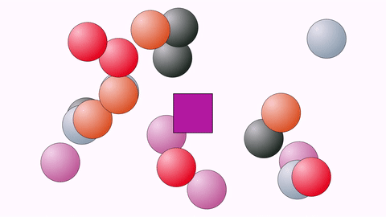
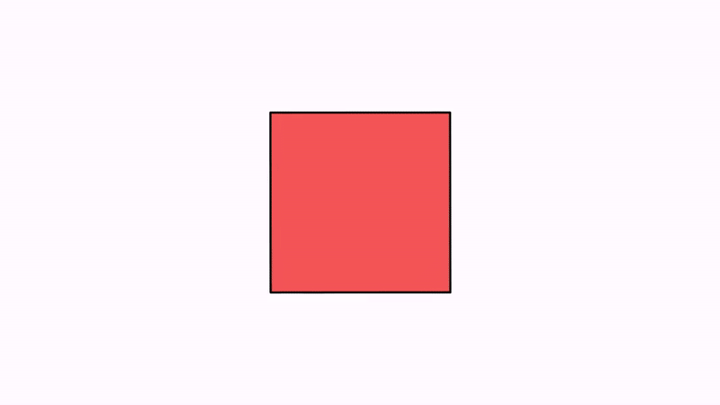
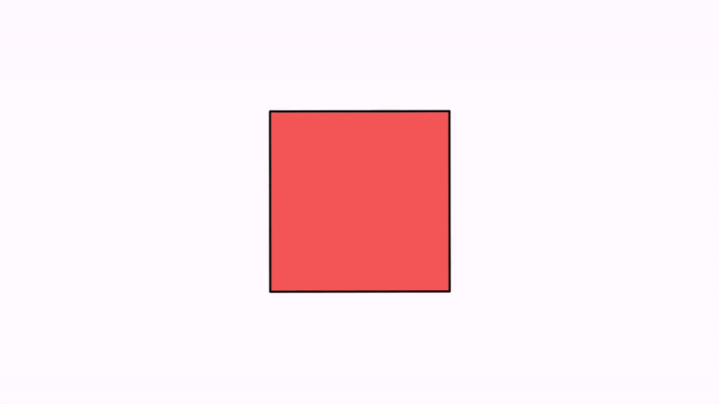
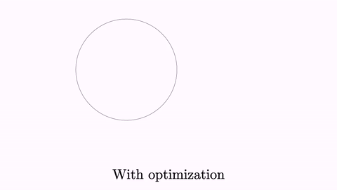
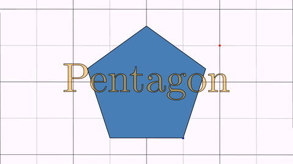

[home](https://davidgutierrezrubio.github.io/jmathanim/) [back](../index.html)

# Animations

So far, we’ve learned to draw basic objects, and put them in the position we desire. What about animations? Well, this is what this library is meant for. We have the `Animation` class that will store any kind of animation you can do to an object. Not only `MathObject` instances can be animated, but also the `Camera` object can be animated too.

An `Animation` object has 4 important methods that should be understood if you want to implement your own animations or playing it manually with the `advanceFrame()` method 

-   The `initialize(this)` method, which prepares the objects to be animated. It should be called immediately before the animation begins, that is, no modifications should be done to the objects between this method and the start of the animation. The only parameter it needs is the scene from where it is invoked, usually the own class, `this`.
-   The `processAnimation`this method computes the time depending on the frame rate, and calls the next method. If the animation is finished, return `true`.
-   The `doAnim(double t)` method. This method actually performs the animation. The parameter `t` ranges from 0 to 1 where 0 is the beginning and 1 is the end. This is not actually the time, but the percentage of animation done. Internally a second parameter computed is a "smoothed" version of the parameter `t`, where a smooth function is applied so that the animation starts and ends in a soft way, rather than with the lineal `t`.  The smooth function is defined as a lambda java function, that you can get or set with `getLambda` and `setLambda` methods. In the next chapter we will see other lambdas that you can use in your animations.

-   The `finishAnimation()` method, that should do all the needed cleanup and finishing jobs.

An `Animation` object can be played with the `playAnimation` method, which will handle all the necessary steps for you, but there is another way to play it in a more procedimental way. You can achieve the same effect with the following piece of code:

````java
Animation anim=<define here the animation>
anim.initialize(this);
while (!anim.processAnimation()) {
    advanceFrame();
}
````

is the same as

```java
Animation anim=<define here the animation>
playAnimation(anim);
```

Also, there is a convenience object created, `play`, which stores shortcuts for most used animations.

In general, parameters of all animations always follow the structure `(runTime, parameters, object_1,…​,object_n)`. The last part is a varargs `MathObject`, so that you can apply the animation to an arbitrary number of objects.

# Basic Animations


The basic transformations also have their animated versions. They are defined as static methods in the `Commands` class.

A gif (and its generating code) is worth a thousand words:

``` java
Shape sq=Shape.square().fillColor("#87556f").thickness(2);
//Animates a moving square, with 3 seconds of duration
Animation shiftAnim = Commands.shift(3, Vec.to(.75,-.5), sq);
playAnimation(shiftAnim);
waitSeconds(1);
```


We have performed a simple animation defining it in the variable `shiftAnim` and playing it with the `playAnimation` method.

This animation and many other have a shorter access through the `play` object. The following code produces the same result:

``` java
Shape sq=Shape.square().fillColor("#87556f").thickness(2);
play.shift(3, Vec.to(.75,-.5), sq);
waitSeconds(1);
```

## Moving, rotating, scaling
The `play` object is an instance of the `PlayAnim` class that holds several fast-access to most common animations.

You can replace the animation method with one of this list of basic transforms, in its easy-access version, to see how it works:

``` java
//Rotates the square arund its center, 45 degress, in 3s
play.rotate(3,45*DEGRESS,sq);

//Rotates the square around the origin 120
play.rotate(5,Point.at(0,0),120*DEGREES,sq);degress, in 5s

//Scales the square uniformly at 70%, around its center, in 3s
play.scale(3,.7,sq);

//Scales the square at 70% x, 150% y, around the origin, in 3s
play.scale(3,Point.at(0,0),.7,1.5,sq);
```

## Animating the camera

The `play` object has also most animations related to the view camera:

``` java
//Animates a camera pan for 4 seconds, with vector (1,-1)
play.cameraShift(4,1,-1);

//Zoom in the view 200%, in 3 seconds
play.cameraScale(3,.5);

//Zoom out the view 25%, in 3 seconds
play.cameraScale(3,4);

//Pan and zoom the camera so that the specified objects are visible, in 3 seconds
play.adjustToObjects(3,sq,circ,A,B);

//Pan and zoom the camera so that all objects in the scene are visible, in 3 seconds
play.adjustCameraToAllObjects(3);
```

Before adjusting the camera to objects, you can define the gaps used to leave space between the objects and the border of the screen, with the
`camera.setGaps(hGap,vGap)` method.

## Entering and exiting

Some method to add or remove objects to the scene are also included:

``` java
//Fade the object from 0 alpha to 1, and add the object to the scene, in 2 seconds
play.fadeIn(2,sq);

//Fade out the object to 1 alpha to 0, removing it from the scene, in 2 seconds
play.fadeOut(2,sq);

//Fade out all objects in the scene, in 2 seconds
play.fadeOutAll(2);

//Scales the object from 0 to 1, adding it to the scene
play.growIn(2,sq);

//The same, but it also applies a 30 degrees rotation
play.growIn(2,30*DEGREES,sq);

//The opposite, scales the object to 0 and removes it from the scene
play.shrinkOut(2,sq);

//The same but it also applies a 45 degrees rotation
play.shrinkOut(2,45*DEGREES,sq);

//Moves the object from outside (direction is specified in the enum Anchor.Type {LEFT, RIGHT, LOWER, UPPER})
play.moveIn(1,Anchor.Type.LEFT,sq);//Entering from the left

//Moves the object out of the scene
play.moveOut(1,Anchor.Type.LEFT,sq);//Exiting through the left
```

Most of this commands can be called omitting the runtime parameter, using the default time for each one. For example, calling
`play.fadeIn(sq)` will execute the `fadeIn` animation in 1 second, which is the value defined in the public variable `play.defaultRunTimefadeIn`.
You can change the values of these variables as you need. Here is a demo animation with its source code:

``` java
LaTeXMathObject text;
Shape sq = Shape.square().fillColor("#87556f").thickness(2).center();//
text = LaTeXMathObject.make("{\\tt play.fadeIn(sq)}").stackToScreen(Anchor.Type.LOWER, .1, .1);
add(text);
play.fadeIn(sq);
waitSeconds(1);
remove(text);
text = LaTeXMathObject.make("{\\tt play.scale(1,1.5,1,sq)}").stackToScreen(Anchor.Type.LOWER, .1, .1);
add(text);
play.scale(1,1.5,1,sq);
waitSeconds(1);
remove(text);
text = LaTeXMathObject.make("{\\tt play.shrinkOut(1,45*DEGREES, sq)}").stackToScreen(Anchor.Type.LOWER, .1, .1);
add(text);
play.shrinkOut(1,45*DEGREES, sq);
waitSeconds(1);
```


The use of the `play` object allows fast writing of simple animations, but if you need to fine tune some parameters, like the lambda time function, or add some effects, you will need to define it "the long way".

## Highlighting

These animations helps object to briefly get the attention of the person who is enjoying that beautiful animation you have created. 

* The `Commands.highlight`animation will scale back and forth the given objects the amount we define. The default value is 150%.
* The `Commands.twistAndScale` animation works in similar way than `highlight`, but adds a small twist movement, with a default angle of +/- 15 degrees.
* The `ContourHighlight` animation will draw a `snake`running over the contour a shape. The color and thickness can be changed (default: color red and thickness 10).

We see all of them with this example:

```java
Shape sq = Shape.square().center().scale(1);
Point importantPoint1 = sq.getPoint(1).drawColor("red");
LaTeXMathObject importantLabel1 = LaTeXMathObject.make("A").
    stackTo(importantPoint1, Anchor.Type.RIGHT, .1);

Point importantPoint2 = sq.getPoint(3).drawColor("blue");
LaTeXMathObject importantLabel2 = LaTeXMathObject.make("B").
    stackTo(importantPoint2, Anchor.Type.LEFT, .1);

add(sq,
    importantPoint1,
    importantLabel1,
    importantPoint2,
    importantLabel2
   );

play.highlight(importantLabel1);
play.twistAndScale(importantLabel2);
play.contourHighlight(sq);
waitSeconds(2);
```

Here is a GIF from the movie generated:


The `ContourHighlight` animation can be configured creating the object with its static constructor:

```java
Shape obj = Shape.circle();
add(obj);
ContourHighlight anim = ContourHighlight.make(2, obj);
anim.setColor("green");

//This parameter from 0 to 1 determines the max portion of shape to be drawed
//The default value of 4.
//A value of 1 will draw the whole shape and then undraw it.
anim.setAmplitude(.5);

//The thickness of the "snake"
anim.setThickness(15);

//The color of the "snake"
anim.setColor("violet");
playAnimation(anim);
waitSeconds(2);
```


## Stacking and aligning

The `stackTo` method also has an animated version. A variable number of objects can be animated at the same animation. In this case, the second object will be stacked to the first, and so on. To illustrate this, we create 4 arrays of circles with random colors and stack them to a central square:

```java
Shape[] circles1 = new Shape[5];
Shape[] circles2 = new Shape[5];
Shape[] circles3 = new Shape[5];
Shape[] circles4 = new Shape[5];
for (int n = 0; n < 5; n++) {
    //Creates a radial gradient with a random color
    JMRadialGradient gr = new JMRadialGradient(Point.at(.25, .75), .8).setRelativeToShape(true);
    JMColor col = (JMColor) JMColor.random();//Random color
    gr.add(0, (JMColor) col.interpolate(JMColor.WHITE, .75));//The random color, but brighter
    gr.add(1, col);
    
	//Base circle
    Shape s = Shape.circle().scale(.25).fillColor(gr).thickness(2);
    //Make 4 copies at random positions
    circles1[n] = s.copy().shift(Point.random().v);
    circles2[n] = s.copy().shift(Point.random().v);
    circles3[n] = s.copy().shift(Point.random().v);
    circles4[n] = s.copy().shift(Point.random().v);
    add(circles1[n],
        circles2[n],
        circles3[n],
        circles4[n]);
}
Shape center = Shape.square().center().scale(.5).fillColor(JMColor.random()).thickness(4);
add(center);
camera.adjustToAllObjects();
ShiftAnimation anim1 = Commands.stackTo(3, center, Anchor.Type.UPPER, 0, circles1);
ShiftAnimation anim2 = Commands.stackTo(3, center, Anchor.Type.LEFT, 0, circles2);
ShiftAnimation anim3 = Commands.stackTo(3, center, Anchor.Type.LOWER, 0, circles3);
ShiftAnimation anim4 = Commands.stackTo(3, center, Anchor.Type.RIGHT, 0, circles4);
playAnimation(anim1, anim2, anim3, anim4);
waitSeconds(5);
```




The same effect can be easily achieved using the `MathObjectGroup` class and the `setLayout` method.


The `Commands.align` animation works in a similar way than the method `Mathobject.align`

```java
LaTeXMathObject upper=LaTeXMathObject.make("upper");
LaTeXMathObject lower=LaTeXMathObject.make("lower");
LaTeXMathObject left=LaTeXMathObject.make("left");
LaTeXMathObject right=LaTeXMathObject.make("right");
LaTeXMathObject hcenter=LaTeXMathObject.make("hcenter");
LaTeXMathObject vcenter=LaTeXMathObject.make("vcenter");
Shape center = Shape.square().scale(3).fillColor("lightblue");
add(center);
camera.adjustToAllObjects();
ShiftAnimation anim1 = Commands.align(3, center, MathObject.Align.LEFT, left);
ShiftAnimation anim2 = Commands.align(3, center,  MathObject.Align.RIGHT, right);
ShiftAnimation anim3 = Commands.align(3, center,  MathObject.Align.UPPER, upper);
ShiftAnimation anim4 = Commands.align(3, center,  MathObject.Align.LOWER, lower);
ShiftAnimation anim5 = Commands.align(3, center, MathObject.Align.HCENTER, hcenter);
ShiftAnimation anim6 = Commands.align(3, center, MathObject.Align.VCENTER, vcenter);
playAnimation(anim1,anim2,anim3,anim4,anim5,anim6);
waitSeconds(5);
```


## Moving along a path

The `MoveAlongPath` animations move an object along a specified path. You can provide a `Shape` object or a `JMPath`objec to determine the path. The moved object will be located with the specified `Anchor` point.

In this example, we show 2 squares moving along  a circle:

```java
Shape c = Shape.circle().fillColor("orange").thickness(3);
Shape a = Shape.square().scale(.3).fillColor("darkblue").fillAlpha(.7);
Shape b = a.copy();
add(c, a, b);
Animation anim = new MoveAlongPath(5, c, a, Anchor.Type.UL);
Animation anim2 = new MoveAlongPath(5, c, b, Anchor.Type.DR);
playAnimation(anim, anim2);
waitSeconds(3);
```


You can try modifying the lambda function of each animation with the `setLambda` method to see what happens. For example, `anim.setLambda(x->x)` or `anim.setLambda(x->4*x*(1-x))`.  We will see use of lambdas in the next chapter.

# The ShowCreation animation

This animation draws the specified object and adds it to the scene. Depending on the object, several strategies (that is, several ways to actually create the object) are used, specified in the enum `ShowCreationStrategy`. Strategy is automatically chosen, but it can be overriden with the method `setStrategy`. 

Forcing a specified strategy may lead to errors in some cases, as some methods are designed for specific subclasses, like `Line` or `Arrow2D`.

Let’s show it with an example. We use the short version with the `play` object:

``` java
Shape sq=Shape.square().fillColor("#87556f").thickness(2).center();
play.showCreation(2,sq);//Creates sq in 2 seconds
//The other way to do this:
//ShowCreation sc=new ShowCreation(2, sq);
//playAnimation(sc);
waitSeconds(1);
```


In the case of a simple shape like this, the `SIMPLE_SHAPE_CREATION` strategy is used.

In case of `MultiShape` objects, which include `LaTeXMathObject` and `SVGObject`, the strategy `FIRST_DRAW_AND_THEN_FILL` is chosen, where, as its name
suggest, first draw the outline and then fill the shape.

``` java
LaTeXMathObject text=LaTeXMathObject.make("$a^2+b^2=c^2$").center().scale(3);
play.showCreation(text);
```


There are specific creation strategies for objects like axes, arrows or delimiters.

# The Transform animation

The `Transform` class animates a smooth transform from one `Shape` object to another.

``` java
Shape circle = Shape.circle().shift(-1, 0).scale(.5);
Shape pentagon = Shape.regularPolygon(5).shift(.5, -.5).style("solidblue");
play.transform(3, circle, pentagon);
waitSeconds(3);
```


Note that the `transform` animation also interpolates drawing parameters
as thickness and color.

> **WARNING**: After transforming object `A` into `B`, in some cases the transformed object becomes unusable. You should using `B` after that in a general case. In any case, `A` object is removed automatically from the scene.

## Transform strategies

The precise method of transform depends on the type of source and destination objects.  For example, in the previous case, a point-by-point interpolation was chosen. However, if both shapes are regular polygons with the same number of sides, an homothecy is chosen to transform. We will show another example, not using the "long" form given by the `play` object:

``` java
Shape pentagon = Shape.regularPolygon(5).thickness(3).scale(.5).shift(-1,-1);
Shape pentagonDst = Shape.regularPolygon(5).thickness(3).scale(.8).shift(.5,-.5).rotate(45*DEGREES);
Transform tr = new Transform(3, pentagon, pentagonDst);
playAnimation(tr);
waitSeconds(1);
```


While both methods may seem equal, the homothecy method ensures the object doesn’t get distorted in the way. If you want to force a concrete transform strategy, you can do it with the method `.setTransformMethod(method)` where method is a value of the enum `TransformMethod`.

> **WARNING**: Forcing a concrete transform strategy may leads to errors in some cases. In most cases, no animation will be done and a message will be added to the logs.

Currently, the following strategies are implemented:

1. `INTERPOLATE_SIMPLE_SHAPES_BY_POINT`, for 2 simple shapes, a point-by-point interpolation. A simple shape has only one connected component, like squares or circles.
2. `INTERPOLATE_POINT_BY_POINT`. A more general interpolation. The shape is converted in the so called canonical form. Applicable when the shapes have multiple componentes (for example the shape of a "B" letter has 3 components).
3. `HOMOTHECY_TRANSFORM` A homothecy is created to transform the original shape into the destiny. The homothecy is created so that the 2 first points of the origin shape transform into the 2 first points of the destiny shape.
4. `ROTATE_AND_SCALEXY_TRANSFORM` Similar to the homothecy, but scaling is not homogeneous. This animation is used to transform any rectangle into another one, to prevent distortions.
5. `FUNCTION_INTERPOLATION` The name says it! Used  to transform one function to another, interpolating x-to-x
6. `MULTISHAPE_TRANSFORM` For transforming Multishape objects (like LaTeXMathObject)
7. `GENERAL_AFFINE_TRANSFORM` Like HomothecyTransform, but admits a more general affine transform. The 3 first points of origin go to the 3 first points of destiny.
8. `ARROW_TRANSFORM` A specialized class that transforms arrows, delegating into a homothecy transform and properly handling arrow heads.

To see the difference between one type or another, consider this code, where we transform one square into a rotated rectangle, forcing a `GENERAL_AFFINE_TRANSFORM` method:

```java
Shape sq = Shape.square().center().style("solidorange");
Shape sq2 = Shape.square().scale(.25,1).style("solidorange").rotate(45 * DEGREES).moveTo(Point.at(1,0));
Transform tr = new Transform(10, sq, sq2);//10 seconds so that you can see the details
tr.setTransformMethod(Transform.TransformMethod.GENERAL_AFFINE_TRANSFORM);
playAnimation(tr);
waitSeconds(3);
```

We obtain the following animation:



Notice something strange? The transform is done, but the intermediate steps are not natural. That is because the intermediate figures are not rectangles. That's what the `ROTATE_AND_SCALEXY_TRANSFORM` was created for. Fortunately, the `Transform` class chooses the most appropriate transform so you don't have to worry. In this case, simply remove the line `tr.setTransformMethod(Transform.TransformMethod.GENERAL_AFFINE_TRANSFORM);` and JMathAnim will use the proper strategy:



## Transform optimizations

Apart from different transform strategies, this class also allows different previous-to-transform optimization strategies (well, right now it only has one), listed in the enum `OptimizeMethod`.

By default, a transform animations converts the n-th point of Shape A into the n-th point of Shape B. The `SIMPLE_CONNECTED_PATHS` optimization aligns the paths cycling the transformed object, so that the sum of the distances between points of A from the points of B is minimal, ensuring a cleaner point-to-point transform from A to B. The following code compares the same transformation with and without
optimization:

``` java
Shape circle = Shape.circle().scale(-1, 1).scale(.6).shift(-.5, .3);
Shape circle2 = circle.copy();
Shape square = Shape.square().shift(.5, 0).scale(.6).rotate(45*DEGREES);
add(LaTeXMathObject.make("With optimization").stackToScreen(Anchor.Type.LOWER, .1, .1));
Transform tr = new Transform(3, circle, square);
playAnimation(tr);
waitSeconds(1);
play.fadeOutAll();
add(LaTeXMathObject.make("Without optimization").stackToScreen(Anchor.Type.LOWER, .1, .1));
Transform tr2 = new Transform(3, circle2, square);
tr2.optimizePaths(false);
playAnimation(tr2);
waitSeconds(1);
play.fadeOutAll();
```



## Flip transforms

A simpler transform animation, which works on any `MathObject` instance is `FlipTransform`. This animation scales the first object to 0 horizontally or vertically (or both) and then scales the second object from 0 to 1, giving the effect of flipping. The flip can be `HORIZONTAL`, `VERTICAL` or `BOTH`.

```java
LaTeXMathObject text = LaTeXMathObject.make("JMathAnim");
FlipTransform.FlipType[] flips = new FlipTransform.FlipType[]{FlipTransform.FlipType.HORIZONTAL, FlipTransform.FlipType.VERTICAL, FlipTransform.FlipType.BOTH};

//The MultiShapeObject and all its subclasses implement the iterable interface,
//which allows to easily iterate over all the shapes this way:
for (Shape s : text) {
    s.center();//Center all the shape glyphs on the screen
}
camera.zoomToObjects(text);
Shape previous = null;
int index = 0;
for (Shape s : text) {
    if (previous != null) {
        playAnimation(new FlipTransform(2, flips[index], previous, s));
        index = (index + 1) % 3;
    }
    previous = s;
}
```


# Animating style changes

So far, we have seen how to animate the position or shape of an object. In the `Transform` animation, style of the transformed object changes smoothly to match the style of destiny too. There are a few animations related to the style of an object:

The `setColor` animation animates the colors of the objects to the specified. Draw color and fill color may be specified. If you do not wish to change one of them, you just set it to null. 

The `setStyle` performs in a similar way, but changes all drawing parameters to those stored in the given style.

Note that, at the current version, only draw and fill colors/gradients, and thickness are interpolated. At the end of the animation, all the destiny attributes like layer, dash style, etc are copied.

``` java
Shape circle = Shape.circle().thickness(8);
play.showCreation(circle);
waitSeconds(1);

//Animate the change of fill color to violet. Draw color is unaltered.
playAnimation(Commands.setColor(2, null, JMColor.parse("VIOLET"), circle));

waitSeconds(1);
//Animate change to style solidorange
playAnimation(Commands.setStyle(2, "solidorange", circle));

//Animate change of fill to a gradient and draw to a fixed color
JMRadialGradient gradient=new JMRadialGradient(Point.at(.25,.75),.5);
gradient.setRelativeToShape(true)
    .add(0, "white")
    .add(1,"brown");
playAnimation(Commands.setColor(2, JMColor.parse("STEELBLUE"),gradient,circle));
waitSeconds(3);
```

Will generate the following animation:


These methods have simplified fast-access versions in the object `play`:

```java
play.setColor(2, JMColor.parse("STEELBLUE"),gradient,circle);//Equivalent to the first playAnimation command in the previous code
play.setStyle(2, "solidorange", circle);//Equivalent to the second playAnimation command in the previous code
```

The `setMP` animations works in a more general way, where you directly interpolate with the values of a specified `MODrawProperties`. So, for example the following code will animate for 3 seconds a change of drawing properties of object A to math those of object B:

```java
playAnimation(Commands.setMP(3, B.getMp(), A));
```


# AffineTransform related animations

These animations are better explained with illustrative examples:
## Affine transform
The animation `Commands.affineTransform(double runtime, Point a, Point b, Point c, Point d, Point e, Point f, MathObject… objects)` is the animated version of the `createAffineTransformation` we saw in the chapter dedicated to transforming objects:

```java
//Create axes, color dark blue, in layer 1 so that they draw over the rest of the objects
Axes axes = new Axes();
axes.generatePrimaryXTicks(-2, 2, 1);
axes.generatePrimaryYTicks(-2, 2, 1);
add(axes);
axes.thickness(3).drawColor("darkblue").layer(1);

//Create a cartesian grid, a group of horizontal and vertical lines.
MathObjectGroup grid = new MathObjectGroup();
for (int i = -5; i < 5; i++) {
    grid.add(Line.XAxis().shift(0, .5 * i).thickness(i % 2 == 0 ? 3 : 1));
    grid.add(Line.YAxis().shift(.5 * i, 0).thickness(i % 2 == 0 ? 3 : 1));
}
//Creates a B glyph, center it, make it height 1
LaTeXMathObject c = LaTeXMathObject.make("B").center().setHeight(1).style("solidorange").fillAlpha(.5);
//Animate the creation of the grid and the B shape
play.showCreation(grid, c);
waitSeconds(1);
Point A = Point.at(0, 0).drawColor(JMColor.BLUE);
Point B = Point.at(1, 0).drawColor(JMColor.BLUE);
Point C = Point.at(0, 1).drawColor(JMColor.BLUE);
Point D = Point.at(0, .5).drawColor(JMColor.RED);
Point E = Point.at(1, 0).drawColor(JMColor.RED);
Point F = Point.at(1, 1).drawColor(JMColor.RED);
add(A, B, C, D, E, F);
Animation anim = Commands.affineTransform(3, A, B, C, D, E, F, grid, c);
playAnimation(anim);
waitSeconds(1);
```

Here you can see a GIF from the movie generated:


This animation, which works on any affine transform, simply interpolates element-to-element the identity matrix with the transformation matrix. For special cases of affine transforms like the next ones, JMathAnim internally uses other algorithms to generate a convenient interpolated state.

## Reflection
The animation `Commands.reflection(double runtime, Point A, Point B, MathObject… objects)` animates the reflection that maps point A into B. Note that the point A is also transformed, as it is an instance of a point of the shape.

```java
MathObjectGroup grid = new MathObjectGroup();
//Create a grid
for (int i = -15; i < 15; i++) {
    grid.add(Line.XAxis().shift(0, .5 * i).thickness(i % 2 == 0 ? 3 : 1));
    grid.add(Line.YAxis().shift(.5 * i, 0).thickness(i % 2 == 0 ? 3 : 1));
}

//A pentagon
Shape reg = Shape.regularPolygon(5)
    .center().thickness(5)
    .fillColor("steelblue");
//A text
MathObject text = LaTeXMathObject.make("Pentagon")
    .center().setHeight(.5)
    .style("solidorange").fillAlpha(.5)
    .layer(1);

//Origin and destination points to define the reflection
//Point A is (a copy of) the first point of the pentagon
Point A = reg.getPoint(0).drawColor(JMColor.BLUE).copy();
Point B = Point.at(1, .5).drawColor(JMColor.RED);

//Add everything to the scene
add(A, B, grid, text);
//Define the animation and play it!
Animation anim = Commands.reflection(3, A, B, reg, text,grid);
playAnimation(anim);
waitSeconds(2);
```



The animation `Commands.reflectionByAxis(double runtime, Point a, Point b, MathObject… objects)` animates the reflection given by the axis AB.

```java
Shape reg1 = Shape.regularPolygon(6).style("solidred").center();
Shape reg2 = reg1.copy().style("solidorange");
add(reg1, reg2);
camera.scale(2);
Point A=reg1.getPoint(1);
Point B=reg1.getPoint(2);
add(Line.make(A,B).dashStyle(MODrawProperties.DashStyle.DOTTED));
Animation anim = Commands.reflectionByAxis(3, A, B, reg2);
playAnimation(anim);
waitSeconds(2);
```


## Homothecies
The animation `Commands.homothecy(double runtime, Point a, Point b, Point c, Point d, MathObject... objects)` animates the only direct homothecy that maps A into C and B into D:

```java
Point A = Point.origin().drawColor(JMColor.BLUE);
Point B = Point.at(1, 0).drawColor(JMColor.BLUE);
Point C = Point.at(1, .2).drawColor(JMColor.RED);
Point D = Point.at(1.8, .6).drawColor(JMColor.RED);
add(A,B,C,D);
Shape triangle = Shape.polygon(A, B, Point.at(0, .5));
Animation anim=Commands.homothecy(3, A, B, C, D, triangle);
playAnimation(anim);
waitSeconds(3);
```


# Transforming math expressions

LaTeX math expressions  admit a specialized animation called `TransformMathExpression`which allows to fine tune a transformation between one `LaTeXMathObject` and another. We will see how it works in the math expressions chapter.

[home](https://davidgutierrezrubio.github.io/jmathanim/) [back](../index.html)