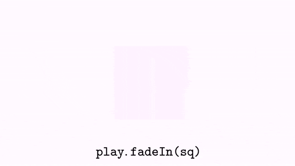
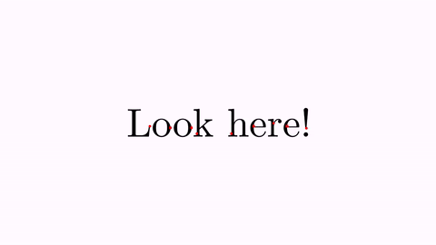
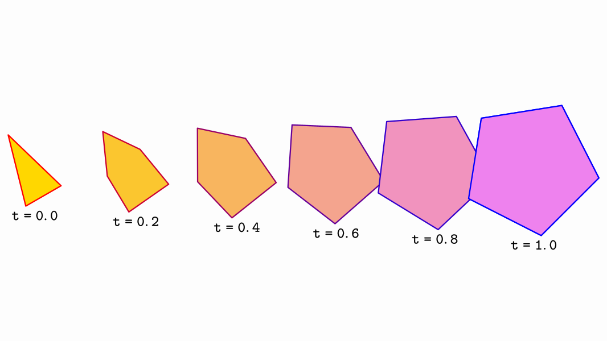

[home](https://davidgutierrezrubio.github.io/jmathanim/) [back](../index.html)

# Animations

So far, we’ve learned to draw basic objects and put them in the positions we desire. What about animations? Well, this is what this library is meant for. We have the `Animation` class that will store any kind of animation you can do to an object. Not only can `MathObject` instances be animated, but also the `Camera` object can be animated too.

An `Animation` object has 4 important methods that should be understood if you want to implement your own animations or play them manually with the `advanceFrame()` method.

-   The `initialize(this)` method prepares the objects to be animated. It should be called immediately before the animation begins, that is, no modifications should be made to the objects between this method and the start of the animation. The only parameter it needs is the scene from where it is invoked, usually the own class, `this`.
-   The `processAnimation` method computes the time depending on the frame rate, and calls the next method. If the animation is finished, return `true`.
-   The `doAnim(double t)` method. This method actually performs the animation. The parameter `t` ranges from 0 to 1 where 0 is the beginning and 1 is the end. This is not actually the time, but the percentage of animation done. Internally a second parameter computed is a "smoothed" version of the parameter `t`, where a smooth function is applied so that the animation starts and ends in a soft way, rather than with the lineal `t`.  The smooth function is defined as a lambda Java function, that you can get or set with the `getLambda` and `setLambda` methods. In the next chapter, we will see other lambdas that you can use in your animations.

-   The `finishAnimation()` method, which does all the needed cleanup and finishing jobs.

An `Animation` object can be played with the `playAnimation` method, which will handle all the necessary steps for you, but there is another way to play it in a more procedural way. You can achieve the same effect with the following piece of code:

````java
Animation anim=<define here the animation>
anim.initialize(this);
while (!anim.processAnimation()) {
    advanceFrame();
}
anim.finishAnimation();
````

is the same as

```java
Animation anim=<define here the animation>
playAnimation(anim);
```

Also, there is a convenience object created, `play`, which stores shortcuts for most commonly used animations.

In general, the parameters of all animations always follow the structure `(runTime, parameters, object_1,…​,object_n)`. The last part is a varargs `MathObject`, so that you can apply the animation to an arbitrary number of objects.

# Basic Animations


The basic transformations also have their own animated versions. They are defined as static methods in the `Commands` class.

A gif (and its generating code) is worth a thousand words:

``` java
Shape sq=Shape.square().fillColor("#87556f");
//Animates a moving square, with 3 seconds of duration
Animation shiftAnim = Commands.shift(3, Vec.to(.75,-.5), sq);
playAnimation(shiftAnim);
waitSeconds(1);
```


We have performed a simple animation by defining it in the variable `shiftAnim` and playing it with the `playAnimation` method.

This animation and many other have a shorter access through the `play` object. The following code produces the same result:

``` java
Shape sq=Shape.square().fillColor("#87556f");
play.shift(3, Vec.to(.75,-.5), sq);
waitSeconds(1);
```

## Moving, rotating, scaling
The `play` object is an instance of the `PlayAnim` class that holds several fast-access to most common animations.

You can replace the animation method with one of this list of basic transforms, in its easy-access version, to see how it works:

``` java
//Rotates the square arund its center, 45 degress, in 3s
play.rotate(3,45*DEGRESS,sq);

//Rotates the square around the origin 120
play.rotate(5,Point.at(0,0),120*DEGREES,sq);

//Scales the square uniformly at 70%, around its center, in 3s
play.scale(3,.7,sq);

//Scales the square at 70% x, 150% y, around the origin, in 3s
play.scale(3,Point.at(0,0),.7,1.5,sq);
```

## Animating the camera

The `play` object has also most animations related to the view camera:

``` java
//Animates a camera pan for 4 seconds, with vector (1,-1)
play.cameraShift(4,1,-1);

//Zoom in the view 200%, in 3 seconds
play.cameraScale(3,.5);

//Zoom out the view 25%, in 3 seconds
play.cameraScale(3,4);

//Pan and zoom the camera so that the specified objects are visible, in 3 seconds
play.adjustToObjects(3,sq,circ,A,B);

//Pan and zoom the camera so that all objects in the scene are visible, in 3 seconds
play.adjustCameraToAllObjects(3);
```

Before adjusting the camera to objects, you can define the gaps used to leave space between the objects and the border of the screen, with the
`camera.setGaps(hGap,vGap)` method.

## Entering and exiting

Some method to add or remove objects to the scene are also included:

``` java
//Fade the object from 0 alpha to 1, and add the object to the scene, in 2 seconds
play.fadeIn(2,sq);

//Fade out the object to 1 alpha to 0, removing it from the scene, in 2 seconds
play.fadeOut(2,sq);

//Fade out all objects in the scene, in 2 seconds
play.fadeOutAll(2);

//Scales the object from 0 to 1, adding it to the scene
play.growIn(2,sq);

//The same, but it also applies a 30 degrees rotation
play.growIn(2,30*DEGREES,sq);

//The opposite, scales the object to 0 and removes it from the scene
play.shrinkOut(2,sq);

//The same but it also applies a 45 degrees rotation
play.shrinkOut(2,45*DEGREES,sq);

//Moves the object from outside (direction is specified in the enum Anchor.Type {LEFT, RIGHT, LOWER, UPPER})
play.moveIn(1,Anchor.Type.LEFT,sq);//Entering from the left

//Moves the object out of the scene
play.moveOut(1,Anchor.Type.LEFT,sq);//Exiting through the left
```

Most of these commands can be called by omitting the runtime parameter and using the default time for each one.  For example, calling
`play.fadeIn(sq)` will execute the `fadeIn` animation in 1 second, which is the value defined in the public variable `play.defaultRunTimefadeIn`.
You can change the values of these variables as you need. Here is a demo animation with its source code:

``` java
Shape sq = Shape.square().fillColor("#87556f").center();
LatexMathObject text = LatexMathObject.make("{\\tt play.fadeIn(sq)}")
    .stack()
    .withGaps(.1)
    .toScreen(ScreenAnchor.LOWER);
add(text);
play.fadeIn(sq);
waitSeconds(1);
text.setLaTeX("{\\tt play.scale(1,1.5,1,sq)}");
play.scale(1, 1.5, 1, sq);
waitSeconds(1);
text.setLaTeX("{\\tt play.shrinkOut(1,45*DEGREES, sq)}");
play.shrinkOut(1, 45 * DEGREES, sq);
waitSeconds(1);
```




Using the `play` object allows you to quickly write simple animations, but if you need to fine-tune some parameters, such as the lambda time function, or add some effects, you will need to define it "the long way".

## Highlighting

These animations help objects to briefly attract the attention of users who enjoy the beautiful animation you have created. 

* The `Commands.highlight`animation will scale back and forth the given objects by the amount we define. The default value is 150%.
* The `Commands.twistAndScale` animation works in similar way than `highlight`, but adds a small twist movement, with a default angle of +/- 15 degrees.
* The `ContourHighlight` animation will draw a "snake" running over the contour a shape. The color and thickness can be changed (default: color red and thickness 10).

We see all of them with this example:

```java
Shape sq = Shape.square().center().scale(1);
Point importantPoint1 = sq.getPoint(1).drawColor("red");
LatexMathObject importantLabel1 = LatexMathObject.make("A")
    .stack()
    .withDestinyAnchor(AnchorType.RIGHT)
    .withGaps(.1)
    .toPoint(importantPoint1);


Point importantPoint2 = sq.getPoint(3).drawColor("blue");
LatexMathObject importantLabel2 = LatexMathObject.make("B")
    .stack()
    .withDestinyAnchor(AnchorType.LEFT)
    .withGaps(.1)
    .toPoint(importantPoint2);


add(sq,
    importantPoint1,
    importantLabel1,
    importantPoint2,
    importantLabel2
   );

play.highlight(importantLabel1);
play.twistAndScale(importantLabel2);
play.contourHighlight(sq);
waitSeconds(2);
```

Here is a GIF from the movie generated:


The `ContourHighlight` animation can be configured by creating the object with its static constructor:

```java
Shape obj = Shape.circle();
add(obj);
ContourHighlight anim = ContourHighlight.make(2, obj);

//This parameter from 0 to 1 determines the max portion of shape to be drawn
//The default value is 0.4.
//A value of 1 will draw the whole shape and then undraw it.
anim.setAmplitude(.85);

//The thickness of the "snake"
anim.setThickness(15);

//The color of the "snake"
anim.setColor("violet");

playAnimation(anim);
waitSeconds(2);
```


You can also make a contour highlight of the bounding box of an object, which can be more clear in some cases. Just use the `makeBBox` constructor:

```java
LatexMathObject obj = LatexMathObject.make("Look here!").center().scale(2);
add(obj);

//This animation is not very clear, because the shape is complex
ContourHighlight anim1=ContourHighlight.make(2, obj);
playAnimation(anim1);

//Using a bounding box is simpler. The .1 parameter is the desired gap to add to the box
ContourHighlight anim2 = ContourHighlight.makeBBox(2, .1, obj);
//You can also use the default make with a gap and a Rect object
//ContourHighlight anim2 = ContourHighlight.make(2, .1, obj.getBoundingBox());
anim2.setColor("green");
playAnimation(anim2);
waitSeconds(2);
```




You can pass `Point` objects (or the constructible version,` CTPoint`, which we will see in the next chapters), and a circle with a radius equal to its thickness will be drawn.

```java
Point P1 = Point.at(-.5, 0)
    .dotStyle(DotStyle.CROSS)
    .thickness(30)
    .drawColor("blue");
Point P2 = Point.at(0, 0)
    .dotStyle(DotStyle.TRIANGLE_UP_FILLED)
    .thickness(50)
    .drawColor("tomato");
Point P3 = Point.at(.5, 0)
    .dotStyle(DotStyle.CIRCLE)
    .thickness(30)
    .drawColor("black");
add(P1, P2, P3);

ContourHighlight anim1 = ContourHighlight.make(2, P1).setColor("gold");
ContourHighlight anim2 = ContourHighlight.make(2, P2).setColor("blue");
ContourHighlight anim3 = ContourHighlight.make(2, P3).setColor("green");
playAnimation(anim1, anim2, anim3);
scene.waitSeconds(1);
```


## Aligning

The `Commands.align` animation works in a similar way than the method `Mathobject.align`

```java
LatexMathObject upper=LatexMathObject.make("upper");
LatexMathObject lower=LatexMathObject.make("lower");
LatexMathObject left=LatexMathObject.make("left");
LatexMathObject right=LatexMathObject.make("right");
LatexMathObject hcenter=LatexMathObject.make("hcenter");
LatexMathObject vcenter=LatexMathObject.make("vcenter");
Shape center = Shape.square().scale(3).fillColor("lightblue");
add(center);
camera.adjustToAllObjects();
ShiftAnimation anim1 = Commands.align(3, center, MathObject.Align.LEFT, left);
ShiftAnimation anim2 = Commands.align(3, center,  MathObject.Align.RIGHT, right);
ShiftAnimation anim3 = Commands.align(3, center,  MathObject.Align.UPPER, upper);
ShiftAnimation anim4 = Commands.align(3, center,  MathObject.Align.LOWER, lower);
ShiftAnimation anim5 = Commands.align(3, center, MathObject.Align.HCENTER, hcenter);
ShiftAnimation anim6 = Commands.align(3, center, MathObject.Align.VCENTER, vcenter);
playAnimation(anim1,anim2,anim3,anim4,anim5,anim6);
waitSeconds(5);
```


## Moving along a path

`MoveAlongPath` animations move an object along a specified path. You can use a `Shape` object or a `JMPath` object to specify the path. The moved object will be at the specified anchor point. This animation takes 2 boolean parameters. The first determines whether an object should rotate by the angle given by the tangent of the path at its destination point. Second, it determines whether or not the animation should use a parameterised equation for the curve. A parameterised equation ensures that the motion is constant along the arc length of the path. For example, a parameterised value of t=0.3 ensures that the object will be at 30% of the total arc length. If this boolean flag is false, the standard Bézier parameterization is used.

In this example, we show 2 squares moving along a circle. The red square moves with constant velocity and the blue one with the standard parametrization of Bézier curves. In general, the standard parametrization of Bézier moves slower at sharp turns.

```java
Shape pathShape = Shape.circle().fillColor("orange");//A circle
pathShape.get(2).shift(1, 0);//Move its left point one unit to get a piece of tangerine
add(pathShape);
Shape squareToMove = Shape.square().scale(.1).fillColor("darkblue").fillAlpha(.4);
Shape squareToMove2 = squareToMove.copy().fillColor("darkred").fillAlpha(.4);
Animation anim = MoveAlongPath.make(5, pathShape, squareToMove, Anchor.Type.CENTER, true, true).setLambda(t -> t);
Animation anim2 = MoveAlongPath.make(5, pathShape, squareToMove2, Anchor.Type.CENTER, true, false).setLambda(t -> t);
playAnimation(anim,anim2);
```


Here we have specified the lambda parameters in the animations with the  `.setLambda(t->t)` methods in order to move with uniform velocity. We will see the use of lambdas in the next chapter.

Although a `FunctionGraph`is a subclass of a `Shape` and admits the `MoveAlongPath` animation, it is recommended to use the `PointOnFunctionGraph`object instead if you want to animate a `Point` along the graph.

# The ShowCreation animation

This animation draws the specified object and adds it to the scene. Depending on the object, several strategies (that is, several ways to actually create the object) are used, specified in the enum `ShowCreationStrategy`. Strategy is automatically chosen, but it can be overridden with the method `setStrategy`. 

Forcing a specified strategy may lead to errors in some cases, as some methods are designed for specific subclasses, like `Line` or `Arrow2D`.

Let’s show it with an example. We use the short version with the `play` object:

``` java
Shape sq=Shape.square().fillColor("#87556f").center();
play.showCreation(2,sq);//Creates sq in 2 seconds
//The other way to do this:
//ShowCreation sc= ShowCreation.make(2, sq);
//playAnimation(sc);
waitSeconds(1);
```


In the case of a simple shape like this, the `SIMPLE_SHAPE_CREATION` strategy is used.

Another example: This time, we will show the creation of an equation, which is a `MultiShapeObject`. Note that all shapes are not created at the same time, but a small delay is added:

``` java
LatexMathObject text=LatexMathObject.make("$a^2+b^2=c^2$").center().scale(3);
play.showCreation(2,text);
waitSeconds(1);
```


If you specify a longer time (10 seconds or so), you can see the details of the animation, first drawing the contour and then filling the glyphs.

There are specific creation strategies for objects like axes, arrows, or delimiters.

# The Transform animation

The `Transform` class animates a smooth transform from one `Shape` object to another.

``` java
Shape circle = Shape.circle().shift(-1, 0).scale(.5);
Shape pentagon = Shape.regularPolygon(5).shift(.5, -.5).style("solidblue");
play.transform(3, circle, pentagon);
waitSeconds(3);
```


Note that the `transform` animation also interpolates drawing parameters as thickness and color.

The general procedure when the transformation from A to B is complete is to delete A from the scene and add B, so you should be using B from now on.

With this code, you can see the intermediate steps, in this case, when we are transforming an isosceles triangle into a regular pentagon:

```java
@Override
public void setupSketch() {
    config.parseFile("#production.xml");// No screen preview, hd
    config.parseFile("#light.xml");//Light style, white background
}

public void runSketch() throws Exception {
    Shape triangle = Shape.regularPolygon(3)
        .scale(.5,1)
        .rotate(PI / 6)
        .drawColor("red")
        .fillColor("gold")
        .thickness(20);

    Shape pentagon = Shape.regularPolygon(5)
        .rotate(PI / 4)
        .drawColor("blue")
        .fillColor("violet")
        .thickness(20);

    //Stack the pentagon to the right of  the triangle, 5 units apart
    pentagon
        .stack()
        .withDestinyAnchor(AnchorType.RIGHT)
        .withGaps(5)
        .toObject(triangle);

    //Make sure everything is correctly centered at screen, adjusting the camera
    camera.adjustToObjects(triangle, pentagon);

    //Create an animation that transforms the triangle into the pentagon
    Transform anim = Transform.make(2, triangle, pentagon);

    //This makes sure that the animation has constant velocity
    anim.setLambda(t -> t);
    anim.initialize(this);
    int num = 6; //Number of intermediate steps to show
    for (int i = 0; i < num; i++) {
        double t = 1d * i / (num - 1);

        //Compute the animation at time t
        anim.doAnim(t);

        //The getIntermediateObject gives us the intermediate object used in the animation
        MathObject intermediate = anim.getIntermediateObject().copy();
        //Generate a descriptive text, located below the intermediate object
        LatexMathObject lat = LatexMathObject.make("{\\tt t=" + t + "}")
            .stack()
            .withDestinyAnchor(AnchorType.LOWER)
            .withRelativeGaps(0,.5)
            .toObject(intermediate);

        //Add both elements to the scene
        add(intermediate, lat);
    }

    //And save it to a png file
    saveImage("intermediateSteps.png");
}
```

Gives an image like this:



## Transform strategies

The precise method of transform depends on the type of source and destination objects. In the previous example, a point-by-point interpolation was used. However, if both shapes are regular polygons with the same number of sides, an isomorphic transform is chosen. We will show another example, not using the "long" form given by the `play` object:

``` java
Shape pentagon = Shape.regularPolygon(5)
    .scale(.5)
    .shift(-1,-1)
    .style("solidOrange");
Shape pentagonDst = Shape.regularPolygon(5)
    .scale(.8)
    .shift(.5,-.5)
    .rotate(45*DEGREES)
    .style("solidBlue");
Transform tr = Transform.make(3, pentagon, pentagonDst);
playAnimation(tr);
waitSeconds(1);
```


While both methods may seem equal, the isomorphic method ensures the object doesn’t get distorted in the way. If you want to force a concrete transform strategy, you can do it with the method `.setTransformMethod(method)` where method is a value of the enum `TransformMethod`.

> **WARNING**: Forcing a concrete transform strategy may leads to errors in some cases. In most cases, no animation will be done and a message will be added to the logs.

Currently, the following strategies are implemented:

1. `INTERPOLATE_SIMPLE_SHAPES_BY_POINT`, for 2 simple shapes, a point-by-point interpolation. A simple shape has only one connected component, like squares or circles. This method allows more flexibility for preoptimizing the paths to get a smoother animation.
2. `INTERPOLATE_POINT_BY_POINT`. A more general interpolation. The shape is converted in the so called canonical form. Applicable when the shapes have multiple components (for example the shape of a "B" letter has 3 components).
3. `ISOMORPHIC_TRANSFORM` A direct isomorphism is created to transform the original shape into the destiny shape. The isomorphism is created so that the 2 first points of the origin shape transform into the 2 first points of the destiny shape.
4. `ROTATE_AND_SCALEXY_TRANSFORM` Similar to isomorphism , but scaling is not homogeneous. This animation is used to transform any rectangle into another one, to prevent distortions.
5. `FUNCTION_INTERPOLATION` The name says it! Used  to transform one function to another, interpolating x-to-x
6. `MULTISHAPE_TRANSFORM` For transforming Multishape objects (like LatexMathObject)
7. `GENERAL_AFFINE_TRANSFORM` Like the isomorphic transform, but admits a more general affine transform. The 3 first points of origin go to the 3 first points of destiny.
8. `ARROW_TRANSFORM` A specialized class that transforms arrows, delegating into a isomorphic transform and properly handling arrow heads.

To see the difference between one type or another, consider this code, where we transform one square into a rotated rectangle, forcing a `GENERAL_AFFINE_TRANSFORM` method:

```java
Shape sq = Shape.square().center().style("solidRed");
Shape sq2 = Shape.square().scale(.25,1).style("solidGreen").rotate(45 * DEGREES).moveTo(Point.at(1,0));
Transform tr = Transform.make(10, sq, sq2);//10 seconds so that you can see the details
tr.setTransformMethod(Transform.TransformMethod.GENERAL_AFFINE_TRANSFORM);
playAnimation(tr);
waitSeconds(3);
```

We obtain the following animation:


Notice anything strange? The transform is done, but the intermediate steps are not natural. That is because the intermediate figures are not rectangles. That's what the `ROTATE_AND_SCALEXY_TRANSFORM` was created for. Fortunately, the `Transform` class chooses the most appropriate transform, so you don't have to worry. In this case, simply remove the line `tr.setTransformMethod(Transform.TransformMethod.GENERAL_AFFINE_TRANSFORM);` and JMathAnim will use the proper strategy:


## Flip transforms

A simpler transform animation which works on any `MathObject` instance is `FlipTransform`. This animation scales the first object to 0 horizontally or vertically (or both) and then scales the second object from 0 to 1, giving the effect of flipping. The flip can be `HORIZONTAL`, `VERTICAL` or `BOTH`.

```java
LatexMathObject text = LatexMathObject.make("JMathAnim");
OrientationType[] flips = new OrientationType[]{OrientationType.HORIZONTAL, OrientationType.VERTICAL, OrientationType.BOTH};

//The MultiShapeObject and all its subclasses implement the iterable interface,
//which allows to easily iterate over all the shapes this way:
for (LatexShape s : text) {
    s.center();//Center all the shape glyphs on the screen
}
camera.zoomToObjects(text);
LatexShape previous = null;
int index = 0;
for (LatexShape s : text) {
    if (previous != null) {
        FlipTransform flipTransform = FlipTransform.make(2, flips[index], previous, s);
        playAnimation(flipTransform);
        index = (index + 1) % 3;
    }
    previous = s;
}
```


# Animating style changes

So far, we have seen how to animate the position or shape of an object. In the `Transform` animation, style of the transformed object changes smoothly to match the style of destiny too. There are a few animations related to the style of an object:

The `setColor` animation animates the colors of the objects to the specified. Draw color and fill color may be specified. If you do not wish to change one of them, you just set it to null. 

The `setStyle` performs in a similar way, but changes all drawing parameters to those stored in the given style.

Note that, at the current version, only draw and fill colors/gradients, and thickness are interpolated. At the end of the animation, all the destiny attributes like layer, dash style, etc are copied.

``` java
Shape circle = Shape.circle().thickness(8);
play.showCreation(circle);
waitSeconds(1);

//Animate the change of fill color to violet. Draw color is unaltered.
playAnimation(Commands.setColor(2, null, JMColor.parse("VIOLET"), circle));

waitSeconds(1);
//Animate change to style solidorange
playAnimation(Commands.setStyle(2, "solidorange", circle));

//Animate change of fill to a gradient and draw to a fixed color
JMRadialGradient gradient = JMRadialGradient.make(Vec.to(.25,.75),.5);
gradient.setRelativeToShape(true)
    .add(0, "white")
    .add(1,"brown");
playAnimation(Commands.setColor(2, JMColor.parse("STEELBLUE"),gradient,circle));
waitSeconds(3);
```

Will generate the following animation:


These methods have simplified fast-access versions in the object `play`:

```java
play.setColor(2, JMColor.parse("STEELBLUE"),gradient,circle);//Equivalent to the first playAnimation command in the previous code
play.setStyle(2, "solidorange", circle);//Equivalent to the second playAnimation command in the previous code
```

The `setMP` animations works in a more general way, where you directly interpolate with the values of a specified `MODrawProperties`. So, for example the following code will animate for 3 seconds a change of drawing properties of object A to math those of object B:

```java
playAnimation(Commands.setMP(3, B.getMp(), A));
```


# AffineTransform related animations

These animations are better explained with illustrative examples:
## Affine transform
The animation `Commands.affineTransform(double runtime, Point a, Point b, Point c, Point d, Point e, Point f, MathObject… objects)` is the animated version of the `createAffineTransformation` we saw in the chapter dedicated to transforming objects:

```java
//Create axes, color dark blue, in layer 1 so that they draw over the rest of the objects
Axes axes = Axes.make();
axes.generatePrimaryXTicks(-2, 2, 1);
axes.generatePrimaryYTicks(-2, 2, 1);
add(axes);
axes.thickness(6).drawColor("darkblue").layer(1);

//Create a cartesian grid, a group of horizontal and vertical lines.
//We do not use the CartesianGrid class as its elements cannot be transformed
MathObjectGroup grid = MathObjectGroup.make();
for (int i = -5; i < 5; i++) {
    grid.add(Line.XAxis().shift(0, .5 * i).thickness(i % 2 == 0 ? 4 : 2));
    grid.add(Line.YAxis().shift(.5 * i, 0).thickness(i % 2 == 0 ? 4 : 2));
}
//Creates a B glyph, center it, make it height 1
LatexMathObject bigB = LatexMathObject.make("B").center().setHeight(1).style("solidorange").fillAlpha(.5);
//Animate the creation of the grid and the B shape
play.showCreation(grid, bigB);
waitSeconds(1);
Point A = Point.at(0, 0).drawColor(JMColor.BLUE);
Point B = Point.at(1, 0).drawColor(JMColor.BLUE);
Point C = Point.at(0, 1).drawColor(JMColor.BLUE);
Point D = Point.at(0, .5).drawColor(JMColor.RED);
Point E = Point.at(1, 0).drawColor(JMColor.RED);
Point F = Point.at(1, 1).drawColor(JMColor.RED);
add(A, B, C, D, E, F);
Animation anim = Commands.affineTransform(3, A, B, C, D, E, F, grid, bigB);
playAnimation(anim);
waitSeconds(1);
```

Here you can see a GIF from the movie generated:


This animation, which works on any affine transform, simply interpolates element-to-element the identity matrix with the transformation matrix. For special cases of affine transforms like the next ones, JMathAnim internally uses other algorithms to generate a convenient interpolated state.

## Reflection
The animation `Commands.reflection(double runtime, Point A, Point B, MathObject… objects)` animates the reflection that maps point A into B. Note that the point A is also transformed, as it is an instance of a point of the shape.

```java
MathObjectGroup grid = MathObjectGroup.make();
//Create a grid
for (int i = -15; i < 15; i++) {
    grid.add(Line.XAxis().shift(0, .5 * i).thickness(i % 2 == 0 ? 4 : 2));
    grid.add(Line.YAxis().shift(.5 * i, 0).thickness(i % 2 == 0 ? 4 : 2));
}

//A pentagon
Shape reg = Shape.regularPolygon(5)
    .center()
    .fillColor("steelblue");
//A text
MathObject text = LatexMathObject.make("Pentagon")
    .center().setHeight(.5)
    .style("solidorange").fillAlpha(.5)
    .layer(1);

//Origin and destination points to define the reflection
//Point A is (a copy of) the first point of the pentagon
Point A = reg.getPoint(0).drawColor(JMColor.BLUE).copy();
Point B = Point.at(1, .5).drawColor(JMColor.RED);

//Add everything to the scene
add(A, B, grid, text);
//Define the animation and play it!
Animation anim = Commands.reflection(3, A, B, reg, text,grid);
playAnimation(anim);
waitSeconds(2);
```


The animation `Commands.reflectionByAxis(double runtime, Point a, Point b, MathObject… objects)` animates the reflection given by the axis AB.

```java
Shape reg1 = Shape.regularPolygon(6).style("solidred").center();
Shape reg2 = reg1.copy().style("solidorange");
add(reg1, reg2);
camera.scale(2);
Point A=reg1.getPoint(1);
Point B=reg1.getPoint(2);
add(Line.make(A,B).dashStyle(MODrawProperties.DashStyle.DOTTED));
Animation anim = Commands.reflectionByAxis(3, A, B, reg2);
playAnimation(anim);
waitSeconds(2);
```


## Isomorphism
The animation `Commands.isomorphism(double runtime, Point a, Point b, Point c, Point d, MathObject... objects)` animates the only direct isomorphism that maps A into C and B into D:

```java
Point A = Point.origin().drawColor(JMColor.BLUE);
Point B = Point.at(1, 0).drawColor(JMColor.BLUE);
Point C = Point.at(1, .2).drawColor(JMColor.RED);
Point D = Point.at(1.8, .6).drawColor(JMColor.RED);
Shape triangle = Shape.polygon(A.copy(), B.copy(), Point.at(0, .5));
triangle.style("solidblue");
add(triangle, A, B, C, D);
Animation anim = Commands.isomorphism(3, A, B, C, D, triangle);
playAnimation(anim);
waitSeconds(3);
```


Internally, JMathAnim creates the isomorphism as a composition of shifting, rotating, and uniform scaling, so the precise form of the shapes is unaltered (except size).

Since version 0.9.9, the other isomorphism (the inverse one, which includes a reflection) can be animated too. Simply replace in the previous code the animation with:

```java
Animation anim = Commands.inverseIsomorphism(3, A, B, C, D, triangle);
```


# TwistTransform
Until now, the animations presented have sought to generate intermediate steps that are as natural as possible to transform object A into object B. The problem arises when you want to convert one object into another while respecting the measurements of the objects. For example, consider the classic problem of rectifying an arc of a circle. If we want to animate the process, it is natural that the total length of the arc should not vary as it is transformed into a straight segment. This cannot be achieved using point-to-point interpolation between the figures. That is why the TwistTransform animation was created.

This animation, available from version 0.9.12, is designed to create a "realistic transform" of a `Shape` object `A` onto another `Shape` object `B`. Some limitations apply:
* Both `A` and `B` must be shapes with straight segments.

* They must have the same number of vertices

* `A`or `B` must be open paths (more specifically, `A` and `B` can be closed, but the animation that is generated does not guarantee that the intermediate steps will show a closed figure).

* Vertices from `A` and `B` must be properly "aligned" in the sense that first vertex of `A` will go to first vertex of `B`, etc.


First, let's look at a simple example. We are going to convert a square into a segment. To do this, we will create a segment that has 5 points (the square will contain 5 points when opened) and the same measurements as the sides of the square. Point 0 of the segment and the square are located at the origin.
```java
Shape sq=Shape.square().drawColor("steelblue");
Shape seg=Shape.segment(Point.at(0,0),Point.at(4,0),5)
		.drawColor("firebrick");

camera.centerAtObjects(sq, seg);
camera.adjustToObjects(sq,seg);

//Twist transform, 5 seconds, from sq to sqe, using point 0 as pivot point
TwistTransform tr=TwistTransform.make(5,sq,seg,0);
playAnimation(tr);
```

We will obtain an animation where a square unfolds into a segment. Lengths of sides are preserved.


The last parameter of the animation, pivot point, is important, and choosing one or the other results in different effects.
The animation consists of the following actions:

* A shift animation is performed from the pivotal point of the source figure to the destination figure. In the case of the example, point 0 (lower left corner of the cube and left point of the segment, both in the same position).
* The angles formed by the segments from the pivot point are progressively modified to match the angles of the destination figure. If lengths differ, each segment will be progressively adjust it size to the corresponding destiny segment.
* The same is done with the segments before the pivot point.

You can create a `TwistTransform` without specifying the pivotal point parameter, in which case an approximation of the midpoint `size()/2` will be used.

All these 3 processes can be controlled exhaustively using lambdas. An example of this is shown in next section.

Here is another example, where a semicircle is rectified. Note that the semicircle in this case is not formed by Bézier curves, but is a polygonal approximation generated with enough points to make it look curved (50 points).

```java
Shape semiCirc = Shape.arc(PI, 50);//Semicircunference with 50 points
PathUtils.rectifyPath(semiCirc.getPath());//Delete all curvature

//Note the segment goes from (0,0) to (-PI,0)
//That is so first point of segment is in the right side, as the arc
//If you use (PI,0) instead, the arc will "turn around" to match ending points
Shape seg = Shape.segment(Point.at(0, 0), Point.at(-PI, 0), 50)
    .drawColor("firebrick");

//Put the segment under the arc, slightly apart
seg.stackTo(semiCirc, Anchor.Type.LOWER, .25);

camera.centerAtObjects(semiCirc, seg);
camera.adjustToObjects(semiCirc, seg);

TwistTransform tr = TwistTransform.make(5, semiCirc, seg);
playAnimation(tr);
```

We obtain the following animation:


# Transforming math expressions

LaTeX math expressions  admit a specialized animation called `TransformMathExpression` which allows to fine tune a transformation between one `LatexMathObject` and another. We will see how it works in the math expressions chapter.
[home](https://davidgutierrezrubio.github.io/jmathanim/) [back](../index.html)