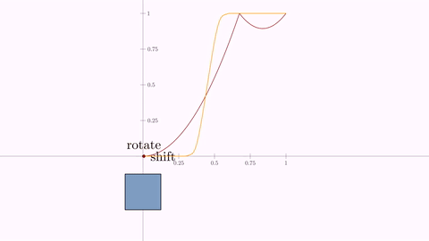
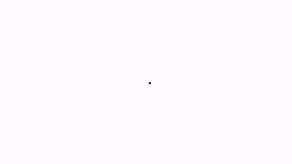

[home](https://davidgutierrezrubio.github.io/jmathanim/) [back](../index.html)


# Combining animations
Suppose you want a square to perform a shift and rotation at the same time. The first approach may be to play at the same this animations. However if you try with a code like this:

```java
Shape sq = Shape.square().fillColor("seagreen").thickness(3).center();
Animation shift = Commands.shift(5, 1, 0, sq);
Animation rotate = Commands.rotate(5, PI/2, sq);
playAnimation(shift, rotate);
waitSeconds(3);
```

You'll obtain a square rotating, but not shifting at all. The reason is that each animation saves the state of the object in the `initialize` method and restore it at each call of `doAnim` where the changes are done. So, the restore state call of the `rotate` animation erases the changes made by the `shift` animation. The solution is quite simple, as every animation has the method `.setUseObjectState` that activates or deactivates the saving and restoring of states. In this case, as the `rotate` animation is executed each frame after the `shift`, we let this one to manage states, and deactivates it for the `rotate` animation.

```java
Shape sq = Shape.square().fillColor("seagreen").thickness(3).center();
Animation shift = Commands.shift(5, 1, 0, sq);
Animation rotate = Commands.rotate(5, -PI/2, sq).setUseObjectState(false);
playAnimation(shift, rotate);
waitSeconds(3);
```

Now the square properly shifts and rotates:


# Adding effects to animations

Several animations inherit from a subclass called `AnimationWithEffects`that allows to apply certain effects. Currently, those animations are `Transform`, `FlipTransform`, `TransformMathExpression`, `shift`,  `stackTo`, `align`, `moveIn`, `moveOut` and `setLayout`.  We saw how to apply these effects in the `TransformMathExpression` animations in the math formulas chapter.

## The jump effect

The `.setJumpHeight(double height)` adds a jump effect to the object(s) being shifted. The direction of the jump is the shift vector rotated 90 degrees clockwise. A negative height can be specified. We show an example adding a jump effect to a FlipTransform animation:

```java
Shape hexagon = Shape.regularPolygon(6)
    .scale(.25)
    .moveTo(Point.relAt(.25, .5))
    .fillColor("steelblue").thickness(3);
Shape triangle = Shape.regularPolygon(3)
    .scale(.5)
    .moveTo(Point.relAt(.75, .5))
    .fillColor("orange").thickness(3);
FlipTransform anim = new FlipTransform(5, FlipTransform.FlipType.HORIZONTAL, hexagon, triangle);
anim.addJumpEffect(.5); //adds a jump effect
playAnimation(anim);
```


By default, the trajectory is a parabola (except in the `TransformMathExpression` which is semicircular). You can specify other jump types adding a second parameter to the `addJumpEffect` method, defined in the `AnimationEffect.JumpType` enum.

```java
anim.addJumpEffect(.5,AnimationEffect.JumpType.CRANE);//A crane effect, with height .5
anim.addJumpEffect(.5,AnimationEffect.JumpType.ELLIPTICAL); //Elliptical path, with height .5
anim.addJumpEffect(.5,AnimationEffect.JumpType.PARABOLICAL); //Parabolical path, with height .5
anim.addJumpEffect(.5,AnimationEffect.JumpType.SEMICIRCLE); //A semicircular path (the height is ignored, except for the sign)
anim.addJumpEffect(.5,AnimationEffect.JumpType.SINUSOIDAL); //A path with a sinusoidal shape, from 0 to PI, and height .5
anim.addJumpEffect(.5,AnimationEffect.JumpType.SINUSOIDAL2); //A path with a sinusoidal shape, from 0 to 2*PI, and height .5
anim.addJumpEffect(.5,AnimationEffect.JumpType.TRIANGULAR); //A path resembling a triangular roof, with height .5
```

Here you can see the different paths:


## The scale effect

The `.setScaleEffect(double scale)` adds a back and forth scale effect:

```java
Shape pol = Shape.regularPolygon(6).scale(.25).center().fillColor("steelblue").thickness(3);
ShiftAnimation anim = Commands.shift(3, 1,0, pol);//shifts pol with vector (1,0)
anim.addScaleEffect(2); //adds a scale effect
playAnimation(anim);
```


## The alpha scale effect

The `.setAlphaScaleEffect(double alphaScale)` adds a back and forth alpha effect:

```java
Shape pol = Shape.regularPolygon(6).scale(.25).center().fillColor("steelblue").thickness(3);
ShiftAnimation anim = Commands.shift(5, 1, 0, pol);//shifts pol with vector (1,0)
anim.addAlphaScaleEffect(.2);
playAnimation(anim);
```


## The rotation effect

The `.setRotateEffect(int numTurns)` adds a rotation, making the specified number of turns.

```java
Shape pol = Shape.regularPolygon(6).scale(.25).center().fillColor("steelblue").thickness(3);
ShiftAnimation anim = Commands.shift(3, 1,0, pol);//shifts pol with vector (1,0)
anim.addRotationEffect(-1); //Make a complete turn clockwise
playAnimation(anim);
```


And, in case you are wondering, yes, these effects can be nested:

```java
Shape square = Shape.square()
    .scale(.25)
    .moveTo(Point.relAt(.25, .5))
    .fillColor("steelblue").thickness(3);
Shape circle = Shape.circle()
    .scale(.25)
    .moveTo(Point.relAt(.75, .5))
    .fillColor("firebrick").thickness(3);
Transform anim = new Transform(5, square, circle);
anim.addRotationEffect(1)
    .addScaleEffect(.5)
    .addJumpEffect(.5, AnimationEffect.JumpType.FOLIUM);
playAnimation(anim);
waitSeconds(3);
```


# Effects in shift animations

The shifting-type animations (`shift`,  `stackTo`, `align`, `moveIn`, `moveOut` and `setLayout`)  all inherit from the `ShiftAnimation`class. These methods allows additional effects:

## Rotation by any angle

Apart from the `.addRotationEffect` you can also use the method `.addRotationEffectByAngle` to specify an arbitrary rotation angle. However, keep in mind that animations like `setLayout` or `stackTo` compute the shifting vectors without taking into account this.

## Setting animations for individual objects

All methods to add effects have overloaded methods in the  `ShiftAnimation` class where you can set an effect for a particular object added to the animation. For example, let's suppose we have a MathObjectGroup with 10 squares and want to shift them, each one with a different rotation angle. We can accomplish this by creating 10 individual shift animations and setting the rotation angle effect for each one, but we can achieve the same effect with a single animation:

```java
MathObjectGroup squares = MathObjectGroup.make();
for (int n = 0; n < 10; n++) {
    squares.add(Shape.square().scale(.1).thickness(3).fillColor(JMColor.random()));
}
squares.setLayout(MathObjectGroup.Layout.RIGHT,.1).center();

//Note that in the animation we pass squares.toArray() instead of squares. This way we are passing the
//10 squares instead of a single object
ShiftAnimation anim=Commands.shift(5, 0,-1, squares.toArray());
for (int n = 0; n < 10; n++) {
    anim.addRotationEffectByAngle(squares.get(n),PI*n/9);//Sets different rotation angles for each object
}
playAnimation(anim);
waitSeconds(2);
```


## The delay effect

This effect can be applied to shifting-type animations when several objects are animated. Instead of moving all object at the same time, a delay is applied creating the effect of a queue of moving objects. For example, let's create a simple animation that changes the layout of a group of squares, leaving commented the line that adds the delay effect:

```java
MathObjectGroup smallSquaresGroup = MathObjectGroup.make();
for (int n = 0; n < 10; n++) {
    smallSquaresGroup.add(Shape.square().scale(.1).thickness(3).fillColor(JMColor.random()));
}
Shape centralSquare = Shape.square().scale(.25).stackToScreen(Anchor.Type.LOWER, .1, .1);
smallSquaresGroup.setLayout(centralSquare, MathObjectGroup.Layout.LEFT, 0);
add(smallSquaresGroup,centralSquare);
waitSeconds(1);
ShiftAnimation anim = Commands.setLayout(5, centralSquare, MathObjectGroup.Layout.UPPER, 0, smallSquaresGroup);
//anim.addDelayEffect(.5);
playAnimation(anim);
```

Generates the following animation:


Note that all squares begin and end their paths at the same time.

Now if we uncomment the method `anim.addDelayEffect(.5)` we have this:


When applying a delay effect with a parameter 0<t<1, each individual animation runtime is reduced by the factor 1-t and distributed evenly over the total runtime of the animation. Thus, for example an `addDelayEffect(.3)` will reduce all single animations to the 70% of the total runtime.

If you change the parameter .5 to .75, with `anim.addDelayEffect(.75)`  the animation produced looks like that:


## Delay effect in AnimationGroup

Since version 0.9.3-SNAPSHOT, the delay effect is also implemented in the `AnimationGroup`:

```java
@Override
public void setupSketch() {
    config.parseFile("#production.xml");
    config.parseFile("#light.xml");
}

@Override
public void runSketch() throws Exception {
    double runtime = 3;
    Shape box = Shape.square().scale(1.5, 1).center().style("solidgreen");

    Delimiter delWidth = Delimiter.make(box.getBoundingBox().getUR(), box.getBoundingBox().getDR(), Delimiter.Type.BRACE, .1);
    LaTeXMathObject textWidth = LaTeXMathObject.make("height").stackTo(delWidth, Anchor.Type.RIGHT, .1);

    Delimiter delHeight = Delimiter.make(box.getBoundingBox().getDR(), box.getBoundingBox().getDL(), Delimiter.Type.BRACE, .1);
    LaTeXMathObject textHeight = LaTeXMathObject.make("width").stackTo(delHeight, Anchor.Type.LOWER, .1);

    AnimationGroup ag = AnimationGroup.make(
        Commands.growIn(runtime, box),
        AnimationGroup.make(//Note that we include this in its own group so that they are animated at the same time
            new ShowCreation(runtime, delWidth),
            new ShowCreation(runtime, textWidth),
            new ShowCreation(runtime, delHeight),
            new ShowCreation(runtime, textHeight))
    );

    playAnimation(ag.addDelayEffect(.25));
    waitSeconds(3);
}
```


# Creating complex animations

There are special subclasses of `Animation`that allows to build more complex animations using previously defined ones.

## The wait animation

This `WaitAnimation` does what it says. It simply waits for specified amount of time. Sounds exciting right? This is used for example in the `ShowCreation` animation when applied to a `LaTexMathObject`, where each shape must wait a certain time, to make the left-to-right appear illusion.

## The concatenate animation

The `Concatenate`class allows to play animations in sequence

```java
Shape sq = Shape.square().fillColor("seagreen").thickness(3).center();
Animation shift = Commands.shift(2, 1, 0, sq);
Animation rotate = Commands.rotate(2, -PI/2, sq);
Concatenate c=new Concatenate(shift,rotate);
playAnimation(c);
waitSeconds(1);
```


## The AnimationGroup animation

The `AnimationGroup` plays all the animations at the same. It finishes when the last one has ended. The example of the combined shift and rotate can be written as

```java
Shape sq = Shape.square().fillColor("seagreen").thickness(3).center();
Animation shift = Commands.shift(5, 1, 0, sq);
Animation rotate = Commands.rotate(5, -PI/2, sq).setUseObjectState(false);
AnimationGroup ag=new AnimationGroup(shift,rotate);
playAnimation(ag);
waitSeconds(3);
```

# Controlling the animations with lambda functions

Each animation has a lambda object that represents a function from [0,1] to [0,1]. This function takes the parameter t in the `doAnim(double t)` method and computes a new time value to apply the animation. The primary reason for this is to prevent the animations to perform in a linear way, without a smooth beginning or ending, but they can be used for many more effects.

The class `UsefulLambdas`, as its name suggests, holds several static methods that returns different lambdas to obtain different effects to your animations. For example, the following code will draw the graphs (with time in x-axis) of the differente lambdas defined:

```java
@Override
public void setupSketch() {
	config.parseFile("#preview.xml");
	config.parseFile("#light.xml");
}

@Override
public void runSketch() {
    MathObjectGroup functions = MathObjectGroup.make(
        drawGraphFor(UsefulLambdas.smooth(), "{\\tt smooth()}"),
        drawGraphFor(UsefulLambdas.smooth(.25d), "{\\tt smooth(.25d)}"),
        drawGraphFor(UsefulLambdas.allocateTo(.25, .75), "{\\tt allocate(.25,.75)}"),
        drawGraphFor(UsefulLambdas.reverse(), "{\\tt reverse()}"),
        drawGraphFor(UsefulLambdas.bounce1(), "{\\tt bounce1()}"),
        drawGraphFor(UsefulLambdas.bounce2(), "{\\tt bounce2()}"),
        drawGraphFor(UsefulLambdas.backAndForthBounce1(), "{\\tt backAndForthBounce1()}"),
        drawGraphFor(UsefulLambdas.backAndForthBounce2(), "{\\tt backAndForthBounce2()}")
    );
    functions.setLayout(new BoxLayout(Point.origin(), 4, AbstractBoxLayout.Direction.RIGHT_DOWN, .25, .25));
    add(functions);
    camera.zoomToAllObjects();
    waitSeconds(3);
}

private MathObjectGroup drawGraphFor(DoubleUnaryOperator lambda, String name) {
    MathObjectGroup resul = MathObjectGroup.make();
    FunctionGraph fg = new FunctionGraph(lambda, 0, 1).thickness(3).drawColor("darkblue");
    LaTeXMathObject text = LaTeXMathObject.make(name).scale(.5).stackTo(fg, Anchor.Type.LOWER, .2);
    Shape segX = Shape.segment(Point.at(-.1, 0), Point.at(1.1, 0));
    Shape segY = segX.copy().rotate(Point.origin(), .5 * PI);
    resul.add(fg, text, segX, segY);
    return resul;
}
```


These graphs should be interpreted considering that the x-axis is the time from 0 to 1, and the y-axis is the amount of animation done (from 0 to 1 too), thus, a lambda function *g* that starts the animation and ends it properly should satisfy the conditions *g*(0)=0 and *g*(1)=1. Note that the `reverse()` method returns a lambda function which does the opposite. It is used to play animations backwards in time.

All animations use the `smooth()`method by default. There is a version with a parameter from 0 to 1 that controls the smoothness (0=straight line, 1=fully smoothed). The default value is 0.9.

If you want an animation that plays in a linear way you can use the method `.setLambda(t->t)` or `.setLamba(UsefulLambdas.smooth(0))`.

The bounce methods simulate a single or double bounce. Note that the `backAndForthBounce` methods take the value 0 when t=1, which means the animation is not complete at the end of the cycle, but the object is restored a their initial state.

The lambda functions are `DoubleUnaryOperator` java objects, which support compositions via the `.compose` method. With the lambdas `.allocate` and `reverse` we can build useful variations of the base lambdas.

The `allocate(a,b)` lambda performs a time scaling from a to b where 0<a<b<1. For example, an animation with a lambda function `allocate(.25,.75)`will start at 25% of the runtime and finish at 75%, which can be handy when playing with other animations simultaneously. For example, consider the previous code that shifts and rotates a square at the same time:

```java
Shape sq = Shape.square().scale(.5).style("solidblue").moveTo(Point.at(-1, 0));
AnimationGroup ag = AnimationGroup.make(
    Commands.shift(6, 2, 0, sq),
    Commands.rotate(6, PI * .5, sq)
    		.setUseObjectState(false)
);
playAnimation(ag);
```

The shifting and rotation both begin and end at the same time. Suppose we want the square to perform the rotation at some intermediate point. We may achieve this effect easily using lambdas. Add the following  code to the definition of the rotate animation:

```java
 Commands.rotate(6, PI * .5, sq)
    		.setUseObjectState(false)
     		.setLambda(UsefulLambdas.smooth().compose(UsefulLambdas.allocateTo(.4, .6)))
```

You will get the following animation:


The allocate lambdas rescales the time so that the rotation starts at 40% of runtime and ends at 60%. The allocate lambda itself is linear so that we compose it with the smooth lambda to get a smoothed rotation.

Another example, if we change the lambda of the rotate animation with the line

```java
 .setLambda(UsefulLambdas.bounce2().compose(UsefulLambdas.allocateTo(.2, .75)))
```

we have a bounce effect between the 20% and 75% of the animation runtime:


With the following code you can see the graphs of the lambda parameters and how they affect the animation. You can experiment changing the definitions of `rotateLambda` and `shiftLambda`, and create your own lambda functions with the sintax `t->f(t)`.

```java
@Override
public void setupSketch() {
	config.parseFile("#preview.xml");
	config.parseFile("#light.xml");
}

@Override
public void runSketch() {
    Axes axes = new Axes();
    axes.generatePrimaryXTicks(0, 1, .25);
    axes.generatePrimaryYTicks(0, 1, .25);
    add(axes);
    //Lambdas for rotate and shift animation
    final DoubleUnaryOperator rotateLambda = UsefulLambdas.smooth().compose(UsefulLambdas.allocateTo(.3, .6));
    final DoubleUnaryOperator shiftLambda = UsefulLambdas.bounce1();

    //Draw the graph of the shift lambda and add a point with a legend that will move
    FunctionGraph fgShift = FunctionGraph.make(shiftLambda, 0, 1).drawColor("brown").thickness(4);
    //This is an updateable point permanently in the graph of the function
    PointOnFunctionGraph pointFgShift = new PointOnFunctionGraph(0, fgShift)
        .drawColor("darkblue").thickness(1);
    MathObject legendShift = LaTeXMathObject.make("shift")
        .drawColor("brown").scale(.5);
    //We register this updateable to put the legend always to the right of the point
    registerUpdateable(new AnchoredMathObject(legendShift, Anchor.Type.LEFT, pointFgShift, Anchor.Type.RIGHT, .05));
    add(legendShift,fgShift, pointFgShift);

    //We do the same for the graph of the rotate lambda
    FunctionGraph fgRotate = FunctionGraph.make(rotateLambda, 0, 1)
        .drawColor("orange").thickness(4);
    PointOnFunctionGraph pointFgRotate = new PointOnFunctionGraph(0, fgRotate)
        .drawColor("darkred").thickness(1);
    MathObject legendRotate = LaTeXMathObject.make("rotate")
        .drawColor("orange").scale(.5);
    registerUpdateable(new AnchoredMathObject(legendRotate, Anchor.Type.LOWER, pointFgRotate, Anchor.Type.UPPER, .05));
    add(legendRotate,fgRotate, pointFgRotate);

    camera.setMathXY(-1, 2, .25);
    Shape sq = Shape.square()
        .scale(.25)
        .style("solidblue")
        .moveTo(Point.at(0, -.25));

    AnimationGroup ag = AnimationGroup.make(
        Commands.shift(6, 1, 0, pointFgShift)
        .setLambda(t -> t),//Move point in the graph of lambda shift
        Commands.shift(6, 1, 0, pointFgRotate)
        .setLambda(t -> t),//Move point in the graph of lambda rotate
        Commands.shift(6, 1, 0, sq)
        .setLambda(shiftLambda),
        Commands.rotate(6, PI * .5, sq)
        .setUseObjectState(false)
        .setLambda(rotateLambda)
    );
    playAnimation(ag);
    waitSeconds(1);
}
```



# Making procedural animations

For procedural animations we mean animations made "manually" performing the modifications to the objects and advancing a frame, most like a stop motion artist would do. This method is needed for complex movements that cannot be done with the predefined animations. For this, the `JMathAnimScene`class has a protected variable, `dt`, that holds the time step for each frame. The `advanceFrame()`method  does all necessary procedures to create the frame and save it. For example, let's make a program that moves a point with uniformly random steps:

```java
A=Point.origin();
add(A);
double numberOfSeconds=10;
for (double t = 0;  t< numberOfSeconds; t+=dt) {
	A.shift((1-2*Math.random())*dt,(1-2*Math.random())  *dt);
	advanceFrame();
}
```

If you execute it, you'll obtain a rather nervous point:



## Combining predefined procedural and animations

Suppose you want to show the nervous point, but at the same time you want to execute a rotation on a square for example. Of course you could do this in a purely procedural way, but you can use also the `rotate` animation. After defining it, you must initialize it and, prior to each call of the `advanceFrame`, invoke the `processAnimation`method of the animation. 

```java
Point A=Point.origin();
Shape square=Shape.square().center();
add(A,square);
Animation rotation=Commands.rotate(5,90*DEGREES,square);//Define the animation
rotation.initialize(this);//Initialize the animation
double numberOfSeconds=10;
for (double t = 0;  t< numberOfSeconds; t+=dt) {
	A.shift((1-2*Math.random())*dt,(1-2*Math.random())*dt);
	rotation.processAnimation();//Do whatever the animation needs for every frame here
	advanceFrame();
}
```

Note that when the rotation is finished subsequent calls to `processAnimation` have no effect:


[home](https://davidgutierrezrubio.github.io/jmathanim/) [back](../index.html)

