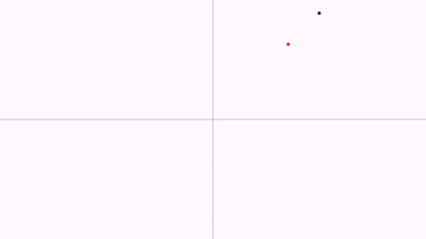
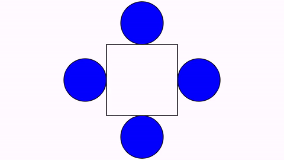
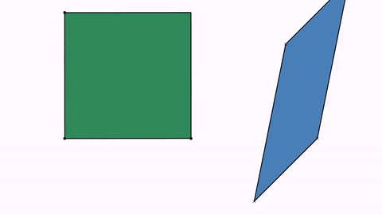

# Advanced topics

## Updaters

An updater is an object whose state is automatically updated right before doing the draws on the screen. Any class that implements the `Updateable` interface can be registered as an updater. This interface implements the two following methods:

```java
public int getUpdateLevel();
public void update(JMathAnimScene scene);
```

The `getUpdateLevel` method returns the order of updating this object. Objects with level 0 update first, then all with level 1, etc. Thus, if you have an updater  A that depends on another updater B to be previously updated before, you should set the update level of A greater than of B. All necessary updating commands should be set in the `update` method.

Any update must be registered on the scene to be used, with the `registerUpdateable`method.

Every MathObjects implements the interface `Updateable` , and is registered when added to the scene.	

For example, lets suppose we want the following simple animation, where a `Point` object named `A` moves from the point (1,1) to (-1,1):

```java
add(new Axes());
Point A=Point.at(0,0);
play.shift(3,-2,0,A);
waitSeconds(3);
```

We want to create a `Point`subclass that automatically locates at the inverse coordinates of point `A`. As the `Point` class implements the `updateable` interface, the easiest way is to subclass the `Point` and override the `getUpdateLevel` and `update` methods.

```java
class UnitPoint extends Point {
    Point sourcePoint;

    public UnitPoint(Point sourcePoint) {
        this.sourcePoint = sourcePoint;
    }

    @Override
    public int getUpdateLevel() {
        //The update level of the source point plus 1, ensures that this object is updated after the source object
        return sourcePoint.getUpdateLevel() + 1;
    }

    @Override
    public void update(JMathAnimScene scene) {
        double norm = sourcePoint.v.norm();
        if (norm != 0) {
            this.v.x = sourcePoint.v.x / norm;
            this.v.y = sourcePoint.v.y / norm;
        }
    }
}
```

and modify the scene, adding an instance of this class:

```java
add(new Axes());
Point A = Point.at(1, 1);
UnitPoint B = new UnitPoint(A);
B.drawColor(JMColor.RED);
add(B);
play.shift(3, -2,0, A);
waitSeconds(3);
```

Generates the following animation:



## Predefinied updaters

JMathAnim has some useful updaters defined

### Camera always ajusted to objects

With the `CameraAlwaysAdjusting`  updater, you can force the camera to show all objects in the scene. The camera will zoom out when needed, but not zoom in.

```java
registerUpdateable(new CameraAlwaysAdjusting(camera, .1, .1));
```

### Stacks permanently an object to another

```java
Shape circ1=Shape.circle().scale(.3).fillColor(JMColor.BLUE).thickness(3);
Shape circ2=circ1.copy();
Shape circ3=circ1.copy();
Shape circ4=circ1.copy();
Shape sq=Shape.square().center().thickness(4);
add(circ1,circ2,circ3,circ4);
        
registerUpdateable(new AnchoredMathObject(circ1, sq, Anchor.Type.RIGHT));
registerUpdateable(new AnchoredMathObject(circ2, sq, Anchor.Type.LEFT));
registerUpdateable(new AnchoredMathObject(circ3, sq, Anchor.Type.UPPER));
registerUpdateable(new AnchoredMathObject(circ4, sq, Anchor.Type.LOWER));
        
play.rotate(3, 90*DEGREES, sq);
waitSeconds(3);
```



### Transformed path 

```java
Shape sq = Shape.square().fillColor("seagreen").thickness(3);
Point A = Point.at(0, 0); //A maps to D
Point B = Point.at(1, 0); //B maps to E
Point C = Point.at(0, 1); //C maps to F
Point D = Point.at(1.5, -.5).dotStyle(DotSyle.CROSS);
Point E = Point.at(2, 0).dotStyle(DotSyle.CROSS);
Point F = Point.at(1.75, .75).dotStyle(DotSyle.CROSS);

AffineJTransform transform = AffineJTransform.createAffineTransformation(A, B, C, D, E, F, 1);
Shape sqTransformed = new TransformedJMPath(sq, transform);
sqTransformed.fillColor("steelblue").thickness(3);
add(sqTransformed, sq, A, B, C, D, E, F);

camera.adjustToAllObjects();
play.rotate(5, 90 * DEGREES, sq);
waitSeconds(5);
```



