# Mathematical formulas

As we have seen, math formulas are created with the `LaTexMathObject` class. Since version 0.9.5-SNAPSHOT, the LaTeX code is compiled using the library `JLaTeXMath` removing the need to have a working LaTeX distribution installed in the system. All glyphs generated are converted into `Shape`objects.

For example, if we generate a math expression with the command

```java
LaTeXMathObject sum=LaTeXMathObject.make("$2+2=4$");
```

It will generate 5 shapes, that we can access via the `get` method. Thus, the command `sum.get(0)` will return the first shape (the "2" glyph), `sum.get(1)` will return the "+" glyph, etc. These indices will be important to specify exactly how we want the animation from one expression to another to be done.

The major drawback of this approach is that it is not always clear which glyph of the formula corresponds to a given index. For that, we have the method `formulaHelper` that takes a varargs of `LatexMathObject` objects, or `String` with the LaTeX code, overlays the shape number for each one, stacks the formulas vertically, zooms and adds them to the scene. For example:

```java
LaTeXMathObject t1 = LaTeXMathObject.make("$e^{i\\pi}+1=0$");
LaTeXMathObject t2 = LaTeXMathObject.make("$\\sqrt{a+b}\\leq\\sqrt{a}+\\sqrt{b}$");
formulaHelper(t1, t2);
waitSeconds(5);
```

We'll obtain the following image for 5 seconds. You can make a screenshot or save it to a file with the `saveImage` command to examine it more deeply:

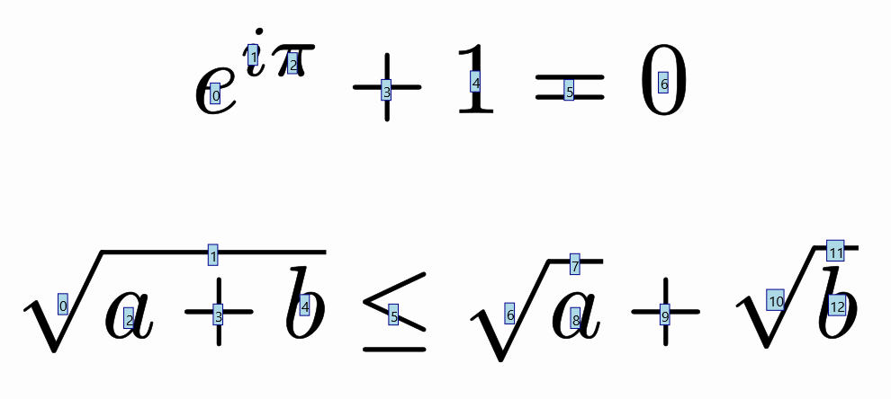

It is recommended, before doing any animation that involves math formulas, to run this method to get useful references when defining animations.

## Setting color to specific parts of a math expression

If you want to apply colors to some parts of a math expression, you can use the `\color` commands of LaTeX or you can use the `setColor`method and specify the indexes to apply the color. For example:

```java
LaTeXMathObject formula=LaTeXMathObject.make("$(a+b)^2=a^2+b^2+2ab$").center();
camera.adjustToAllObjects();
formula.setColor(JMColor.parse("darkred"),1,7,14);//Color dark red to indexes 1, 7 and 14
formula.setColor(JMColor.parse("darkgreen"),3,10,15);//Color dark green to indexes 3,10 and 15
add(formula);
waitSeconds(5);
```


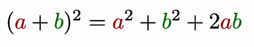

Note that the method changes both draw and fill colors.

## The slice method

Sometimes you may need to separate a formula into parts so you can animate them separately. The `slice` method extracts a subformula with the given indexes and removes the extracted shapes from the original formula. For example, suppose we have the formula `$A=b\cdot h$` and want to initially show the "b" and "h" glyphs in a rectangle before putting them in their original place:

```java
Shape rectangle = Shape.square().scale(2,1).center().fillColor("chocolate");
LaTeXMathObject formula = LaTeXMathObject.make("$A=b\\cdot h$")
    .stackToScreen(Anchor.Type.UPPER, .1, .1)
    .layer(1);
formula.setColor("steelblue",2);
formula.setColor("crimson",4);

LaTeXMathObject sliceBase=formula.slice(2);//Extracts the "b" from the formula
LaTeXMathObject sliceHeight=formula.slice(4);//Extracts the "h from the formula

Point sliceBaseCenter=sliceBase.getCenter();//Save the centers into these points
Point sliceHeightCenter=sliceHeight.getCenter();

//Position the sliced parts in the rectangle
sliceBase.stackTo(rectangle, Anchor.Type.LOWER,.1);
sliceHeight.stackTo(rectangle, Anchor.Type.RIGHT,.1);

play.showCreation(rectangle, sliceBase,sliceHeight);
play.showCreation(formula);//Draws the formula, except "b" and "h"
ShiftAnimation anim1 = Commands.moveTo(3, sliceBaseCenter, sliceBase);
ShiftAnimation anim2 = Commands.moveTo(3, sliceHeightCenter, sliceHeight);
playAnimation(anim1,anim2);//Restores the slices to their original positions
waitSeconds(2);
```


Note that, although the sliced formula has only one element, the indexes remain the same. So, if the "b" glyph was in position 2 in the original formula, it is still in position 2 in the sliced formula, so that `sliceBase.get(2)` returns the "b" shape. The other indexes store empty shapes.

There is another version of the method, with a boolean flag that controls if the sliced shapes are removed from the original math expression or not. In the preceding example, `LaTeXMathObject sliceBase=formula.slice(false,2)` will generate a slice of the "b" glyph without changing the original formula.

The `slice`method can be a powerful tool if you want to operate on parts of complex math expressions. If you want to progressively show a complex formula, the easiest option is to slice it into the different parts you will be showing at a concrete point in the animation.

## Animating transforms between equations

Suppose we are planning to perform an animation that solves a simple equation x+2=0. We define the two math expressions:

```java
LaTeXMathObject t1=LaTeXMathObject.make("$x+2=0$");
LaTeXMathObject t2=LaTeXMathObject.make("$x=-2$");
```

and we want to define a precise, self-explanatory animation, that transforms the first equation into the second.

If we simply try the command

```java
play.transform(4, t1, t2);
```

we will obtain the following animation:

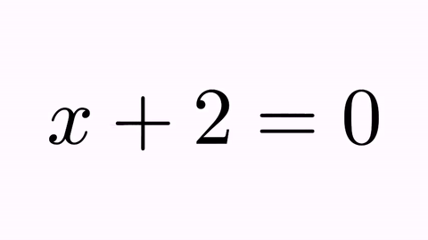

It's nice, but not illustrative. It would be better to force the "+2" to convert into "-2", and the original "x" and "=" glyphs to their counterparts "x" and "=" glyphs. For this, we have the `TransformMathExpression` animation class. But first, we must be clear about the indexes of the different shapes that compose the latex objects. For that, we use the method `formulaHelper`:

```java
formulaHelper(t1,t2);
waitSeconds(5);
```

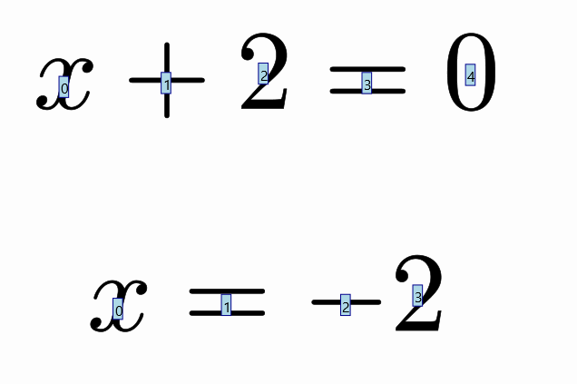

So, we need an animation that maps shape 0 onto shape 0, shape 3 onto shape 1, etc.

We create a new `TransformMathExpression` animation object, with the expected parameters:

```java
TransformMathExpression tr=new TransformMathExpression(5, t1, t2);
```

The `TransformMathExpression` objects admits several commands to define the precise transform we want to do. In this case, we want to transform the original shape 0 (x) to destiny shape 0 (x). This is stated with the command`map`

```java
tr.map(0,0);//Transforms orig-shape 0 to dst-shape 0
```

We also want to map the "+" sign (shape 1) into the "-" sign (shape 2), with the command

```java
tr.map(1,2);//Transforms orig-shape 1 to dst-shape 2
```

and the original "2" (shape 2) into the destiny "2" (shape 3):

```java
tr.map(2,3);
```

And finally, the "=" sign (shape 3) into the another "=" sign (shape 1):

```java
tr.map(3,1);//Transforms orig-shape 3 to dst-shape 1
```

What about shape 4 (the "0" sign)? If we don't specify a destination, this shape is marked for removal, with a `fadeOut` animation by default. If we play this animation with the `playAnimation` method we have:

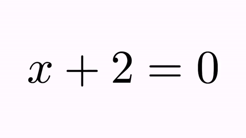

Ok, this is better, but there is still something that looks odd. When manipulating equations, it's always desirable to mark the "=" sign as a pivotal point. We can achieve this by forcing that the origin and destiny formulas are aligned by the "=" sign. This sign is at position 3 in the origin formula and at position 1 in destiny. With the command

```
    t2.alignCenter(1, t1, 3);
```

we make that the center of glyph number 1 of `t2` (its "=" sign) matches the center of the glyph number 3 of `t1` (its "=" sign). If we execute this method prior to the animation now we have:

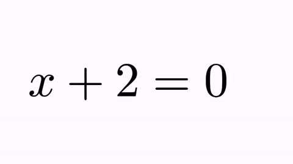

**Disclaimer:** This is not, by far, the best way to show the resolution of an equation like this! I show this specific animation for a better understanding of the program.

## Type of transformations

The `.map` method returns a `TransformMathExpressionParameters` object, which allows us to control how the transformation is done, with the method `setTransformStyle`. Transformation types are defined in the enum `TransformMathExpression.TransformType, currently INTERPOLATION, FLIP_HORIZONTALLY, FLIP_VERTICALLY and FLIP_BOTH`. By default, the `INTERPOLATION` method is used.

Note: The `INTERPOLATION` method uses the `Transform` class to do the work, so, depending on the origin and destination shapes, it may actually perform a point-to-point interpolation, or, if applicable, an isomorphism or a more general affine transform. For example, if you use an `INTERPOLATION` type transform to map a "2" character to another "2", it will use an isomorphism, since these 2 characters are the same except for scale.

```java
LaTeXMathObject t1 = LaTeXMathObject.make("$a^2=a\\cdot a$");
LaTeXMathObject t2 = LaTeXMathObject.make("$3^2=3\\cdot 3$");
t1.alignCenter(2, t2, 2);//Move t1 so its equal sign (glyph 2) matchs the t2 equal sign (glyph 2)
camera.zoomToObjects(t1, t2);
TransformMathExpression tr = new TransformMathExpression(5, t1, t2);
tr.map(0, 0).setTransformStyle(TransformMathExpression.TransformType.FLIP_HORIZONTALLY);//The first "a"
tr.map(1, 1);
tr.map(2, 2);
tr.map(3, 3).setTransformStyle(TransformMathExpression.TransformType.FLIP_VERTICALLY);//The second "a"
tr.map(4, 4);
tr.map(5, 5).setTransformStyle(TransformMathExpression.TransformType.FLIP_BOTH);//The third "a"
playAnimation(tr);
waitSeconds(3);
```

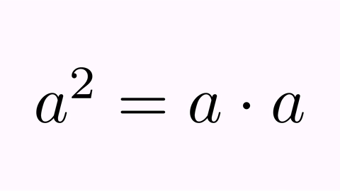

## Range mapping

If we need to map a bunch of consecutive origin indexes into another bunch of consecutive destiny indexes , the method `mapRange(OrigA,OrigB,dst)` does exactly this. The command

```java
tr.mapRange(3,7,13);
```

is equivalent to

```java
tr.map(3,13);
tr.map(4,14);
tr.map(5,15);
tr.map(6,16);
tr.map(7,17);
```

Or, if you have two formulas with the same number of glyphs and one-to-one correspondence, the `mapAll()` method does all the work for you.

## Grouping 

Suppose we have the following two arithmetic expressions

```java
LaTeXMathObject t1 = LaTeXMathObject.make("$(1+98)+(2+97)+\\cdots+(49+50)$");
LaTeXMathObject t2 = LaTeXMathObject.make("$99+99+\\cdots+99$");
```

 and we want to animate how these sums change all into 99. We want to perform a transform for each one of the sums into their simplified form. Our dear friend `formulaHelper` helps us to ellaborate a plan:

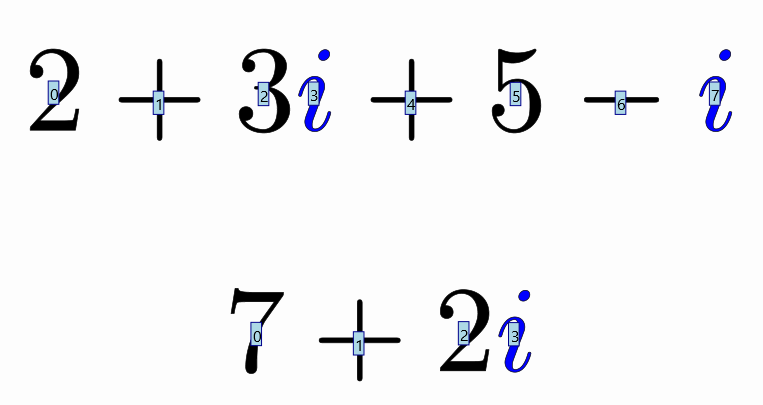


We are interested in mapping 0-5 origin indices to 0,1 destiny indices, 7-12 to 3,4 and 18-24 to 10,11. But in all these cases this means mapping 6 indices to 2. The `map` method only maps one index to another. To achieve this, we can define source and destination groups. We will use the 3 transform methods to show you the effect:

```java
LaTeXMathObject t1 = LaTeXMathObject.make("$(1+98)+(2+97)+\\cdots+(49+50)$");
LaTeXMathObject t2 = LaTeXMathObject.make("$99+99+\\cdots+99$");
TransformMathExpression tr=TransformMathExpression.make(10, t1, t2);

//Define groups of first sum. You can use any string as name of the group, as long as it doesn't start with "_"
tr.defineOrigGroup("sum_1", 0,1,2,3,4,5);
tr.defineDstGroup("99_1", 0,1);
tr.map("sum_1","99_1").setTransformStyle(TransformMathExpression.TransformType.FLIP_HORIZONTALLY);

tr.map(6,2);//The first "+" sign

//Define groups of second sum
tr.defineOrigGroup("sum_2", 7,8,9,10,11,12);
tr.defineDstGroup("99_2", 3,4);
tr.map("sum_2","99_2").setTransformStyle(TransformMathExpression.TransformType.FLIP_VERTICALLY);

tr.mapRange(13, 17, 5);//The "+...+" part

//Define groups of third sum
tr.defineOrigGroup("sum_3", 18,19,20,21,22,23,24);
tr.defineDstGroup("99_3", 10,11);
tr.map("sum_3","99_3").setTransformStyle(TransformMathExpression.TransformType.INTERPOLATION);
playAnimation(tr);
waitSeconds(1);
```

Here is the gif of the generated video. As you can see, grouping allows a bunch of indices to be managed as a single object. When applying the `INTERPOLATION` transformation method, the `MultiShapeTransform` is used, which handles correctly when the number of origin and destination shapes does not match.

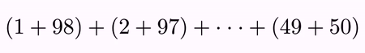

## Effects

Each mapping from one shape (or group) to another can be decorated with some effects. These can be added right after the `map` command with the following methods. Let's show them with an example. Suppose we want to animate the commutative property of the sum. Define the 2 `LaTexMathObject` objects and make an animation:

```java
LaTeXMathObject t1=LaTeXMathObject.make("$a+b$");
LaTeXMathObject t2=LaTeXMathObject.make("$b+a$");
t2.alignCenter(1, t1, 1);//Align both expressions in the "=" sign
camera.zoomToObjects(t1,t2);
TransformMathExpression tr=new TransformMathExpression(5, t1, t2);
tr.map(1,1);//= into =
tr.map(0,2);//a into b
tr.map(2,0);//b into a
playAnimation(tr);
waitSeconds(1);
```

We have the following animation:

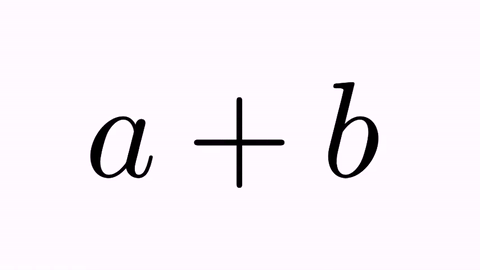

We will apply effects by adding them to the `tr.map(0,2)` and `tr.map(2,0)` commands. First, the .addScaleEffect`(t)` applies a scaling factor back and forth.

```java
tr.map(0,2).addScaleEffect(.7);
tr.map(2,0).addScaleEffect(1./.7);
```

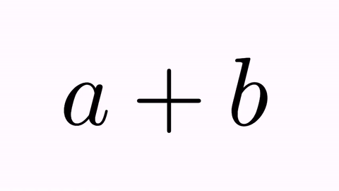

The `.addAlphaEffect(t)`  changes the alpha (draw and fill) back and forth:

```java
tr.map(0,2).addAlphaEffect(.7);
tr.map(2,0).addAlphaEffect(.7);
```

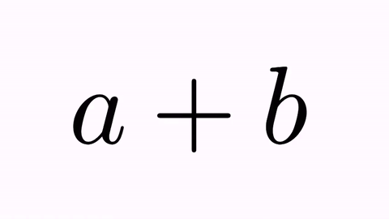

The `.addRotateEffect(n)`  rotates n times the shape.

```java
tr.map(0,2).addRotateEffect(1);
tr.map(2,0).addRotateEffect(-1);
```

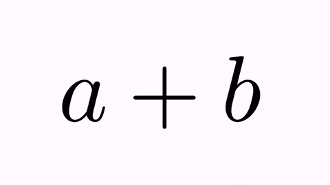

The `.addJumpEffect(t)`  applies a jump with a vector of 90º clockwise.

```java
tr.map(0,2).addJumpEffect(1);
tr.map(2,0).addJumpEffect(1);//Note that this "jump" is downward
```

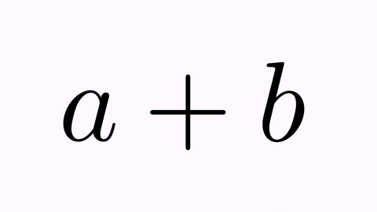

By default, the shape of the jump is a semicircle, so that only the sign of the parameter is relevant. Other jump types can be specified since version 0.9.0, defined in the enum `AnimationEffect.JumpType`: `SEMICIRCLE, PARABOLICAL, ELLIPTICAL, TRIANGULAR, SINUSOIDAL, SINUSOIDAL2, CRANE`. These are explained in detail in the animation effects chapter. For example, you can set it so that the "a" glyph moves like a crane grabs it, and that the "b" glyph follows a path resembling a triangular roof, with the following code:

```java
tr.map(0, 2).addJumpEffect(t1.getHeight(), AnimationEffect.JumpType.CRANE);
tr.map(2, 0).addJumpEffect(t1.getHeight(), AnimationEffect.JumpType.TRIANGULAR);//Note that this "jump" is downward
```


We use the method `getHeight()` to get the actual height of the formula, which will be the height of the jumps.

And, finally, you can nest any of these effects:

```java
tr.map(0,2).addJumpEffect(.1).addRotateEffect(-1).addScaleEffect(.5);
tr.map(2,0).addJumpEffect(.1).addRotateEffect(1).addScaleEffect(.5);
```

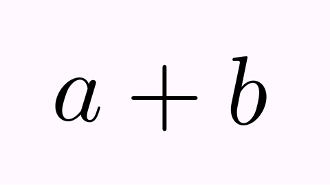

## Shapes marked for removal or adding

Any shape whose index is not mapped to a destiny index or group is marked for removal. Currently, there are 6  types, defined in the enum `TransformMathExpression.RemoveType`: `FADE_OUT, SHRINK_OUT, MOVE_OUT_UP, MOVE_OUT_LEFT, MOVE_OUT_RIGHT, MOVE_OUT_DOWN`.

Similarly, any destiny shape that is not mapped by a origin index or group is marked for adding with one of the following ways, defined in the enum `TransformMathExpression.AddType`: `FADE_IN, GROW_IN, MOVE_IN_UP, MOVE_IN_LEFT, MOVE_IN_RIGHT, MOVE_IN_DOWN`.

By default, `FADE_OUT` and `FADE_IN` are chosen for removing and adding. With the `setRemovingStyle` and `setAddingStyle` we can define individually the style for each shape.

We'll show all of this in one single, beautiful, self-explicative, dizzying animation:

```java
LaTeXMathObject t1 = LaTeXMathObject.make("ABCDEF").center();
LaTeXMathObject t2 = LaTeXMathObject.make("123456").center();
camera.zoomToObjects(t1, t2);
camera.scale(2);
TransformMathExpression tr = new TransformMathExpression(10, t1, t2);
//If we don't map anything, all origin shapes are marked for removal and 
//all destiny shapes are marked for adding.

tr.setRemovingStyle(TransformMathExpression.RemoveType.FADE_OUT, 0);
tr.setRemovingStyle(TransformMathExpression.RemoveType.SHRINK_OUT, 1);
tr.setRemovingStyle(TransformMathExpression.RemoveType.MOVE_OUT_DOWN, 2);
tr.setRemovingStyle(TransformMathExpression.RemoveType.MOVE_OUT_LEFT, 3);
tr.setRemovingStyle(TransformMathExpression.RemoveType.MOVE_OUT_RIGHT, 4);
tr.setRemovingStyle(TransformMathExpression.RemoveType.MOVE_OUT_UP, 5);
        
tr.setAddingStyle(TransformMathExpression.AddType.FADE_IN, 0);
tr.setAddingStyle(TransformMathExpression.AddType.GROW_IN, 1);
tr.setAddingStyle(TransformMathExpression.AddType.MOVE_IN_DOWN, 2);
tr.setAddingStyle(TransformMathExpression.AddType.MOVE_IN_LEFT, 3);
tr.setAddingStyle(TransformMathExpression.AddType.MOVE_IN_RIGHT, 4);
tr.setAddingStyle(TransformMathExpression.AddType.MOVE_IN_UP, 5);
        
playAnimation(tr);
waitSeconds(3);
```

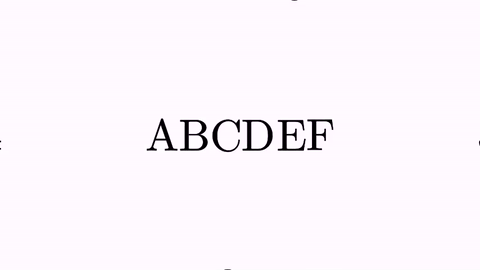

And finally, we show how the initial animation will look applying colors, mapping, and effects (again, this is not the optimal way from the didactic point of view):

````java
LaTeXMathObject t1 = LaTeXMathObject.make("$x+2=0$");
LaTeXMathObject t2 = LaTeXMathObject.make("$x=-2$");
//Add some colors
t1.setColor(JMColor.parse("darkolivegreen"), 0);
t2.setColor(JMColor.parse("darkolivegreen"), 0);
t1.setColor(JMColor.parse("maroon"), 2);
t2.setColor(JMColor.parse("maroon"), 2, 3);

t2.alignCenter(1, t1, 3);//Align centers
camera.zoomToObjects(t1, t2);
TransformMathExpression tr = new TransformMathExpression(5, t1, t2);
tr.map(0, 0);//Transforms orig-shape 0 to dst-shape 0
tr.map(1, 2)
    .addJumpEffect(t1.getHeight())
    .setTransformStyle(TransformMathExpression.TransformType.FLIP_VERTICALLY);//Transforms using a vertical flip orig-shape 1 to dst-shape 2 and adds a jump effect with the height of t1
tr.map(2, 3)
    .addJumpEffect(t1.getHeight());//Transforms orig-shape 2 to dst-shape 3 and adds a jump effect with the height of t1
tr.map(3, 1);//Transforms orig-shape 3 to dst-shape 1
tr.setRemovingStyle(TransformMathExpression.RemoveType.SHRINK_OUT, 4);
playAnimation(tr);
waitSeconds(3);
````

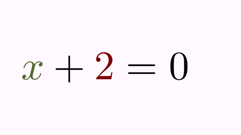

## Cross out of parts of a formula

Since version 0.9.5, JMathAnim includes another animation that can be handy for manipulating equations called `CrossOutMathElements`. These animations, as their name suggests, cross out parts of a mathematical formula. Let's see with a simple example:

```java
LaTeXMathObject formula = LaTeXMathObject.make("$2\\over 2$");
add(formula);
camera.zoomToAllObjects();
CrossOutMathElements anim=CrossOutMathElements.make(1, formula, 0,2);//Cross out glyps 0 and 2
playAnimation(anim);
waitSeconds(1);
```

Here is a GIF from the movie generated:

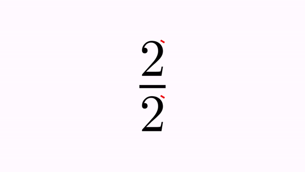

You can define which elements to cross out as usual, specifying the indices. There are 2 ways:

`.addSmallCrosses(int...indices)` generates one cross out for each individual glyph given by the index. This is the default behaviour for the static builder. So, another way to get the same result as before should be:

```java
CrossOutMathElements anim=CrossOutMathElements.make(1, formula).addSmallCrosses(0,2);//Cross out glyps 0 and 2
```

`.addBigCross(int...indices)` generates only one cross out that extends over all specified glyphs. For example:

```java
LaTeXMathObject formula = LaTeXMathObject.make("$x-y+2y-y$");
add(formula);
camera.zoomToAllObjects();
CrossOutMathElements anim=CrossOutMathElements.make(1, formula);
anim.addBigCross(1,7);//A "big" cross out for -y+2y-y
playAnimation(anim);
waitSeconds(1);
```

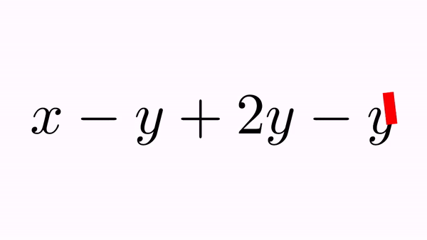

You can set appearance parameters for the drawn cross through the `getMp()` method defined in the animation. For example, if you want the cross out in the previous example to have 50% opacity and a black border, you can add the following lines to the previous code right before the `playAnimation` command:

```java
anim.getMp().setFillColor(JMColor.parse("violet"))
			.setFillAlpha(.5)
			.setDrawColor(JMColor.parse("black"))
    		.setThickness(10d);
anim.crossRatioWidth(.1);//Width of cross out is 10% of length (default value is 5%)
```

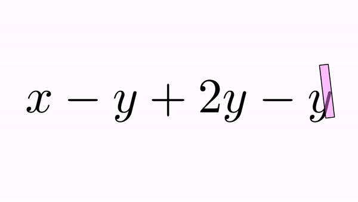

By default, all cross outs made to a formula become part of this formula. In the previous example, the big, violet cross out adds itself to the formula at the first free index, which is 8. This way, you can use them in further animations.

Another example, where we use 2 `CrossOutMathElements` animations, one with a different color. The first animation adds 2 crossouts at positions 13 and 14, and the second at positions 15 and 16. Remember that, although `map`commands may seem confusing, using the `formulaHelper` before makes things much clearer. We show here the indices of the formulas we are going to work with:

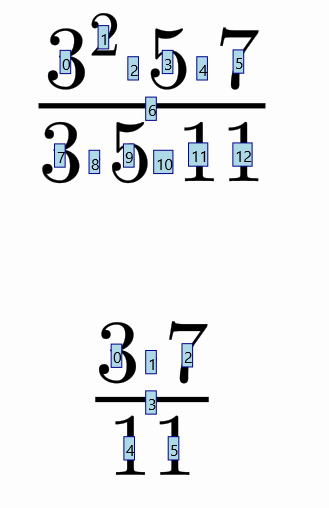

We want to perform a simplification, crossing out the exponent of the 3 in the numerator, with the 3 in the denominator, and later the 5 glyphs on both sides, and finally perform a transform to the simplified formula, removing all crossed out components. That's what we do in the following code: 
```java
LaTeXMathObject eq1 = LaTeXMathObject.make("$3^2\\cdot 5\\cdot 7\\over 3\\cdot 5\\cdot 11$").center();
LaTeXMathObject eq2 = LaTeXMathObject.make("$3\\cdot 7\\over 11$").center();
camera.zoomToObjects(eq1, eq2);
add(eq1);
waitSeconds(1);

//Cross out the exponent of numerator and the 3 of denominator
CrossOutMathElements cross1 = CrossOutMathElements.make(1, eq1, 1, 7);
cross1.getMp().loadFromStyle("solidred");
playAnimation(cross1);
waitSeconds(.5);

//Cross out the 5 of numerator and denominator
CrossOutMathElements cross2 = CrossOutMathElements.make(1, eq1, 3, 9);
cross2.getMp().loadFromStyle("solidgreen");
cross2.addDelayEffect(.2);
playAnimation(cross2);

waitSeconds(1);
TransformMathExpression anim = TransformMathExpression.make(2, eq1, eq2);
anim.map(0, 0);
anim.map(4, 1);
anim.map(5, 2);
anim.map(6, 3);
anim.map(11, 4);
anim.map(12, 5);
anim.setDefaultRemovingStyle(TransformMathExpression.RemoveType.FADE_OUT);

//The crossed out parts (and the crosses themselves) are removed moving themselves up (numerator) or down (denominator)
anim.setRemovingStyle(TransformMathExpression.RemoveType.MOVE_OUT_UP, 1, 3, 13, 15);
anim.setRemovingStyle(TransformMathExpression.RemoveType.MOVE_OUT_DOWN, 7, 9, 14, 16);

playAnimation(anim);
waitSeconds(1);
```

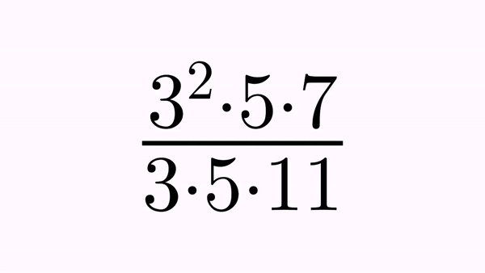