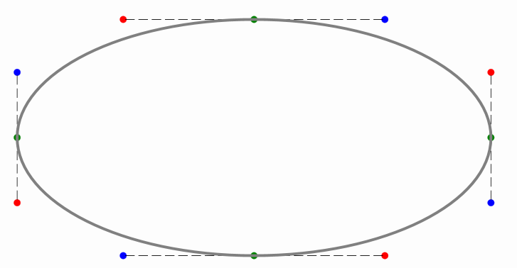
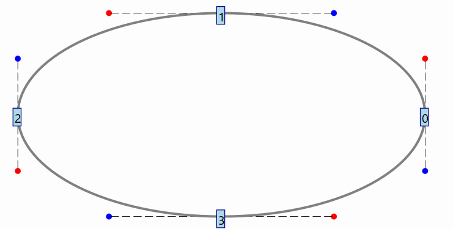
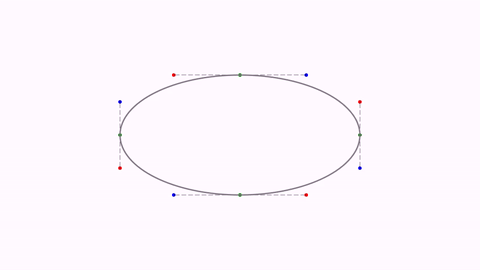
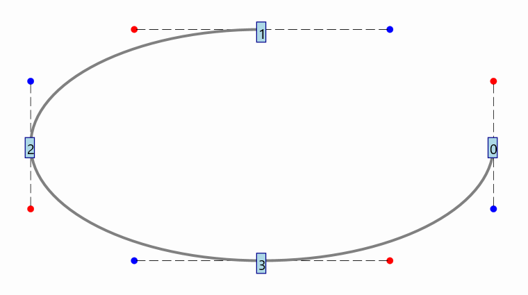
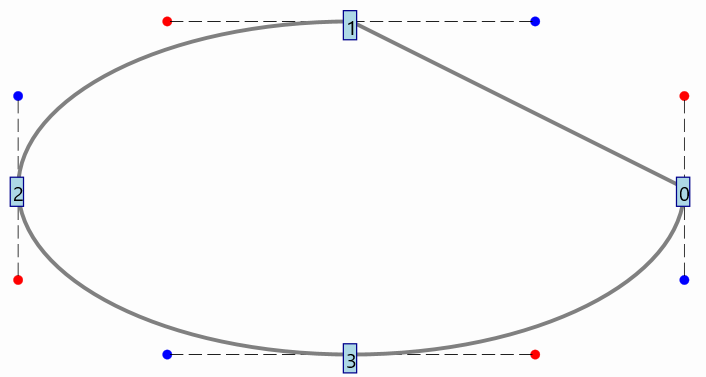
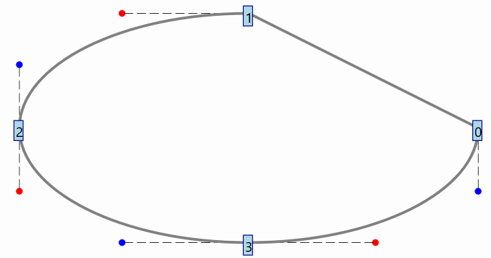
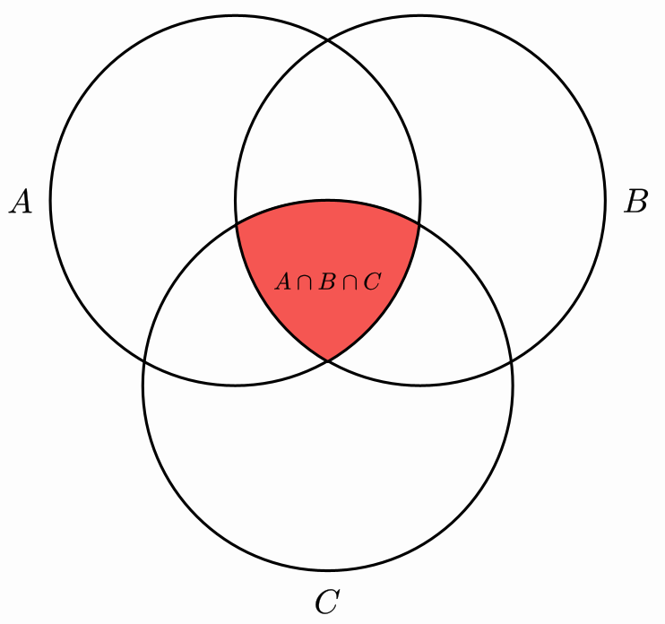
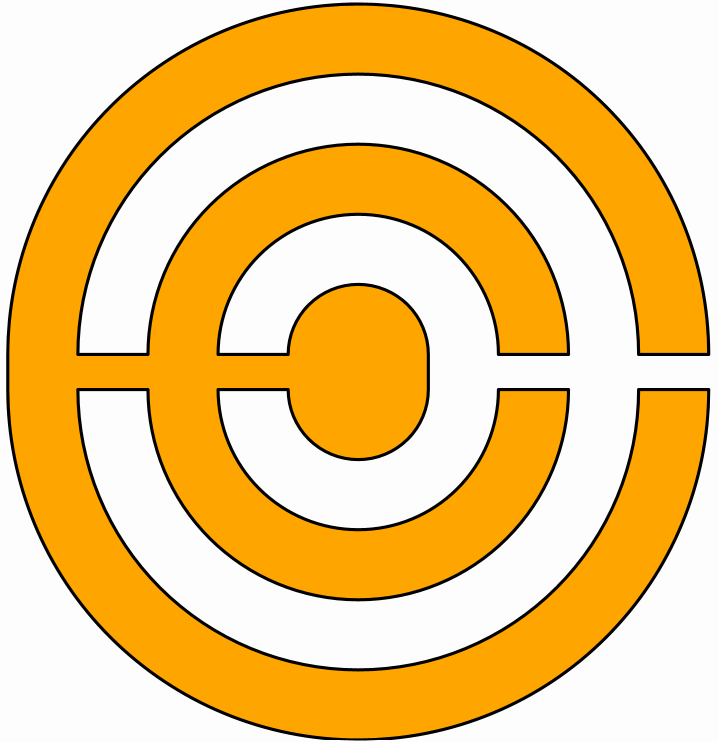

[

[home](https://davidgutierrezrubio.github.io/jmathanim/) [back](../index.html)

# Dealing with paths
Shapes are the most fundamental objects in JMathAnim. Almost anything that is drawed in the screen is ultimately a Shape (in fact, the `Renderer` class only admits the core methods `drawShape` and `drawImage`). A `Shape`object contains, apart from styling parameters, a `JMPath`object that stores the path that will be drawed. In this chapter we will see its structure and how to deal with its elements to create more complex objects.

If we run the following code:

```java
@Override
public void setupSketch() {
    config.parseFile("#light.xml");
    config.parseFile("#preview.xml");
}

@Override
public void runSketch() throws Exception {
    Shape ellipse=Shape.circle().scale(1,.5);
    for (JMPathPoint p:ellipse.getPath()){
        addJMPathPointToScene(p);
    }
    add(ellipse.thickness(5));
    waitSeconds(5);//Time for a screenshot
}

private void addJMPathPointToScene(JMPathPoint p) {
    add(p.p.drawColor("green"));//Point of the curve
    add(p.cpEnter.drawColor("blue"));//Control point that "enters" into the point
    add(p.cpExit.drawColor("red"));//Control point that "exits" from the point
    add(Shape.segment(p.p, p.cpExit)
        .dashStyle(MODrawProperties.DashStyle.DASHED)
        .drawColor("gray"));
    add(Shape.segment(p.p, p.cpEnter)
        .dashStyle(MODrawProperties.DashStyle.DASHED)
        .drawColor("gray"));
}
```

you will obtain the following image for 5 seconds:



Here we have drawed a `Shape`object with name `ellipse`. The method `ellipse.getPath()`returns the `JMPath`object of `ellipse`, and the method

```java
 for (JMPathPoint p:ellipse.getPath()){...}
```

iterates over all the elements of the path. Each element of a `JMPath` is a `JMpathPoint`class that stores 3 important `Point`objects:

* The `.p` object that stores the actual point of the shape (in the picture, in green color).
* The `.cpEnter`object that stores a control point that controls how the curve should approach to the point.
* The `.cpExit`object that stores a control point that controls how the curve should get away from the point.

Each `JMPathPoint` so, has information of the precise shape of the curve in this point. When passed this information to the renderer, a cubic Bezier curve is drawed using the parameters of 2 consecutive jmpathpoints.

You can access a particular `JMPathPoint`from the `Shape`class using the `get`method. So, in the previous code, `ellipse.get(0)`will return the first `JMPathPoint`of the path. These points are stored in a `CircularArray` object so that `ellipse.get(-1)`will return the last element of the path.

If you set the flag to show debug points with the command `ellipse.setShowDebugPoints(true)` JMathAnim will number the points of the path for you:



 Each `JMPathPoint`is a subclass of the`MathObject` so you can apply the usual transformations like `rotate`,`scale`, `shift`or any affine transformation. JMathAnim will transform the shape point and the control points accordingly. For example, if we add the 3 lines right before the `waitSeconds` command:

```java
play.shift(4,-1,0,ellipse.get(0));
play.rotate(4,-45*DEGREES,ellipse.get(0));
play.scale(4,.5,ellipse.get(0));
```

you will obtain the following animation. Any affine transformation to a `Shape` transforms every `JMPathPoint`of the path.



Each `JMPathPoint`has 2 public boolean variables, `isCurved`and `isThisSegmentVisible`. The first one determines if the Bezier curve that ends at this point is curved or straight, and the second one determines if it should be drawed or not.

For example, if we add the following line after the creation of `ellipse`object:

```java
ellipse.get(1).isThisSegmentVisible=false;
```

The piece of curve that goes from point 0 to 1 will not be drawed:




This way, if you have an open curve and you want to close it, you just have to add the command:

```java
myOpenShape.get(0).isThisSegmentVisible=true;
```


if we add this line instead:

```java
ellipse.get(1).isCurved=false;
```
The piece of curve that goes from 0 to 1 is drawed in a straight line:



You can also make a Bezier curve straight with the code:

```java
//make coordiantes of control point exit of point 0 equals to that point
ellipse.get(0).cpExit.copyFrom(ellipse.get(0).p);

//make coordiantes of control point enter of point 1 equals to that point
ellipse.get(1).cpEnter.copyFrom(ellipse.get(1).p);
```

You will have the same effect, with the control points altered:





# Boolean operations with paths

JMathAnim allows boolean operations union, intersection and substract for `Shape`objects. These methods relay on the boolean methods of the JavaFX library.

```java
Shape A = Shape.circle().thickness(4);
Shape B = A.copy().shift(1, 0);
Shape C = A.copy().shift(.5, -1);
Shape intersect = A.copy().intersect(B).intersect(C).style("solidRed");
add(A, B, C, intersect);
add(
    LaTeXMathObject.make("$A$").stackTo(A, Anchor.Type.LEFT, .1),
    LaTeXMathObject.make("$B$").stackTo(B, Anchor.Type.RIGHT, .1),
    LaTeXMathObject.make("$C$").stackTo(C, Anchor.Type.LOWER, .1),
    LaTeXMathObject.make("$A\\cap B\\cap C$").stackTo(intersect, Anchor.Type.CENTER)
);
camera.centerAtAllObjects();
waitSeconds(5);//Smile, you're being screenshoted!
```

Gives the following image:



JMathAnim uses a private method called `distille()`that get rids of redundant path points, in order to get the simplest result of the operation. However, it is known that in some cases, artifacts may occur, specially when dealing with multiple boolean operations in complex paths, due to the JavaFX algorithm.

# Merging paths

The `Shape`object admits the `merge` method with the syntax `A.merge(B,connectAtoB, connectBtoA)`.This method will add all the path points from shape B to those of shape A. The boolean flags `connectAtoB`and `connectBtoA` determine if the end of path A should connect by a straight line with the beginning of path B and `connectBtoA`, in a similar fashion, if end of path B should connect to the beginning of path A. 

When using this method, the `reverse()` method may be useful to exchange beginning and ending points of a path.

For example, the following code merges several semicircles to form a closed shape. Not e that the even arcs are reversed whereas odd ones are not:

```java
Shape upperLeaf = Shape.arc(PI);
boolean reverse = true;
int numberOfArcs = 6;
for (int i = 2; i < numberOfArcs; i++) {
    final Shape newSh = Shape.arc(PI).scale(Point.origin(), i, i);
    if (reverse) {
        newSh.reverse();
    }
    upperLeaf.merge(newSh, true, false);
    reverse = !reverse;
}
//Now we made a copy of the upper leaf and merge them
final Shape lowerLeaf = upperLeaf.copy()
    .reverse()
    .scale(Point.origin(), 1, -1)
    .shift(0, -.5);
upperLeaf.merge(lowerLeaf, true, true);
add(upperLeaf.style("solidorange"));
camera.adjustToAllObjects();
waitSeconds(5);//Yes, screenshot!
```

Will give the following figure:




[home](https://davidgutierrezrubio.github.io/jmathanim/) [back](../index.html)

