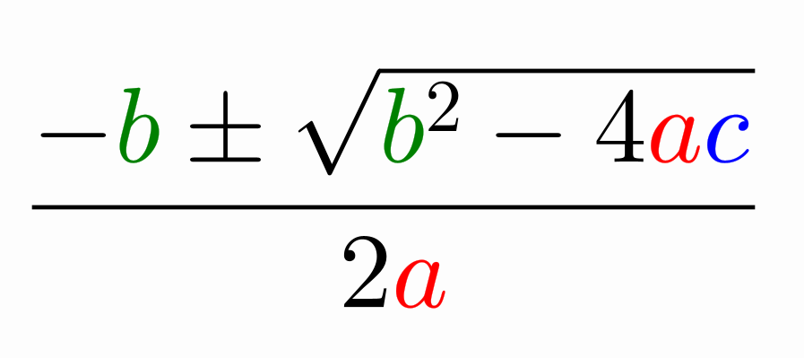
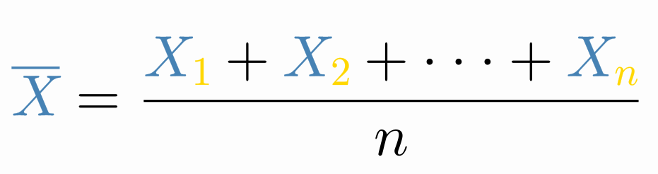
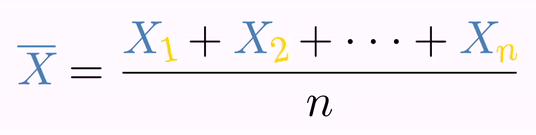
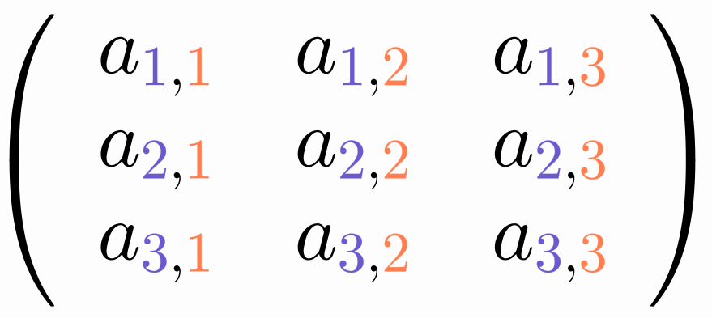

# Coloring Mathematical Formulas

## The simple way

The easy way to colorize some parts of a mathematical expression is shown in this example:

```java
LaTeXMathObject formula=LaTeXMathObject.make("$${-b\\pm\\sqrt{b^2-4ac}\\over 2a}$$");
LatexStyle latexStyle=LatexStyle.make();//Creates a latex style class that holds several "instructions"
latexStyle.setColorToChar("a", "red"); //All "a" glyphs should be red
latexStyle.setColorToChar("b", "green");//All "b" glyphs should be green
latexStyle.setColorToChar("c", "blue");//All "c" glyphs should be blue

formula.setLatexStyle(latexStyle);
add(formula);
camera.zoomToAllObjects();
waitSeconds(3);//Smile for the screenshot!
```

You should obtain something like that:



Easy, right? Well, to get the job done, a lot of internal work had to be done, mostly to correctly identifying which `Shape`objects correspond to certain LaTeX tokens.  When creating the `LatexMathObject` using the JLaTeXMath library to generate the formula, parsing capabilities of this library (and a bit of tweaking) are used to properly assign a `LatexToken` object to each generated `Shape`, that holds useful information to identify and assign colors to it.

This is the most simple use of the coloring capabilities, but there is a lot more, using the `LatexToken` class.  If you want to get more fine-tuned coloring effects, continue reading the next subsections.

## A closer look into the LatexToken class

As we have seen, LaTeX formulas are compiled and imported into Shape objects, usually one per glyph (in some cases a glyph is composed of more than one glyph). If we generate the formulas using the `JLaTeXMath` library (the default option), additional information about the specific glyph a shape represents is stored in the `LatexMathObject`. This is done using the `LatexParser` class, accessible through the `getLatexParser()` method, which relies heavily on the parsing capabilities of the `JLaTeXMath` library. Let's have a look at an example that generates a simple and beautiful mathematical formula:

```java
LaTeXMathObject eulerFormula=LaTeXMathObject.make("$e^{i\\pi}+1=0$");
for (int i = 0; i < eulerFormula.getLatexParser().size(); i++) {
    LatexToken token = eulerFormula.getLatexParser().get(i);//Gets the i-th identified token
    System.out.println("Token number "+i + ": " + token);
}
```

You will see in the console output all the generated tokens:

```
Token number 0: LatexToken[CHAR, "e"] [delimDepth=0] SEC_NORMAL
Token number 1: LatexToken[CHAR, "i"] [delimDepth=0] SEC_SUPERSCRIPT
Token number 2: LatexToken[GREEK_LETTER, "pi"] [delimDepth=0] SEC_SUPERSCRIPT
Token number 3: LatexToken[BINARY_OPERATOR, "plus"] [delimDepth=0] SEC_NORMAL
Token number 4: LatexToken[NUMBER, "1"] [delimDepth=0] SEC_NORMAL
Token number 5: LatexToken[RELATION, "equals"] [delimDepth=0] SEC_NORMAL
Token number 6: LatexToken[NUMBER, "0"] [delimDepth=0] SEC_NORMAL
```

There are several useful attributes in the token. The first,is the type, accesed through the `getType()` method, defines what family this glyph belongs to. Currently there are the following types, defined in the `LatexToken.TokenType` enum:

```java
public enum TokenType {
    NONE, //This token will not be assigned never. It is used to always returns false when matching tokens
    NON_MATH_CHAR,//Normal, non mathematical text
    CHAR,//A char token, mostly a letter
    NUMBER, //0-9 digits, including point if used in the decimal context
    SYMBOL, //A math symbol
    OPERATOR, //A "big" operator like \sum, \int
    BINARY_OPERATOR, //A simpler binary operator like +, -, \cap,\cup...
    RELATION, // A math relation like =, \geq, \leq, etc.
    DELIMITER, //Parenthesis, brackets...of any size
    SQRT, // Square (or nth-) root symbol
    FRACTION_BAR, //That is, the fraction bar :-)
    GREEK_LETTER, //Any greek letter like \pi or \varepsilon
    NAMED_FUNCTION, //A named function like \log or \ln
    ARROW //An arrow
}
```

So, we can see the generated formula if composed of 2 `CHAR`s, a `GREEK_LETTER` (\\pi), a `BINARY_OPERATOR` (\plus), etc.

The second `LatexToken` attribute is the string, accessible through the `getString()` method, which is basically the LaTeX command which generated the glyph, without the backslashes.

The `getDelimiterDepth` method indicates the "depth" of the glyph in the delimiters, i.e. how many groups of parentheses the glyph is "buried" in. In this case, all glyphs have a `delimDepth` value of 0, as there are no parentheses or brackets (or any delimiters).

The `getSecondaryFlags()` method retrieves some bit flags to add additional classification to the token. Currently these are the different flags:

```java
    public static final int SEC_NONE = 0b00000000;//None. A value of 0 should never be matched
    public static final int SEC_NORMAL = 0b00000001;//This token is normal style, nothing special about it
    public static final int SEC_DELIMITER_NORMAL = 0b00000010;//This token is a delimiter, normal size
    public static final int SEC_DELIMITER_BIG1 = 0b00000100;//This token is a delimiter, \big size
    public static final int SEC_DELIMITER_BIG2 = 0b00001000;//This token is a delimiter, \Big size
    public static final int SEC_DELIMITER_BIG3 = 0b0000100000000000;//This token is a delimiter, \bigg size
    public static final int SEC_DELIMITER_BIG4 = 0b0001000000000000;//This token is a delimiter, \Bigg size
    public static final int SEC_DELIMITER_EXTENSIBLE = 0b00010000;//This token is a delimiter, extensible size
    public static final int SEC_SUPERSCRIPT = 0b00100000;//This token is in a superscript
    public static final int SEC_SUBSCRIPT = 0b01000000;//This token is in a subscript
    public static final int SEC_FROM_INDEX = 0b10000000;//This token is in the "from" part of an \int, \sum...
    public static final int SEC_TO_INDEX = 0b0000000100000000;//This token is in the "to" part of an \int, \sum...
    public static final int SEC_NUMERATOR = 0b0000001000000000;//This token is in the numerator part of a fraction
    public static final int SEC_DENOMINATOR = 0b0000010000000000;//This token is in the denominator part of a fraction
    public static final int SEC_LEFT_ARROW = 0b0010000000000000; //This token is a left arrow
    public static final int SEC_RIGHT_ARROW = 0b0100000000000000;//This token is a right arrow
    public static final int SEC_LEFTRIGHT_ARROW = 0b1000000000000000;//This token is a leftright arrow
    public static final int SEC_BOLD_FONT = 0b10000000000000000;//This token is in bold math
```

 We can use this to fine-tune our coloring in the formula. For example, if you want to color all the subscripts in a formula, you can do this with the following code:

```java
LaTeXMathObject formula = LaTeXMathObject.make("$$\\overline{X}={X_1+X_2+\\cdots+X_n\\over n}$$");
LatexStyle latexStyle = LatexStyle.make();//Creates a latex style class that holds several "instructions"
latexStyle.setColorToChar("X", "steelblue"); //All "X" glyphs should be steelblue color

LatexToken subscriptToken = LatexToken.make();//Generates a LatexToken with all attributes set to null
subscriptToken.activateSecondaryFlag(LatexToken.SEC_SUBSCRIPT);//Any token in a subscript will match this one

LatexStyleItem latexStyleItem = LatexStyleItem.make("gold");//This item will apply the color gold to...
latexStyleItem.mustMatchTo(subscriptToken);//Any token that matchs the given token

latexStyle.add(latexStyleItem);//Add to the latex style

formula.setLatexStyle(latexStyle);
add(formula);
camera.zoomToAllObjects();
waitSeconds(3);//Smile for the screenshot!
```

You will get the following colored formula:



Of course, you can use `LatexToken` objects to select precise Shapes of the LatexMathObject. For example, adding the following lines to the previous code right before the `waitSeconds` method will twist and scale the subscript to draw attention to them:

```java
MultiShapeObject subscriptPart = formula.getShapesWith(subscriptToken);//Select all Shape object in subscript
play.twistAndScale(subscriptPart.toArray());//Uses to toArray() method to treat each Shape as a separate argument
```

Will generate an animation like this:



Currently, the `LatexStyle`class can use up to 6 `LatexToken` to compare:

```java
latexStyleItem.mustMatchTo(token);//The token to be colored must match with this
latexStyleItem.mustDifferFrom(token);//The token to be colored must differ from this
latexStyleItem.previousTokenMustMatchTo(token);//The token previous to the one to be colored must match with this
latexStyleItem.previousTokenMustDifferFrom(token);//The token previous to the one to be colored must differ from this
latexStyleItem.nextTokenMustMatchTo(token);//The token after to the one to be colored must match with this
latexStyleItem.nextTokenMustDifferFrom(token);//The token after to the one to be colored must differ from this
```

It is important to note that "match" or "differ" means to match/differ in all its non-null attributes. That is, if we have a `LatexToken` object with all its attributes set to null except the `string` variable, an expression like `latexStyleItem.mustDifferFrom(token)` will return true for any token with a string different from `token.string` value, without taking into account the other attributes. Of course a `LatexToken` with all its attributes set to `null` will always return `true` to any match or differs method.


With the next example we can see the flexibility of this method: Suppose we want to show a 3x3 matrix, and assign different colors to row and column indices. Both are numbers in a subscript style. Using the `previousTokenMustMatchTo` and `nextTokenMustMatchTo` we can infer if they are the first or second subscript, with a code like this:

```java
LaTeXMathObject formula = 
    LaTeXMathObject.make("$$\\left("
                         + "\\begin{array}{ccc}"
                         + "a_{1,1} & a_{1,2} & a_{1,3} \\\\"
                         + "a_{2,1} & a_{2,2} & a_{2,3} \\\\"
                         + "a_{3,1} & a_{3,2} & a_{3,3}"
                         + "\\end{array}"
                         + "\\right)$$");
add(formula);
//This style will hold 2 latexStyle items,
//one for row and other for colum subscripts
LatexStyle latexStyle = LatexStyle.make();

//The style for the row subscript: applies to all
//subscript numbers with a comma immediately after
LatexStyleItem rowSubscriptStyle = LatexStyleItem.make("slateblue");
rowSubscriptStyle.mustMatchTo(//Must be a number and a subscript
    LatexToken.make()
    .setType(LatexToken.TokenType.NUMBER)
    .activateSecondaryFlag(LatexToken.SEC_SUBSCRIPT)
);
rowSubscriptStyle.nextTokenMustMatchTo(//The next token must be a comma
    LatexToken.make()
    //The real string name for this token is "comma",
    //but jmathanim translates most commons signs to make it easier
    .setString(",")
);

//The style for the col subscript: applies to all
//subscript numbers with a comma immediately before
LatexStyleItem colSubscriptStyle = LatexStyleItem.make("coral");
colSubscriptStyle.mustMatchTo(//Must be a number and a subscript
    LatexToken.make()
    .setType(LatexToken.TokenType.NUMBER)
    .activateSecondaryFlag(LatexToken.SEC_SUBSCRIPT)
);
colSubscriptStyle.previousTokenMustMatchTo(//The previous token must be a comma
    LatexToken.make()
    .setString(",")
);

latexStyle.add(rowSubscriptStyle);
latexStyle.add(colSubscriptStyle);

formula.setLatexStyle(latexStyle);

camera.zoomToAllObjects();
waitSeconds(3);//Smile for the screenshot!
```

It will create a matrix with row and column indices in different colours:




Note that this code will only work if the row and column indices consist of only one digit, because tokens work at a single glyph level. If you want more specialized results, you should write your own method to match tokens. For most purposes, however, the `LatexStyle` class is sufficient.

Finally, you can store LaTeX coloring styles into config files too. The previous style used can be stored in a config file like follows:

```XML
<?xml version="1.0" encoding="UTF-8"?>
<JMathAnimConfig>
    <latexStyles>
        <latexStyle name="rowColMatrixStyle">
            <!--Row subscript-->
            <latexStyleItem>
                <conditions>
                    <equals>
                        <type>NUMBER</type>
                        <subtype>SEC_SUBSCRIPT</subtype>
                    </equals>
                    <equalsAfter>
                          <!-- <string>,</string> also works-->
                        <string>comma</string>
                    </equalsAfter>
                </conditions>
                <style>
                    <color>slateblue</color>
                </style>
            </latexStyleItem>
                <!--Column subscript-->
               <latexStyleItem>
                <conditions>
                    <equals>
                        <type>NUMBER</type>
                        <subtype>SEC_SUBSCRIPT</subtype>
                    </equals>
                    <equalsPrev>
                           <!-- <string>,</string> also works-->
                           <string>comma</string>
                    </equalsPrev>
                </conditions>
                <style>
                    <color>coral</color>
                </style>
            </latexStyleItem>
           </latexStyle>
    </latexStyles>
</JMathAnimConfig>
```

You can achieve the same effect saving this file under your `resources/config` directory with a proper name (for example, `matrixColor.xml`) and the following code:

```java
config.parseFile("matrixColor.xml");//You can parse config files with styles in the runSketch() method at any time
LaTeXMathObject formula = LaTeXMathObject.make("$$\\left("
                                               + "\\begin{array}{ccc}"
                                               + "a_{1,1} & a_{1,2} & a_{1,3} \\\\"
                                               + "a_{2,1} & a_{2,2} & a_{2,3} \\\\"
                                               + "a_{3,1} & a_{3,2} & a_{3,3}"
                                               + "\\end{array}"
                                               + "\\right)$$");
add(formula);
LatexStyle latexStyle = config.getLatexStyles().get("rowColMatrixStyle");
formula.setLatexStyle(latexStyle);

camera.zoomToAllObjects();
waitSeconds(3);//Smile for the screenshot!
```

