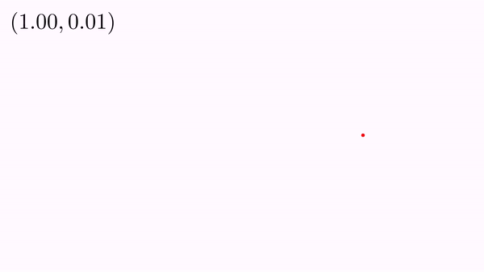

# Dynamic Text and Linking MathObjects

The method `setLatex()` of the `LatexMathObject` allows to change and recompile the LaTeX code, but there is another way to add text that changes its content while animating, using the `Link` class. Let's see this with an example. Suppose you have the following code in the `runSketch()` method, that rotates a red point along the unit circunference:

```java
Point A=Point.at(1,0).thickness(30).drawColor("red");
play.rotate(5,Point.origin(),2*PI,A);
```

Suppose you want to show the coordinates of the point while the point moves. This can be accomplished advancing each frame and doing the proper changes to the LatexMathObject:

```java
//The format I will use to represent the coordinates.
//2 decimal places. Use point as decimal separator
DecimalFormat df=new DecimalFormat("0.00");
df.setDecimalFormatSymbols(DecimalFormatSymbols.getInstance(Locale.UK));

Point A = Point.at(1, 0).thickness(30).drawColor("red");
Animation anim = Commands.rotate(5, Point.origin(), 2 * PI, A);

//The LEFT parameter says that, when changing text, the new text should be
//stacked to the left part of the old text (the default value is CENTER)
LaTeXMathObject text = LaTeXMathObject.make("$(1,0)$",Anchor.Type.LEFT);

//Put the text in the upper left scren corner
text.stackToScreen(Anchor.Type.ULEFT);
add(text);

anim.initialize(this);
while (!anim.processAnimation()) {//Main animation loop
    //Update the text with the new coordinates
    text.setLaTeX("$(" + df.format(A.v.x) + ", " + df.format(A.v.y)+ ")$");
    advanceFrame();
}
```

You will have the following animation:




We will see another way to get this effect, using the `Link`class

## Linking objects

A link is a method that is called immediately after the objects have been updated with the `update()` method and prior to render them. Basically, it gets an attribute of the "from" object and puts it in the "destiny" object.

We illustrate this with an example:

```java
 Point A = Point.at(1, 0).thickness(30).drawColor("red");
//The LEFT parameter says that, when changin text, the new text should be
//stacked to the left part of the old text (the defaulta value is CENTER)
LaTeXMathObject text = LaTeXMathObject.make("$({#0},{#1})$", Anchor.Type.LEFT);

registerLink(A, //From object A...
             Link.LinkType.X, //...take the X coordinate...
             text, //and put it in the object text...
             Link.LinkType.ARG0 //in its first argument
            );

registerLink(A, //From object A...
             Link.LinkType.Y, //...take the Y coordinate...
             text, //and put it in the object text...
             Link.LinkType.ARG1 //in its second argument
            );


//Put the text in the upper left scren corner
text.stackToScreen(Anchor.Type.ULEFT);
add(text);

play.rotate(5, Point.origin(), 2 * PI, A);
```

If you execute this code you will get the same result as before. Lets see what code we used. Look at the LaTeX code in the `LatexMathObject`:

```java
 LaTeXMathObject text = LaTeXMathObject.make("$({#0},{#1})$", Anchor.Type.LEFT);
```

The coordinates are now replaced by the strings '`{#0}` and `{#1}`. These are special scape strings that tell JMathAnim to replace whenever there is a value for the first, and second argument, respectively. Actually, a `LatexMathObject`can hold up to 10 arguments, name `{#0}` to `{#9}`.

The set of this argument is done via the linking process. To do so, we must create and register a link in the scene flow. This is done with this command:

```java
registerLink(A, //From object A...
             Link.LinkType.X, //...take the X coordinate...
             text, //and put it in the object text...
             Link.LinkType.ARG0 //in its first argument
            );
```

 The comments tell how it works. The first parameter is the source object, where to extract the information. The second parameter is a `LinkType` enum that defines the type of information. Depending on the object type and this value a certain value is extracted, and JMathAnim do its best to extract the appropiate information. For example in this case, X coordinate of the point is extracted. If A were a `MathObjectGroup`for example, the x coordinate of the center of the object will be extracted.

The third and fourth parameters define the destiny object and the type of attribute to change in this object. In this case the value `ARG0` means to change the value of the first argument.

Currently, the following `LinkType` values are supported:

```java
  public enum LinkType {
      X, Y, //Coordinates of a Point or the center of a MathObject
      VALUE, //If a vector, returns its norm. If a Mathobject, the distance from the origin to its center
      COUNT, //If a MathObjectGroup, returns the number of elements. If Shape, number of points
      WIDTH, HEIGHT, XMIN, XMAX, YMIN, YMAX,//Return these values from the Bounding Box of the object
      ARG0, ARG1, ARG2, ARG3, ARG4, ARG5, ARG6, ARG7, ARG8, ARG9 //Arguments of a LatexMathObject
    };
```

