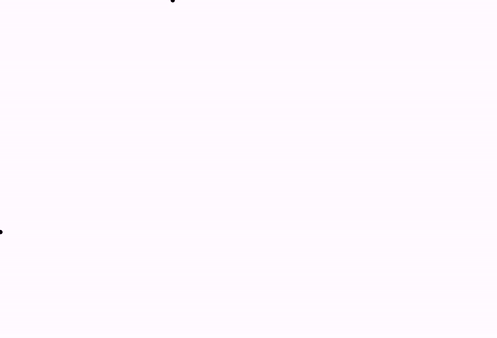

[home](https://davidgutierrezrubio.github.io/jmathanim/) [back](../index.html)

# Constructible objects
Since version 0.9.5, JMathAnim introduces constructible objects. These objects inherit from the abstract class `Constructible` which is itself a subclass of `MathObject`, so they have all common properties of these, like styling.

A constructible object is a mathobject that is built much like constructive geometry works. Thats it, computing parallels, intersections, etc. The main difference with a normal `MathObject` is that they are dependent on other `Constructible`objects, and most of them are "rigid" in the sense they cannot be shifted, rotated or scaled (well, they can, but without effect). All `Constructible` objects have name with the prefix `CT`.

An example is worth thousand non-example words:

```java
CTPoint A = CTPoint.make(Point.at(0, 0)).dotStyle(Point.DotSyle.CROSS).drawColor("blue");
CTPoint B = CTPoint.make(Point.at(1, 1)).dotStyle(Point.DotSyle.CROSS).drawColor("blue");;
CTSegment segment = CTSegment.make(A, B).drawColor("red").thickness(10);
CTPerpBisector perpBisector = CTPerpBisector.make(segment).drawColor("darkgreen").thickness(10);
CTCircle circle=CTCircle.makeCenterPoint(A, B).dashStyle(DashStyle.DASHED).drawColor("gray");
add(A, B, segment, perpBisector,circle);
play.shift(5, 0, -1, B);
waitSeconds(3);
```

Will give an animation like this:


In this example, we have created 2 `CTPoint`objects. These are almost identical to the classical `Point`object. The `CTSegment` object represents a segment between 2 `CTPoint` objects. Note that this object is not a `Shape` in the sense that you can transform it into another `Shape` for example, but it always remains as a segment. These objects are more rigid but they allows richer properties depending on the context.

The `CTPerpBisector`does as its name says, builds the perpendicular bisector of the given segment.

Another object showed is the `CTCircle`. The static method `makeCenterPoint(A,B)`builds the circle with center `A` that pass through the point `B`.

Finally, we perform a `shift` animation to `B`. Note that all objects dependent on `B` are updated accordingly.

Each `Constructible` object has its own static creations methods, with several parameters. For example the `CTPerpBisector`admits a static builder from a `CTSegment` but also wit 2 `CTPoint` objects. Also several builder method that admits `CTPoint` are overloaded so that admit `Point`objects (they simply wrap them into new `CTPoint` instances).

## Constructible lines

The class `CTLine` has several subclasses as `CTRay`, `CTSegment`, `CTAngleBisector`, `CTLineOrthogonal`, `CTPerpBisector`, or `CTVector`. These are fairly self-explicative, but one thing they have in common is that they all implement the interface `hasDirection` meaning that this object has an inherent direction (not oriented). So, we can use any of these objects as a parameter that admits a direction. For example, we can build a orthogonal line that pass through a `CTPoint` and is perpendicular to a `CTLine`, `CTSegment`, or `CTVector`. Other non constructible objects, like `Line`, `Ray` or `Arrow2D` also implement this interface.

## CTLaTeX

Mostly like his brother-in-code, `LaTeXMathObject`, this object represents a LaTeX string to be drawed on screen. This object is permanently stacked to a given `CTPoint`. We'll see an example of this class in the next section.

## CTIntersection

The `CTIntersection` object extends the `CTPoint` object and represents the intersection point between 2 constructible objects. At the current version, several static builders can be used:

```java
CTIntersectionPoint p1=CTIntersectionPoint.make(ct1,ct2,num);
```

Where `ct1` and `ct2` can be `CTLine`, `CTSegment`, `CTRay` and `CTCircle`. In the case of intersecting with a circle, the intersection may be 2 points. the `num` variable (1 or 2) determine the solution number.

For example, the following code:

```java
CTPoint A = CTPoint.at(.3, .0).drawColor("blue");
CTPoint B = CTPoint.at(-.5, -.1).drawColor("red");
CTLine toIntersect = CTLine.make(A, B);
CTCircle circle = CTCircle.makeCenterRadius(Point.origin(), 1);
CTIntersectionPoint inter1 = CTIntersectionPoint.make(circle, toIntersect, 1).drawColor("green");
CTIntersectionPoint inter2 = CTIntersectionPoint.make(circle, toIntersect, 2).drawColor("yellow");
add(A, B, toIntersect, circle, inter1, inter2);
add(//Let's add some labels
    CTLaTeX.make("$A$", A, Anchor.Type.DL, .02).scale(.5),
    CTLaTeX.make("$B$", B, Anchor.Type.DL, .02).scale(.5),
    CTLaTeX.make("$1$", inter1, Anchor.Type.DL, .02).scale(.5),
    CTLaTeX.make("$2$", inter2, Anchor.Type.DL, .02).scale(.5)
);
waitSeconds(3);
```

Generates the following image with the 2 solutions numbered. Which solution number we should choose?  If we parametrize the line AB where A is at t=0 and B is at t=1, and the intersections are located at parameter t1 and t2, then solution number 1 is at min(t1,t2) and number 2 is at max(t1,t2)


If there is no intersection, the point returned will have coordinates `Double.NaN`. You can check if any of the coordinates a point is `NaN` with the `Vec` method `isNaN()`.

```java
CTPoint P=....
    if (P.v.isNan()) {
        //Sorry mate, at least one coordinate is NaN...
    }
```


## Converting to non-constructible MathObjects

Suppose you have been built a `CTCircle` that pass through 3 points, but now you want to transform it into a square. You cannot do that with a Constructible object (in fact, it will give you an error), but you can extract the contained `MathObject`which is actually drawn and perform any transformation to it.

```java
//With the layer(1) we ensure the dots are over the rest of the objects
CTPoint A= CTPoint.at(0, 0).drawColor("blue").thickness(60).layer(1);
CTPoint B= CTPoint.at(1, 0).drawColor("red").thickness(60).layer(1);
CTPoint C= CTPoint.at(.75, .75).drawColor("green").thickness(60).layer(1);
CTCircle circle = CTCircle.make3Points(A,B,C).style("solidred");
add(A,B,C,circle);

//Let's move the C point for fun!
play.shift(2,0,-.5,C);

//The next command is necessary! Doing so it will remove an unused object from the scene
//but more importantly, it will unregister the CTCircle from the update queue 
//and stop updating the contained MathObject, leaving it "free".
remove(circle);

Shape shape=circle.getMathObject();
play.transform(3, shape, Shape.square().style("solidblue"));
waitSeconds(3);
```


# Geogebra import

One of the advantages of `Constructible` objects is that they behave similarly to the object of the Geogebra program. In the rare case you don't know it, [Geogebra](http://www.geogebra.org) is an excellent open source software that allows to make geometrical constructions (and many other things). JMathAnim can import Geogebra files in a limited way (bear in mind that Geogebra has literally hundreds of commands). For now, the following elements can be succesfully imported: Points, middle points, intersection points (lines, rays, segment, circles), lines, orthogonal, parallels, perpendicular bisector, polygons, regular polygons, vectors, mirrored,  translated, and rotated points. JMathAnim will emmit a Warning when it founds an unknown command that cannot be imported. The process is quite simple. For example, suppose we have a document like this created in Geogebra, where we have calculated the ortocenter of a triangle.


Now, we save this in our disk under the name `test.gbb`, in a directory named `resources/geogebra`  of our project. This will be the default location to look for geogebra files (remember you can use # and ! flags to alter this behaviour).

```java
//With this command we parse the file resources/geogebra/test.gbb
GeogebraLoader gl = GeogebraLoader.parse("test.ggb");
```

Now, JMathAnim will try to convert all Geogebra elements, logging a warning if there is an unknown command (and possibly throwing an exception if the there are objects that depend on this unknown object). If everything goes well, the `gl` object will have a `Dictionary` with the created objects.

The command

```java
add(gl);
```

Is equivalent to add all stores objects to the scene.

If you want to adjust the camera to the view of the original geogebra document, you can do it with the command:

```java
camera.setViewFrom(gl);
```

However, bear in mind that proportions may not be the same, so the view is accurate.

And that's it! Well, not really.  If you want to animate elements, or simply access to them, you may use the original name that these objects had in Geogebra. For example, to access to the point A, you may do it with the command

```java
gl.get("A");
```

The imported document looks like this:


Not bad, right? Note that axis and object labels are not imported. Let's add some animations to the creation of this scene to make it brighter!

```java
GeogebraLoader gl = GeogebraLoader.parse("test.ggb");
camera.setViewFrom(gl);
playAnimation(
    Commands.moveIn(1,Anchor.Type.LEFT, gl.get("A")),
    Commands.moveIn(1,Anchor.Type.UPPER, gl.get("B")),
    Commands.moveIn(1,Anchor.Type.RIGHT, gl.get("C"))
);
play.showCreation(gl.get("t1"));
play.showCreation(gl.get("f"),gl.get("g"),gl.get("h"));
play.moveIn(Anchor.Type.UPPER, gl.get("D"));
waitSeconds(3);
```




[home](https://davidgutierrezrubio.github.io/jmathanim/) [back](../index.html)

