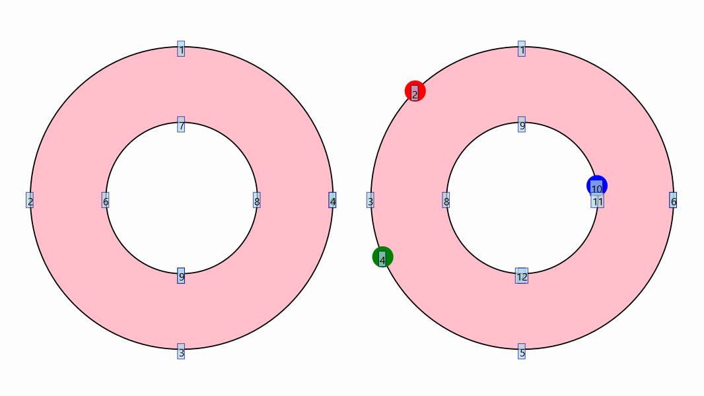

[home](https://davidgutierrezrubio.github.io/jmathanim/) [back](../index.html)

# Dealing with paths
Shapes are the most fundamental objects in JMathAnim. Almost anything that is drawn on the screen is ultimately a Shape (in fact, the `Renderer` class only admits the core methods `drawShape` and `drawImage`). A `Shape`object contains, apart from styling parameters, a `JMPath`object that stores the path that will be drawn. In this chapter, we will see its structure and how to deal with its elements to create more complex objects.

If we run the following code:

```java
@Override
public void setupSketch() {
    config.parseFile("#light.xml");
    config.parseFile("#preview.xml");
}

@Override
public void runSketch() throws Exception {
    Shape ellipse=Shape.circle().scale(1,.5);
    for (JMPathPoint p:ellipse.getPath()){
        addJMPathPointToScene(p);
    }
    add(ellipse.thickness(8)));
    waitSeconds(5);//Time for a screenshot
}

private void addJMPathPointToScene(JMPathPoint p) {
    add(p.p.drawColor("green"));//Point of the curve
    add(p.cpEnter.drawColor("blue"));//Control point that "enters" into the point
    add(p.cpExit.drawColor("red"));//Control point that "exits" from the point
    add(Shape.segment(p.p, p.cpExit)
        .dashStyle(MODrawProperties.DashStyle.DASHED)
        .drawColor("gray"));
    add(Shape.segment(p.p, p.cpEnter)
        .dashStyle(MODrawProperties.DashStyle.DASHED)
        .drawColor("gray"));
}
```

you will obtain the following image for 5 seconds:


Here we have drawn `Shape`object with name `ellipse`. The method `ellipse.getPath()` returns the `JMPath`object of `ellipse`, and the method

```java
 for (JMPathPoint p:ellipse.getPath()){...}
```

iterates over all the elements of the path. Each element of a `JMPath` is a `JMpathPoint`class that stores 3 important `Point`objects:

* The `.p` object that stores the actual point of the shape (in the picture, in green color).
* The `.cpEnter`object that stores a control point that controls how the curve should approach to the point (in the picture, in blue color).
* The `.cpExit`object that stores a control point that controls how the curve should get away from the point (in the picture, in red color).

Each `JMPathPoint` has information about the precise shape of the curve at this point. When passing this information to the renderer, a cubic Bézier curve is drawn using the parameters of 2 consecutive jmpathpoints.

You can access a particular `JMPathPoint` from the `Shape` class using the `get` method. So, in the previous code, `ellipse.get(0)` will return the first `JMPathPoint` of the path. These points are stored in a `CircularArray` object so that `ellipse.get(-1)` will return the last element of the path.

If you set the flag to show debug points with the command `ellipse.setShowDebugPoints(true)` JMathAnim will number the path's points for you:


 Each `JMPathPoint` is a subclass of the`MathObject` so you can apply the usual transformations like `rotate`, `scale`, `shift` or any affine transformation. JMathAnim will transform the shape point and the control points accordingly. 

You can also apply these transforms to individual jmpathpoints. For example, if we add the 3 lines right before the `waitSeconds` command:

```java
play.shift(4,-1,0,ellipse.get(0));
play.rotate(4,-45*DEGREES,ellipse.get(0));
play.scale(4,.5,ellipse.get(0));
```

you will obtain the following animation. Any affine transformation to a `Shape` transforms every `JMPathPoint`of the path.


Each `JMPathPoint` has 2 public boolean variables, `isCurved` and `isThisSegmentVisible`. The first one determines if the Bézier curve that ends at this point is curved or straight, and the second one determines if it should be drawn or not.

For example, if we add the following line after the creation of an `ellipse`object:

```java
ellipse.get(1).isThisSegmentVisible=false;
```

The piece of curve that goes from point 0 to 1 will not be drawn:


This way, if you have an open curve and you want to close it, you just have to add the command:

```java
myOpenShape.get(0).isThisSegmentVisible=true;
```


if we add this line instead:

```java
ellipse.get(1).isCurved=false;
```
The piece of curve that goes from 0 to 1 is drawn in a straight line:


You can also make a Bézier curve straight with the code:

```java
//make coordinates of control point exit of point 0 equals to that point
ellipse.get(0).cpExit.copyFrom(ellipse.get(0).p);

//make coordinates of control point enter of point 1 equals to that point
ellipse.get(1).cpEnter.copyFrom(ellipse.get(1).p);
```

You will have the same effect, with the control points altered:


If you have a closed path and want to open it, you should duplicate the first JMPathPoint and make the segment between them invisible. That's what the `openPath` method does. If you want to open the previous shape, you can do it with the command `ellipse.getPath().openPath()`. The visual appearance of the shape is unaltered, but moving the first or last point of the shape will behave differently.

# Retrieving points from paths

There are several methods to get points from the path.

```java
Shape c=Shape.circle();
JMPathPoint jmp = c.get(0); //Gets the first JMPathPoint of the path
Point P=c.getPoint(0); //Gets the first Point. This is equivalent to Point P=c.get(0).p
int size=c.size(); //Gets the number of JMPathPoint objects in the path
```

Sometimes we are interested in getting where a precise point should be in the path. JMathAnim has several methods to compute the interpolated JMPathPoint at a specified position. The interpolation parameter alpha ranges from 0 to 1, where 0 is the start of the Shape (point at index `0`) and 1 is the end (point at index `size()-1`).

```java
Shape c=Shape.circle();
Point interpP=c.getPointAt(.2); //Computes the interpolated point at alpha=.2;
JMPathPoint interpJmp = pol.getPath().getJMPointAt(.2);//Interpolated JMPathPoint
```

Note that this parameter does not run in "constant velocity". For example, in a path with 3 elements like the figure:


The whole range [0,.5] maps to the segment from point 0 to 1, but the equal-size range [.5,1] maps to the segment from point 1 to 2. Thus, if we animate a point moving with constant alpha velocity, this point will travel faster from 1 to 2 than from 0 to 1:


If you want to insert an interpolated JMPathPoint into a path, it is not enough to simply add it to the array of elements of the path; it is also necessary to recompute the control points of the adjacent elements. This is done with the command `.getPath().insertJMPointAt(int k, double alpha) `. This command will insert a new `JMPathPoint` between the k-th and (k+1)-th ones, with the alpha parameter. An alpha value of 0 means the k-th point, 0.5 means the middle-path point, and 1 means the (k+1)-th point.

For example, the following code draws an annulus and a copy with 3 new JMPathPoints inserted:

```java
Shape c = Shape.annulus(.5, 1);
c.setShowDebugPoints(true);
Shape c2 = c.copy().stackTo(c, Anchor.Type.RIGHT, .25);

JMPathPoint newJmp1 = c2.getPath().insertJMPointAt(1, .5);
JMPathPoint newJmp2 = c2.getPath().insertJMPointAt(3, .25);
JMPathPoint newJmp3 = c2.getPath().insertJMPointAt(9, .9);

//Note that we add the Point (.p) object, NOT the JMPathPoint!
//The JMPathPoints don't have a draw() method so
//they will not appear on the screen
add(
    newJmp1.p.thickness(20).drawColor("red"),
    newJmp2.p.thickness(20).drawColor("green"),
    newJmp3.p.thickness(20).drawColor("blue")
);
add(c, c2);
camera.centerAtAllObjects();
waitSeconds(3);
```

Note how the indices change (the index 0 is hidden by the indices 4 and 7 respectively):





# Boolean operations with paths

JMathAnim allows boolean operations union, intersection and substract for `Shape`objects. These methods relay on the boolean methods of the JavaFX library.

```java
Shape A = Shape.circle().thickness(8);
Shape B = A.copy().shift(1, 0);
Shape C = A.copy().shift(.5, -1);
Shape intersect = A.copy().intersect(B).intersect(C).style("solidRed");
add(A, B, C, intersect);
add(
    LaTeXMathObject.make("$A$").stackTo(A, Anchor.Type.LEFT, .1),
    LaTeXMathObject.make("$B$").stackTo(B, Anchor.Type.RIGHT, .1),
    LaTeXMathObject.make("$C$").stackTo(C, Anchor.Type.LOWER, .1),
    LaTeXMathObject.make("$A\\cap B\\cap C$").stackTo(intersect, Anchor.Type.CENTER)
);
camera.centerAtAllObjects();
waitSeconds(5);//Smile, you're being screenshot!
```

Gives the following image:


JMathAnim uses a private method called `distille()` that gets rid of redundant path points in order to get the simplest result possible. However, it is known that in some cases, artifacts may occur, especially when dealing with multiple boolean operations in complex paths, due to the JavaFX algorithm.

# Merging paths

The `Shape`object admits the `merge` method with the syntax `A.merge(B,connectAtoB, connectBtoA)`.This method will add all the path points from shape B to those of shape A. The boolean flags `connectAtoB`and `connectBtoA` determine if the end of path A should connect by a straight line with the beginning of path B and `connectBtoA`, in a similar fashion, if end of path B should connect to the beginning of path A. 

When using this method, the `reverse()` method may be useful to exchange beginning and ending points of a path.

For example, the following code merges several semicircles to form a closed shape. Note that the even arcs are reversed, whereas the odd ones are not:

```java
Shape upperLeaf = Shape.arc(PI);
boolean reverse = true;
int numberOfArcs = 6;
for (int i = 2; i < numberOfArcs; i++) {
    final Shape newSh = Shape.arc(PI).scale(Point.origin(), i, i);
    if (reverse) {
        newSh.reverse();
    }
    upperLeaf.merge(newSh, true, false);
    reverse = !reverse;
}
//Now we made a copy of the upper leaf and merge them
Shape lowerLeaf = upperLeaf.copy()
    .reverse()
    .scale(Point.origin(), 1, -1)
    .shift(0, -.5);
upperLeaf.merge(lowerLeaf, true, true);
add(upperLeaf.style("solidorange"));
camera.adjustToAllObjects();
waitSeconds(5);//Yes, screenshot!
```

Will give the following figure:


In the Gallery section, you can see how to generate Koch and Hilbert curves iteratively using the `merge` method.

# Subpaths

The `JMPath`command `.subpath(double a, double b)` returns the subpath that goes from a to b, where a and b are interpolation parameters as described before, from 0 to 1.

You can directly extract the subshape with the `Shape` method `getSubShape(double a, double b)` that works in a similar way. A new shape with the same styling parameters will be created. For example:

```java
Shape F = LaTeXMathObject.make("F").get(0).center().setHeight(2);
Shape partialF=F.getSubShape(.2, .76);
F.fillColor("violet").fillAlpha(.5);
partialF.style("default").thickness(8).drawColor("olive");//Load default style to clear the style latexdefault
add(c,c2);
waitSeconds(3);
```

gives the following image:


The `ContourHighlight` animation makes extensive use of the `getSubShape` method

# Generating control points

The class `PathUtils` has the static method `generateControlPointsBySimpleSlopes` that adjusts the control points of a `Shape` to give a spline-interpolated appearance. The following code creates a `polyLine` object and adjusts the control points to give a smooth appearance, using a tension factor from 0 to 1.

```java
Point[] ps = new Point[5];
ps[0] = Point.at(0, .25);
ps[1] = Point.at(-1, .25);
ps[2] = Point.at(0, -.25);
ps[3] = Point.at(1, .25);
ps[4] = Point.at(1, -.25);
for (Point p : ps) {
    p.dotStyle(Point.DotSyle.CROSS);
    p.drawColor("blue").thickness(60);//Points are blue crosses
}
Shape pol = Shape.polyLine(ps).thickness(10).drawColor("tomato");
add(pol);//Add polyline
add(ps);//Add all points

//Generate control points with a tension of 0.7
PathUtils.generateControlPointsBySimpleSlopes(pol.getPath(),.7);
waitSeconds(3);//3 seconds for a screenshot!
```


[home](https://davidgutierrezrubio.github.io/jmathanim/) [back](../index.html)

