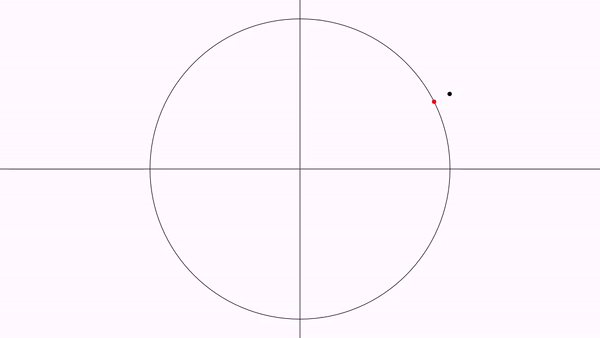
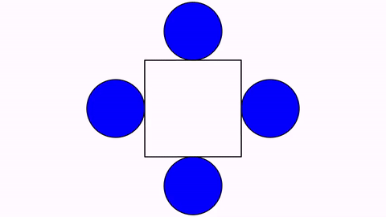
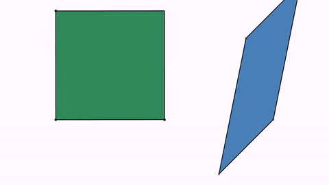
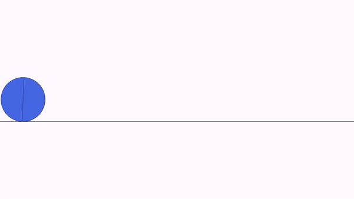

[home](https://davidgutierrezrubio.github.io/jmathanim/) [back](../index.html)

# Disabling and enabling animations
Suppose you are writing a rather long animation.  Usually this process involves several test runs to check if everything goes as planned. If you are fine tuning the last part of the animation, you don't need to run all from the beginning to do this. Instead, you can add these methods to your code:

```java
disableAnimations();
//...animation code that is already tested and don't need to see it again before generating the final movie
enableAnimations();
//...animation code that I want to preview
```

The `disableAnimations()` and `enableAnimations()` methods allows to temporarily disable animations and frame generations. Updating and object creations are done, but the non-essential parts, like drawing, writing to movie, or performing the animations is omitted, dramatically increasing speed. You can also use this to generate a movie with only specific parts of the sketch.

# Updaters

An updater is an object whose state is automatically updated right before doing the draws on the screen. Any class that implements the `Updateable` interface can be registered as an updater. Any updater must be registered on the scene to be used, with the `registerUpdateable`method. Similarly, there is the `unregisterUpdateable` method that does the opposite.

This interface implements the following methods:

```java
public int getUpdateLevel();
public void setUpdateLevel(int level);
public void update(JMathAnimScene scene);
public void registerUpdateableHook(JMathAnimScene scene);
public void unregisterUpdateableHook(JMathAnimScene scene);
```

The `getUpdateLevel` method returns the order of updating this object. Objects with level 0 update first, then all with level 1, etc. Thus, if you have an updater  A that depends on that another updater B to be previously updated before, you should set the update level of A greater than of B. 

The `update` method it's where "magic" happens. The object is updated which whatever arcane and mystical procedure you choose.

The `setUpdateLevel` does as it name suggests. It sets the update level of the object. This is normally computed once when registering the object in the scene update queue.

Every MathObjects implements the interface `Updateable` , and is registered when added to the scene.

The methods `registerUpdateableHook` and `unregisterUpdateableHook` are called when the object is registered in the scene update queue. This is where normally the update level should be set.

When creating a new `MathObject` subclass which depends on other objects, you should override the method `registerUpdateableHook`and sets the update level there.

For example, let's suppose we have the following simple animation, where a `Point` object named `A` moves from the point (1,1) to (-1,1):

```java
add(new Axes(),Shape.circle());
Point A = Point.at(1, .5);
play.shift(3,-2,0,A);
waitSeconds(3);
```

We want to create a `Point`subclass that automatically locates at the normalized coordinates of point `A`, that is, the projection of `A` into the unit circle. As the `Point` class implements the `Updateable` interface, the easiest way is to subclass the `Point` and override the `registerUpdateableHook` and `update` methods.

```java
class UnitPoint extends Point {

    Point sourcePoint;

    public UnitPoint(Point sourcePoint) {
        this.sourcePoint = sourcePoint;
    }

    @Override
    public void update(JMathAnimScene scene) {
        double norm = sourcePoint.v.norm();
        if (norm != 0) {
            this.v.x = sourcePoint.v.x / norm;
            this.v.y = sourcePoint.v.y / norm;
        }
    }

    @Override
    public void registerUpdateableHook(JMathAnimScene scene) {
        //Register the source point to ensure is updated too 
        //(if it is already registered, it has no effect)
        scene.registerUpdateable(sourcePoint);
        //Sets the update level one more than the update level of sourcePoint
        //This way, we ensure this object will be updated after sourcePoint
        setUpdateLevel(sourcePoint.getUpdateLevel() + 1);
    }
}
```

and modify the scene, adding an instance of this class:

```java
add(new Axes(),Shape.circle());
Point A = Point.at(1, .5);
UnitPoint B = new UnitPoint(A);
B.drawColor("red");
add(B);
play.shift(3, -2, 0, A);
waitSeconds(3);
```

Generates the following animation:



# Predefined updaters

JMathAnim has some built-in updaters that maybe useful:

## Camera always adjusted to objects

With the `CameraAlwaysAdjusting`  updater, you can force the camera to show all objects in the scene. The camera will zoom out when needed, but not zoom in. Admits 3 parameters: the camera (currently there is only one), and the horizontal and vertical gaps. For example:

```java
registerUpdateable(new CameraAlwaysAdjusting(camera, .1, .1));
```

## Stacks permanently an object to another

```java
Shape circ1=Shape.circle().scale(.3).fillColor(JMColor.BLUE).thickness(8);
Shape circ2=circ1.copy();
Shape circ3=circ1.copy();
Shape circ4=circ1.copy();
Shape sq=Shape.square().center().thickness(8);
add(circ1,circ2,circ3,circ4);
        
//Stacks permantently the LEFT of circ1 with the RIGHT of sq
registerUpdateable(new AnchoredMathObject(circ1, Anchor.Type.LEFT,sq, Anchor.Type.RIGHT));

//Stacks permantently the RIGHT of circ1 with the LEFT of sq
registerUpdateable(new AnchoredMathObject(circ2, Anchor.Type.RIGHT,sq, Anchor.Type.LEFT));

//Stacks permantently the LOWER of circ1 with the UPPER of sq
registerUpdateable(new AnchoredMathObject(circ3, Anchor.Type.LOWER,sq, Anchor.Type.UPPER));

//Stacks permantently the UPPER of circ1 with the LOWER of sq
registerUpdateable(new AnchoredMathObject(circ4, Anchor.Type.UPPER,sq, Anchor.Type.LOWER));
        
play.rotate(3, 90*DEGREES, sq);
waitSeconds(3);
```



## Transformed path 

A path that is always the image of another path, using an affine transformation.

```java
Shape sq = Shape.square().fillColor("seagreen").thickness(6);//The original path
Point A = Point.at(0, 0); //A maps to D
Point B = Point.at(1, 0); //B maps to E
Point C = Point.at(0, 1); //C maps to F
Point D = Point.at(1.5, -.5).dotStyle(DotSyle.CROSS);
Point E = Point.at(2, 0).dotStyle(DotSyle.CROSS);
Point F = Point.at(1.75, .75).dotStyle(DotSyle.CROSS);

AffineJTransform transform = AffineJTransform.createAffineTransformation(A, B, C, D, E, F, 1);
Shape sqTransformed = new TransformedJMPath(sq, transform);//The transformed path
sqTransformed.fillColor("steelblue").thickness(6);
add(sqTransformed, sq, A, B, C, D, E, F);

camera.adjustToAllObjects();
play.rotate(5, 90 * DEGREES, sq);
waitSeconds(5);
```



## Trail

A trail is a `Shape` subclass that updates every frame adding the position of a marker point.  Let's draw a cycloid, using a combined `shift` and `rotate` animation:

```java
double circleRadius = .25;
Shape circle = Shape.circle()
    .scale(circleRadius)
    .fillColor("royalblue")
    .stackToScreen(Anchor.Type.LEFT)
    .rotate(-90 * DEGREES);//Rotate it so that point 0 touches the floor

//By default a circle shape has 4 point, so point 0 and 2 make a diameter
Shape diameter = Shape.segment(circle.getPoint(0), circle.getPoint(2)).layer(1).thickness(3);
//Note that, as diameter is created with point instances of the Shape circle, we don't need to animate diameter, only circle

//The "floor". An horizontal line that we put right under the circle
Line floor = Line.XAxis().stackTo(circle, Anchor.Type.LOWER);
add(floor, diameter);//Add everyhing (no need to add circle because it will automatically added with the shift and rotate animation)

Trail trail = new Trail(circle.getPoint(0));//The Trail object
trail.layer(1)
    .thickness(6)
    .drawColor(JMColor.parse("tomato"));
add(trail);
//Ok, time to move this!
Animation shift = Commands.shift(10, 4 * PI * circleRadius, 0, circle).setLambda(t -> t);
Animation rotate = Commands.rotate(10, -4 * PI, circle).setUseObjectState(false).setLambda(t -> t);
playAnimation(shift, rotate);
waitSeconds(1);
```


# The addOnce method

A useful method when creating procedural animations is the `addOnce(obj)` method. This method will add the specified object(s) to the scene but remove them after they are being drawed, so they "live" only for a frame. This method may be useful when you need to create an object for every frame, draw, and remove it because you will use another object in the next frame. 

# Current status of methods implemented to MathObjects

Not all `MathObject` and `Animation` combinations are compatible. Below is a table that shows, at the current version of the library, what you can and cannot do:

| MathObject      | Affine transforms related: Shift, scale, rotate , grow in, shrink out, highlight | ShowCreation animation | Transform animation                                          |
| --------------- | ------------------------------------------------------------ | ---------------------- | ------------------------------------------------------------ |
| Point           | Yes                                                          | Yes (fadeIn is used)   | No                                                           |
| Shape           | Yes                                                          | Yes                    | Yes                                                          |
| Line            | Yes                                                          | Yes                    | Yes                                                          |
| Axes            | No                                                           | Yes                    | No                                                           |
| LaTeXMathObject | Yes                                                          | Yes                    | Yes (also you can use the specialized `TransformMathExpression` method) |
| Arrow2D         | Yes                                                          | Yes                    | Yes (delegates in the isomorphic transform)                  |
| Delimiter       | No (you have the transform the anchor points instead)        | Yes                    | No (transform anchor points instead)                         |

# Sounds

Since version 0.9.7-SNAPSHOT, JMathAnim can add sounds to created videos. To do so, an external `ffmpeg` executable is need. You can define the path where this executable is at the `setupSketch()` method with the command `config.setFfmpegBinDir(path)` where `path` is a `String` with the full path to the `bin` directory of `ffmpeg`, like `C:\ffmpeg\bin` in Windows or `/home/bob/.ffmpeg/bin` in Linux.

To add a sound to a specific moment of the animation, you can use the command `playSound`. For example

```java
playSound("pop.wav");
```

Will add the given sound at the current frame. Note that adding a sound doesn't stop the animations. They simply are added at the current frame.

The sound file is loaded using the `ResourceLoader` class, so usual conventions are used. In this case, JMathAnim will look for the file `pop.wav` in the directory `project_dir/resources/sounds`. Remember that you can use the "!" modifier to specify an absolute path.

As `ffmpeg` is used as an external command to process the sound files, all most common formats are supported, like wav, mp3, ogg or flac.

When added a sound to the animation, and after the video is created, JMatAnim will process all added sounds and merge them into the created video, so an extra time will be spent. If you don't want to add any sound at all to the animation you can disable them with the config command:

```java
config.setSoundsEnabled(false);
```

Another method to add a sound is with the animation `PlaySoundAt`. This is useful when you want to play a sound at a certain specific time of an animation. For example, suppose you have this animation of a square moving and rotating from the previous chapters, where rotating happens between 40% and 60% of animation.

```java
Shape sq = Shape.square().scale(.5).style("solidblue").moveTo(Point.at(-1, 0));
AnimationGroup ag = AnimationGroup.make(
    Commands.shift(6, 2, 0, sq),
    Commands.rotate(6, PI * .5, sq)
    		.setUseObjectState(false)
		    .setLambda(UsefulLambdas.smooth().compose(UsefulLambdas.allocateTo(.4, .6)))
);
playAnimation(ag);
```

Suppose you want the square to translate quietly, but the rotation makes a `rotationSound.mp3` , which is located at the `home_project/resources/sounds` directory. You can achieve this if you define this animation and play it with the original one:

```  java
 playAnimation(ag, PlaySoundAt.make(6, .4, "rotationSound.mp3"));
```

Another (wrong) way of achieving this may be using lambdas, using the following definition:

```java
PlaySoundAt.make(6, 0, "rotationSound.mp3").compose(UsefulLambdas.allocateTo(.4, .6));
```

but if you create the animation, the sound will be played at the start of the animation. What happened here? Well, the `PlaySoundAt.make` defines an animation that will play the sound when runtime is greater or equal than the given time, in this case 0. The allocate function evaluated at any t<.4 will return 0, so the animation will play the sound at the first animation frame.

To prevent this, the `makeStrict` method creates an animation where the sound will be played after runtime parameter is strictly greater than a given one. So, if you want to make the following code right you should use:

```java
PlaySoundAt.makeStrict(6, 0, "rotationSound.mp3").compose(UsefulLambdas.allocateTo(.4, .6));
```


[home](https://davidgutierrezrubio.github.io/jmathanim/) [back](../index.html)

