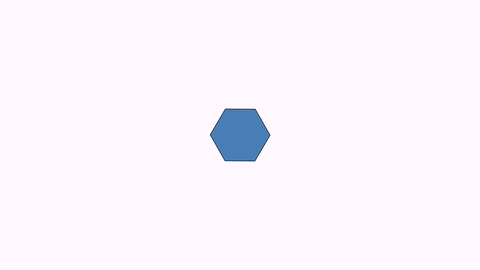
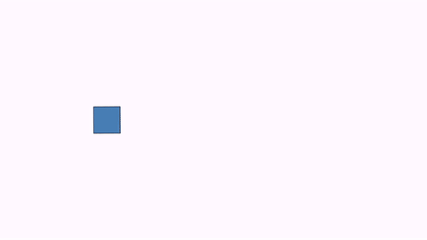

[home](https://davidgutierrezrubio.github.io/jmathanim/) [back](../index.html)

# Disabling and enabling animations
Suppose you are writing a rather long animation.  Usually this process involves several test runs to check if everything goes as planned. If you are fine tuning the last part of the animation, you don't need to run all from the beginning to do this. Instead, you can add these methods to your code:

```java
disableAnimations();
//...animation code that is already tested and don't need to see it again before generating the final movie
enableAnimations();
//...animation code that I want to preview
```

The `disableAnimations()` and `enableAnimations()` methods allows to temporarily disable animations and frame generations. Updating and object creations are done, but the non-essential parts, like drawing, writing to movie, or performing the animations is omitted, dramatically increasing speed. You can also use this to generate a movie with only specific parts of the sketch.

# Updaters

An updater is an object whose state is automatically updated right before doing the draws on the screen. Any class that implements the `Updateable` interface can be registered as an updater. This interface implements the two following methods:

```java
public int getUpdateLevel();
public void update(JMathAnimScene scene);
```

The `getUpdateLevel` method returns the order of updating this object. Objects with level 0 update first, then all with level 1, etc. Thus, if you have an updater  A that depends on that another updater B to be previously updated before, you should set the update level of A greater than of B. All necessary updating commands should be set in the `update` method.

Any update must be registered on the scene to be used, with the `registerUpdateable`method. Similarly, there is `unregisterUpdateable` method that does the opposite.

Every MathObjects implements the interface `Updateable` , and is registered when added to the scene.	

For example, let's suppose we have the following simple animation, where a `Point` object named `A` moves from the point (1,1) to (-1,1):

```java
add(new Axes());
Point A = Point.at(1, 1);
play.shift(3,-2,0,A);
waitSeconds(3);
```

We want to create a `Point`subclass that automatically locates at the normalized coordinates of point `A`, that is, the projection of `A` into the unit circle. As the `Point` class implements the `updateable` interface, the easiest way is to subclass the `Point` and override the `getUpdateLevel` and `update` methods.

```java
class UnitPoint extends Point {
    Point sourcePoint;

    public UnitPoint(Point sourcePoint) {
        this.sourcePoint = sourcePoint;
    }

    @Override
    public int getUpdateLevel() {
        //The update level of the source point plus 1, ensures that this object is updated after the source object
        return sourcePoint.getUpdateLevel() + 1;
    }

    @Override
    public void update(JMathAnimScene scene) {
        double norm = sourcePoint.v.norm();
        if (norm != 0) {
            this.v.x = sourcePoint.v.x / norm;
            this.v.y = sourcePoint.v.y / norm;
        }
    }
}
```

and modify the scene, adding an instance of this class:

```java
add(new Axes());
Point A = Point.at(1, 1);
UnitPoint B = new UnitPoint(A);
B.drawColor(JMColor.RED);
add(B);
play.shift(3, -2, 0, A);
waitSeconds(3);
```

Generates the following animation:


# Predefinied updaters

JMathAnim has some built-in updaters that maybe useful:

## Camera always ajusted to objects

With the `CameraAlwaysAdjusting`  updater, you can force the camera to show all objects in the scene. The camera will zoom out when needed, but not zoom in. Admits 3 parameters: the camera (currently there is only one), and the horizontal and vertical gaps. For example:

```java
registerUpdateable(new CameraAlwaysAdjusting(camera, .1, .1));
```

## Stacks permanently an object to another

```java
Shape circ1=Shape.circle().scale(.3).fillColor(JMColor.BLUE).thickness(3);
Shape circ2=circ1.copy();
Shape circ3=circ1.copy();
Shape circ4=circ1.copy();
Shape sq=Shape.square().center().thickness(4);
add(circ1,circ2,circ3,circ4);
        
//Stacks permantently the LEFT of circ1 with the RIGHT of sq
registerUpdateable(new AnchoredMathObject(circ1, Anchor.Type.LEFT,sq, Anchor.Type.RIGHT));

//Stacks permantently the RIGHT of circ1 with the LEFT of sq
registerUpdateable(new AnchoredMathObject(circ2, Anchor.Type.RIGHT,sq, Anchor.Type.LEFT));

//Stacks permantently the LOWER of circ1 with the UPPER of sq
registerUpdateable(new AnchoredMathObject(circ3, Anchor.Type.LOWER,sq, Anchor.Type.UPPER));

//Stacks permantently the UPPER of circ1 with the LOWER of sq
registerUpdateable(new AnchoredMathObject(circ4, Anchor.Type.UPPER,sq, Anchor.Type.LOWER));
        
play.rotate(3, 90*DEGREES, sq);
waitSeconds(3);
```


## Transformed path 

A path that is always the image of another path, using an affine transformation.

```java
Shape sq = Shape.square().fillColor("seagreen").thickness(3);//The original path
Point A = Point.at(0, 0); //A maps to D
Point B = Point.at(1, 0); //B maps to E
Point C = Point.at(0, 1); //C maps to F
Point D = Point.at(1.5, -.5).dotStyle(DotSyle.CROSS);
Point E = Point.at(2, 0).dotStyle(DotSyle.CROSS);
Point F = Point.at(1.75, .75).dotStyle(DotSyle.CROSS);

AffineJTransform transform = AffineJTransform.createAffineTransformation(A, B, C, D, E, F, 1);
Shape sqTransformed = new TransformedJMPath(sq, transform);//The transformed path
sqTransformed.fillColor("steelblue").thickness(3);
add(sqTransformed, sq, A, B, C, D, E, F);

camera.adjustToAllObjects();
play.rotate(5, 90 * DEGREES, sq);
waitSeconds(5);
```


## Trail

A trail is a `Shape` subclass that updates every frame adding the position of a marker point.  Let's draw a cycloid, using a combined `shift` and `rotate` animation (we will see the purpose of the method `setUseObjectState` in the next section):

```java
camera.scale(4);
Shape sq = Shape.circle().fillColor("royalblue").thickness(3).stackToScreen(Anchor.Type.LEFT).rotate(-90*DEGREES);
Line floor=Line.XAxis().stackTo(sq, Anchor.Type.LOWER);
add(floor);
Trail trail=new Trail(sq.getPoint(0));
add(trail.layer(1).thickness(6).drawColor(JMColor.parse("tomato")));
Animation shift = Commands.shift(10, 4*PI, 0, sq);
Animation rotate = Commands.rotate(10, -4*PI, sq).setUseObjectState(false);
playAnimation(shift,rotate);
waitSeconds(3);
```


# Combining animations
Suppose you want a square to perform a shift and rotation at the same time. The first approach may be to play at the same this animations. However if you try with a code like this:

```java
Shape sq = Shape.square().fillColor("seagreen").thickness(3).center();
Animation shift = Commands.shift(5, 1, 0, sq);
Animation rotate = Commands.rotate(5, PI/2, sq);
playAnimation(shift, rotate);
waitSeconds(3);
```

You'll obtain a square rotating, but not shifting at all. The reason is that each animation saves the state of the object in the `initialize` method and restore it at each call of `doAnim` where the changes are done. So, the restore state call of the `rotate` animation erases the changes made by the `shift` animation. The solution is quite simple, as every animation has the method `.setUseObjectState` that activates or deactivates the saving and restoring of states. In this case, as the `rotate` animation is executed each frame after the `shift`, we let this one to manage states, and deactivates it for the `rotate` animation.

```java
Shape sq = Shape.square().fillColor("seagreen").thickness(3).center();
Animation shift = Commands.shift(5, 1, 0, sq);
Animation rotate = Commands.rotate(5, -PI/2, sq).setUseObjectState(false);
playAnimation(shift, rotate);
waitSeconds(3);
```

Now the square properly shifts and rotates:


# Adding effects to shifting animations

The previous animation can be done in another way. The animations `shift`,  `stackTo`, `align`, `moveIn`, `moveOut` and `setLayout`all have in common that they implement a shifting of the object(s), each one differing in the form the shift vector is computed. All these animations inherit from the abstract class `ShiftAnimation` which implements 3 effects you can add to these animations:

The `.setJumpHeight(double height)` adds a (parabolical) jump effect to the object(s) being shifted. The direction of the jump is the shift vector rotated 90 degrees clockwise. A negative height can be specified. (Note: this effect doesn't work on `setLayout` in version 0.8.8)

```java
Shape pol = Shape.regularPolygon(6).scale(.25).center().fillColor("steelblue").thickness(3);
ShiftAnimation anim = Commands.shift(3, 1,0, pol);//shifts pol with vector (1,0)
anim.setJumpHeight(.5); //adds a jump effect
playAnimation(anim);
```


The `.setScaleEffect(double scale)` adds a back and forth scale effect:

```java
Shape pol = Shape.regularPolygon(6).scale(.25).center().fillColor("steelblue").thickness(3);
ShiftAnimation anim = Commands.shift(3, 1,0, pol);//shifts pol with vector (1,0)
anim.setScaleEffect(2); //adds a scale effect
playAnimation(anim);
```


The `.setRotateEffect(double angle)` adds a rotation:

```java
Shape pol = Shape.regularPolygon(6).scale(.25).center().fillColor("steelblue").thickness(3);
ShiftAnimation anim = Commands.shift(3, 1,0, pol);//shifts pol with vector (1,0)
anim.setRotateEffect(90*DEGREES); //adds a rotation effect
playAnimation(anim);
```



And, in case you are wondering, yes, these effects can be nested:

```java
Shape pol = Shape.regularPolygon(6).scale(.25).center().fillColor("steelblue").thickness(3);
ShiftAnimation anim = Commands.shift(3, 1,0, pol);//shifts pol with vector (1,0)
anim.setRotateEffect(90*DEGREES).setScaleEffect(2).setJumpHeight(.5);
playAnimation(anim);
```



# Creating complex animations

There are special subclasses of `Animation`that allows to build more complex animations using previously defined ones.

## The wait animation

This `WaitAnimation` does what it says. It simply waits for specified amount of time. Sounds exciting right? This is used for example in the `ShowCreation` animation when applied to a `LaTexMathObject`, where each shape must wait a certain time, to make the left-to-right appear illusion.

## The concatenate animation

The `Concatenate`class allows to play animations in sequence

```java
Shape sq = Shape.square().fillColor("seagreen").thickness(3).center();
Animation shift = Commands.shift(2, 1, 0, sq);
Animation rotate = Commands.rotate(2, -PI/2, sq);
Concatenate c=new Concatenate(shift,rotate);
playAnimation(c);
waitSeconds(1);
```


## The AnimationGroup animation

The `AnimationGroup` plays all the animations at the same. It finishes when the last one has ended. The example of the combined shift and rotate can be written as

```java
Shape sq = Shape.square().fillColor("seagreen").thickness(3).center();
Animation shift = Commands.shift(5, 1, 0, sq);
Animation rotate = Commands.rotate(5, -PI/2, sq).setUseObjectState(false);
AnimationGroup ag=new AnimationGroup(shift,rotate);
playAnimation(ag);
waitSeconds(3);
```

# Making procedural animations

For procedural animations we mean animations made "manually" performing the modifications to the objects and advancing a frame, most like a stop motion artist would do. This method is needed for complex movements that cannot be done with the predefined animations. For this, the `JMathAnimScene`class has a protected variable, `dt`, that holds the time step for each frame. The `advanceFrame()`method  does all necessary procedures to create the frame and save it. For example, let's make a program that moves a point with uniformly random steps:

```java
A=Point.origin();
add(A);
double numberOfSeconds=10;
for (double t = 0;  t< numberOfSeconds; t+=dt) {
	A.shift((1-2*Math.random())*dt,(1-2*Math.random())  *dt);
	advanceFrame();
}
```

If you execute it, you'll obtain a rather nervous point:


## Combining predefined procedural and animations

Suppose you want to show the nervous point, but at the same time you want to execute a rotation on a square for example. Of course you could do this in a purely procedural way, but you can use also the `rotate` animation. After defining it, you must initialize it and, prior to each call of the `advanceFrame`, invoke the `processAnimation`method of the animation. 

```java
Point A=Point.origin();
Shape square=Shape.square().center();
add(A,square);
Animation rotation=Commands.rotate(5,90*DEGREES,square);//Define the animation
rotation.initialize(this);//Initialize the animation
double numberOfSeconds=10;
for (double t = 0;  t< numberOfSeconds; t+=dt) {
	A.shift((1-2*Math.random())*dt,(1-2*Math.random())*dt);
	rotation.processAnimation();//Do whatever the animation needs for every frame here
	advanceFrame();
}
```

Note that when the rotation is finished subsequent calls to `processAnimation` have no effect:


[home](https://davidgutierrezrubio.github.io/jmathanim/) [back](../index.html)

# Current status of methods implemented to MathObjects

Not all `MathObject` and `Animation` combinations are compatible. Below is a table that shows, at the current version of the library, what you can and cannot do:

| MathObject      | Affine transforms related: Shift, scale, rotate , grow in, shrink out, highlight | ShowCreation animation | Transform animation                                          |
| --------------- | ------------------------------------------------------------ | ---------------------- | ------------------------------------------------------------ |
| Point           | Yes                                                          | No (use fade in)       | No                                                           |
| Shape           | Yes                                                          | Yes                    | Yes                                                          |
| Line            | Yes                                                          | Yes                    | Yes                                                          |
| Axes            | No                                                           | Yes                    | No                                                           |
| LaTeXMathObject | Yes                                                          | Yes                    | Yes (also you can use the specialized `TransformMathExpression` method) |
| Arrow2D         | Yes                                                          | Yes                    | No (use homothecy transform)                                 |
| Delimiter       | No (you have the transform the anchor points instead)        | Yes                    | No (transform anchor points instead)                         |


