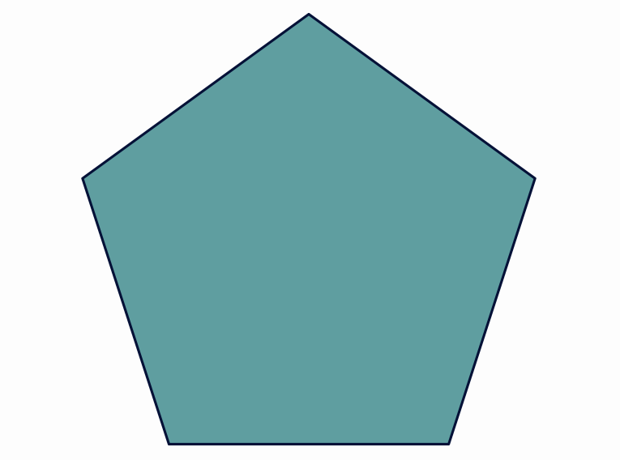
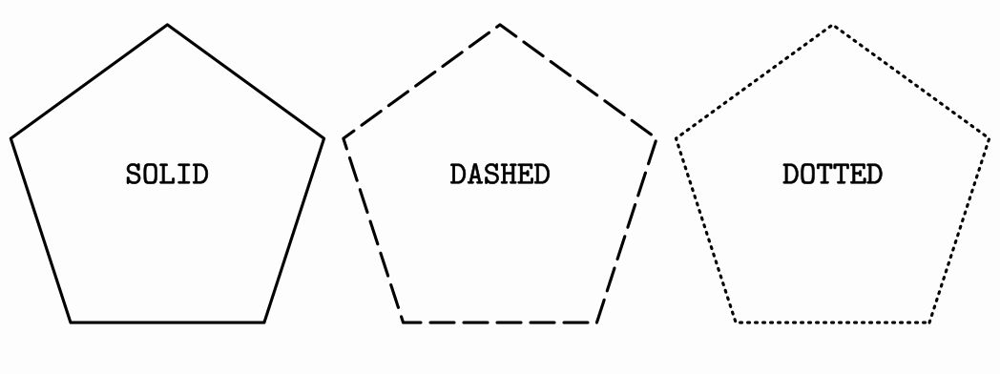

## Applying styles

Each `MathObject` has one `MODrawingProperties` object that stores drawing parameters.

## Basic styles

Each object has 2 colors: the draw color (changed with `.setColor`), used drawing the contour  y the fill color (changed with `.fillColor`), used to fill the object. Each color is stores in a `JMColor`object, with the components red, green, blue and alpha. The `.thickness`method sets the thickness of the stroke used to draw the object.

``` java
Shape r=Shape.regularPolygon(5).fillColor(JMColor.parse("CADETBLUE")).drawColor(JMColor.parse("#041137")).thickness(5);
```



Here we can see the method `.parse` to define a color. All JavaFX color names are supported, as well as hexadecimal format `#RRGGBBAA` (8 hexadecimal digits), `#RRGGBB` (6 hexadecimal digits) and `#RGB` (4 hexadecimal digits) . Also, both methods to change colors are overloaded so that `drawColor(string)`is equivalent to `drawColor(JMColor.parse(string))`, and the same with `fillColor`.

The `dashStyle`method sets the dash used to draw the outline, chosen from the enum `DashStyle`. Currently, there are 3 different styles, `SOLID`, `DASHED`and `DOTTED`. The following code creates 3 pentagons with these dash styles.

```java
Shape r1 = Shape.regularPolygon(5).thickness(5);
Shape r2=r1.copy().stackTo(r1, Anchor.RIGHT,.1);
Shape r3=r1.copy().stackTo(r2, Anchor.RIGHT,.1);
r1.dashStyle(DashStyle.SOLID);
r2.dashStyle(DashStyle.DASHED);
r3.dashStyle(DashStyle.DOTTED);
add(LaTeXMathObject.make("{\\tt SOLID}").stackTo(r1, Anchor.BY_CENTER));
add(LaTeXMathObject.make("{\\tt DASHED}").stackTo(r2, Anchor.BY_CENTER));
add(LaTeXMathObject.make("{\\tt DOTTED}").stackTo(r3, Anchor.BY_CENTER));
add(r1,r2,r3);
camera.adjustToAllObjects();
waitSeconds(5);
```



## Saving styles 

A concrete combination of drawing parameters can be saved in styles. The `config`objects stores the saved styles and has methods to manage them. To apply a style to an object, use the method `.style(styleName)`.

```java
Shape triangle=Shape.regularPolygon(3).thickness(5).fillColor("RED");
//Creates style named solidRed
config.createStyleFrom(triangle, "solidRed");
Shape circle=Shape.circle().stackTo(triangle,Anchor.LEFT);
//Apply style to circle
circle.style("solidRed");
add(triangle,circle);
waitSeconds(5);
```

